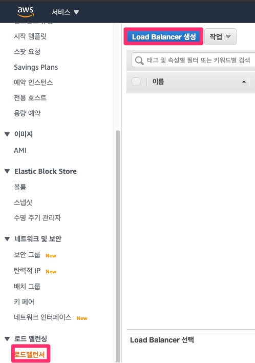

# ACM

> AWS Certificate Manager(ACM)는 AWS 웹 사이트 및 애플리케이션을 보호하는 퍼블릭 및 프라이빗 SSL/TLS X.509 인증서 및 키를 생성, 저장 및 갱신하는 복잡한 과정을 처리합니다. ACM를 사용하여 직접 발급하거나 [관리 시스템으로 AWS타사 인증서를 ](https://docs.aws.amazon.com/ko_kr/acm/latest/userguide/acm-services.html)가져오기ACM를 통해 [통합 ](https://docs.aws.amazon.com/ko_kr/acm/latest/userguide/import-certificate.html)서비스ACM에 대한 인증서를 제공할 수 있습니다. ACM 인증서는 단수 도메인 이름, 여러 특정 도메인 이름, 와일드카드 도메인 또는 이러한 항목의 조합을 보호할 수 있습니다. ACM 와일드카드 인증서는 무제한 수의 하위 도메인을 보호할 수 있습니다. 또한 내부 PKI의 어디서나 사용할 수 있도록 [에서 서명한 ](https://docs.aws.amazon.com/ko_kr/acm/latest/userguide/export-private.html)인증서를 ACM내보내기ACM Private CA할 수도 있습니다.
>
> AWS Certificate Manager는 AWS 서비스 및 연결된 내부 리소스에 사용할 공인 및 사설 SSL/TLS(Secure Sockets Layer/전송 계층 보안) 인증서를 손쉽게 프로비저닝, 관리 및 배포할 수 있도록 지원하는 서비스입니다. SSL/TLS 인증서는 네트워크 통신을 보호하고 인터넷상에서 웹 사이트의 자격 증명과 프라이빗 네트워크상에서 리소스의 자격 증명을 설정하는 데 사용됩니다. AWS Certificate Manager는 SSL/TLS 인증서를 구매, 업로드 및 갱신하는 데 드는 시간 소모적인 수동 프로세스를 대신 처리합니다.

[ACM 인증서는 다음 서비스에서 지원됩니다](https://docs.aws.amazon.com/ko_kr/acm/latest/userguide/acm-services.html)

**Elastic Load Balancing**

> Elastic Load Balancing에서는 애플리케이션의 수신 트래픽을 여러 Amazon EC2 인스턴스로 자동으로 분산합니다. 또한 풀 내에서 비정상 인스턴스를 검색하고 비정상 인스턴스가 복원될 때까지 자동으로 트래픽을 정상 인스턴스로 재라우팅합니다. Elastic Load Balancing은 수신되는 트래픽에 맞춰 요청 처리 용량을 자동으로 조정합니다. 로드 밸런싱에 대한 자세한 내용은  단원을 참조하십시오.[Elastic Load Balancing 사용 설명서](https://docs.aws.amazon.com/elasticloadbalancing/latest/userguide/).
>
> 일반적으로 SSL/TLS를 통해 보안 콘텐츠를 제공하려면 SSL/TLS 인증서를 Load Balancer 또는 백엔드 Amazon EC2 인스턴스에 설치해야 합니다. ACM은 Elastic Load Balancing에 통합되어 ACM 로드 밸런서 Load Balancer 인증서를 배포합니다. 자세한 내용은 [애플리케이션 로드 밸런서 생성](https://docs.aws.amazon.com/elasticloadbalancing/latest/application/create-application-load-balancer.html) 단원을 참조하십시오.

## ACM에서 SSL/TLS 인증서 생성

1. https://ap-northeast-2.console.aws.amazon.com/acm 에서 인증서 요청 클릭
2. **1단계: 도메인 이름 추가**: 도메인 이름 적고 다음
3. **2단계: 검증 방법 선택** : DNS 검증 체크 후 다음
4. **3단계: 태그 추가**
5. **4단계: 검토 및 요청**
6. **5단계: 검증**: Route 53에 레코드 생성 버튼 클릭
   * 아래의 조건을 만족하면 Route 53에 레코드 생성 버튼이 활성화 됩니다.
   * Route 53을 DNS 공급자로 사용합니다.
   * 호스팅한 영역에 대한 쓰기 권한이 있습니다

참고: https://docs.aws.amazon.com/ko_kr/acm/latest/userguide/gs-acm-validate-dns.html

## Elastic Load Balancing에 SSL/TLS 인증서를 배포하기

 https://console.aws.amazon.com/ec2/ 에서 로드밸런서 -> Load Balancer 생성

### 1단계: Load Balancer 구성

* Load Balancer 유형 선택 -> Application Load Balancer
* Load Balancer의 이름
* IP 주소 유형
* 리스너
  * HTTPS 추가
*  가용 영역
  *  Load Balancer의 가용성을 높이려면 2개 이상의 가용 영역에서 서브넷을 지정해야 합니다.

### 2단계: 보안 설정 구성

* **인증서 유형**
  * ACM에서 인증서 선택 (권장)
* **인증서 이름**
  * 앞서 ACM에서 생성한 인증서를 선택
* 보안 정책 선택
  * 디폴트

### 3단계: 보안 그룹 구성

### 4단계: 라우팅 구성

* 이름: 대상 그룹 이름
* 대상 유형
  * 인스턴스: instance ID로 대상 등록
* 프로토콜
  * HTTP
* 상태 검사
  * 디폴트

### 

### 5단계: 대상 등록

* 인스턴스를 선택하고 등록된 항목에 추가 버튼 클릭

### 6단계: 검토

* 검토 후 생성