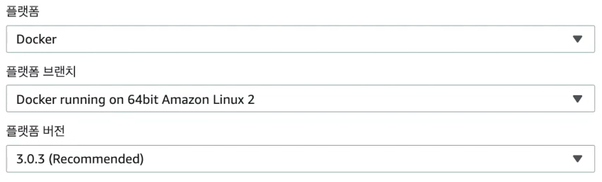

#### Elastic Beanstalk

> AWS Elastic Beanstalk는 Java, .NET, PHP, Node.js, Python, Ruby, Go, Docker를 사용하여 Apache, Nginx, Passenger, IIS와 같은 친숙한 서버에서 개발된 웹 애플리케이션 및 서비스를 간편하게 배포하고 조정할 수 있는 서비스입니다.
>
> 코드를 업로드하기만 하면 Elastic Beanstalk가 용량 프로비저닝, 로드 밸런싱, Auto Scaling부터 시작하여 애플리케이션 상태 모니터링에 이르기까지 배포를 자동으로 처리합니다. 이뿐만 아니라 애플리케이션을 실행하는 데 필요한 AWS 리소스를 완벽하게 제어할 수 있으며 언제든지 기본 리소스에 액세스할 수 있습니다.


#### Dockerrun.aws.json

> * Dockerrun.wes.json. 파일은. Docker 컨테이너 셋트를 EB 애플리케이션으로 배포하는 방법을 설명하는 EB 고유의 json파일입니다. Dockerrun.aws.json 파일을 멀티컨테이너 docker 환경에서 사용할 수 있습니다.
> * dockerrun.aws.json은 환경에서 각 커네티어 인스턴스에 배포할 컨테이너 및 탑재할 컨테이너의 호스트 인스턴스에서 생성할 불륨을 설명합니다.
> * EB에세 어떻게 다중 컨테이너를 실행할지 알려준다.

예시

```json
{
  "AWSEBDockerrunVersion": 2,
  "containerDefinitions": [
    {
      "name": "frontend",
      "image": "neptunes032/docker-frontend",
      "hostname": "frontend",
      "essential": false,
      "memory": 128
    },
    {
      "name": "backend",
      "image": "neptunes032/docker-backend",
      "hostname": "backend",
      "essential": false,
      "memory": 128
    },
    {
      "name": "nginx",
      "image": "neptunes032/docker-nginx",
      "hostname": "nginx",
      "essential": true,
      "portMappings": [
        {
          "hostPort": 80,
          "containerPort": 80
        }
      ],
      "links": ["frontend", "backend"],
      "memory": 128
    }
  ]
}

```

* name : 컨테이너 이름
* image : docker repository의 docker image 이름
* hostname : 이 이름을 이용해 도커 컴포즈를 이용해 생성된 다른 컨테이너에서 접근이 가능하다.
* essential : 컨테이너가 실패할 경우 작업을 중지해야 될 경우 `true` 필수적이지 않은 컨테이너는 `false` 다른 컨테이너에 영향을 미치지 않고 종료된다.
* memory : 컨테이너 인스턴스의 메모리 크기를 지정
* portMappings: 컨테이너에 있는 네트워크 지점을 호스트에 있는 지점에 매핑합니다.
* Links : 연결할 컨테이너의 목록입니다. 연결된 컨테이너를 서로 검색하고 통신할 수 있습니다.


#### 다중 컨테이너 앱을 위한 Elasitc Beanstalks 환경 설정

1. 애플리케이션 생성
2. 플랫폼 docker 선택



3. 