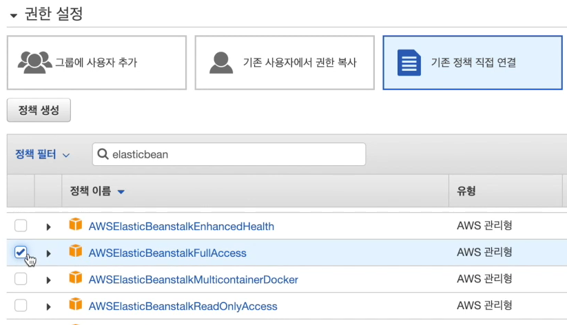
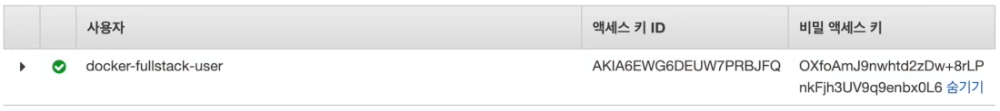

# IAM

#### IAM

> IAM(Identity and Access Management)은 AWS 리소스에 대한 액세르르 안전하게 할 수 있는 웹 서비스입니다. IAM을 사용하여 리소스를 사용하도록 인증 및 권한 부여된 대상을 제어합니다.

#### 예시 : Travis CI의 AWS접근을 위한 API 생성

1. IAM 유저 생성

   * Identity and Access Management
   * AWS 리소스에 대한 액세스를 안전하게 제어 할 수 있는 웹 서비스이다.
   * Root 사용자 :  aws에 가입하여 사용하고 있는 계정
     * AWS 서비스 및 리소스에 대한 완전한 액세스 권한이 있다.
     * 루트 사용자를 직접 사용하는 것은 보안상 좋지 않다.
   * IAM 사용자 : root 사용자가 부여한 권한만 가지고 있다.

2. IAM 유저에게 elasticbeanstalk 액세스 권한을 부여한다.

   

3. IAM 유저 생성 후 액세스 키와 비밀 액세스 키를 발급 받는다.

   

4. 발급 받은 키들을 Travis ci 설정에서 환경 변수로 추가한다

5. .travis.yml에서 등록한 환경변수를  다음과 같이 사용한다. `$지정한이름`

