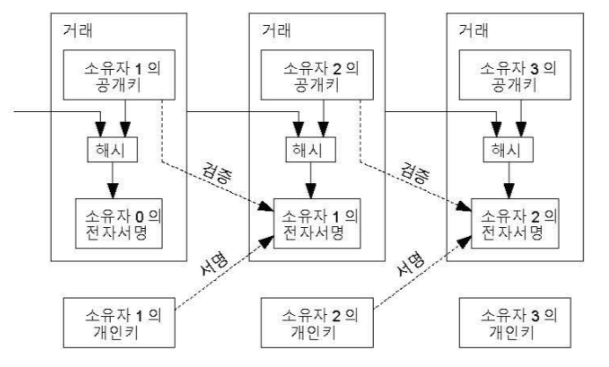
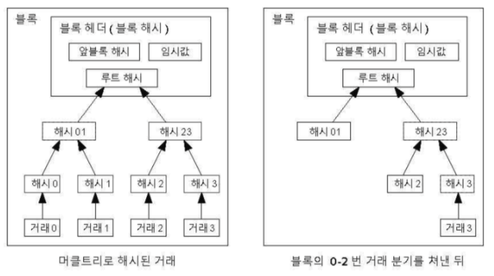
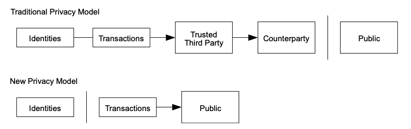

# 1 서론

## 기존의 전자상거래 시스템과 문제점

* 인터넷 기반 상거래는 전자 결제를 처리한 신뢰받는 제 3자로 금융기관에 의존해왔다
* 이 시스템에는 약점이 존재한다.
  * 신뢰할 수 있는 기관으로써 이용자들 간에 분쟁을 중재해야만 한다.
  * 중재의 비용은 거래 비용을 증가 시킨다.
  * 사용 가능한 최소 거래 규모를 제한해서 일상적인 거래를 불가능하게 한다.(소액 결제)
  * 비가역적 서비스에 대해 비가역적 지급을 할 수 있는 능력의 손실에는 더 많은 비용이 발생한다.
  * 가역성때문에 신뢰를 잃는다
  * 신뢰 기관의 몰락: 서브프라임 모기지 사태로 리만 브라더스 파산신청
    * 신뢰 기관을 백프로 믿을 수 있나?
* 비용과 지불의 불확실성은 사람이 직접 물리적인 화폐를 지불하여 피할수 있다.
  * 그러나 현재 신용기관 없이 통신상으로 지불하는 방법이 존재하지 않는다.

## 해결책

* 이 문제를 **신용보다 암호화 기술에 기반한 전자지불 시스템을 이용하여 자발적인 두 거래자가 제 3자인 신용기간 없이 직접 거래하게 함으로써 해결한다.**
* 철회가 전산적으로 불가능한 거래는 판매자를 보호한다.
* 에스크로 방법으로 구매자를 보호한다.
* 거래들의 시간 순서를 전산적으로 입증하게 만들도록 하는 P2P 분산 네트워크 기반 타임스탬프 서버를 이용하여 이중지불 문제를 방지하는 해법을 제시한다.
* 이 시스템은 악의적으로 협력하는 노드 그룹보다 정직한 노드가 더 많은 컴퓨티 파워를 가지고 있다면 안전하다

# 2 Transaction

* 전자적 화폐(electronic coin)는 디지털 서명의 사슬로 정의한다.
* 각 소유자는 화폐를 송금할 때 먼젓번 거래 내역 및 다음 소유자 공개키의 해시값에 전자적으로 서명한다.
* 그리고 이 정보를 이 화폐 끝에 추가한다.
* 수금자는 소유자의 전자 서명을 소유자의 공개키로 복호화해 소유권을 검증할 수 있다

**문제**

* 수금자가 소유자 가운데 누군가 화폐를 이중지불했는지 검증할 수 없다
* 통상적으로 신뢰받는 중앙통제기관이나 조폐국은 쉽게 이 문제를 해결한다.
  * 모든 거래를 인식해 최초로 받은 거래만을 승인 대상으로 결정하면된다.
  * 이 방식의 문제는 통화체계가 제 3자에 의존한다는 점이다.

**해결**

* 먼젓번 소유자가 이전에 어떤 거래에서도 서명을 하지 않았음을 수금자에게 알릴 방법이 필요하다
* 가장 앞선 거래 하나를 인정하고 이후 이중지불은 무시한다.
* 이중거래가 없음을 확인하기 위해선 모든 거래를 인식해야한다.
* 신뢰받는 제 3자 없이 이방식을 실현하려면 거래가 공개적으로 알려져야한다.
* 또한 참가자들이 단일한 이력에 합의하는 시스템이 필요하다

**공개키 암호화 방식**

* 사용자들은 하나 이상의 주소를 가지고 이에 대응되는 공개키와 비밀키 쌍을 가진다
* 이러한 키 쌍은 `wallet`에 보관된다.
* 암호화: 퍼블릭 키로 암호화 프라이빗 키로 복호화
  * A가 B에서 암호화된 문서를 보내고 싶다
  * A가 문서를 B의 공개키로 암호화해서 보낸다.
  * B는 문서를 받아서 자신의 비밀키로 복호화 한다. 즉 B만 열어볼 수 있다.
* 전자서명: 프라이빗 키로 암호화 퍼블릭 키로 복호화
  * A가 해당 문서를 자신이 작성했음을 증명하고 싶다
  * A가 문서를 자신의 비밀키로 암호화
  * 누구나 A의 공개키로 검증 가능
* 비트 코인을 소지한 사람이 다른 사람에게 비트코인을 주려면 소지한 사람의 비밀키로 transaction에 서명을 해야한다.
* 그리고 모든 유저들은 비트 코인을 전달하려는 사람의 공개키를 이용해서 해당 서명의 진위를 판단할 수 있다.

**transaction의 흐름**

* 앨리스가 밥에게 비트코인을 보내고 싶어한다고 가정해보자.
* 밥은 앨리스에게 주소를 보낸다.
* 앨리스는 밥의 주소와 메시지에 전송할 비트코인의 양을 추가한다
* 앨리스는 개인 키로 거래에 서명하고 서명 확인을 위해 공개 키를 발표합니다.
* 앨리스는 모든 사람이 볼 수 있도록 비트코인 네트워크에 거래를 알린다.

### 이중 지불

* 이중 지출 문제는 단일 통화 단위가 한 번 이상 동시에 소비되는 현상이다.
* 쉽게 말하면 문화 상품권을 두번 쓰는것
  * 중앙 집중적인 기관이 이를 관리한다면 쉽게 이중 지불 문제를 해결할 수 있다. 
  * 거래내역이 한 서버에 기록이 존재하는 것과 같기 때문에
  * 물리적인 회폐세상에서는 최근 거래와 현재 소유자를 실시간으로 쉽게 확인할 수 있기 때문에 이중지출 문제를 해결할 수 있다.
* 그러나 분산 시스템 상에 전자 상거래에서 이중 지불 문제를 해결하기 까다롭다.

**해결책**

* 조폐국과 같이 거래를 공개적으로 알려주고 이 문제를 해결하기 위해 제 3자가 아닌 타임스탬프 서버, 작업 증명, 네트워크 등을 이용한다.
* 어떤 거래가 존재하지 않았다는 것을 확인하려면 모든 거래를 다 확인해야 한다.
* 제 3자 없이 달성하려면 거래를 반드시 공개적으로 알려야 한다
* 참가자들이 거래의 순서에 대한 기록에 동의할 수 있는 시스템이 필요
* 수취인은 매 거래마다 과반수의 노드들이 그것이 첫 사용이라고 동의해주는 증명을 필요로 한다.
* 이중 지출로부터 안전하기 위해, 거래가 일정 블록 깊이가 될 때까지 Confirmed로 간주해서는 안 된다.

## 3 타임 스탬프 서버

* 이중 지불에 대한 해결책으로 제시됨
* 비트코인은 타임스탬프를 이용해서 각 타임스탬프에 이전 타임스탬프를 포함하고 이를 계속 이어나가는 사슬을 형성한다.

## 4 Proof of work(작업 증명)

* Proof of work는 블록을 생성하는 과정이다.
* 마이닝 노드는 매 블록 생성마다 블록에 들어갈 트랙잭션을 검증하여 머클트리를 만들고 머클트리의 루트 값을 이용해 POW를 진행한다.
* N + 1번 블록을 만드는 POW 과정
  * `Hash(N 번째 블록의 해시 값 + N + 1번째 블록의 트랜잭션의 머클루트 + Nonce) < target value` 를 만족하는 `Nonce` 를 찾는 것
  * 얻어낸 해쉬값이 Target value보다 작은 숫자를 가지면 이는 N+1번째 블록의 해쉬값이 될 조건을 만족한다.
  * 노드는 해당 블록해쉬값으로 블록을 만들고 네트워크에 전파한다.
  * 만약 네트워크의 다른 노드들이 블록해쉬값을 구하지 못했다면, 각 노드는 전달받은 블록을 검증 후 자신의 체인에 연결하고, 커밋 후 또 다시 네트워크에 블록을 전파한다.

* 작업 증명이란 해시 연산 결과가 0비트 여러 개로 시작하는 nonce 값을 찾는 것을 말한다
* 블록을 생성하기 위해선 이러한 작업을 반드시 거쳐야한다.
* 한 블록을 위조하려면 그 이후 모든 블록을 위조해야 한다.
  * 이 재수행 작업이 많은 시간을 걸려 해킹의 위험성을 낮춘다
* 작업 증명은 블록 생성을 위해 비트코인에서 사용된다. 
* 네트워크 참여자가 블록을 수락하려면, 마이너는 블록의 모든 데이터를 포함하는 작업 증명서를 작성해야 합니다.
*  이 작업의 난이도는 네트워크가 새로운 블록을 생성할 수 있는 속도를 10분당 1개로 제한하도록 조정된다. 
* 매우 낮은 생성 가능성 때문에, 이것은 네트워크에서 어떤 작업자 컴퓨터가 다음 블록을 생성할 수 있는지를 예측할 수 없게 만든다.
* 블록이 유효하려면 현재 `target`보다 작은 값으로 해시해야 한다.
  * `target` 은 속도를 10분당 1개로 제한하도록 자동 조정된다. 
* 각 블록은 선행 블록의 해시를 포함하므로, 각 블록은 함께 많은 양의 작업을 포함하는 블록 체인을 가집니다. 
* 블록을 변경하려면 모든 후속 블록을 재생성하고 해당 블록에 포함된 작업을 다시 실행해야 합니다. 
* 이를 통해 블록체인이 변조되지 않도록 보호합니다.

## 5 네트워크

* 노드는 항상 가장 긴 사슬을 정확한 것으로 간주하고 그걸 잇는 작업을 지속한다.
* 두 노드가 동시에 블록의 서로 다른 버전을 퍼트려도 결국 한 쪽 체인이 더 길어지고 그 체인이 블록체인 네트워크에서 받아들여진다.
* 새로운 `Transaction` 이 반드시 모든 노드에 도달할 필요는 없다
  * 많은 노드에 브로드캐스팅되면 언젠가 한 블록안에 들어가게 될것이다.

**네트워크 흐름**

1. 새로운 `Transaction`이 모든 노드에 브로드캐스팅된다
2. 각 노드가 새로운 `Transaction`을 블록에 수집
3. 각 노드가 블록에 맞는 난이도의 작업증명을 찾는다
4. 노드가 작업증명을 찾은 시점에, 모든 노드로 그 블록을 브로드캐스팅한다.
5. 그 블록에 대해 노드는 모든 거래가 유효하고 아직 이중지불되지 않은 것을 확인하고 블록을 승인한다
6. 노드는 먼젓번 해시로 승인된 블록의 해시를 사용해 체인 안에 다음 블록을 생성한다.

## 6 인센티브

* 인센티브를 통해 노드가 계속 정직하게 행동하도록 유도한다.
* 올바른 블록을 가장 먼저 만들게되면 비트코인이 보상으로 지급된다.
  * 블록안에 첫 거래는 블록을 만든이에게 주어지는 새 화폐로 시작하는 특별한 `Transaction`이다 이 `Transaction` 을 Coinbase라고 한다.
  * 블록 보조금은 블록당 50비트코인에서 시작해 21만 블록마다, 즉 약 4년마다 반감된다.
* 블록 생성 대가로 수수료를 받는다
  * `Transaction`에는 수수료가 있다
  * 블록에 포함된 `Transaction` 들의 수수료를 모아 블록을 생성한 사람이 가져간다.
* 비트코인 발행량이 다 떨어지면 새로운 비트코인이 아닌 거래 수수료로만 충당된다.
* 이러한 인센티브가 공격자가 규칙대로 움직이는 것이 이득이라는 것을 알게해 공격을 방지한다.

## 7 디스크 공간 회수

* 최종 `Transaction`이 충분한 블록에 묻히면 그 전에 지불된 `Transaction` 은 디스크 공간 절약을 위해 폐기될 수 있다
* 해당 블록의 해시를 유지하면서 이를 달성하기 위해 머클트리라는 자료구조가 사용된다.
* 결과적으로 오래된 블록은 트리의 분기를 쳐냄으로 공간을 절약할 수 있다.

## 8 간소화한 결제 검증

* 결제 검증은 전체 네트워크 노드를 구동하지 않아도 가능하다

## 9 가지 합치기와 나누기

## 10 프라이버시

* 전통적인 은행 모델을 다른 사람에게 정보 접근을 제한해 일정 수준의 프라이버시를 달성한다.
* 비트코인은 공개키를 통해 익명성을 보존해 프라이버시를 보장한다.
  * 주소(공개키)가 의미가 없는 데이터로 구성되어 누구의 것인지 모른다.
* 추가적으로 거래마다 새로운 키 쌍을 사용하여 프라이버시를 강화할 수 있다
  * 여러 입금이 동일 소유자라면 다중 입금 거래에서 프라이버시가 약해질 우려가있다
  * 그 거래의 키 소유자가 들어나면 동일한 소유자의 다른 `Transaction` 까지 노출될 수 있다.

## 11 계산

* 공격자가 해당 시점부터 따라잡을 수 있는 확률은 시간이 지날수록 지수적으로 늘어난다.

## 12 결론

* 

참고

* https://brunch.co.kr/@skkrypto/81