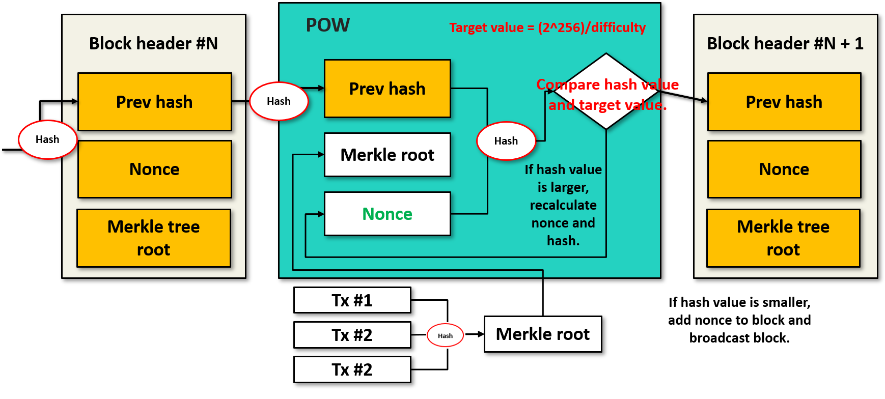
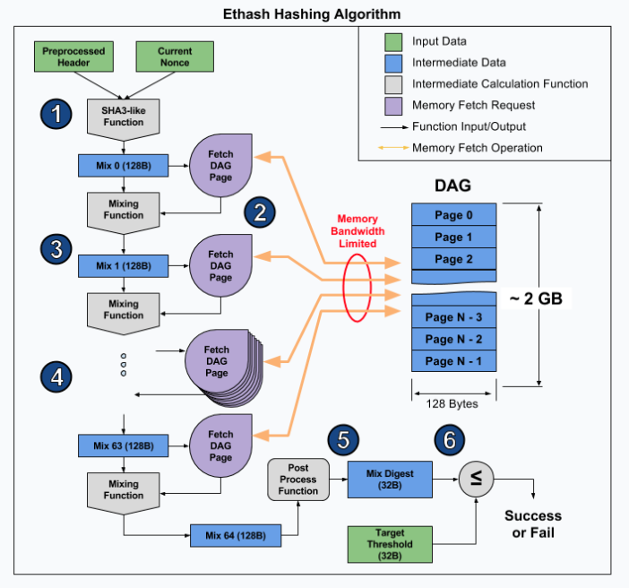

# 1 합의

* 합의란 탈중앙화화 시스템에서 결정론적인 방식으로 운영되기 위해 각자가 지켜야 하는 규칙을 말한다.
* 분산 시스템에서 각기 다른 참여자가 한 시스템의 전체 상태에 모두 동의하는 합의 도달이 필요하다
* 따라서 **통제자가 없는 엄격한 규칙 체계**를 만들기 위한 것

## 1.2 합의의 원칙

* 합의 알고리즘이 답해야할 질문들

1. 누가 과거를 바꿀 수 있으며, 어떻게 할 수 있는가?(불변성)
2. 누가 미래를 바꿀 수 있으며, 어떻게 할 수 있는가?(최종성)
3. 그러한 변경을 하는데 필요한 비용은 얼마인가?
4. 그러한 변화를 일으키는 힘은 어떻게 탈중앙화되어 있는가?
5. 무언가 바뀌었는지 누가 알 수 있으며, 어떻게 알 수 있는가?

# 2 PoW(Proof Of Work)

* 작업증명
* 비트코인이 작업증명이라는 합의 알고리즘을 개발했다
* 이더리움의 PoW를 비트코인과 약간 다르며 이대시(Ethash)라고 한다.

**비트코인 PoW 동작 방식**

* 정해진 난이도 값 이하의 해시값을 생성할 수 있는 논스값을 찾아내는 과정
* 모든 경우의 수를 대입해보는 것보다 더 빠른 방식이 존재하지 않지만 검증은 쉬움
* 평균적으로 10분마다 새로운 블록이 생성되도록 2016 블록마다 네트워크에 의해 target이 조절된다.

# 3 Ethash

* Ethash는 이더리움 작업증명 알고리즘이다.
* Ethash는 DAGGER와 HASHIMOTO 알고리즘을 혼합한 Dagger-Hashimoto 알고리즘을 사용한다.

> **HASHIMOTO**
>
> * CPU에 비해 상대적으로 느린 메모리(RAM)의 최대 읽기/쓰기 속도보다 빠르게 채굴을 수행할 수 없는 알고리즘
>
> **DAGGER**
>
> * DAG(Directed Acyclic Graph)를 사용하여 메모리 상으로 계산하기 어렵지만 검증하기 쉬운 알고리즘

**기존 PoW의 문제점**

* 기존의 작업증명(PoW) 방식에서는 중국의 비트메인 등 소수의 채굴업체들이 에이식(ASIC) 방식의 고성능 채굴기를 제작하고 거대한 마이닝풀을 구성하여 막강한 영향력을 행사할 수 있다.
* 심지어 전체 해시파워의 과반수에 이르는 연산력을 보유하고, 이른바 51% 공격도 가능한 상황이었다.

**Ethash의 목적**

* Ethash는 채굴 인프라를 지배하는 집단이 생기는 것을 방지하는 즉 **채굴 파워의 탈중앙화를 위해 고안**되었다.
* 이더리움이 채택한 이더해시 방식을 따를 경우, 에이식(ASIC) 채굴기를 사용한 채굴이 매우 어렵다. 
  * 이더리움을 채굴하려면, 채굴하기 전에 컴퓨터에서 대그(DAG) 작성이라는 프로세스를 수행해야 한다.
  * 해시값을 구하기 위해서는 논스뿐만 아니라 DAG의 데이터를 랜덤하게 읽어와야 한다.
* 컴퓨터 메모리상의 일정 양의 데이터를 읽은 후 이를 넌스와 함께 해시계산을 함으로써 메모리 IO 중심의 작업 증명
  * Memory Hard Computation
  * Memory Easy Validation
  * DAG에서 한번에 읽어오는 데이터는 128 바이트이므로 하나의 논스를 해시할 때에 (128 바이트 * 64) = 8KB의 메모리를 읽어오는 작업이 필수적이고, 따라서 연산력은 프로세서(CPU, GPU)의 속도보다 RAM의 속도에 큰 영향을 받는다.
* 약 12초에 하나의 블록을 생성하는 것이 알고리즘의 궁극적인 목표

**Ethash 동작 방식**

* 해시값을 구하기 위해서는 논스뿐만 아니라 DAG의 데이터를 랜덤하게 읽어와야 한다.
* 블록 헤더 데이터 + 논스로부터 Mix 0을 구하고, Mix1 - Mix64까지 반복하면 최종 해시값이 구해진다.
* DAG에서 한번에 읽어오는 데이터는 128 바이트이므로 하나의 논스를 해시할 때에 (128 바이트 * 64) = 8KB의 메모리를 읽어오는 작업이 필수적이고, 따라서 연산력은 프로세서(CPU, GPU)의 속도보다 RAM의 속도에 큰 영향을 받는다.

# 4 Pos(Proof Of Stack)

* 지분증명

**동작 방식**

1. 블록체인 검증인 집합을 유지한다.
2. 이더를 보유한 사람은 이더를 컨트랙트에 예치시키는 특별한 유형의 트랜잭션을 보냄으로써 검증인이 된다.
3. 검증인은 유효한 다음 블록에 대핸 제안하고 투표한다.

* 각 검증인의 투표 중요도는 보증금의 크기에 따라 다르다
* 특정 검증인이 보유한 블록이 대다수 검증인엔 의해 거부된다면 보증금을 잃는다
* 반대로 검증인은 대다수가 수락한 모든 블록에 대해 누적된 지분에 비례하여 보상을 얻는다

# 4 PoW와 Pos의 차이점

**처벌**

* 지분증명: 블록체인에 내재되어 이더 지분의 손실을 가져옴
* 작업증명: 블록체인 외적인 전기 사용료에 대한 자금 손실을 가져옴

**에너지 절약**

* POW와 다르게 수학적 연산을 통해 블록을 채굴하는 것이 아니므로 에너지 절약

**보안성**

* POW의 51% 노드를 점유하기 위해 필요한 비용보다 POS의 51% 자산을 확보하는 비용이 큼
* 비트코인(POW)에서 51%의 해시파워 비용 = 약 2500억원 
* 이더리움(POS)에서 전체 자산의 51% = 약 25조원