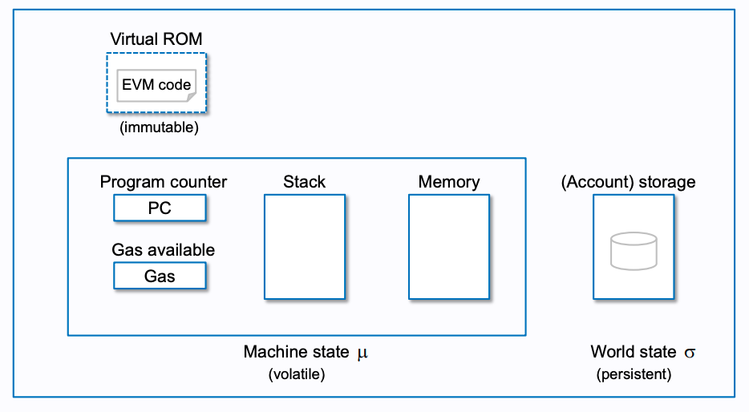
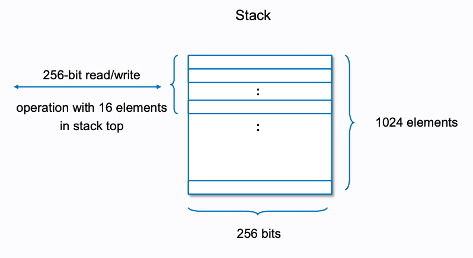
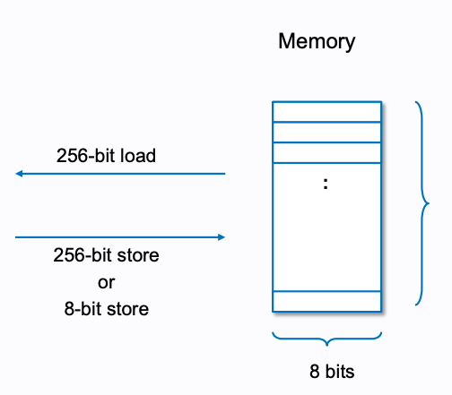
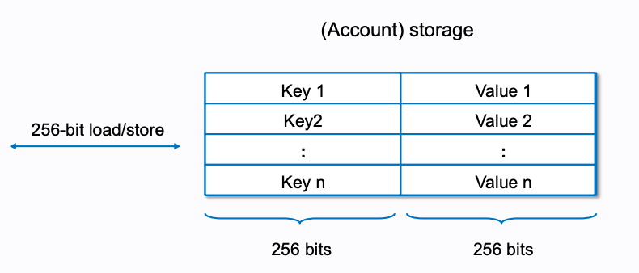
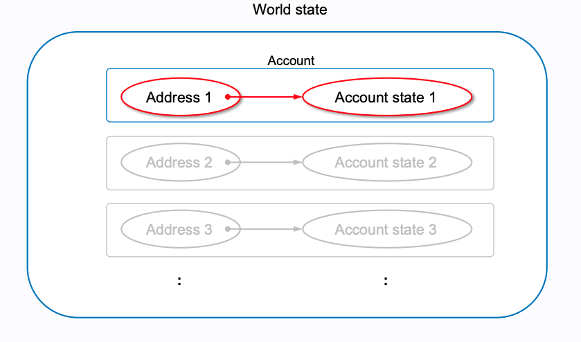
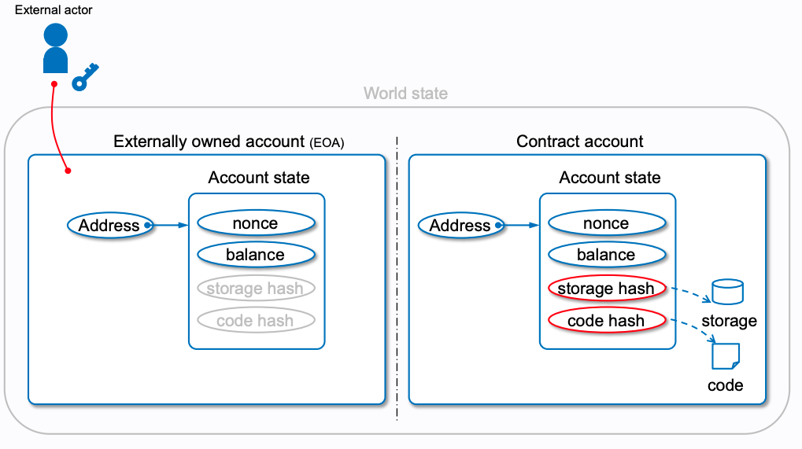
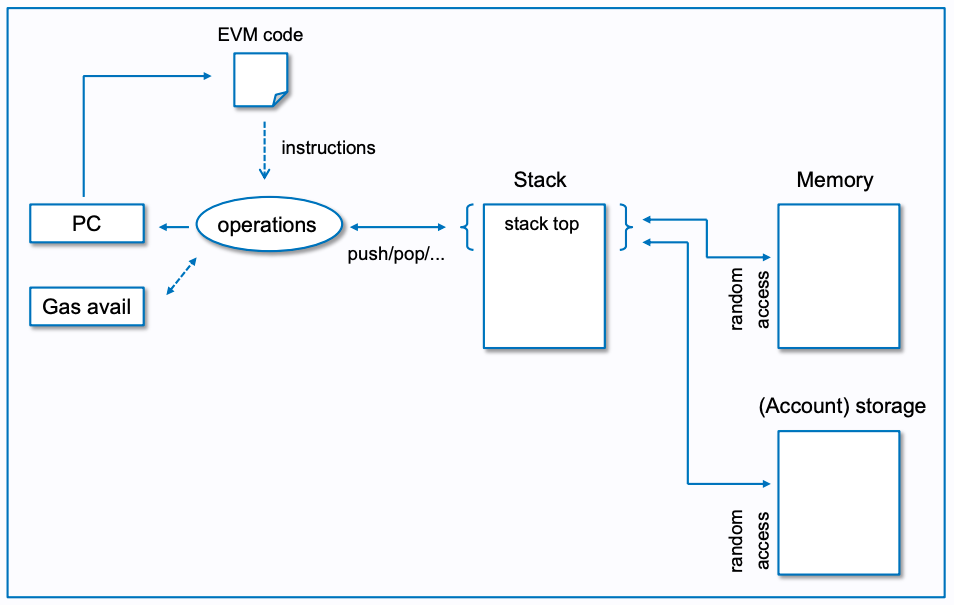

# 1 EVM이란 무엇인가?

* 이더리움 가상 머신이라고 하는 **에뮬레이트된 컴퓨터에서 스마트 컨트랙트라는 프로그램을 실행**한다.
* EVM은 싱글톤으로 전 세계에 걸친 **단일 인스턴스 컴퓨터인 것처럼 작동**한다.
  * EVM은 모든 이더리움 노드에서 로컬 인스턴스로 실행된다.
  * EVM의 모든 인스턴스 동일한 초기 상태에서 동작하고 동일한 최종 상태를 생성하기 때문에 시스템 전체가 단일 월드 컴퓨터로 작동한다.
* 각 노드들은 컨트랙트 실행을 확인하기 위해 EVM의 로컬 사본을 실행하고 이더리움 블록체인은 트랜잭션과 스마트 컨트랙트를 처리할 때 월드 컴퓨터의 변화하는 상태를 기록한다.
* EVM은 머신 코드를 실행하는 컴퓨터의 CPU와 유사한 EVM바이트코드라는 특수한 코드를 실행하는 가상 머신이다.


**EVM 특징**

**튜링 완전 머신**

* 앨런 튜링이 고안한 개념으로, 수학적으로 어떠한 알고리즘이든 실행시킬 수 있는 머신
* 정확히는 **유사 튜링 완전 머신**
  * 스마트 컨트랙트 실행에 사용할 수 있는 **가스양에 따라 모든 실행 프로세스가 유한개의 계산 단계로 제한**된다는 것을 의미한다.
  * 따라서 **정지 문제를 해결**해 실행이 영원히 지속되어 이더리움 플랫폼이 중단되는 상황을 피할 수 있다.

**GAS**

* 정지되지 않고 무한히 수행되는 프로그램(Halting Problem)을 방지하기 위해 수수료를 낸만큼만 EVM을 사용할 수 있음

**바이트 코드**

* 스택 기반으로 실행될 수 있는 저수준의 기계어에 가까운 코드로써, EVM은 바이트 코드만을 수행함.


# 1.1 EVM의 architecture

* EVM은 간단한 Stack 기반 architecture를 지님



**컴퓨터와 같은 구조**

* 코드와 저장소, 스택, 인자, 메모리 등 일반적인 컴퓨터가 갖는 구조를 그대로 가지고 있음

**스택**



* 프로그램의 수행 과정에서 데이터가 스택이라는 자료구조를 활용하는 머신
* 스택 프레임의 크기는 256비트 총 1024개의 스택 프레임을 가짐

**메모리**



* 256비트의 데이터가 배열로 저장된 형태로 영구적이 아닌 휘발성 메모리를 보유
* 초기값 0으로 설정됨

**저장소**



* 키-값 형태의 데이터 저장소로써 데이터는 블록체인 위에 영속적으로 저장됨.
* 초기값 0으로 설정됨


## 1.2 EVM 명령어 집합

* EVM은 모든 피연산자를 스택에서 가져와 결과를 스택 상단에 다시 넣는다.

**산술 연산**

```
ADD        //Add the top two stack items
MUL        //Multiply the top two stack items
SUB        //Subtract the top two stack items
DIV        //Integer division
SDIV       //Signed integer division
MOD        //Modulo (remainder) operation
SMOD       //Signed modulo operation
ADDMOD     //Addition modulo any number
MULMOD     //Multiplication modulo any number
EXP        //Exponential operation
SIGNEXTEND //Extend the length of a two's complement signed integer
SHA3       //Compute the Keccak-256 hash of a block of memory
```

**스택 연산**

```
POP     //Remove the top item from the stack
MLOAD   //Load a word from memory
MSTORE  //Save a word to memory
MSTORE8 //Save a byte to memory
SLOAD   //Load a word from storage
SSTORE  //Save a word to storage
MSIZE   //Get the size of the active memory in bytes
PUSHx   //Place x byte item on the stack, where x can be any integer from 1 to 32 (full word) inclusive
DUPx    //Duplicate the x-th stack item, where x can be any integer from 1 to 16 inclusive
SWAPx   //Exchange 1st and (x+1)-th stack items, where x can be any integer from 1 to 16 inclusive
```

**프로세스 흐름 연산**

```
STOP      //실행중지
JUMP      //프로그램 카운터를 임의 값으로 설정
JUMPI     //조건부로 프로그램 카운터 변경
PC        //프로그램 카운터 값을 조회
JUMPDEST  //점프에 대한 유효한 대상을 표시
```

**시스템 연산**

```
LOGx          //X항목이 있는 로그 레코드를 추가.
CREATE        //관련된 코드로 새 계정 생성
CALL          //다른 계정으로 메시지 호출. 즉, 다른계정 코드 실행
CALLCODE      //Message-call into this account with another account's code
RETURN        //실행을 중단하고 출력 데이터 반환
DELEGATECALL  //Sender와 value의 현재 값은 유지하면서 대체 계정 코드에서 이 계정으로 메시지 호출
STATICCALL    //Static message-call into an account
REVERT        //Halt execution, reverting state changes but returning data and remaining gas
INVALID       //잘못된 명령어
SELFDESTRUCT  //Halt execution and register account for deletion
```

**논리 연산**

```
LT     //Less-than comparison
GT     //Greater-than comparison
SLT    //Signed less-than comparison
SGT    //Signed greater-than comparison
EQ     //Equality comparison
ISZERO //Simple NOT operator
AND    //Bitwise AND operation
OR     //Bitwise OR operation
XOR    //Bitwise XOR operation
NOT    //Bitwise NOT operation
BYTE   //Retrieve a single byte from a full-width 256-bit word
```

**환경 연산**

```
GAS            //Get the amount of available gas (after the reduction for this instruction)
ADDRESS        //Get the address of the currently executing account
BALANCE        //Get the account balance of any given account
ORIGIN         //Get the address of the EOA that initiated this EVM execution
CALLER         //Get the address of the caller immediately responsible for this execution
CALLVALUE      //Get the ether amount deposited by the caller responsible for this execution
CALLDATALOAD   //Get the input data sent by the caller responsible for this execution
CALLDATASIZE   //Get the size of the input data
CALLDATACOPY   //Copy the input data to memory
CODESIZE       //Get the size of code running in the current environment
CODECOPY       //Copy the code running in the current environment to memory
GASPRICE       //Get the gas price specified by the originating transaction
EXTCODESIZE    //Get the size of any account's code
EXTCODECOPY    //Copy any account's code to memory
RETURNDATASIZE //Get the size of the output data from the previous call in the current environment
RETURNDATACOPY //Copy data output from the previous call to memory
```

**블록 연산**

```
BLOCKHASH  //Get the hash of one of the 256 most recently completed blocks
COINBASE   //Get the block's beneficiary address for the block reward
TIMESTAMP  //Get the block's timestamp
NUMBER     //Get the block's number
DIFFICULTY //Get the block's difficulty
GASLIMIT   //Get the block's gas limit
```


## 1.3 이더리움 상태

* EVM은 이더리움 프로토콜에 정의된 대로 스마트 컨트랜트의 실행 결과로 유효한 상태 변화를 계산하여 이더리움 상태를 업데이트 한다.

**이더리움 상태의 구성 요소**

* wolrd state
  * 가장 상위 레벨
  * 계정은 이더리움 주소와 계정의 상태를 매핑한 것이다.
  * wolrd state는 이러한 계정의 집합이다.



> 각 이더리움 주소는 이더 잔액, 논스, 계정의 스토리지, 계정의 프로그램 코드를 의미한다.
>
> 
>
> * 이더 잔액: 계좌가 소유한 웨이
> * 논스: EOA일 경우 성공적으로 전송한 트랜잭션의 수, CA인 경우 생성된 컨트랙트의 수
> * 스토리지: 스마트 컨트랙트에서만 사용하는 영구 데이터 저장소, EOA는 스토리지가 비어있다.
> * 프로그램 코드: CA일 경우만 존재, EOA는 코드가 없다


**Transaction-based State Machine**

```
Y(S, T)= S'
```


**Execution model**




## 1.4 EVM 바이트코드로 솔리디티 컴파일

```bash
# EVM 연산코드 파일
$ solc -o BytecodeDir --opcodes Example.sol
```

```
PUSH1 0x60 PUSH1 0x40 MSTORE CALLVALUE ISZERO PUSH1 0xE JUMPI PUSH1 0x0 DUP1
REVERT JUMPDEST CALLER PUSH1 0x0 DUP1 PUSH2 0x100 EXP DUP2 SLOAD DUP2 PUSH20
0xFFFFFFFFFFFFFFFFFFFFFFFFFFFFFFFFFFFFFFFF MUL NOT AND SWAP1 DUP4 PUSH20
0xFFFFFFFFFFFFFFFFFFFFFFFFFFFFFFFFFFFFFFFF AND MUL OR SWAP1 SSTORE POP PUSH1
0x35 DUP1 PUSH1 0x5B PUSH1 0x0 CODECOPY PUSH1 0x0 RETURN STOP PUSH1 0x60 PUSH1
0x40 MSTORE PUSH1 0x0 DUP1 REVERT STOP LOG1 PUSH6 0x627A7A723058 KECCAK256 JUMP
0xb9 SWAP14 0xcb 0x1e 0xdd RETURNDATACOPY 0xec 0xe0 0x1f 0x27 0xc9 PUSH5
0x9C5ABCC14A NUMBER 0x5e INVALID EXTCODESIZE 0xdb 0xcf EXTCODESIZE 0x27
EXTCODESIZE 0xe2 0xb8 SWAP10 0xed 0x
```

```bash
# EVM 바이트코드 명령어에 대한 더 높은 수준의 설명과 함께 유용한 주석 포함
$ solc -o BytecodeDir --asm Example.sol
```

```
/* "Example.sol":26:132  contract example {... */
  mstore(0x40, 0x60)
    /* "Example.sol":74:130  function example() {... */
  jumpi(tag_1, iszero(callvalue))
  0x0
  dup1
  revert
tag_1:
    /* "Example.sol":115:125  msg.sender */
  caller
    /* "Example.sol":99:112  contractOwner */
  0x0
  dup1
    /* "Example.sol":99:125  contractOwner = msg.sender */
  0x100
  exp
  dup2
  sload
  dup2
  0xffffffffffffffffffffffffffffffffffffffff
  mul
  not
  and
  swap1
  dup4
  0xffffffffffffffffffffffffffffffffffffffff
  and
  mul
  or
  swap1
  sstore
  pop
    /* "Example.sol":26:132  contract example {... */
  dataSize(sub_0)
  dup1
  dataOffset(sub_0)
  0x0
  codecopy
  0x0
  return
stop

sub_0: assembly {
        /* "Example.sol":26:132  contract example {... */
      mstore(0x40, 0x60)
      0x0
      dup1
      revert

    auxdata: 0xa165627a7a7230582056b99dcb1edd3eece01f27c9649c5abcc14a435efe3b...
}
```

```bash
# 기계가 읽을 수 있는 16진수 바이트 코드 새성
$ solc -o BytecodeDir --bin Example.sol
```

```
60606040523415600e57600080fd5b336000806101000a81548173
ffffffffffffffffffffffffffffffffffffffff
021916908373
ffffffffffffffffffffffffffffffffffffffff
160217905550603580605b6000396000f3006060604052600080fd00a165627a7a7230582056b...
```


## 1.5 컨트랙트 배포 코드


## 1.6 바이트코드 분해


**Faucet.sol**

```solidity
pragma solidity 0.4.19;

contract Faucet {
    function () public payable {}

    function withdraw(uint withdraw_amount) public {
        require(withdraw_amount <= 100000000000000000);

        msg.sender.transfer(withdraw_amount);
    }
}
```

**바이트코드**


* dispatcher가 트랜잭션의 데이터 필드를 읽고 적합한 함수로 보낸다.


**dispatcher**

```
PUSH1 0x4
CALLDATASIZE
LT
PUSH1 0x3f
JUMPI
```

* PUSH1 0x4: 4를 스택에 푸시
* CALLDATASIZE: 데이터 필드의 바이트 수를 스택에 푸시

| Stack                        |
| ---------------------------- |
| <length of calldata from tx> |
| 0x4                          |

* LT: 스택의 맨 위 원소(CALLDATASIZE)가 그 다음 원소(0x4)보다 작으면 1을 스택에 푸시 아니면 0을 푸시
  * 4바이트 보다 작은지 비교하는 이유
  * 함수의 프로토 타입 `keccak256("withdraw(uint256)") = 0x2e1a7d4d...` 결과의 앞 4바이트
  * 즉 모든 함수는 4바이트 만약 4바이트 보다 작다면 호출한 함수가 없어서 exception 발생
  * fallback function을 구현했다면 4바이트보다 작다면 fallback function을 호출한다.
* PUSH1 0x3f: 스택에 0x3f 푸시

| Stack |
| ----- |
| 0x3f  |
| 1     |

* JUMPI: 조건을 만족하면 점프
  * 스택 맨 위의 원소 0x3f 주소로 점프
  * 0x3f 주소는 fallback function의 위치를 가르킴
  * 그 다음 원소가 조건 여기선 1이므로 참
  * 즉  fallback function를 실행한다.
* CALLDATASIZE가 4바이트 이상이였다면 아래의 코드가 실행된다.

```
PUSH1 0x0
CALLDATALOAD
PUSH29 0x1000000...
SWAP1
DIV
PUSH4 0xffffffff
AND
DUP1
PUSH4 0x2e1a7d4d
EQ
PUSH1 0x41
JUMPI
```

* PUSH1 0x0: 스택에 0 푸시
* CALLDATALOAD: 스택 맨 위에 원소 위치부터(0) 시작해서 32바이트의 calldata를 로드해서 스택에 푸시
* PUSH29 0x1000000...

| Stack                                     |
| ----------------------------------------- |
| 0x1000000… (29 bytes in length)           |
| <32 bytes of calldata starting at byte 0> |

* SWAP1: 탑 원소와 이후 1번째 원소를 바꾼다.

| Stack                                     |
| ----------------------------------------- |
| <32 bytes of calldata starting at byte 0> |
| 0x1000000… (29 bytes in length)           |

* DIV: 정수 나누기
  * 결과로 calldata의 첫 4바이트(function identifier)를 얻고 스택에 푸시

| Stack                              |
| ---------------------------------- |
| <function identifier sent in data> |

* PUSH4 0xffffffff, AND 실행시 스택 변화 없음
* DUP1
* PUSH4 0x2e1a7d4d: withdraw(uint256)의 function identifier 푸시

| Stack                              |
| ---------------------------------- |
| 0x2e1a7d4d                         |
| <function identifier sent in data> |
| <function identifier sent in data> |

* EQ: 스택에서 두 원소가 같은지 비교 같으면 1 푸시
  * dispatcher의 메인 역할
  * 트랜잭션의 데이터 필드에 담긴 function identifier가 withdraw(uint256)의 function identifier 맞는지 확인

| Stack                                                        |
| ------------------------------------------------------------ |
| 1                                                            |
| <function identifier sent in data> (now known to be 0x2e1a7d4d) |

* PUSH1 0x41: 0x41은 withdraw(uint256) 함수의 위치

| Stack                                |
| ------------------------------------ |
| 0x41                                 |
| 1                                    |
| function identifier sent in msg.data |

* JUMPI: 조건이 참이면 해당 위치로 점프
  * 위치: 0x41
  * 조건: 1
  * 즉 withdraw(uint256) 함수 실행


참고

* https://takenobu-hs.github.io/downloads/ethereum_evm_illustrated.pdf
