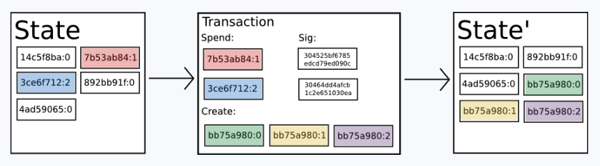

# History

## Introduction to Bitcoin and Existing Concepts

> 2009년 나카모토 사토시는 공개키 암호를 통한 coin의 소유권 관리할 수 있는 최초의 실용적인 분산 화폐를 만들었다. 이미 확립된 기본 요소와 "작업 증명"이라고 알려진 coin 소유자를 추적하기 위한 합의 알고리즘을 결합했다.


**Pow는 두가지 문제를 동시에 해결했다**

* **효과적인 합의 알고리즘**
  * 간단하고 적당히 효과적인 합의 알고리즘을 제공하여 네트워크의 노드가 비트코인 원장 **상태에 대한 일련의 업데이트에 대해 집단적으로 합의**할 수 있도록 했다. 
* **합의결정권에 대한 정치적 문제를 해결**
  * 합의 과정에 자유롭게 진입할 수 있는 장치를 마련하여 합의 과정에 누가 영향을 미칠지를 결정하는 정치적 문제를 해결하는 동시에 Sybil 공격을 방지함
  * 각 노드의 결정권의 크기를 그 노드의 계산능력에 직접적으로 비례시키는 방식으로 대체함


**POW와 POS**

* 합의 투표 과정에서 단일 노드의 가중치는 노드의 컴퓨팅 능력에 정비례한다. 
* 그 이후로, 노드 가중치를 컴퓨팅 능력이 아닌 통화 보유량에 비례하는 것으로 계산하는 지분 증명이라고 불리는 대체 접근법이 제안되었다.


## Bitcoin As A State Transition System



* 비트코인과 같은 암호화 화폐의 장부는 하나의 상태 변환 시스템(state transition system)으로 생각해볼 수 있다

* 상태

  * 현재 모든 비트코인의 소유권 현황으로 이루어진 하나의 상태
  * 아직 사용되지 않은 코인(UTXO)들의 집합
    * 각 UTXO는 액면금액과 소유자가 있다.
    * 소유자: 20byte 의 주소로 정의되는 암호화된 공개키

* 거래

  * 거래는 하나 이상의 입력을 포함한다
  * 각 입력은 현재 사용되는 UTXO와 소유자의 주소와 관련된 개인 키에 의해 생성된 암호화 서명을 포함한다.
  * 각 출력은 상태에 추가될 새로운 UTXO들이다.

* 상태 변환 함수

  * **상태와 거래를 가지고 그 결과 새로운 상태를 출력하는 함수**

  * 각 **입력**에는 보내는 쪽 지갑주소에서 선택된 기존 **UTXO** 에 대한 참조정보와, 해당지갑주소에 대응되는 개인키(private key)가 생성한 **암호화된 서명**을 담고 있다. 

  * 각 **출력**들은 상태에 추가될 **새로운 UTXO** 정보를 가지고 있다.

  * ```
    APPLY(S,TX) -> S' or ERROR
    APPLY({ Alice: $50, Bob: $50 },"send $20 from Alice to Bob") = { Alice: $30, Bob: $70 }
    ```


**비트코인 거래**

1. TX의 각 입력에 대해:
   * 참조된 UTXO가 S에 없다면 오류를 반환합니다. -> 존재하지 않는 코인
   * 제공된 서명이 UTXO의 소유자와 일치하지 않으면 오류를 반환합니다. -> 다른 사람의 코인을 사용하지 못함
2. 모든 입력 UTXO의 합계가 모든 출력 UTXO의 합보다 작으면 오류를 반환합니다.
3. 모든 입력 UTXO가 제거되고 모든 출력 UTXO가 추가된 상태를 반환합니다.


**비트코인 거래 예시**

1. 앨리스는 밥에게 11.7 BTC를 보내고싶다
2. 먼저, Alice는 최소 11.7 BTC이상의 이용 가능한 UTXO들을 찾는다. 
3. 현실적으로, 앨리스는 정확히 액면가가 11.7 BTC인 UTXO를 얻을 수 없을 것이다; 
4. 그녀가 얻을 수 있는 가장 작은 UTXO들의 합은 6+4+2=12(UTXO)라고 가정하자. 
5. 그리고 나서 그녀는 그 세 개의 입력과 두 개의 출력으로 거래를 만든다.
6. 첫 번째 출력물은 밥의 주소를 소유자로 둔 11.7 BTC이며, 두 번째 출력물은 나머지 0.3 BTC "잔돈"으로 소유자는 앨리스 자신이 될 것이다.


## Mining


* 비트코인을 통해 우리는 탈중앙화 화폐 시스템을 구축하려 하고 있기 때문에 모든 사람이 거래 순서에 동의하도록 하기 위해 State Transition System과 합의 시스템을 결합할 필요가 있을 것이다.
* 비트코인의 분산된 합의 프로세스는 네트워크상의 노드들이 "블록"이라고 불리는 트랜잭션 패키지를 지속적으로 생성하려고 시도하도록 요구한다.
* 네트워크는 10분마다 대략 하나의 블록을 생성하도록 되어 있다
* 각 블록은 타임스탬프, 논스, 이전 블록(해시)과 이전 블록 이후 발생한 모든 트랜잭션의 목록으로 구성된다.
* 시간이 지남에 따라 비트코인 원장의 최신 상태를 나타내기 위해 끊임없이 업데이트되는 "블록체인"을 만든다.


**블록 유효성 검사 알고리즘**

* 하나의 블록이 유효한지 아닌지를 확인하기 위한 알고리즘

1. 블록에서 참조한 이전 블록이 존재하며 유효한지 확인합니다.
2. 블록의 타임스탬프가 이전 블록의 타임스탬프 보다 크면서 2시간 이내인지 확인합니다.
3. 블록의 작업증명이 유효한지 확인합니다.
4. S[0]를 이전 블록의 끝에 있는 상태라고 하자.
5. TX가 n개의 트랜잭션이 있는 블록의 트랜잭션 리스트라고 가정해 보자. 
   * 0...n-1의 모든 i에 대해 S[i+1] = APPLY(S[i],TX[i]) 
   * 오류를 반환하는 경우 종료하고 false를 반환합니다.
6. true를 반환하고 S[n]를 이 블록의 끝에 있는 상태로 등록합니다.

* 블록의 각 트랜잭션은 트랜잭션이 실행되기 전의 표준 상태에서 어떤 새로운 상태로 유효한 상태 전환을 제공해야 한다.
* **상태는 블록에 인코딩되지 않는다.**
* 상태는 검증 노드에 의해 기억되어야한다.
* 상태는 발생 상태에서 시작하여 모든 블록의 모든 트랜잭션을 순차적으로 적용함으로써 계산될 수 있다.


**POW**


* POW의 조건은 256 비트의 숫자로 표현되는 각 블록의 이중-SHA256 해시가 동적으로 조정되는 target보다 반드시 작아야한다.
* 블록 생성을 전산적으로 '힘들게' 만들어 공격자가 자신들에게 유리하게 전체 블록체인을 다시 만드는 것을 막는 것이 목적이다. 
* SHA256은 완전히 예측할 수 없는 유사 난수 함수로 설계되었으므로 유효한 블록을 생성하는 유일한 방법은 시행착오를 반복하여 nonce를 증가시키고 새 해시가 일치하는지 확인하는 방법밖에 없다.
* 평균적으로 10분마다 새로운 블록이 생성되도록 2016 블록마다 네트워크에 의해 target이 조절된다.


**보상**

* POW 작업에 대해 마이너를 보상하기 위해, 모든 블록의 마이너는 인풋없이 자신에게 25 BTC를 주는 트랜잭션을 포함시킨다.
  * 이 트랜잭션을 코인베이스라고한다.
  * BTC가 발행되는 유일한 메커니즘이다
  * genesis 상태에는 coin이 전혀 존재하지 않았다
* 어떤 거래가 그것의 아웃풋보다 인풋이 더 높은 총액을 가지고 있다면, 그 차이는 "거래 수수료"로서 마이너에게 돌아간다. 


**공격자 시나리오**

* 공격자는 암호학에 의해 직접적으로 보호되지 않는 비트코인 시스템의 한 부분인 거래 순서를 바꾸는 것을 목표로 함

1. 일부 제품(가급적 빠른 배송 디지털 상품)과 교환하여 100 BTC를 판매점에 보냅니다.
2. 제품이 배송될 때까지 기다립니다.
3. 동일한 100 BTC를 자신에게 보내는 다른 트랜잭션을 생성합니다.(이중지불 시도)
4. 비트코인 네트워크가, 공격자 자신에게 보내는 트랜잭션이 판매자에게 지불하는 트랜잭션보다 먼저 수행된 것으로 인식하도록 속이기

> 일단 (1) 단계가 실행되면, 몇 분 후에 일부 마이너는 트랜잭션을 블록(블록 번호 270000)에 포함할 것이다. 약 1시간 후, 이 블록 이후에 5개의 블록이 체인에 추가되며, 각 블록은 트랜잭션을 간접적으로 가리키며 "confirming"한다. 이 시점에서 판매자는 결제를 확정된 것으로 받아들이고 상품을 배송할 것이다; 우리는 이것이 디지털 상품이라고 가정하고 있기 때문에 배송은 즉시 이루어진다. 이제 공격자는 100 BTC를 자신에게 보내는 또 다른 거래를 만든다. 만약 공격자가 단순히 그것을 네트워크에 브로드캐스팅한다면, 트랜잭션은 처리되지 않을 것이다; 마이너는 APPLY(S,TX)를 실행하려고 시도하고 TX가 더 이상 state에 있지 않은 UTXO를 소비한다는 것을 알 수 있기때문이다.
>
>  따라서 공격자는 다른 버전의 블록 270000을 마이닝하는 것으로 시작하여 블록 체인의 "포크"를 생성한다. 다른 버전의 블록은 부모 블록 269999를 가리키지만 위조된 트랜잭션을 포함하고 있다.이 블록 정보는 원래 것과 다르므로 작업증명(proof of work)이 다시 수행되어야 한다. 그리고 공격자의 새버전 블록 270000 은 기존 270000 과 다른 해시를 가지므로 원래 블록 270001 부터 270005 는 공격자의 블록을 가리키지 않는다. 그러므로 원래 체인과 공격자의 새로운 체인은 완전히 분리된다. 포크에서는 가장 긴 체인이 진실로 받아들여지는 규칙 있다. 그래서 올바른 마이너들은 270005 뒤에 연결할 블록을 만들 때 공격자 혼자 270000블록을 작업하고 있을 것이다. 공격자가 자신의 체인을 가장 길게 만들기 위해선 그는 나머지 노드들의 컴퓨팅 파워를 합친 것 보다 더 많은 컴퓨팅 파워가 필요하다.("51% attack")


## Merkle Tree


* 머클트리(Merkle Tree)는 블록에 포함된 거래 내역을 요약한 자료구조이다.
* Merkle 트리는 이진 트리의 일종이다.
  * 머클 트리는 많은 노드로 구성된다
  * 리프 노드에는 저장하고자 하는 데이터가 들어있다.
  * 중간 노드는 두 자식의 해시이다.
  * 루트 노드 또한 두 자식의 해시이다.
  * 이 과정을 통해 다수의 데이터를 하나로 묶어 용량을 절약할 수 있다.
  * SHA256 해시를 사용

**용도**

* 머클트리에서는 모든 거래내역들을 해시화한 **머클루트를 통해 거래내역의 변동여부를 쉽게 확인**할 수 있다
  * 머클트리 자체가 해시로 이루어진만큼 하나의 트랜잭션 혹은 블록 내 필드값이 변조될 경우 머클루트 해시 값이 변조되는 쇄도 효과(avalanche effect)가 발생한다. 
* 머클루트를 헤더에 담아 트랜잭션의 유효성을 보장한다.
* 머클 경로(Merkle path)를 제공받아 **특정한 트랜잭션이 블록에 유효하게 있는 효율적인 검사가 가능**하다. 
* 머클트리는 모든 정보를 압축하여 간단하게 표현한 데이터로서 머클트리를 통해 데이터의 간편하고 확실한 인증이 가능하다
* 머클트리 프로토콜은 비트코인 네트워크를 장기간 지속가능하게 만드는 기초가 된다
  * 모든 블록 전체를 저장하고 처리하는 비트코인 네트워크의 "풀 노드"는 2014년 4월 비트코인 네트워크에서 약 15GB의 디스크 공간을 차지하며 매월 1기가바이트 이상 커짐
* 가벼운 노드는 블록헤더를 다운로드하고 그 블록헤더에서 작업증명을 검증한다. 
  * 그리고 관련 트랜잭션들에 대한 "곁가지들(branches)"만을 다운로드 한다. 
  * 이렇게 전체 블록체인의 매우 작은 비율만을 다운로드 함에도 불구하고 강한 안전성을 보장하면서도, 임의의 트랜잭션의 상태 및 잔고 상태를 알아낼 수 있게 한다.


**구성요소**

* 머클루트 
  * 블록이 보유하고 있는 거래 내역들의 해시값을 가장 가까운 거래내역끼리 쌍을 지어 해시화하고 쌍을 지을 수 없을 때까지 이 과정을 반복했을 때 얻게 되는 값이다. 
  * 이는 블록에 저장되어 있는 모든 거래의 요약본으로 해당 블록에 포함된 거래로부터 생성된 머클트리의 루트에 대한 해시정보가 담겨있다. 
  * 아무리가 거래가 많이 발생하여도 하나로 압축된 머클 루트의 용량은 항상 32 바이트이다
* 머클 경로 
  * 머클 경로(Merkle path)는 어떤 거래의 진위를 따질 때 이를 검증하는 과정이다. 
  * 머클루트가 주어진다면, 좀 더 쉽게 검증이 가능하다.


**블록 헤더**

* 블록의 "해시"는 블록 헤더의 해시이다
* 블록 헤더의 구성 요소
  * 블록 내의 모든 트랜잭션을 저장하는 Merkle 트리라고 불리는 데이터 구조의 루트 해시 
  * 타임스탬프
  * nonce
  * 이전 블록의 해시


## SPV

* SPV(Simple Payment Verification)
* SPV는 모든 블록체인을 다운로드 하지 않고 거래를 검증하는 간이 결제 확인 방법이다
* [라이트노드](#light-node)는 개별 거래에 대한 트랜잭션을 확인하기 위한 SPV(Simple Payment Verify, 단순 지불 검증)를 사용한다.
* SPV는 라이트노드에서 거래를 검증하기 위해 풀노드에게 블록정보를 요청하여 머클트리를 통해 이 거래가 검증된 거래인지를 확인하는 방법이다.

**문제점**

* SPV는 풀 노드들에 정보를 요청해야만 거래를 진행할 수 있기 때문에 풀 노드에 대한 정보의 의존도가 높다. 
* 풀 노드의 경우 처음부터 블록체인을 저장해왔고 최종적으로 돈이 들어 있는 계좌(UTXO)를 블록체인이 아닌 데이터베이스에 저장하기 때문에 더 빠른 속도로 처음부터 자신의 잔고를 확인할 수 있지만, SPV의 경우 다른 풀 노드에 의지하기 때문에 처음부터 제대로 된 정보를 주느냐가 문제이다. 
* 악의적 노드가 끼어들게 되면 SPV로써는 구분할 수 없기 때문에 큰 문제로 이어질 수 있으며 다른 노드들이 거래를 취소를 시켜버림으로써 거래지연이 발생하게 된다


> # Light node
>
> * 라이트노드는 블록체인 **거래내역 중 일종의 핵심본만 저장하는 노드**이다. 
> * 모든 블록 정보를 가지고 있지 않고, 필요한 부분만 저장한다는 특징이 있다.
>   *  즉 **블록헤더에 있는 중요한 데이터만 보유**하고 있다.
> * 모든 블록정보를 가지고 있지 않기 때문에 어떤 새로운 거래 정보를 수신받았을 경우 이 거래가 정상적인지 검증할 수 없다.
> * 라이트노드는 블록체인에 참여하여 거래를 수행하는 노드로, 풀노드에 거래 데이터를 요청하여 개별 거래를 검증하는 기능을 수행한다.


## Scripting

* 별도의 확장없이도 비트코인 프로토콜은 낮은 수준의 "스마트 계약"의 개념을 가능하게 할 수 있다.


**비트코인 Scripting의 한계**

* 튜링불완전성
  * 비트코인 스크립트 언어로 할 수 있는 작업이 많긴 하지만, 모든 경우의 프로그래밍을 다 지원하지는 않는다. 
  * 특히 while 이나 for 와 같은 순환(loop) 명령 카테고리가 빠져 있다.
  * 순환 명령어를 없앤 이유는 거래 증명을 할 때 무한 순환에 빠지는 것을 막기 위해서였다
  * 어떤 순환 명령이든 단순히 하위 코드를 여러 차례 if 구문과 함께 반복함으로써 구현이 가능하나 공간 비효율적
* 금액 해독 불가(VALUE-BLINDNESS)
  * UTXO 스크립트만으로는 인출 액수를 세밀하게 통제할 방법이 없다. 
  * UTXO는 인출액 전부가 송금되거나 말거나 밖에 선택할 수가 없다.
* 상태 표현 제한
  * UTXO 가 표현할 수 있는 상태는 사용되었거나 안 되거나 둘 뿐이다. 
  * 그렇기 때문에 이 두가지 상태 이외에 다른 어떤 내부적 상태를 가지는 다중 단계 계약이나 스크립트를 만들 수가 없다.
* 블록체인 해독 불가(BLOCKCHAIN-BLINDNESS)


# Ethereum

* 이더리움은 [스마트 컨트랙트](#contract)라는 프로그램을 실행하는 오픈 소스에 기반을 둔 전 세계에 걸쳐 탈중앙화된 컴퓨팅 인프라스트럭쳐이다
* 분산 애플리케이션을 위한 플랫폼 제공
  * **빠른 개발 시간**
    * DNS와 같은 앱은 두 줄 정도의 코드, 통화나 평판 시스템 관련 프로토콜은 스무 줄 내외의 코드로 작성 가능
  * **튜링 완전 언어**
    * 누구든지 이 언어를 사용하여 스마트 컨트랙트, 분산 어플리케이션을 작성하여 소유권에 대한 임의의 규칙만들 수 있다.
    * 트랜잭션 형식(transaction format), 상태변환 함수(state transition function) 등
  * **보안**
    * 작고 드물게 사용되는 어플리케이션을 위한 보안을 제공
    * 앱들이 이더리움이라는 하나의 거대한 플랫폼을 공유.


## Account

* 이더리움에서 state는 `account`라고 불리는 객체로 구성된다
* account는 20바이트 주소를 가진다
  * Keccak-256을 사용하여 공개키의 해시를 계산 마지막 20바이트가 주소가된다.
* state 전환은 account 간의 직접적인 value 및 information 전송으로 이루어진다.


### **Account Fields**

* account의 state는 4가지의 필드로 구성된다.
* nonce
  * 각 트랜잭션이 한 번만 처리될 수 있도록 하기 위해 사용되는 카운터
  * [외부 소유 계정](#eoa) 계정인 경우`이 주소에서 보낸 트랜잭션의 수` 
  * [컨트랙트 계정](#contract account)인 경우 `이 계정으로 만든 컨트랙트 생성 수`
* balance
  * 이 주소에 의해 소유된 Wei의 수
* codeHash(optional)
  * 외부 소유 계정은 코드를 가지고 있지 않다.
  * 이 계정(컨트랙트 계정)의 EVM 코드 해시
  * 주소가 메시지 수신할 경우 실행되는 코드입니다.
  * 코드는 불변하므로 다른 필드와 달리 생성 후에 바뀌지 않는다.
  * 이러한 모든 코드 조각은 나중에 검색할 수 있도록 해당 해시의 상태 데이터베이스에 포함되어 있습니다.
* storageRoot
  * 생성 초기 비어있다.
  * 계정의 storage 내용을 인코딩하는 Merkle Patricia 트리의 루트 노드에 대한 256비트 해시


### EOA

* 외부 소유 계정(Externally Owned Accounts)
* 비밀키에 의해 통제되는 계정
* code를 가지고 있지 않다
* [트랜잭션](#transaction)을 만들고 서명함으로써 메시지를 전송할 수 있다.


### **Contract Account**

* contract code에 의해 통제되는 계정
  * 여기서 code란 컨트랙트 계정 생성시 이더리움 블록체인에 기록되고 EVM에 의해 실행되는 소프트웨어 프로그램이다.
* 메시지를 받을 때 마다 code가 작동한다
* storage를 읽고 쓸 수 있다
* 메시지를 보내거나 [컨트랙트](#contract)를 만들 수 있다.
* 컨트랙트 계정에는 개인키가 없다
  * 트랜잭션을 시작할 수 없다(컨트랙트의 발신자가 될 수 없다)
  * EOA만 트랜잭션을 시작할 수 있다.


> ### Contract
>
> * 컨트랙트는, 수행되거나 컴파일 되어야 할 어떤 것이라기 보다는이더리움의 실행 환경안에 살아있는 일종의 자율 에이전트이다
> * 컨트랙트는 자신이 소유한 ether balance와 key/valuce store 대한 직접적인 통제권을 가지고 있다.
>
> 
>
> **Contract의 생성**
>
> * 솔리디티로 작성한 스마트 컨트랙트는 [EVM](#evm)에서 사용되는 바이트 코드로 컴파일되어야 한다.
> * 컴파일된 컨트랙트 코드는 특수한 형태의 [트랜잭션](#transaction)을 통해 이더리움 블록체인에 배포가 되고 이때부터 공개된다.
>   * 스마트 계약의 배포를 위해서는 수신자의 주소가 0으로 지정된 특수한 형태의 트랜잭션을 발생시켜야 한다.
> * 컨트랙트가 생성되면 지갑과 마찬가지로 주소를 가지게된다.
>
> 
>
> **Contract의 실행**
>
> * 컨트랙트는 메시지나 [트랜잭션](#transaction)을 트리거로 항상 특정 코드를 실행하는 자동화된 에이전트이다
> * 트랜잭션의 목적지가 컨트랙트 주소일 때 트랜잭션과 트랜잭션 데이터를 입력으로 사용하여 컨트랙트가 EVM에서 실행된다.
> * 트랜잭션에는 이더, 데이터가 포함된다
>   * 이더가 포함되어 있으면 컨트랙트 잔액에 예치된다.
>   * 데이터가 포함되어 있으면 데이터에서는 컨트랙트에서 명명된 함수를 지정하고 호출하여 함수에 인수를 전달할 수 있다
> * 이렇게 트랜잭션은 컨트랙트 내의 함수를 호출할 수 있다.


## Transaction


* 트랜잭션은 [외부 소유 계정](#eoa)에서 보낼 메시지를 저장하는 서명된 데이터 패키지를 말한다.
  * [컨트랙트](#contract)는 트랜잭션의 발신자가 될 수 없다.
* 이더리움 네트워크에 위해 전송되고 이더리움 블록체인에 기록된다.
* 트랜잭션은 [EVM](#evm)에서 상태 변경을 유발하거나 컨트랙트를 실행할 수 있는 유일한 방법이다.
* 컨트랙트는 독자적으로 실행되지 않는다 모든 것이 트랜잭션으로부터 시작된다.
* 두 가지 유형의 트랜잭션이 있다
  * 코드를 가진 새로운 계정을 생성하는 트랜잭션(컨트랙트 생성 트랜잭션)
  * 메시지 호출을 발생시키는 트랜잭션


### Transaction Fields

**공통 필드**

* nonce(논스)
  * 발신자 주소에서 보낸 트랜잭션의 수
* gasPrice 와 gasLimit
  * gasPrice : 발신자가 지급하는 가스의 가격(웨이)
  * gasLimit: 이 트랜잭션을 위해 구입할 가스의 최대량
  * [gas](#gas)
* to(수신자)
  * 목적지 이더리움 주소(160비트)
  * 또는 컨트랙트 생성 주소
* value(값)
  * 목적지에 보낼 이더의 양
  * 컨트랙트 생성의 경우 새로 생성되는 컨트랙트 계정의 잔액에 예치된다.
* v, r, s
  * EOA의 ECDSA 디지털 서명의 세 가지 구성요소
  * 트랜잭션의 서명에 해당하는 값들이며 트랜잭션의 발신자를 결정하는 데 사용됩니다.


> ### Gas
>
> * 계산의 기본 단위
>   * EVM의 각 명령어는 가스 단위로 미리 정해진 비용이 있다.
>   * 거래 데이터의 1바이트당 5가스의 수수료가 발생한다. 
> * 수수료 시스템의 의도는 어떤 공격자가 계산, 밴드위스, 저장소 등을 포함하여 그들이 소비하는 모든 리소스에 비례하여 강제로 수수료를 지불하게 하는데 있다
> * 이더를 거래할 때도 수수료가 요구된다. 이는 실물처럼 그냥 주고받는 것이 아니라 데이터를 옮기는 것이기 때문에 계산이 필요하고 여기서 계산을 위한 노동의 보상으로 발생하는 것이 가스다.
> * 데이터를 옮기기 위해서는 채굴자들의 연산 작업이 필요한데, 채굴자들이 한 계산에 대한 보상으로 가스를 제공한다.
> * **가스는 네트워크의 과부하를 막으며, 이더리움 플랫폼이 계속 운영되도록 하는 인센티브 역할을 한다**
>
> 
>
> ### Gas Price
>
> * **하나의 연산 단계에 부여할 이더의 양(WEI 단위).**
> * 트랜잭션 생성자는 원하는 가스 가격을 지정할 수 있다.
>   * 예를 들어 ‘가스 당 3Gwei를 지불할 용의가 있다.’라고 설정했을 때, 트랜잭션이 1,000,000가스를 소비하고 가스 가격을 3Gwei로 설정하면 해당 트랜잭션에 대한 수수료로 3,000,000Gwei를 지불하게 된다.
> * 대부분의 채굴자들은 가스 가격의 내림차순으로 트랜잭션을 분류하고 가스 가격이 높은 트랜잭션을 선택하여 블록에 포함시키기 때문에 설정한 가스 가격이 높을수록 트랜잭션은 더 빨리 처리된다.
> * 가격을 낮게 책정해도 결국 트랜잭션이 블록에 포함되기는 하지만 그 대기 시간이 상당히 길어질 가능성도 있다.
> * 가스 가격은 일반 사람들에 의하여 무작위로 책정되지는 않고 가스 가격을 측정해주는 사이트가 있다. 
>   * 이더리움 가스스테이션이라는 사이트인데, 이곳에서 적당한 가스 가격을 선택할 수 있다. 사용되는 가스의 평균값이라고 보면 된다. 
>   * 빠른 처리를 원할 경우 여기 나온 금액보다 높은 가격을 측정하면 된다.
>
> 
>
> ### Gas Limit
>
> * **해당 거래가 수행될 때 사용할 수 있는 최대 연산 단계의 수**
> * **즉 하나의 거래에서 사용될 수 있는 최대 가스 양은 Gas Limit * Gas Price 이고 이 중 사용되지 않은 가스는 반환된다.**
> * 가스 한도는 작업 중단 시점을 보장함으로써 무제한으로 이더를 사용하는 것을 방지할 수 있다.
> * 사용자는 트랜잭션을 실행하기 위해 사용할 가스의 최대 금액을 나타내는 가스 한도(Gas Limit)를 설정한다.
> * 가스 한도는 요청하는 작업량의 추측이다. 하지만 추측은 쉬운 일이 아니다.
>   * 일반적으로 21,000가스의 한도는 대부분의 거래를 만족한다고 알려져 있다.
> * 한도가 낮으면 작업이 완료되지 않고 거래는 실패하며 그 시점까지 사용된 이더가 손실된다.
> * 한도를 너무 높게 설정하여 한도 전에 작업이 끝나더라도 작업에 사용되지 않은 모든 이더는 다시 되돌려 받을 수 있다
>
> 
>
> **Gas Limit 측정**
>
> * 트랜잭션은 크게 2가지 종류로 단순한 이더리움 송금(transactions)과 Contract를 실행시키는 트랜잭션(contract internal transactions)이 있다. 
> * EOA간의 Value transfer(Standard transaction)는 21,000개의 가스가 소모됨
> * Contract 실행은 코드의 복잡성에 따라 천차만별이다. 
>   * 어떻게 이걸 예측해서 Gas Limit을 결정할 수 있을까? 
>   * 답은 간단하게도 실제로 계산을 해보는 것이다. 
>   * 명령어별로 이미 Gas Fee는 공개가 되어있으며 개발자는 자신의 Solidity 코드가 어느 정도의 Gas가 들지 예측할 수 있다.


**message call transaction 필드**

* data
  * 가변 길이 바이너리 데이터 페이로드
  * Message call의 입력 Data
  * 데이터 필드는 기본적으로 아무 기능이 없다.
  * EVM에는 계약이 이 데이터에 액세스할 수 있는 opcode가 있다
  * 사용 예시
    * 계약이 블록체인 도메인 등록 서비스로 작동하는 경우, 
    * 전송되는 데이터를 두 개의 "필드"를 포함하는 것으로 해석할 수 있다
    * 계약은 첫번째 필드로 등록할 도메인과 두 번째 필드로 등록할 IP 주소로 읽고 이를 적절하게 storage에 보관할 수 있다.


**contract creation transaction 필드**

* init


## Message(INTERNAL TRANSACTION)

* [컨트랙트](#contract)는 다른 컨트랙트으로 메시지를 보낼 수 있다. 
* 메시지는 [트랜잭션](#transaction)과 다르게 별도 저장할 필요가 없으며 이더리움 실행 환경에만 존재하는 가상 객체입니다.
* [컨트랙트](#contract)가 `CALL` opcode를 실행할 때 메시지가 생성된다.


**Message 구성요소**

* 메시지 발신인
* 메시지 수신인
* ether 양
* Data(데이터)
* STARTGAS


**Transaction과 비교**

* 본질적으로 메시지는 외부 행위자가 아닌 **컨트랙트에 의해 생산된다는 점**을 제외하면 트랜잭션과 유사하다. 
* 트랜잭션과 마찬가지로 메시지는 **수신자 계정으로 코드를 실행되게한다.** 
* 그러므로 계약들은 외부 행위자들이 할 수 있는 것과 정확히 같은 방식으로 **다른 계약들과 관계를 맺을 수 있다.**


## State Transition Function


이더리움 상태 변환 함수 APPLY(S,TX) -> S'는 다음과 같이 정의할 수 있다.

1. 트랜잭션이 제대로 구성되어 있는지 확인합니다. 
   * 서명이 유효한지 확인
   * 발신자 계정의 nonce와 트랜잭션의 nonce가 같은지 확인
   * 같지 않으면 오류를 반환
2. 거래 수수료를 STARTGAS * GASPRICE로 계산하고 서명에서 발송 주소를 결정합니다. 
   * 발신자의 계정 잔액에서 수수료를 뺀다.
   * 발신자의 nonce를 증가시킨다.
   * 사용할 잔액이 부족하면 오류를 반환
3. GAS = STARTGAS를 초기화하고 바이트당 일정량의 가스를 차감하여 트랜잭션의 바이트값을 지불합니다.
4. value를 발신자의 계정에서 수신자의 계정으로 이동시킨다.
   * 만약 수신자의 계정이 존재하지 않는다면 생성한다.
   * 만약 수신자가 [컨트랙트 계정](#contract account)이라면 컨트랙트의 코드를 끝까지 또는 gas 가 모두 소모될 때 까지 수행한다.
   * 만약 수신자가 컨트랙트가 아니라면
     * 총 거래 수수료는 제공된 가스 가격에 거래 길이를 바이트로 곱한 것과 같다.
5. 발신자의 잔액 부족으로 value전송이 실패하거나 가스 부족으로 code 실행이 실패하면
   * 수수료 지불을 제외한 모든 상태를 복구한다.
   * 그리고 마이너의 계정에 수수료를 준다.
6. 실패하지 않으면 남은 가스 사용료는 모두 발신자에게 환불하고, 소비한 가스 사용료는 마이너에게 보낸다.

> 만약 거래의 수신자가 contract가 아니라면, 총 거래 수수료는 제공된 가스 가격에 거래 길이를 바이트로 곱한 것과 같을 것이고, 거래와 함께 보내진 데이터는 관련이 없을 것이다.


## Code Execution

* 이더리움 **Contract의 코드**는 "[EVM](#evm) 코드"라고 하는 저수준의 스택 기반 **바이트코드 언어**로 작성된다. 
* 이 코드는 연속된 바이트로 구성되어 있고, 각각의 바이트는 연산(operation)을 나타낸다. 
* 일반적으로 코드 실행은 코드 끝에 도달하거나 오류 또는 STOP 또는 RETURN 명령이 감지될 때까지 현재 프로그램 카운터(0에서 시작)에서 작업을 반복적으로 수행한 다음 프로그램 카운터를 하나씩 증가시키는 무한 루프이다. 
* operation은 데이터를 저장할 수 있는 세 가지 유형의 공간에 액세스할 수 있습니다.
  * 스택: 값을 넣고 뺄 수 있는 선입선출 저장소
  * 메모리: 무한 확장 가능한 바이트 배열
  * 스토리지: 계약의 장기 보관, 키/밸류 스토어. 연산이 끝나면 리셋되는 스택이나 메모리와 달리 스토리지는 장기간 지속된다.
* 코드는 또한 블록 헤더 데이터뿐만 아니라 특정 값이나, 발송자 및 수신되는 **메시지의 데이터에 접근**할 수 있고, 결과값으로 데이터의 바이트 배열을 반환할 수도 있다.
* 물리적인 하드웨어 관점에서 볼 때, 컨트랙트 코드는 “어디에서" 실행되는가?
  * 트랜잭션이 블록 B 에 포함되면 그 트랜잭션에 의해 발생할 코드의 실행은 현재 또는 향후에 블록 B 를 다운로드 하고 검증하는 모든 노드들에 의해 실행될 것이다


> ### EVM
>
> * 이더리움 가상 머신이라고 하는 **에뮬레이트된 컴퓨터에서 스마트 컨트랙트라는 프로그램을 실행**한다.
> * EVM은 싱글톤으로 전 세계에 걸친 **단일 인스턴스 컴퓨터인 것처럼 작동**한다.
> * 각 노드들은 컨트랙트 실행을 확인하기 위해 EVM의 로컬 사본을 실행하고 이더리움 블록체인은 트랜잭션과 스마트 컨트랙트를 처리할 때 월드 컴퓨터의 변화하는 상태를 기록한다.
>
> 
>
> **emv의 특징**
>
> * 튜링 완전 머신
>   * 앨런 튜링이 고안한 개념으로, 수학적으로 어떠한 알고리즘이든 실행시킬 수 있는 머신(우리가 쓰는 일반적인 컴퓨터)
> * 컴퓨터와 같은 구조
>   * 코드와 저장소, 스택, 인자, 메모리 등 일반적인 컴퓨터가 갖는 구조를 그대로 가지고 있음
>   * 스택 머신
>     * 프로그램의 수행 과정에서 데이터가 스택이라는 자료구조를 활용하는 머신.
>     * 하나의 데이터는 256 비트(32바이트)로 이루어져 있고 이런 데이터가 최대 1024개까지 쌓일 수 있다.
>     * 데이터가 입력되면 스택에 저장하고, 명령어가 입력되면 이전에 저장된 데이터를 기반으로 명령을 수행한다.
>   * 메모리
>     * 메모리는 EVM 상에서 바이트 코드가 수행되는 동안에만 존재하며 수행 종료와 함께 사라지는 임시 저장소이다.
>     * 256비트의 데이터가 배열로 저장된 형태로 영구적이 아닌 휘발성 메모리를 보유
>   * 저장소
>     * 키-값 형태의 데이터 저장소로써 데이터는 블록체인 위에 영속적으로 저장됨.
> * GAS
>   * 정지되지 않고 무한히 수행되는 프로그램(Halting Problem)을 방지하기 위해 수수료를 낸만큼만 EVM을 사용할 수 있음
> * 바이트 코드
>   * 스택 기반으로 실행될 수 있는 저수준의 기계어에 가까운 코드로써, EVM은 바이트 코드만을 수행함.


## State

* [EVM](#evm) 코드의 공식적인 실행 모델은 놀라울 정도로 간단하다.
* 이더리움 가상 머신이 실행되는 동안 상태는 tuple(block_state, transaction, message, code, memory, stack, pc, gas)로 정의된다.
* 각 명령어는 튜플에 어떻게 영향을 미치는지에 대한 자체 정의가 있다. 
  * ADD는 스택에서 두 개의 항목을 pop하여 합계를 push하고 가스를 1만큼 줄이고 pc를 1 증가시킨다.
  * SSTORE 는 스택에서 두 개의 아이템을 꺼내 이 아이템의 첫 번째 값이 가리키는 컨트랙트 저장소 인덱스에 두 번째 아이템을 넣는다.

**block_state**

* block_state는 글로벌 state이며 모든 계정과 잔액 및 스토리지를 포함한다.

**PC**

* 현재 수행되는 instruction을 가리킴


## Block

* 비트코인의 블록과 유사하지만 차이점이 있다.
  * 주요 차이점으로는 비트코인과는 달리 이더리움 블록은 트랜잭션 리스트와 **가장 최근의 상태(state) 복사본을 가지고 있다는 것**이다. 
* 블록 구성요소
  * transaction 리스트
  * 최신 state
  * 블록 넘버
  * difficulty


### Bolck Headers

* parentHash 
  * 부모 블록 헤더의 해시(The Keccak 256-bit hash)
* ommersHash
* beneficiary
  * 160비트 주소
  * 채굴 승자에게 주어지는 수수료의 합을 이 주소로 전송한다.
* stateRoot
  * 모든 트랜잭션이 실행되고 종료된 후 상태 트리의 루트 노드의 해시(The Keccak 256-bit hash)
* transactionsRoot
  * The Keccak 256-bit hash of the root node of the trie structure populated with each transaction in the transactions list portion of the block
  * 트랜잭션으로 채워진 트리 구조의 루트 노드의 Keccak 256비트 해시
* receiptsRoot
* logsBloom
* difficulty
  * 블록의 난이도
  * 블록의 난이도는 이전 블록의 난이도와 타임스탬프로 계산된다.
* number
  * 부모 블록의 수
  * 제네시스 블록은 number가 0
* gaslimit
  * 블록당 소비할 수 있는 최대 가스 양
* gasUsed
  * 블록의 트랜잭션들에서 사용된 가스의 총 양
* timestamp
  * 블록 생성시 시간
* extraData
* mixHash
* nonce


### Block Validation Algorithm

* 기본적인 이더리움 블록 검증 알고리즘은 다음과 같다.


1. 이전 참조되는 블록이 존재하고 유효한지 검사
2. 현재 블록의 타임스탬프가 참조하고 있는 이전 블록의 그것보다 크면서, 동시에 현 시점을 기준으로 15 분 후보다 작은 값인지 확인한다.
3. 해당 블록의 블록 넘버, difficulty, 트랜잭션 루트, 언클 루트, gas limit이 유효한지 검사
4. 해당 블록의 POW가 유효한지 검사
5. S[0]를 이전 블록의 마지막 상태라고 하자
6. TX를 블록에 포함될 transaction N개의 리스트라고 하자
   * 모든 i 에 대해서 `S[i+1] = APPLY(S[i],TX[i])` 라고 설정
   * 블록에서 소비된 총 가스가 GASLIMIT를 초과할 경우 오류를 반환한다.
7. 채굴자에게 지불된 보상 블록을 S[n] 덧붙인 후 이것을 S_FINAL 이라 하자.
8. 상태 S_FINAL 의 머클 트리 루트가 블록 헤더가 가지고 있는 최종 상태 루트와 같은지를 검증한다. 
   * 이 값이 같으면 그 블록은 유효한 블록이며, 다르면 유효하지 않은 것으로 판단한다.


**Block과 State**

* 모든 상태를 각 블록에 저장하는 것은 매우 비효율적인 것처럼 보이지만, 실제로는 효율성의 측면에서는 비트코인과 비교할만 하다. 
* 그 이유로는 상태가 트리 구조로 저장되고, 모든 블록 후에 단지 트리의 작은 부분만이 변경되기 때문이다. 
* 보통, 인접한 두개의 블록간에는 트리의 대부분의 내용이 같고, 따라서 한번 데이터가 저장되면 포인터(서브트리의 해쉬)를 사용하여 참조될 수 있다.
* 패트리시아 트리(Patricia tree)로 알려진 이러한 종류의 특별한 트리는 머클 트리 개념을 수정하여 노드를 단지 수정할 뿐만 아니라, 효율적으로 삽입되거나 삭제하여 이러한 작업을 수행할 수 있도록 해준다. 
* 모든 상태 정보가 마지막 블록에 포함되어 있기 때문에, 전체 블록체인 히스토리를 모두 저장할 필요가 없어지게 된다. 
* 이 방법을 비트코인에 적용한다면 5 - 20 배의 저장 공간 절약의 효과가 생길 것이다.


## GHOST Protocol

* Greedy Heaviest Observed Subtree
* 다중 체인 방지 프로토콜
  * [스테일 블록](#stale-block) 문제 해결
  * 빠른 블록 생성 시 스테일 블록이 많이 생성되고 그로 인해 보안성이 저하된다.
* GHOST 는 어느 체인이 “가장 긴(longest)”것인지 계산할 때 스테일 블록도 포함으로써 네트워크 보안 손실이라는 문제를 해결한다.
  * 어느 블록이 가장 큰 전체 작업증명을 가지고 있는지 계산할 때 그 블록의 모블록과 그 조상뿐만 아니라, 그 블록의 삼촌까지도 더한다는 것이다
  * 스테일 블록도 기본 보상의 87.5%를 받게 되며, 그 스테일 블록을 포함하고 있는 사촌이 나머지 12.5%를 받는다.
  * 하지만 수수료는 삼촌들에게는 주어지지 않는다.
* GHOST 프로토콜은 가장 최신의 블록넘버를 가진 경로(계산을 가장 많이 수행한 경로)를 선택하도록 함
* 스테일 블록에 대한 보상을 지급함으로써 스테일 블록을 메인체인에 포함하여 Difficulty의 상승을 유도함


**규칙**

* 하나의 블록은 반드시 하나의 모블록을 지정해야 하며, 0 또는 그 이상의 삼촌을 지정해야 한다.
* 블록B에 포함된 삼촌은 다음과 같은 속성들을 가지고 있어야 한다.
  * 


> 삼촌 블록
> 현재의 블록과 조부모 블록을 공유하는 블록으로써, 최대 6대 위의 블록까지만, 최대 2개의 블록만 삼촌 블록으로 기록될 수 있다.
> 삼촌 블록은 유효한 블록 헤더를 가지고 있어야 하며 유효한 블록일 필요는 없다. 삼촌 블록의 채굴자는 기본 블록 보상의 93.75%를 지급받고 삼촌 블록을 기록한 블록의 채굴자는 기본 보상에 3.125%를 추가로 지급받는다.


### Stale Block


* 블록생성에 성공하였고, 검증 작업시, 오류가 없어서 네트워크를 통해 전파되었으나, 더 빨리 전파 된 다른 채굴자에 의한 블록에 순위가 밀리는 바람에 주체인에 산입되지 못한 블록이다.
* 이더리움과 같은 짧은 블록 생성 주기(15초)를 가지는 블록체인에서는 스테일 블록이 생성될 확률이 높다.
* 이더리움에서는 스테일 블록도 여전히 주체인블록 보상의 87.5%만큼의 보상을 받으며 보안성을 강화하는 역할을 수행하게 된다.
