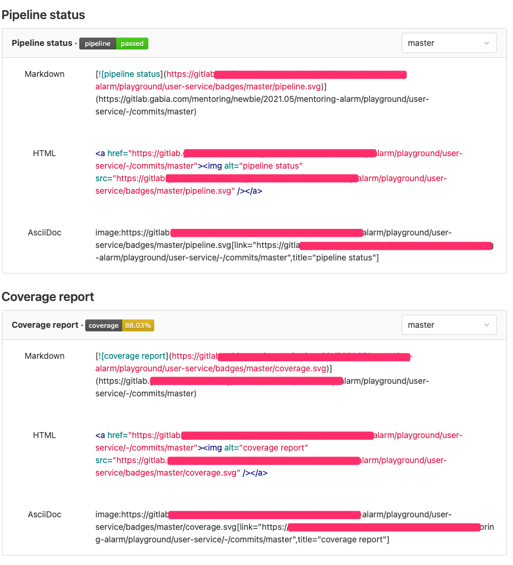
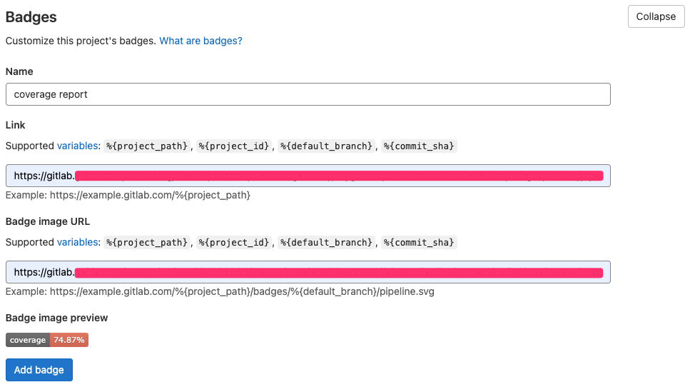

# 1. Gradle 설정

* jacoco 설정

**build.gradle**

```groovy
plugins {
    id 'jacoco'
}

jacoco {
    toolVersion = "0.8.7"
}

test {
    useJUnitPlatform()
    finalizedBy 'jacocoTestReport'
}

jacocoTestReport {
    reports {
        html.enabled true
        csv.enabled true
        csv.destination file("${buildDir}/jacoco/jacocoCsv")
        xml.enabled true
        xml.destination file("$buildDir/jacoco/jacoco.xml")
    }

    finalizedBy 'jacocoTestCoverageVerification'
}

jacocoTestCoverageVerification {
    violationRules {
        rule {
            enabled = true
            element = 'CLASS'
            // includes = []

            limit {
                counter = 'LINE'
                value = 'COVEREDRATIO'
                minimum = 0.7
            }

            excludes = []
        }
    }
}
```


# 2. `.gitlab-ci.yml` 작성

```yml
# ...
variables:
  JACOCO_CSV_LOCATION: '$CI_PROJECT_DIR/build/jacoco/jacocoCsv'
# ...
stages:
  - test
# ...
test:
  stage: test
  script:
    # Any task that runs your tests
    - ./gradlew check 
    - awk -F"," '{ instructions += $4 + $5; covered += $5 } END { print covered, "/", instructions, " instructions covered"; print 100*covered/instructions, "% covered" }' $JACOCO_CSV_LOCATION

```


# 3. GitLab 설정


## 3.1 Test coverage parsing 작성

* *Settings -> CI/CD -> General pipelines -> Test coverage parsing*

`([0-9]{1,3}.[0-9]*).%.covered` 입력


## 3.2 **cicd 파이프라인 실행 후**

* 아래와 같이 `Pipeline status` 와 `Coverage report`를 볼 수 있다.
* 뱃지 이미지 URL: `https://gitlab~~~.svg`
* 링크: `https://gitlab~~~/master`



****

**깃랩 Badge 등록하기**

* Settings -> General -> Badges -> Test coverage parsing
* 위에서 복사한 값을 아래와 같이 등록한다.




참고

* https://akobor.me/posts/how-to-gitlab-test-coverage-with-jacoco-and-gradle

