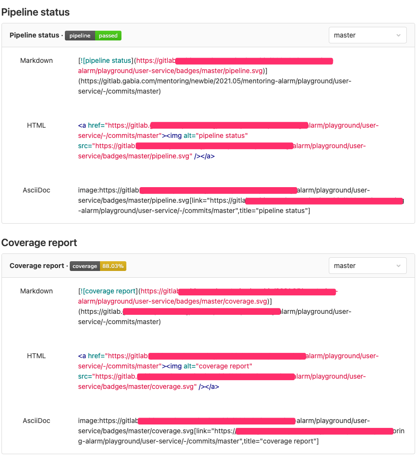

# 1 Gradle 설정

* 테스트 커버리지 리포트를 만들기 위한 Jacoco를 설정해보자


**build.gradle**

* Jacoco는 여러 형태를 제공하지만 csv 형태의 리포트를 만들어보자.
* csv 형태의 리포트 생성은 기본적으로 활성화 되어 있지 않다
* 따라서 아래와 같이 활성화 해주며 레포트의 위치를 지정한다.
  * `csv.enabled true`
  * `csv.destination file("${buildDir}/jacoco/jacocoCsv")`


```groovy
plugins {
    id 'jacoco'
}

jacoco {
    toolVersion = "0.8.7"
}

test {
    useJUnitPlatform()
    finalizedBy 'jacocoTestReport'
}

jacocoTestReport {
    reports {
        csv.enabled true
        csv.destination file("${buildDir}/jacoco/jacocoCsv")
    }

    finalizedBy 'jacocoTestCoverageVerification'
}

jacocoTestCoverageVerification {
    violationRules {
        rule {
            enabled = true
            element = 'CLASS'
            // includes = []

            limit {
                counter = 'LINE'
                value = 'COVEREDRATIO'
                minimum = 0.7
            }

            excludes = []
        }
    }
}
```


# 2 `.gitlab-ci.yml` 작성

- 깃랩 CI/CD는 테스트 커버리지 결과를 잡의 로그를 파싱해서 얻는다.
- 따라서 커버리지 결과를 로그로 남겨야 한다.
- awk 커맨드를 사용해 테스트 커버리지의 결과(csv 형태의 레포트)를 요약하는 로그를 남긴다.

```yml
# ...
variables:
  JACOCO_CSV_LOCATION: '$CI_PROJECT_DIR/build/jacoco/jacocoCsv'
# ...
stages:
  - test
# ...
test:
  stage: test
  script:
    # Any task that runs your tests
    - ./gradlew check 
    - awk -F"," '{ instructions += $4 + $5; covered += $5 } END { print covered, "/", instructions, " instructions covered"; print 100*covered/instructions, "% covered" }' $JACOCO_CSV_LOCATION

```


**잡 실행 로그**

- awk 커맨드를 통해 아래와 같이 로그를 남긴다.

```bash
$ awk -F"," '{ instructions += $4 + $5; covered += $5 } END { print covered, "/", instructions, " instructions covered"; print 100*covered/instructions, "% covered" }' $JACOCO_CSV_LOCATION
2899 / 11165  instructions covered
25.9651 % covered
```


# 3 GitLab 설정


## 3.1 Test coverage parsing 작성

- 로그에서 결과를 파싱하기 위한 regex를 작성한다.

* *Settings -> CI/CD -> General pipelines -> Test coverage parsing*

- 아래와 같이 `([0-9]{1,3}.[0-9]*).%.covered` 입력


## 3.2 **cicd 파이프라인 실행 후**

* 아래와 같이 `Pipeline status` 와 `Coverage report`를 볼 수 있다.
* 뱃지 이미지 URL: `https://gitlab~~~.svg`
* 링크: `https://gitlab~~~/master`



****

**깃랩 Badge 등록하기**

* Settings -> General -> Badges -> Test coverage parsing
* 위에서 복사한 값을 아래와 같이 등록한다.


참고

- https://akobor.me/posts/how-to-gitlab-test-coverage-with-jacoco-and-gradle

