### Jenkins 와 AWS Code deploy를 활용한 CI/CD 파이프 라인 구축하기


## CI(Continuous Integration)

> CI/CD의 "CI"는 개발자를 위한 자동화 프로세스인 지속적인 통합(Continuous Integration)을 의미합니다. CI를 성공적으로 구현할 경우 애플리케이션에 대한 새로운 코드 변경 사항이 정기적으로 빌드 및 테스트되어 공유 리포지토리에 통합되므로 여러 명의 개발자가 동시에 애플리케이션 개발과 관련된 코드 작업을 할 경우 서로 충돌할 수 있는 문제를 해결할 수 있습니다.

## CD(Continuous Deployment)

> CI/CD 파이프라인의 마지막 단계는 지속적 배포입니다. 프로덕션 준비가 완료된 빌드를 코드 리포지토리에 자동으로 릴리스하는 지속적 제공의 확장된 형태인 지속적 배포는 애플리케이션을 프로덕션으로 릴리스하는 작업을 자동화합니다. 프로덕션 이전의 파이프라인 단계에는 수동 작업 과정이 없으므로, 지속적 배포가 제대로 이루어지려면 테스트 자동화가 제대로 설계되어 있어야 합니다.
>
> 실제 사례에서 지속적 배포란 개발자가 애플리케이션에 변경 사항을 작성한 후 몇 분 이내에 애플리케이션을 자동으로 실행할 수 있는 것을 의미합니다(자동화된 테스트를 통과한 것으로 간주). 이를 통해 사용자 피드백을 지속적으로 수신하고 통합하는 일이 훨씬 수월해집니다. 이러한 모든 CI/CD 적용 사례는 애플리케이션 배포의 위험성을 줄여주므로 애플리케이션 변경 사항을 한 번에 모두 릴리스하지 않고 작은 조각으로 세분화하여 더욱 손쉽게 릴리스할 수 있습니다. 그러나 자동화된 테스트는 CI/CD 파이프라인의 여러 테스트 및 릴리스 단계를 수행할 수 있어야 하기 때문에 많은 선행 투자가 필요합니다.
>
> 출처: [링크](https://www.redhat.com/ko/topics/devops/what-is-ci-cd)


## CI/CD 과정

* Jenkins를 CI tool로 사용 예정
* AWS codeDeploy를 CD tool로 사용 예정

1. 소스코드를 GitHub에 특정 브랜치에 푸시한다.
2. GitHub의 WebHook을 통해 Jenkins에 알린다.
3. Jenkins는 GitHub에서 소스코드를 받아온다.
4. 빌드와 테스트 과정을 거친다
5. 애플리케이션을 도커 이미지로 빌드하고 도커 허브에 업로드한다.
6. appspec.yml, scripts를 압축하여 S3로 업로드 한다.
7. AWS codeDeploy에 배포를 요청한다.
8. AWS codeDeploy는 S3에 업로드된 파일을 EC2로 옮기고 appspec.yml을 읽어 scripts를 실행한다.


## Jenkins

### docker와 docker-compose 설치

* AWS amazon-linux-2 인스턴스 기준
* Jenkins를 도커 컨테이너로 띄울 예정이다 따라서 먼저 docker와 docker-compose를 설치한다.

```bash
sudo yum update -y

# 최신 도커 엔진 패키지를 설치합니다.
sudo amazon-linux-extras install docker

sudo yum install docker

# 도커 서비스를 시작합니다.
sudo service docker start

# ec2-user를 사용하지 않고도 도커 명령을 실행할 수 있도록 docker 그룹에 sudo.를 추가합니다.
sudo usermod -a -G docker ec2-user

# 도커 컴포즈 설치
sudo curl -L "https://github.com/docker/compose/releases/download/1.28.2/docker-compose-$(uname -s)-$(uname -m)" -o /usr/local/bin/docker-compose

sudo chmod +x /usr/local/bin/docker-compose

#섪치 확인
docker-compose --version
```


### docker를 이용해 Jenkins 설치하기

* `dockerfile` 과 `docker-compose.yaml` 작성
* [참고](https://github.com/jenkinsci/docker/blob/master/README.md)
* 볼륨
  * `/var/run/docker.sock:/var/run/docker.sock` : 도커 안에 도커를 위한 옵션
* 포트
  * 8080: 젠킨스 기본 포트
  * 50000: dms Jenkins slave 포트

```yaml
version: "3.8"
services:
  jenkins:
    container_name: jenkins
    image: jenkins/jenkins:lts
    volumes: 
      - jenkins_home:/var/jenkins_home
      - /var/run/docker.sock:/var/run/docker.sock
    ports: 
      - 8080:8080
      - 50000:50000
volumes:
  jenkins_home:
```

```bash
$ docker-compose up -d --build
$ docker ps
2faec0cd3ed6        jenkins/jenkins:lts   "/sbin/tini -- /usr/…"   37 seconds ago      Up 36 seconds       0.0.0.0:8080->8080/tcp, 0.0.0.0:50000->50000/tcp   jenkins
```


### Jenkins 접속하기

* http://EC2인스턴스의IP:8080

* EC2 인스턴스의 보안그룹에서 인바운드 규칙 편집 8080포트 열어주기

  

* 접속하면 아래와 같은 화면이 보인다.

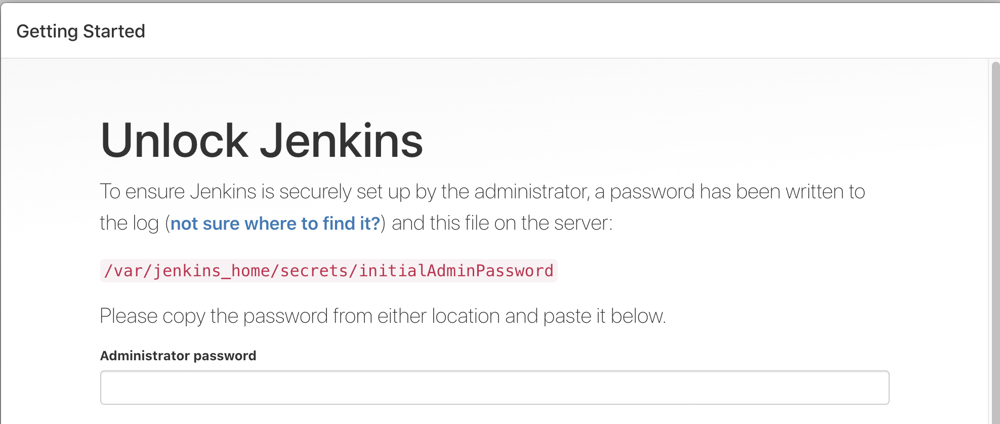

* 비밀번호 확인하기

```bash
$ docker logs jenkins
...
*************************************************************
*************************************************************
*************************************************************

Jenkins initial setup is required. An admin user has been created and a password generated.
Please use the following password to proceed to installation:

**이곳에 비밀번호가 표시됩니다**

This may also be found at: /var/jenkins_home/secrets/initialAdminPassword

*************************************************************
*************************************************************
*************************************************************
...
```

* Suggested plugin 클릭

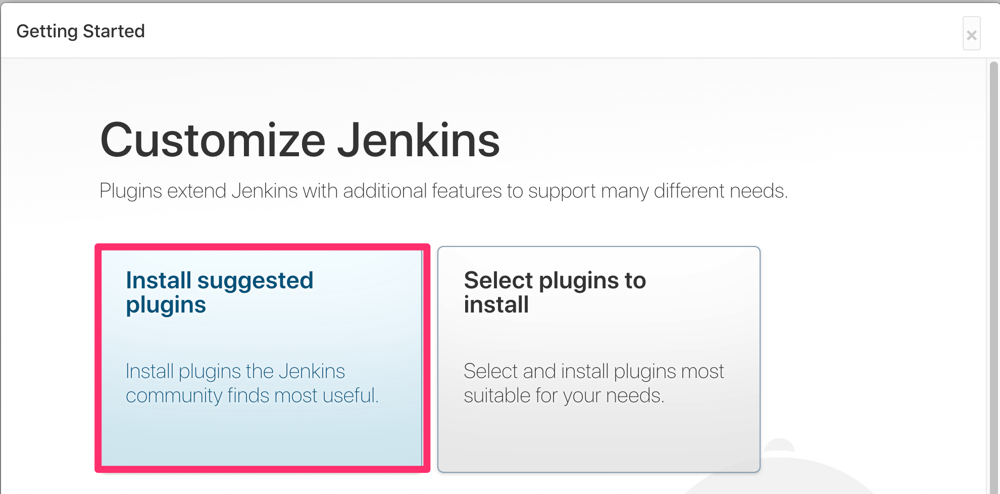


### Jenkins 와 Github 연동하기

* 젠킨스와 Github 연동시에 사용자명과 비밀번호 인증방식은 보안상 추천하지 않는 방식
* SSH 연동로 연동해보자


**키 생성**

```bash
# 젠킨스 컨테이너 접속
$ docker exec -it jenkins /bin/bash

# 키 생성 계속 엔터를 누른다.
$ ssh-keygen
Generating public/private rsa key pair.
Enter file in which to save the key (/var/jenkins_home/.ssh/id_rsa):
Created directory '/var/jenkins_home/.ssh'.
Enter passphrase (empty for no passphrase):
Enter same passphrase again:
# 키가 생성된 위치로 간다
$ cd /var/jenkins_home/.ssh
# 잘 생성 되었는지 확인
$ ls
id_rsa	id_rsa.pub
# 공개키 확인 후 복사 나중에 쓰인다.
$ cat id_rsa.pub
**이곳에 공개키가 표시됩니다**
# 비밀키 확인 후 복사 나중에 쓰인다.
$ cat id_rsa
**이곳에 비밀키가 표시됩니다**
```


### 깃허브와 연동

연동하고 싶은 리포지토리의 세팅으로 들어간다.

Deploy keys -> Add deploy key 버튼을 차례로 클릭합니다

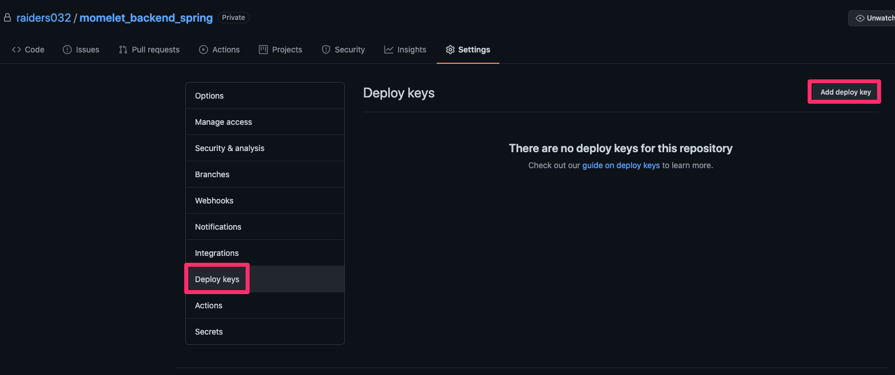

아래에 복사한 공개키를 넣어줍니다.

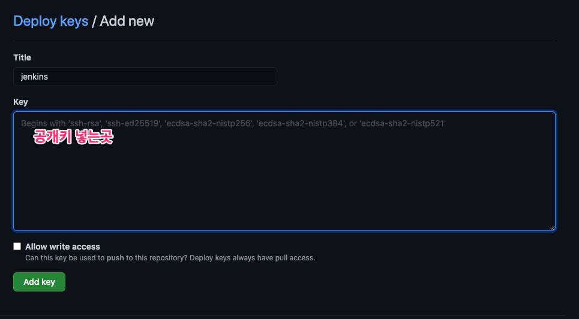


**젠킨스에 비밀키 등록하기**

`젠킨스서버IP/credentials/store/system/domain/_/` 으로 이동

Add Credentials 클릭

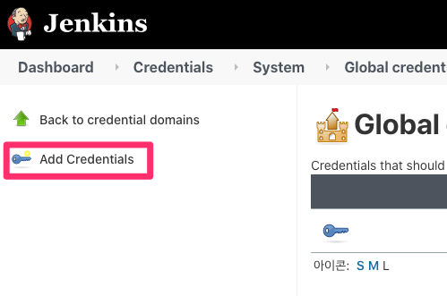

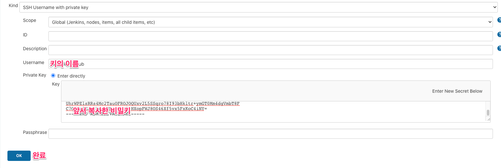


### Jenkins pipe line 만들기

* 2가지 방법 존재

메인화면에서 새로운item 클릭후 파이프라인 프로젝트 생성

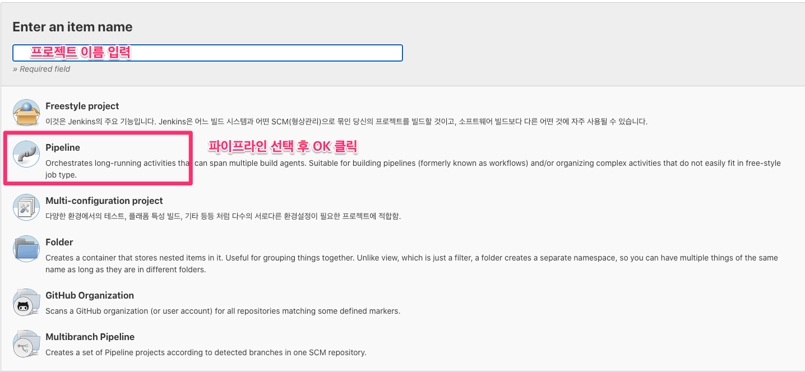

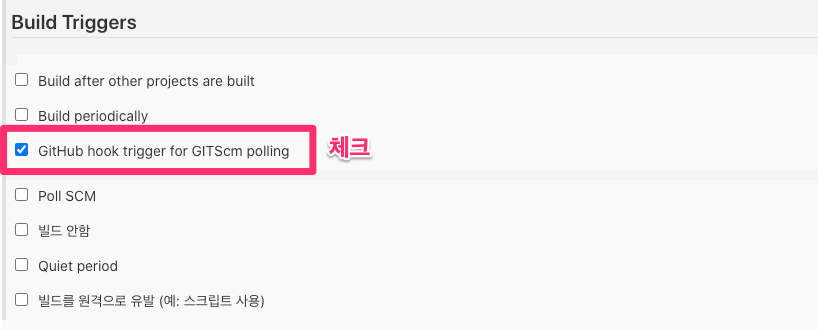

**방법1 Pipeline script를 직접 작성하기**

* Pipeline script 웹에서 직접 작성한다.

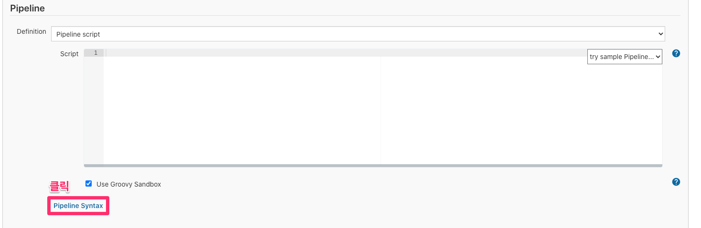

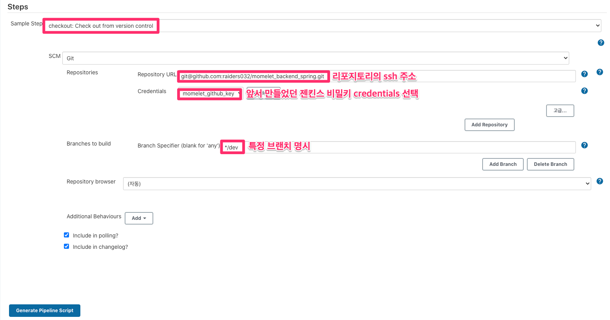

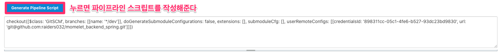

```
checkout([$class: 'GitSCM', branches: [[name: '*/dev']], doGenerateSubmoduleConfigurations: false, extensions: [], submoduleCfg: [], userRemoteConfigs: [[credentialsId: '898311cc-05c1-4fe6-b527-93dc23bd9830', url: 'git@github.com:raiders032/momelet_backend_spring.git']]])
```

이렇게 Pipeline Syntax를 사용해 스크립트 작성을 할 수 있다.

다음과 같은 Pipeline Script를 복사하여 젠킨스 파이프라인 스크립트에 붙여넣는다.

```
node{
    stage('SCM Checkout'){
        checkout([$class: 'GitSCM', branches: [[name: '*/dev']], doGenerateSubmoduleConfigurations: false, extensions: [], submoduleCfg: [], userRemoteConfigs: [[credentialsId: '898311cc-05c1-4fe6-b527-93dc23bd9830', url: 'git@github.com:raiders032/momelet_backend_spring.git']]])
    }

    stage('Build & Test'){
        //
    }

    stage ('Build Docker Image'){
        //
    }

    stage('Push Dokcer Image') {
       //
    }
}
```


**방법2 Pipeline script를 SCM(깃)으로 부터 가져오기**

* Pipeline script를 따로 작성해서 Repository에 업로드하면 젠킨스가 이 Pipeline script가져와 실행한다.

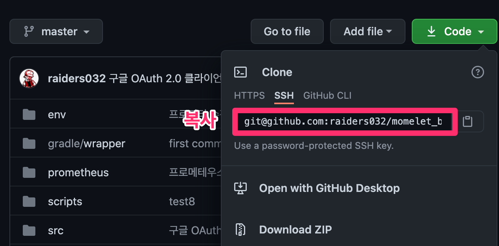

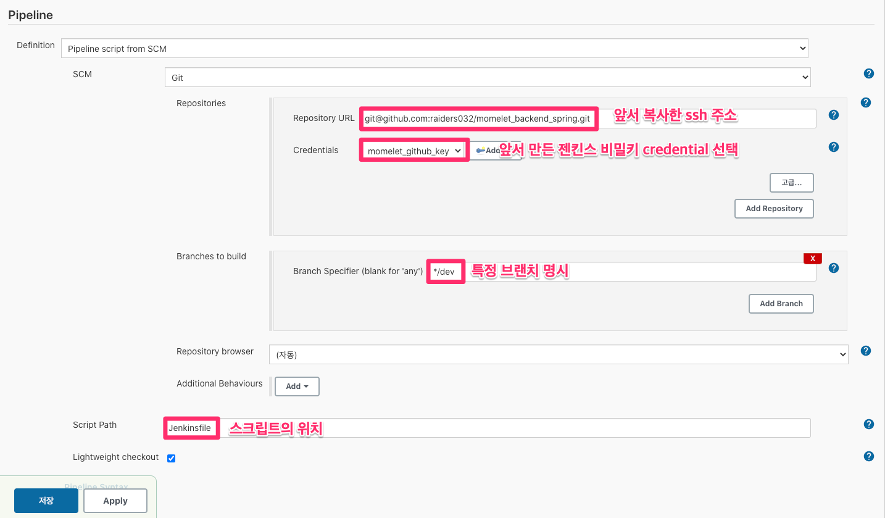


**테스트**

앞서 등록한 깃허브 리포지토리에서 특정 브랜치에 push를 하면

다음과 같이 파이프라인이 정상적으로 동작하는걸 볼 수 있다.

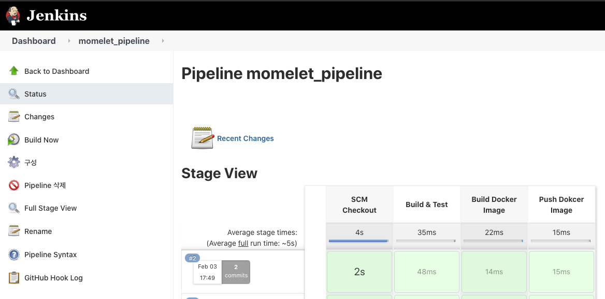


### Docker plugin 설치

Jenkins 관리 -> 플러그인 관리 -> 설치 가능 페이지에서 docker를 검색합니다

* 설치할 플럭그인 목록
  * Docker
  * docker-build-step
  * Docker Pipeline

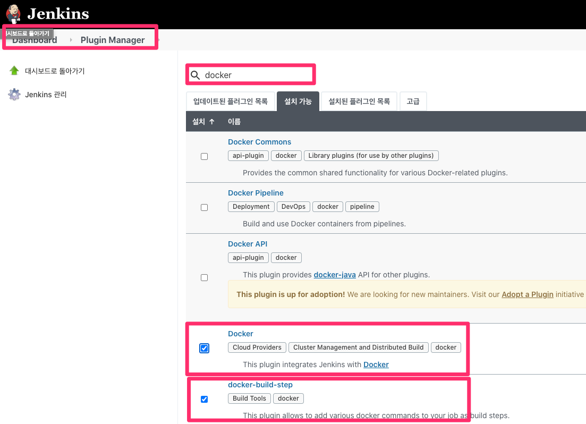


### DockerHub Credential 만들기

* 도커 이미지를 빌드하고 도커허브에 업로드하기 때문에 젠킨스가 dockerhub접근할 수 있도록 Credential을 만든다.

http://localhost:8080/credentials/store/system/domain/_/ 로 이동 Add Credentials 클릭

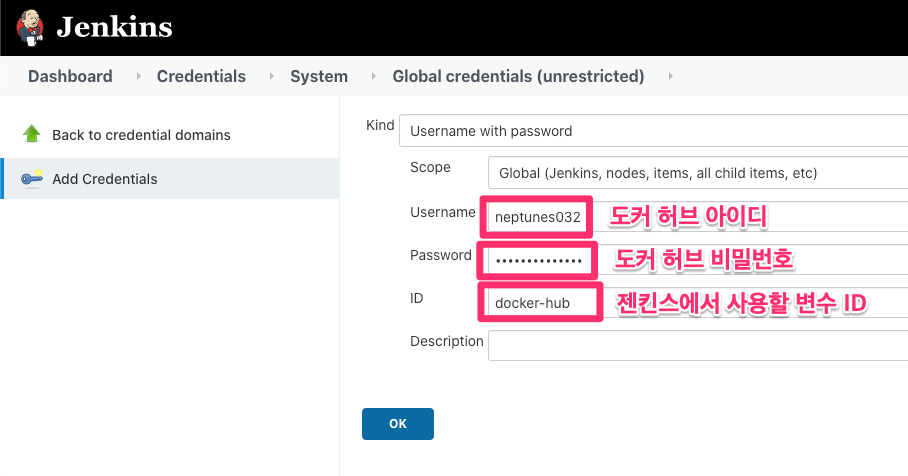


### Jenkinsfile 작성

* 앞서 설정한대로 스크립트를 작성하자
  * 스크립트의 위치는 리포지토리 최상단
  * 파일 이름은 Jenkinsfile


* 다음과 같이 애플리케이션 리포지토리의 최상단 디렉토리에 Jenkinsfile을 작성한다.

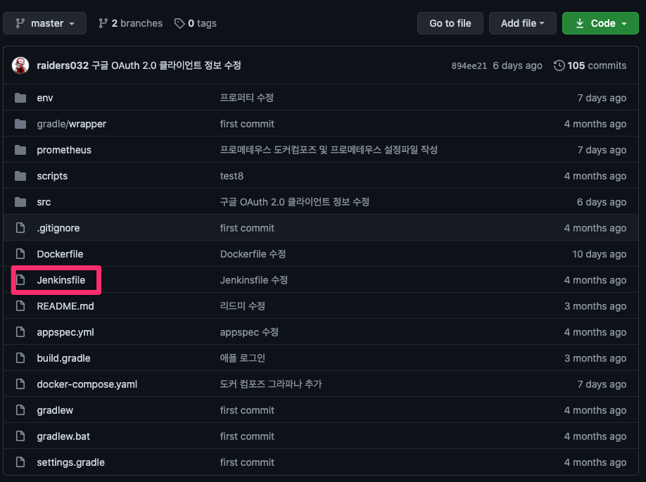

* Jenkinsfile
  * [튜토리얼](https://www.youtube.com/watch?v=7KCS70sCoK0)

```groovy
pipeline {
  environment {
    registry = "neptunes032/momelet_spring" // dockerhubID/Repository
    registryCredential = 'docker-hub' //앞서 설정한 dokcer account Credential의 ID
    dockerImage = ''
  }
  agent any
  stages {
    stage('Cloning Git') {
        steps{
            script {
                checkout scm
            }
        }
    }
    stage('Build & Test'){
       steps{
            script {
                sh './gradlew build -x test'
            }
        }
    }
    stage('Building image') {
      steps{
        script {
          dockerImage = docker.build registry + ":$BUILD_NUMBER"
        }
      }
    }
    stage('Deploy Image') {
      steps{
        script {
          docker.withRegistry( '', registryCredential ) {
            dockerImage.push()
          }
        }
      }
    }
    stage('Remove Unused docker image') {
      steps{
        sh "docker rmi $registry:$BUILD_NUMBER"
      }
    }
  }
}
```


**테스트**

dev 브랜치에 테스트용 commit을 푸시하면

파이프 라인이 정상적으로 동작하는 것을 볼 수 있다.

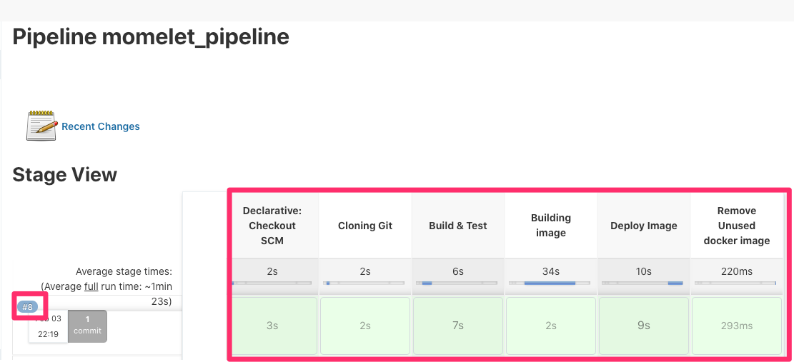

도커허브에도 업로드가 되었다.

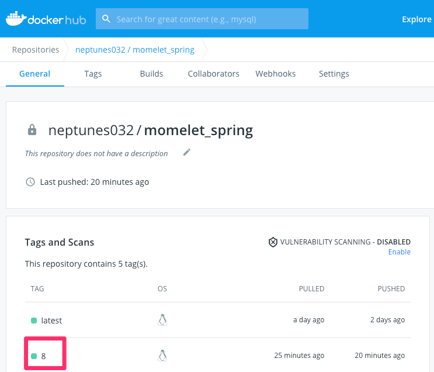

 

### AWS key 발급

* jenkins가 s3와 CodeDeploy에 접근할 수 있도록 IAM 사용자를 만든다
* AmazonS3FullAccess, AWSCodeDeployFullAccess 정책을 할당한다.

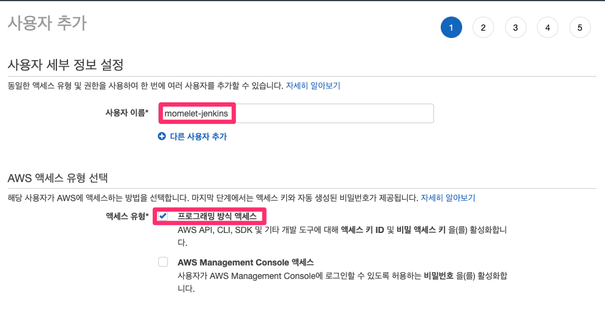

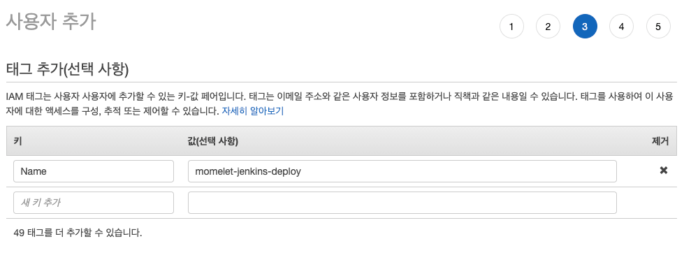

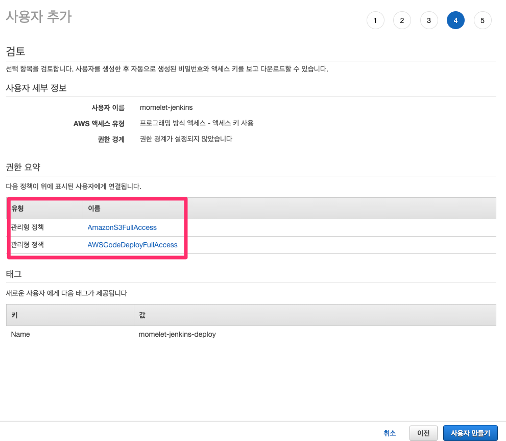

.csv파일을 다운받는다.

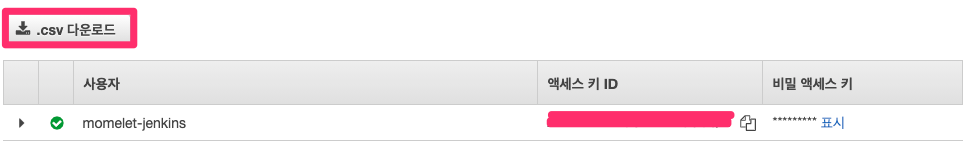


### Jenkins plugin 설치

* AWS access key를 사용하기 위해  `AWS Global Configuration` 플러그인 설치

대쉬보드 -> jenkins 관리 -> 플러그인 관리

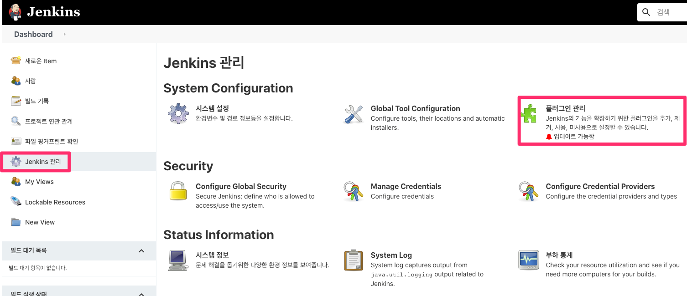

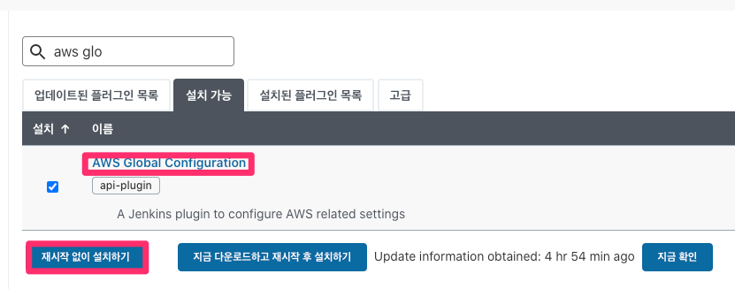

### Jenkins에 credential 추가

대쉬보드 -> Jenkins 관리 -> manage Credentials -> 

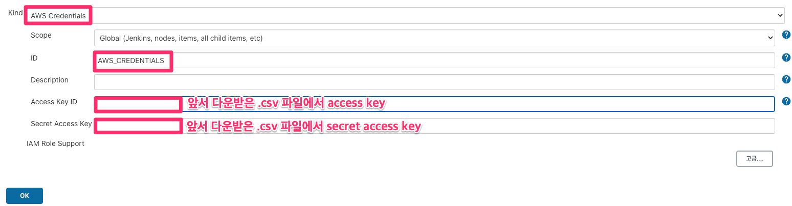


## Codedeploy

> 

### IAM Role 생성

* EC2(애플리케이션 서버)가 사용할수 있는 IAM ROLE을 생성한다.

IAM -> 역할 -> 역할만들기

### 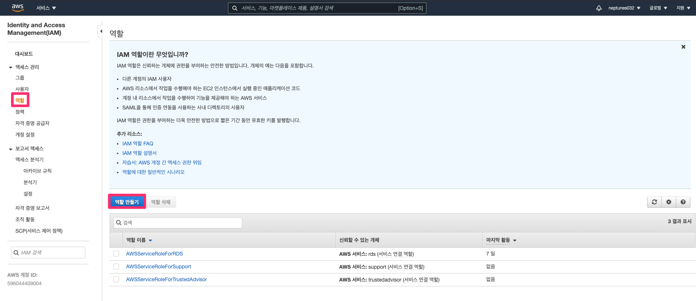

AWS서비스 -> EC2 -> 다음 선택


정책 4가지를 선택합니다.

1. AmazonS3FullAccess
2. AWSCodeDeployFullAccess
3. AWSCodeDeployRole
4. CloudWatchLogsFullAccess

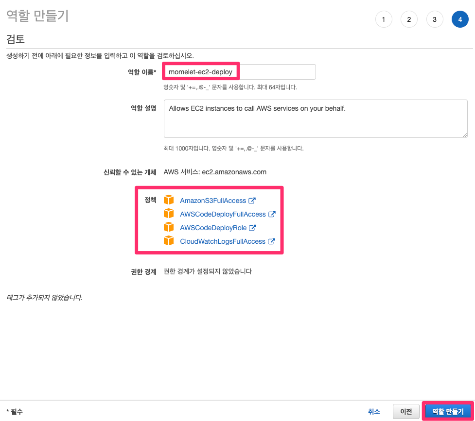

앞서 생성한 역할을 EC2에 부여하겠습니다.

인스턴스 위에서 오른쪽 클릭 -> 보안 -> IAM 역할 수정

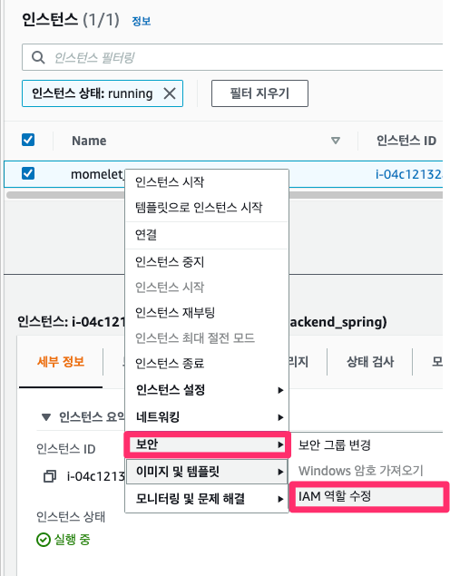

앞서 생성한 IAM역할을 선택후 저장

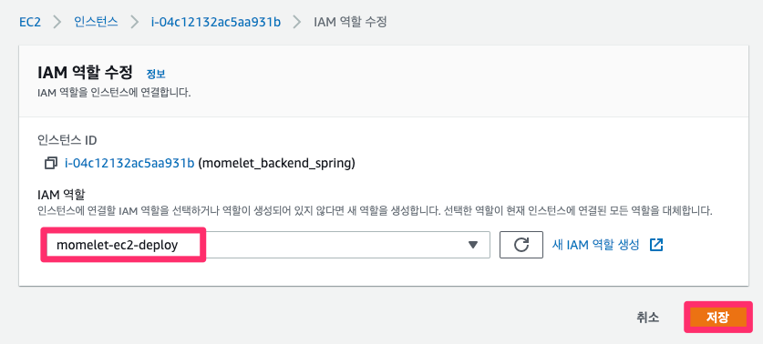


### Code Deploy Agent용 사용자 추가

* EC2가 Code Deploy 이벤트를 수신할 수 있도록 Agent를 설치
* EC2에서 AWS CLI를 사용할 수 있도록, IAM 사용자를 추가

IAM에서 -> 그룹 -> 새로운 그룹 생성

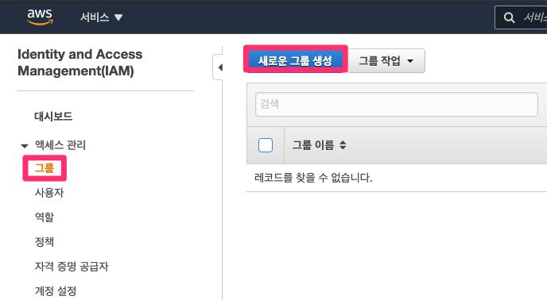

1. 그룹 이름 지정
   * 그룹의 이름을 입력
2. 정책 연결
   * 아무 정책도 선택하지 않는다
3. 검토

생성된 그룹을 클릭 -> 권한 -> 여기

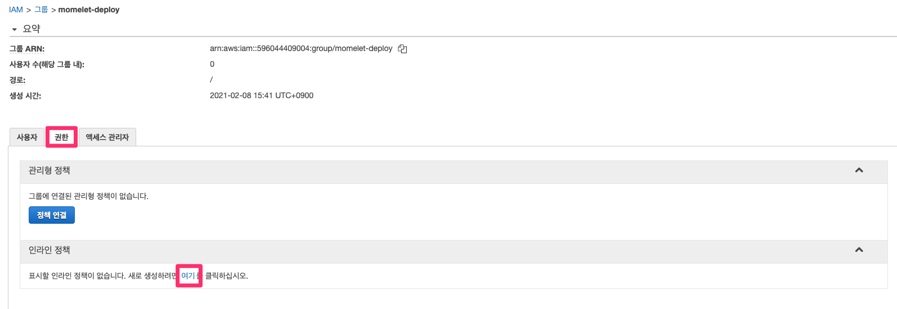

사용자 지정 정책 -> 선택


아래의 JSON을 추가

```json
{
    "Version": "2012-10-17",
    "Statement": [
        {
            "Effect": "Allow",
            "Action": [
                "autoscaling:*",
                "codedeploy:*",
                "ec2:*",
                "lambda:*",
                "elasticloadbalancing:*",
                "s3:*",
                "cloudwatch:*",
                "logs:*",
                "sns:*"
            ],
            "Resource": "*"
        }
    ]
}
```

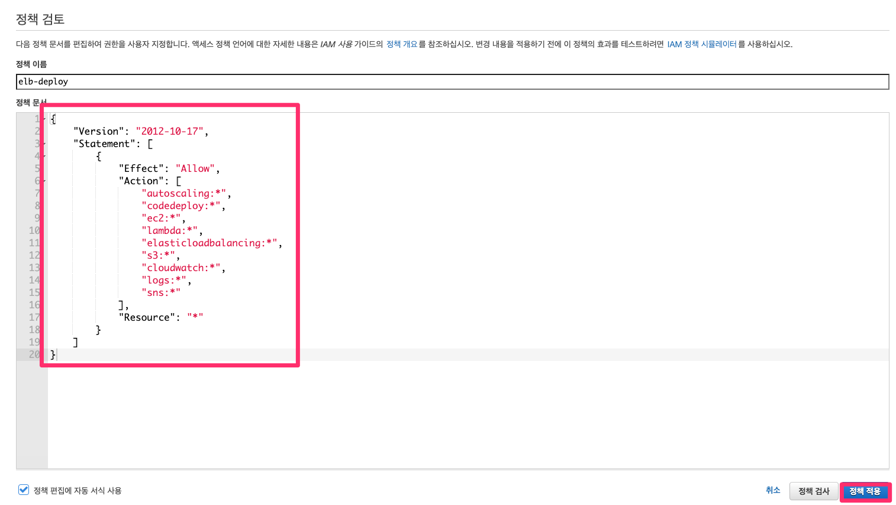

IAM -> 사용자 -> 사용자 추가

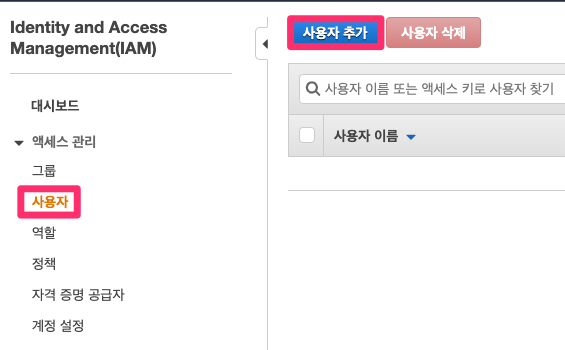


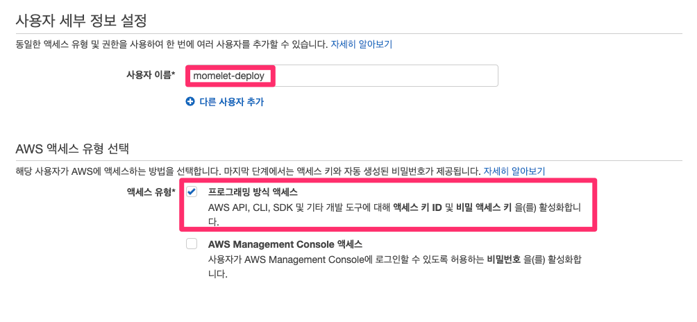

앞서 생성한 그룹에 사용자를 추가합니다.

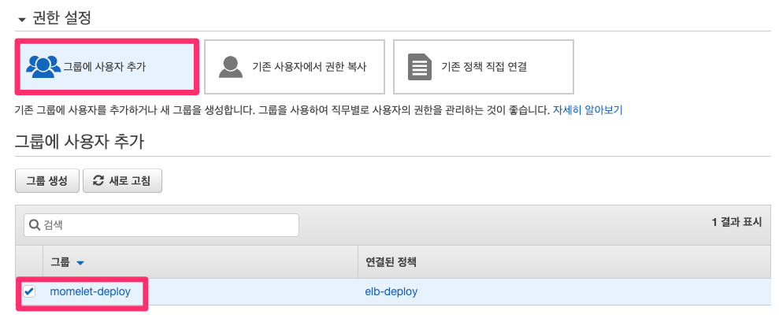

액세스키를 다운받습니다. .csv 다운로드 클릭

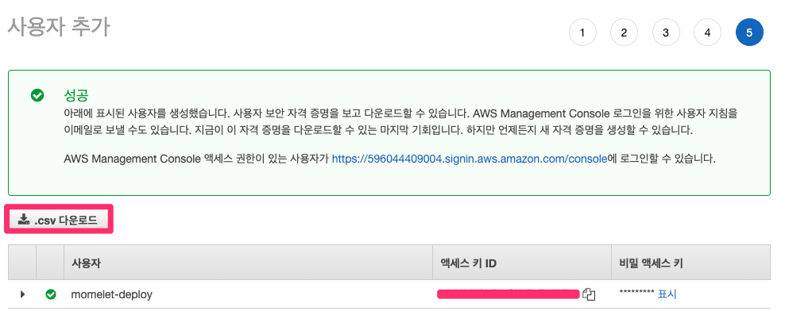

### EC2에 code deploy Agent 설치

* EC2에 CodeDeploy로 지정한 위치에서 파일을 받아 실행하기 위해서는 Code Deploy Agent가 설치되있어야만 합니다.
* ec2에 접속하고 아래와 같이 진행

```bash
# aws-cli 설치
sudo yum install -y aws-cli

cd /home/ec2-user/ 
sudo aws configure
```

* AWS Access Key ID
  * 앞서 다운로드한 .csv파일의 Access key ID
* AWS Secret Access Key
  * 앞서 다운로드한 .csv파일의 Secret access key
* Default region name
  * ap-northeast-2
* Default output format
  * json

```bash
# Agent 파일 설치
wget https://aws-codedeploy-ap-northeast-2.s3.amazonaws.com/latest/install
# 실행권한 부여
chmod +x ./install
sudo yum install -y ruby wget
# 설치 진행
sudo ./install auto
# 실행 확인
sudo service codedeploy-agent status
# EC2인스턴스 부팅시 자동으로 Agent가 실행되도록 스크립트 파일 작성
sudo vim /etc/init.d/codedeploy-startup.sh
cat /etc/init.d/codedeploy-startup.sh
#!/bin/bash
echo 'Starting codedeploy-agent'
sudo service codedeploy-agent restart
# 스크립트의 실행권한 추가
sudo chmod +x /etc/init.d/codedeploy-startup.sh
```

### appspec.yml 작성

* 프로젝트 리포지토리 최상단에 appspec.yml을 생성

  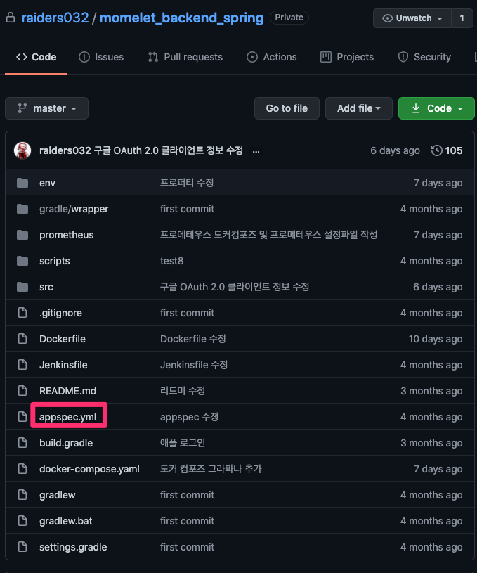

* AWS CodeDeploy는 appspec.yml을 통해 어떤 파일들을, 어느 위치로 배포하고, 이후  어떤 스크립트를 실행할지 관리합니다.

```yml
version: 0.0 
os: linux
files:
  - source: /
    destination: /home/ec2-user/build/
    overwrite: yes

permissions:
  - object: /
    pattern: "**"
    owner: ec2-user
    group: ec2-user

hooks:
  ApplicationStart:
    - location: application-start.sh
      timeout: 60
      runas: ec2-user
```

* 위 코드는 Code Build / S3 / Github 등을 통해서 받은 전체 파일들(`source: /`)을 `/home/ec2-user/build/`로 옮기겠다는 의미입니다.
* `hooks`
  * `ApplicationStart` : 애플리케이션이 시작될 때 실행할 스크립트를 설정

ec2에 디랙토리를 생성합니다.

```bash
mkdir /home/ec2-user/build/
```


### Script 파일 작성

* AWS CodeDeploy가 실행할 스크립트를 작성합니다.
* 위치는 애플리케이션 리포지토리의 `/scripts/application-start.sh` 
  * 애플리케이션이 시작될 때 실행될 스크립트

```sh
#!/bin/bash

# 도커 컴포즈 파일이 있는 곳으로 이동
cd /home/ec2-user/momelet/backend/spring
# 새로운 이미지 pull
docker-compose pull
docker-compose up -d
```


### Code Deploy 역할 생성하기

* Code Deploy가 ec2에 접근할 수 있도록 역할 만들기

IAM -> 역할 -> 역할 만들기

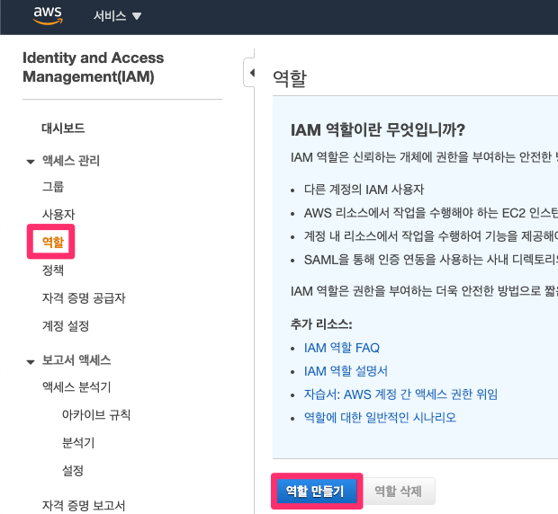

AWS 서비스 -> code deploy

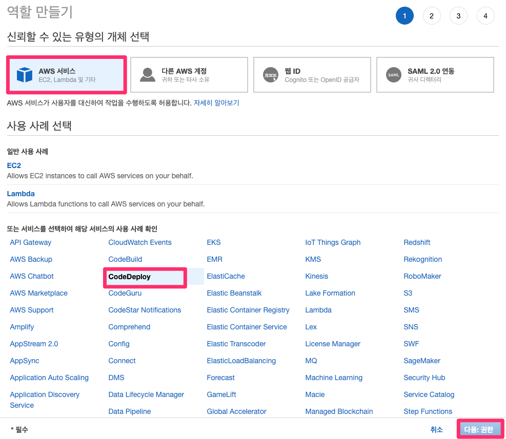

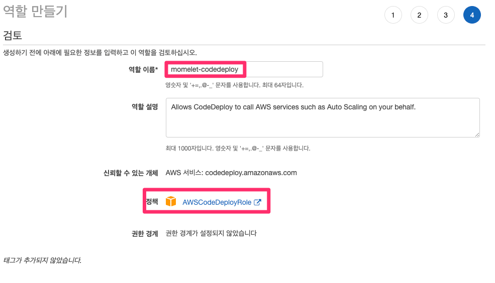


### CodeDeploy 생성

Code deploy -> 애플리케이션 -> 애플리케이션 생성

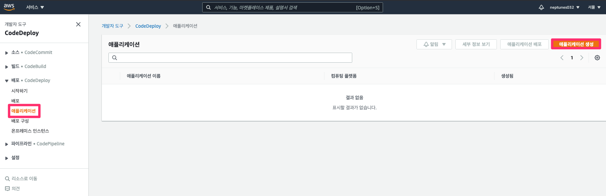

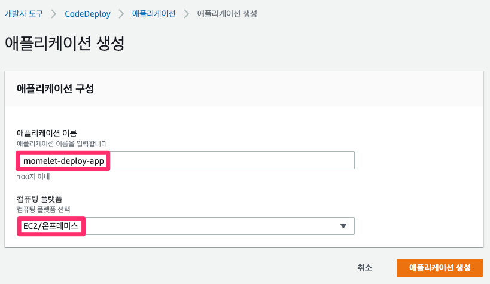

배포 그룹 생성

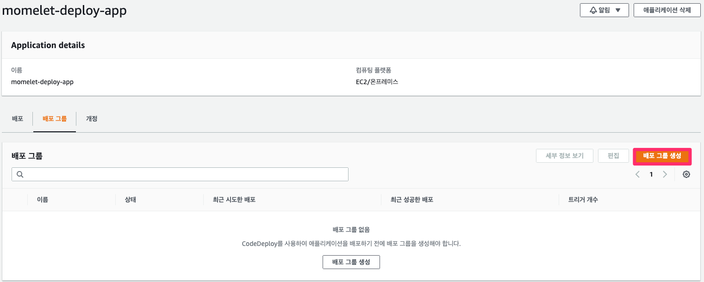

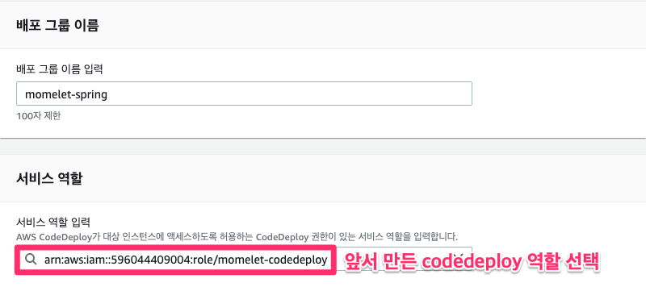

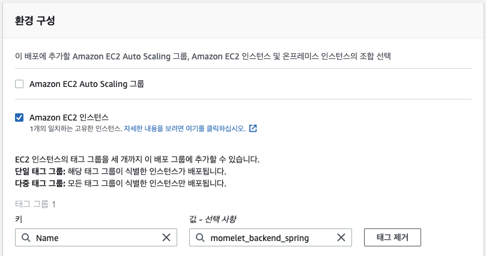

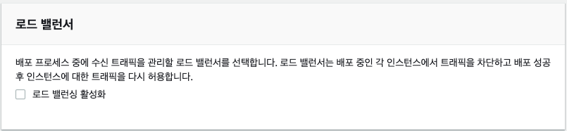


## S3

### S3 버켓 생성

* jenkins에서 build한 파일들을 upload할 s3 bucket을 생성합니다.

S3 -> 버킷 -> 버킷 만들기

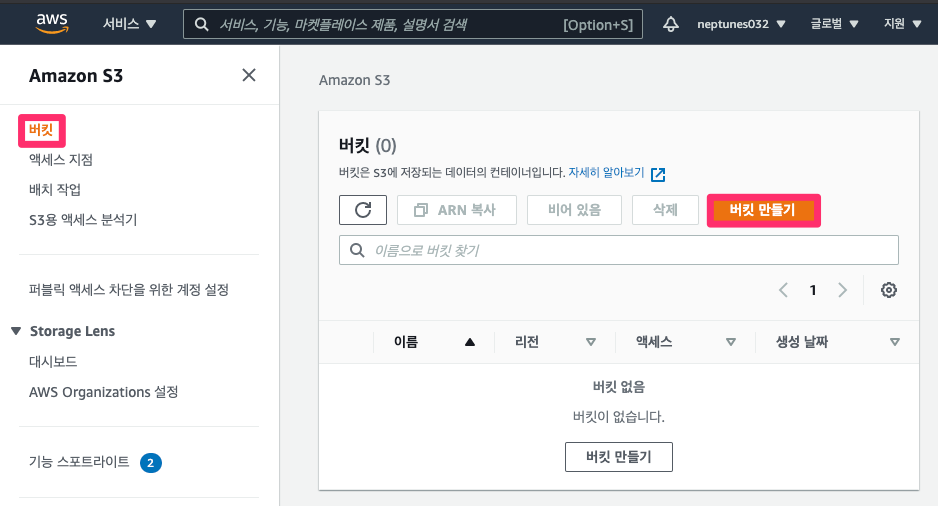

버킷 이름을 입력하고 나머지는 기본 설정으로 생성합니다.

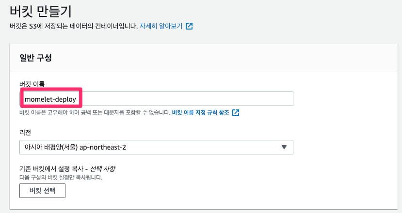


## Jenkins

### Jenkins pipeline 프로젝트 수정

대시보드 -> 기존 파이프라인 프로젝트 클릭 -> 구성 -> Pipeline Syntax 클릭

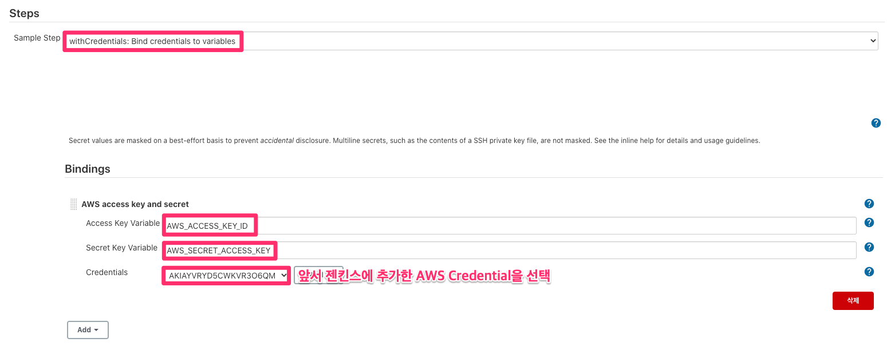

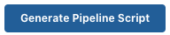

생성된 파이프라인 스크립트

```
withCredentials([[$class: 'AmazonWebServicesCredentialsBinding', accessKeyVariable: 'AWS_ACCESS_KEY_ID', credentialsId: 'AWS_CREDENTIALS', secretKeyVariable: 'AWS_SECRET_ACCESS_KEY']]) {
    // some block
}
```


**수정된 jenkinsfile**

* Pipeline Syntax로 생성된 파이프라인 스크립트를 추가해줍니다.
* Stage `make zip file` 
  * 앞서 작성한 `appspec.yml` 과 `application-start.sh` 압축하는 과정
* Stage `upload to AWS S3`
  * 앞선 stage에서 압축한 파일을 S3로 업로드하는 과정
  * `sh 'aws s3 cp deploy/momelet_spring.zip s3://<s3버켓이름>/momelet_spring.zip --region ap-northeast-2'`
* Stage `deploy`
  * --application-name
    * codedeploy 애플리케이션 이름
  * --deployment-group-name 
    * 배포그룹 이름
  *  --region 
    * ap-northeast-2
  * --s3-location bucket=<버켓이름>,bundleType=zip,key=<압축파일이름>.zip'

```
pipeline {
  environment {
    registry = "neptunes032/momelet_spring"
    registryCredential = 'docker-hub'
    dockerImage = ''
  }
  agent any
  stages {
    stage('Cloning Git') {
        steps{
            script {
                checkout scm
            }
        }
    }

    stage('Build & Test'){
       steps{
            script {
                sh './gradlew build -x test'
            }
        }
    }

    stage('Building image') {
      steps{
        script {
          dockerImage = docker.build registry + ":latest"
        }
      }
    }

    stage('Deploy Image') {
      steps{
        script {
          docker.withRegistry( '', registryCredential ) {
            dockerImage.push()
          }
        }
      }
    }

    stage('Remove Unused docker image') {
      steps{
        sh "docker rmi $registry:latest"
      }
    }

    stage('make zip file') {
      steps{
            sh 'mkdir -p before-deploy'
            sh 'cp scripts/*.sh before-deploy/'
            sh 'cp appspec.yml before-deploy/'
            sh 'cd before-deploy && zip -r before-deploy *'
            sh 'cd ../'
            sh 'mkdir -p deploy'
            sh 'mv before-deploy/before-deploy.zip deploy/momelet_spring.zip'
      }
    }

    stage('upload to AWS S3') {
      steps{
        withCredentials([[$class: 'AmazonWebServicesCredentialsBinding', accessKeyVariable: 'AWS_ACCESS_KEY_ID', credentialsId: 'AWS_CREDENTIALS', secretKeyVariable: 'AWS_SECRET_ACCESS_KEY']]) {
            sh 'aws s3 cp deploy/momelet_spring.zip s3://momelet-deploy/momelet_spring.zip --region ap-northeast-2'
        }
      }
    }

    stage('deploy') {
          steps{
            withCredentials([[$class: 'AmazonWebServicesCredentialsBinding', accessKeyVariable: 'AWS_ACCESS_KEY_ID', credentialsId: 'AWS_CREDENTIALS', secretKeyVariable: 'AWS_SECRET_ACCESS_KEY']]) {
               sh 'aws deploy create-deployment \
                              --application-name momelet-deploy-app \
                              --deployment-group-name momelet-spring \
                              --region ap-northeast-2 \
                              --s3-location bucket=momelet-deploy,bundleType=zip,key=momelet_spring.zip'
            }
          }
        }

  }
}
```

**테스트**

모든 파이프라인이 정상 동작했다.

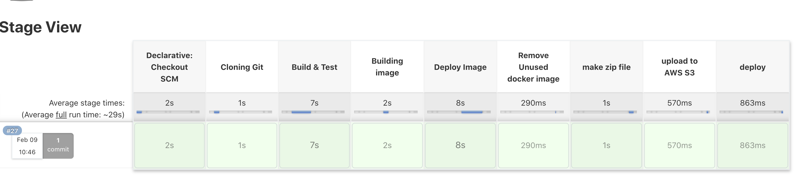

CodeDeploy -> 배포 

성공적으로 배포된 것을 볼 수 있다.

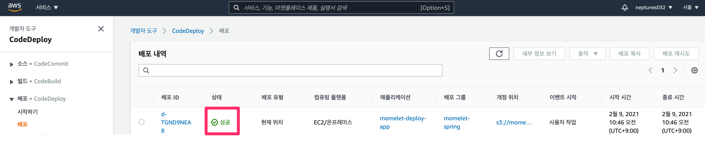


참고

* [Jenkins Pipeline을 이용한 Docker Image Build](https://teichae.tistory.com/entry/Jenkins-Pipeline%EC%9D%84-%EC%9D%B4%EC%9A%A9%ED%95%9C-Docker-Image-Build)
* [Docker를 이용한 Jenkins 설치](https://teichae.tistory.com/entry/Docker%EB%A5%BC-%EC%9D%B4%EC%9A%A9%ED%95%9C-Jenkins-%EC%84%A4%EC%B9%98?category=348114)
* [Docker를 이용한 Jenkins 컨테이너 만들기(docker in docker)](https://www.hanumoka.net/2019/10/14/docker-20191014-docker-jenkins-docker-in-docker/)
* [pipelie 참고](https://www.edureka.co/community/55640/jenkins-docker-docker-image-jenkins-pipeline-docker-registry)
* [codedeploy 참조](https://jojoldu.tistory.com/281?category=777282)
