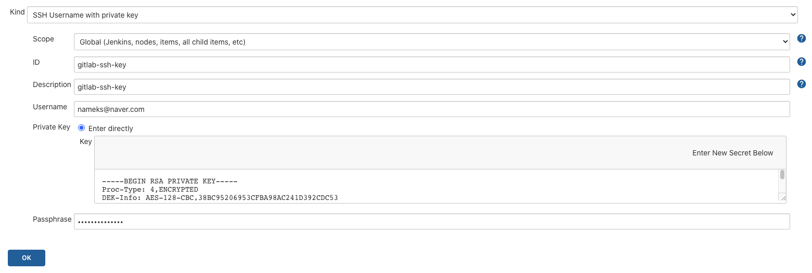
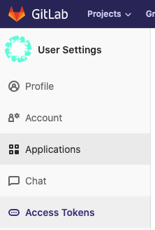
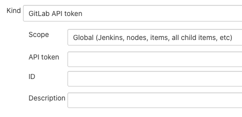
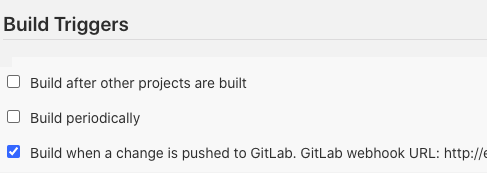
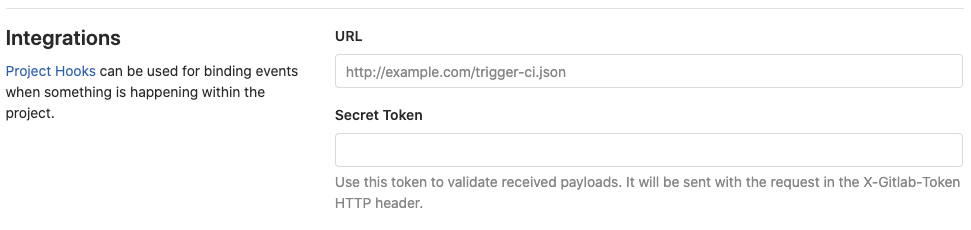
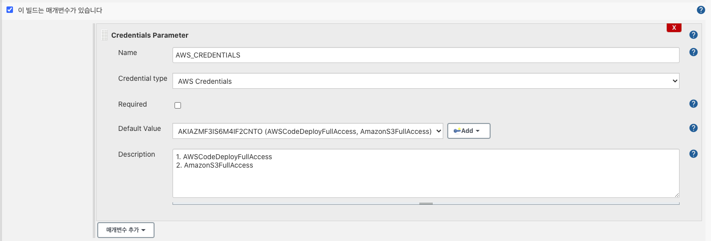

### Jenkins


#### Dockerfile 작성

```dockerfile
FROM jenkins/jenkins:lts

USER root

RUN apt-get update && \
    apt-get -y install apt-transport-https \
        ca-certificates \
        curl \
        gnupg2 \
        zip \
        unzip \
        software-properties-common && \
    curl -fsSL https://download.docker.com/linux/$(. /etc/os-release; echo "$ID")/gpg > /tmp/dkey; apt-key add /tmp/dkey && \
    add-apt-repository \
    "deb [arch=amd64] https://download.docker.com/linux/$(. /etc/os-release; echo "$ID") \
    $(lsb_release -cs) \
    stable" && \
    apt-get update && \
    apt-get -y install docker-ce
```


#### Docker-compose 작성

```yml
version: '3'
volumes:
  grafana_data:
  prometheus_data:

services:
  jenkins:
    build:
      context: .
      dockerfile: Dockerfile
    container_name: jenkins
    restart: always
    volumes:
      - ./jenkins/data:/var/jenkins_home
      - /var/run/docker.sock:/var/run/docker.sock
    ports:
      - 10000:8080
      - 50000:50000
```


#### jenkins 설치 후 unlock을 위해 password 확인하기

```
docker exec -it jenkins /bin/bash
cat /var/jenkins_home/secrets/initialAdminPassword
```


#### shell script 작성

```shell
./gradlew -Dskip.tests clean build
mkdir -p deploy
cp build/libs/*.jar deploy/
cp scripts/*.sh deploy/
cp appspec.yml deploy/

./gradlew -Dskip.tests clean build
mkdir -p before-deploy
cp build/libs/*.jar before-deploy/
cp code-deploy/*.sh before-deploy/
cp appspec.yml before-deploy/
cd before-deploy && zip -r before-deploy *
cd ../ && mkdir -p deploy
mv before-deploy/before-deploy.zip deploy/sprint1.zip

./gradlew -Dskip.tests clean build
mkdir -p before-deploy
cp build/libs/*.jar before-deploy/
cp scripts/*.sh before-deploy/
cp appspec.yml before-deploy/
cd before-deploy && zip -r before-deploy *
cd ../ && mkdir -p deploy
mv before-deploy/before-deploy.zip deploy/sprint1.zip
```


#### Jenkinsfile 작성

* Jenkins pipeline project 생성시 작성한다. 
* Docker Pipeline plugin 설치
*  AWS Global Configurationl plugin 설치
*  Pipeline script from SCM 선택시 

```groovy
node{
    stage('SCM Checkout'){
        git branch: 'cicd', credentialsId: 'gitlab-ssh-key', url: 'git@git.swmgit.org:swmaestro/recorder-1.git'
    }

    stage('Build & Test'){
        sh './gradlew build'
    }

    stage ('Build Docker Image'){
        app = docker.build("644637824921.dkr.ecr.ap-northeast-2.amazonaws.com/backend-spring","-f ./Dockerfile .")
    }

    stage('Push Dokcer Image') {
         sh 'rm  ~/.dockercfg || true'
         sh 'rm ~/.docker/config.json || true'

         docker.withRegistry('https://644637824921.dkr.ecr.ap-northeast-2.amazonaws.com', 'ecr:ap-northeast-2:ecr-credential') {
             app.push("latest")
        }
    }
}
```

```groovy
node{
    stage('SCM Checkout'){
        git branch: 'cicd', credentialsId: 'gitlab-ssh-key', url: 'git@git.swmgit.org:swmaestro/recorder-1.git'
    }

    stage('build & test'){
        sh './gradlew build'
    }

    stage ('make zip file'){
        sh 'mkdir -p before-deploy'
        sh 'cp build/libs/*.jar before-deploy/'
        sh 'cp scripts/*.sh before-deploy/'
        sh 'cp appspec.yml before-deploy/'
        sh 'cd before-deploy && zip -r before-deploy *'
        sh 'cd ../'
        sh 'mkdir -p deploy'
        sh 'mv before-deploy/before-deploy.zip deploy/sprint1.zip'
    }

    stage ('upload to AWS S3'){
    	withAWS(credentials:"$AWS_CREDENTIALS") {
      	sh 'aws s3 cp deploy/sprint1.zip s3://cicd-spring/sprint1.zip --region ap-northeast-2'
      }
    }

    stage('deploy'){
      withAWS(credentials:"$AWS_CREDENTIALS") {
        sh 'aws deploy create-deployment \
               --application-name backend-spring \
               --deployment-group-name backend-spring-group \
               --region ap-northeast-2 \
               --s3-location bucket=cicd-spring,bundleType=zip,key=sprint1.zip'
      }
    }
}
```


#### gitlab과 연동

#### [참조](https://m.blog.naver.com/PostView.nhn?blogId=baekmg1988&logNo=221658364543&categoryNo=72&proxyReferer=https:%2F%2Fwww.google.com%2F)

1. 키 생성

```shell
ssh-keygen -t rsa -C "nameks@naver.com"
```

2. 권한 설정

```
chmod 700 ~/.ssh/id_rsa*
```

3. gitlab에 1에서 생성한 공개키 등록
   * 설정 -> ssh keys
4. Jenkins에 credential 추가
   * SSH Username with private key 선택
   * Username : gitlab 계정 이메일
   * Private key -> enter directly -> 1에서 생성한 private key 복사 -> 추가
   * Passphrase : 1번 key 생성시 입력한 비밀번호 
   * 


#### gitlab web hook 설정

1. GitLab에서 Access Token 발급

   

2. Jenkins에서 GitLab과 연동을 위해 1에서 발급받았던 Access Token을 credential로 추가한다.(gitlab plugin 설치 후)

   

3. Jenkins에서 추가한 credential을 global setting에서 gitlab 설정으로 추가한다.

4. Jenkins에서 자동 Build Trigger가 진행되도록 설정한다.

   * Build when a change is pushed to GitLab. ~~ 체크
   * 

5. GitLab에서 Webhook을 생성한다.

   * Integrations에서 webhook url과 Jenkins에서 생성한 Secret Tokene 등록
   * 


#### codedeploy와 연동

1. AWS CodeDeploy plugin 설치
2. 빌드 후 조치 추가 `Deploy an application AWS CodeDeploy`


### AWS CodeDeploy

* 오토 스케일링 그룹 배포
* 블루 그린 배포
* 롤링 배포


#### EC2에 IAM역할 추가하기

1. EC2에 IAM역할 추가하기
   * 역할 : AWS서비스에만 할당할 수 있는 권한
   * EC2, CodeDeploy 등
2. 역할 만들기
3. EC2 선택
4. AmazonEC2RoleforAWSCodeDeploy 연결
5. EC2 인스턴스-> 인스턴스 설정 -> IAM 역할 수정 
6.  재부팅하기


#### CodeDeploy 에이전트 설치 및 정상작동 확인

```shell
aws s3 cp s3://aws-codedeploy-ap-northeast-2/latest/install . --region ap-northeast-2
chmod +x ./install
sudo apt  install ruby
sudo ./install auto
sudo service codedeploy-agent status
```


#### CodeDeploy를 위한 권한 생성

1. CodeDeploy에 IAM역할 추가하기
2. AWSCodeDeployRole 정책 선택


#### CodeDeploy 생성

1. 어플리케이션 생성
2. 컴퓨팅 플랫폼 선택
3. 배포 그룹 생성
4. 서비스 역할 선택
5. 배포 유형 선택


#### IAM user 생성

1. AWSCodeDeployFullAccess
2. AmazonS3FullAccess


#### S3 버킷 생성

* Jenkins에서 생성된 build 파일을 저장하도록 구성한다.
* 모든 퍼블릭 액세스 차단


#### appspec.yml 작성

* EC2 배포 기준 파일 이름은 appspec.yml이어야 한다.

* 번들링한 파일의 최상단(root)에 위치해야 한다.

  

```
version: 0.0 # CodeDeploy 버전
os: linux
files:
  - source: / # CodeDeploy에서 전달해 준 파일 중 destination으로 이동시킬 대상을 루트로 지정(전체파일)
    destination: /home/ubuntu/build/ # source에서 지정된 파일을 받을 위치, 이후 jar를 실행하는 등은 destination에서 옮긴 파일들로 진행
    overwrite: yes

permissions: # CodeDeploy에서 EC2서버로 넘겨준 파일들을 모두 ubuntu권한을 갖도록 합니다.
  - object: /
    pattern: "**"
    owner: ubuntu
    group: ubuntu

hooks: # CodeDeploy배포 단계에서 실행할 명령어를 지정합니다.
  ApplicationStart: # deploy.sh를 ubuntu권한으로 실행합니다.
    - location: deploy.sh
      timeout: 60 # 스크립트 실행 60초 이상 수행되면 실패가 됩니다.
      runas: ubuntu


```


#### CodeDeploy log 확인

* `/opt/codedepoly-agent/deployment-root/deployment-logs/codedeploy-agent-deployments.log`


#### 오류

1. The CodeDeploy agent did not find an AppSpec file within the unpacked revision directory at revision-relative path "appspec.yml". 
   * https://forums.aws.amazon.com/thread.jspa?threadID=296302
   * 원인 : 쉘 스크립트에서 배포할 파일을 압축했는데 AWS codedeploy plugin이 자동으로 압축해 압축이 2번 된 것이 원인
   * 해결: 쉘 스크립트에 압축하는 부분을 제거함


2. ```
   aws s3 cp deploy/sprint1.zip s3://cicd-spring/sprint1.zip --region ap-northeast-2
   /var/jenkins_home/workspace/test@tmp/durable-37608fef/script.sh: 1: /var/jenkins_home/workspace/test@tmp/durable-37608fef/script.sh: aws: not found
   ```

* ```shell
  docker exec -it jenkins /bin/bash
  sudo apt-get install awscli.
  aws --version.
  ```


3. ```
   aws s3 cp deploy/sprint1.zip s3://cicd-spring/sprint1.zip --region ap-northeast-2
   upload failed: deploy/sprint1.zip to s3://cicd-spring/sprint1.zip An error occurred (AccessDenied) when calling the CreateMultipartUpload operation: Access Denied
   ```

* `AWS Credentail` 만들기

* 매개변수 추가

* 

* ```groovy
  #jenkinsfile
  
  stage ('upload to AWS S3'){
  	withAWS(credentials:"$AWS_CREDENTIALS") {
    	sh 'aws s3 cp deploy/sprint1.zip s3://cicd-spring/sprint1.zip --region ap-northeast-2'
    }
  }
  ```

  

4. ```
   java.lang.NoSuchMethodError: No such DSL method 'withAWS' found among steps
   ```

   * `Pipeline: AWS Steps` plugin 설치

   

5. ```
   aws deploy create-deployment --application-name backend-spring --deployment-group-name backend-spring-group --region ap-northeast-2 --s3-location bucket=cicd-spring,bundleType=zip,key=sprint1.zip
   
   An error occurred (AccessDeniedException) when calling the CreateDeployment operation: User: arn:aws:sts::644637824921:assumed-role/ec2-codedeploy-role/i-05e2227397eab28ac is not authorized to perform: codedeploy:CreateDeployment on resource: arn:aws:codedeploy:ap-northeast-2:644637824921:deploymentgroup:backend-spring/backend-spring-group
   ```

   * 3번 해결책과 동일


### 무중단 배포


#### Nginx

* 웹 서버, 리버스 프록시, 캐싱, 로드 밸런싱, 미디어 스프리밍등을 위한 오픈소스 소프트웨어
* 리버스 프록시
  * 외부의 요청을 받아 백엔드 서버로 요청을 전달하는 행위
* 리눅스 서버에 nginx 1개와 스프링 부트 jar 2개를 이용해 무중단 배포를 해보자


#### Nginx Dockerfile

```dockerfile
FROM nginx
COPY ./nginx/nginx.conf /etc/nginx/nginx.conf
EXPOSE 80
EXPOSE 443
```


#### nginx default.conf

```
server {
    listen       80;
    listen  [::]:80;
    server_name  localhost;

    #charset koi8-r;
    #access_log  /var/log/nginx/host.access.log  main;

    location / {
        root   /usr/share/nginx/html;
        index  index.html index.htm;
    }

    #error_page  404              /404.html;

    # redirect server error pages to the static page /50x.html
    #
    error_page   500 502 503 504  /50x.html;
    location = /50x.html {
        root   /usr/share/nginx/html;
    }

    # proxy the PHP scripts to Apache listening on 127.0.0.1:80
    #
    #location ~ \.php$ {
    #    proxy_pass   http://127.0.0.1;
    #}

    # pass the PHP scripts to FastCGI server listening on 127.0.0.1:9000
    #
    #location ~ \.php$ {
    #    root           html;
    #    fastcgi_pass   127.0.0.1:9000;
    #    fastcgi_index  index.php;
    #    fastcgi_param  SCRIPT_FILENAME  /scripts$fastcgi_script_name;
    #    include        fastcgi_params;
    #}

    # deny access to .htaccess files, if Apache's document root
    # concurs with nginx's one
    #
    #location ~ /\.ht {
    #    deny  all;
    #}
}
```

