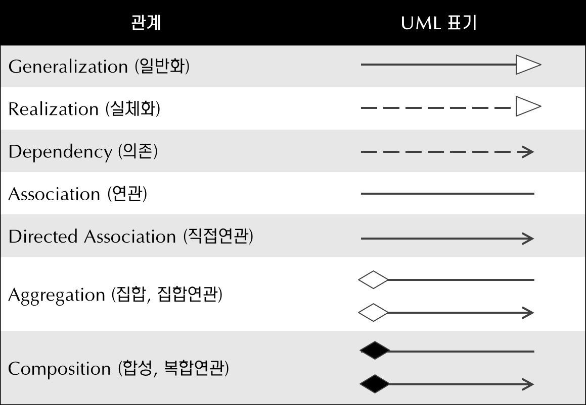

# 1 Class Diagram

# 2 클래스 간의 관계

## 2.1 Generalization

- `부모 클래스`와 `자식 클래스` 간의 상속 관계를 나타낸다.

## 2.2 Realization

- `인터페이스`와 `구현 클래스` 간의 관계를 나타낸다.

## 2.3 Dependency

- 어떤 클래스가 다른 클래스를 참조하는 관계
- 참조의 형태
	- 메서드 내에서 대상 클래스의 객체를  생성해 로컬 변수로 참조
	- 메서드의 매개변수로 받은 클래스
- 객체의 참조가 계속 유지 되지는 않는다.

## 2.4 Association

## 2.5 Aggregation

## 2.6 Composition

참고

- https://www.nextree.co.kr/p6753/