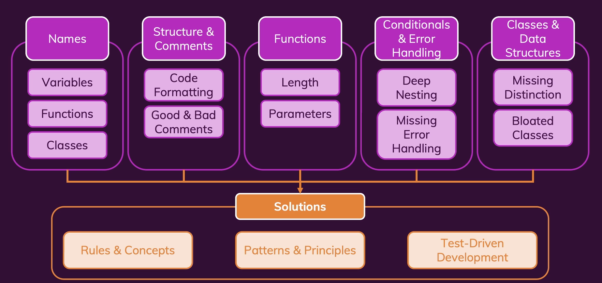

# Clean Code

* https://www.udemy.com/course/writing-clean-code/ 강의를 듣고 내용을 정리했습니다.

## What is clean code?

* 코드가 작동하는지에 관한 것이 아니다.
* 개발자는 대부분의 시간을 코드를 읽고 이해하는데 사용한다.
* 읽기 쉽고 의미있는 코드
* 많이 생각하지 않게 해야한다.
* 직관적이지 않은 이름과, 복잡한 네스틩, 큰 코드 블락을 피해야한다.
* 공통의 best practice 와 패턴을 따르자.

## 키포인트

## Clean Code vs. Clean Architecture

clean code

* 어떻게 코드를 작성할 것인가?
* 작은 코드 블록을 다룬다.

clean architecture

* 어디에 코드를 작성할 것인가? 
* 어떤 언어를 사용하는지 어떤 프로그래밍 패러다임을 가지고 있는가에 따라 좌우된다.
* 프로젝트 전체를 다룬다.

