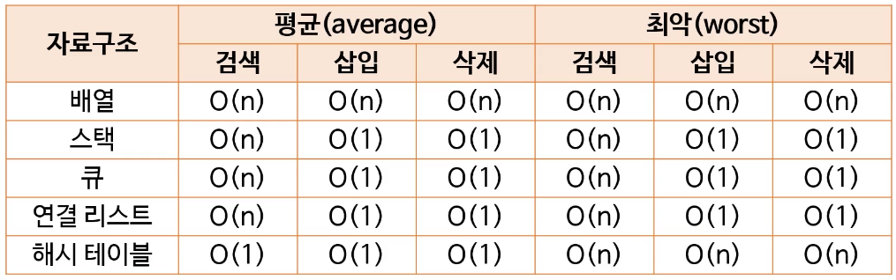

# 1. Time Complexity

* 시간 복잡도란 어떤 알고리즘을 수행하는 데 걸리는 시간을 설명하는 계산 복잡도를 의미한다
* 대표적인 방법으로 big-O표기법이 있다

# 2. big-O

* 입력값이 커질 때 알고리즘의 실행 시간이 어떻게 증가하는지 분휴하는데 사용된다
* big-O는 입력값이 무한대로 행할때 함수의 상한을 설명하는 수학적 표기 방법이다
* 최고차항만 표기하며, 상수항은 무시한다

## 2.1 big-O 표기법의 종류

**O(1)**

* 입력 데이터의 크기에 상관없이 언제나 일정한 시간이 걸림
* 최고의 알고리즘이라 할 수 있다
* 예시) 해시 테이블의 조회 및 삽입

**O(log n)**

* 입력값 만큼 비례하는 시간이 걸림
  * 그러나 로그는 매우 큰 입력값에도 크게 영향을 받지 않는 편으로 좋은 알고리즘이라 할 수 있다
* 예시) 이진 탐색

**O(n)**

* 입력값 만큼 비례하는 시간이 걸림
* 선형 시간 알고리즘이라고 한다
* 예시) 정렬되지 않은 리스트에서 최대값(최소값) 찾기

**O(n log n)**

* 입력값 만큼 비례하는 시간이 걸림
* 예시) 병합 정렬

**O(N^2)**

* 입력 데이터 크기의 제곱에 비례하는 시간이 걸림
* 예시) 버블 정렬

**O(2^N)**

* 예시) 피보나치 수를 재귀로 계산

**O(N!)**

* 예시) 각 도시를 방문하고돌아오는 가장 짧은 경로를 찾는 외판원 문제(TSP)

**자료구조의 big-O**

