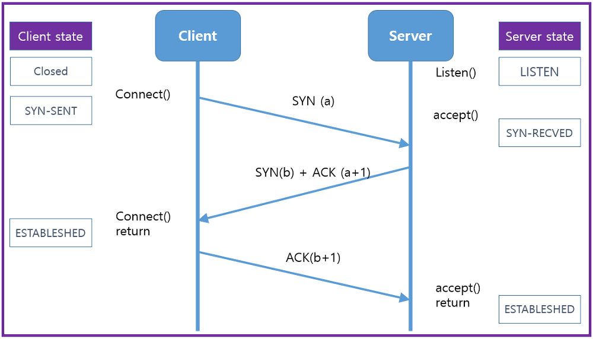

## 전송 계층에서 사용되는 프로토콜 (TCP / UDP)

 

TCP와 UDP는 OSI 표준모델과 TCP/IP 모델의 **전송계층**에서 사용되는 프로토콜입니다. 전송계층은 송신자와 수신자를 연결하는 통신 서비스를 제공하고 IP에 의해 전달되는 패킷의 오류를 검사하며 재전송 요구 제어등을 담당하는 계층입니다. 쉽게 말해 데이터의 전달을 담당한다고 생각하시면 됩니다. TCP와 UDP는 포트 번호를 이용하여 주소를 지정하는것과 데이터 오류검사를 위한 체크섬 존재하는 두가지 공통점을 가지고 있지만 정확성(TCP)을 추구할지 신속성(UDP)을 추구할지를 구분하여 나뉩니다.

 

데이터를 중요하게 생각하여 확실히 주고받고 싶을 때는 ‘TCP(Transmission Control Protocol)’를 사용합니다. TCP는 통신할 컴퓨터끼리 ‘보냈습니다’, ‘도착했습니다’라고 서로 확인 메시지를 보내면서 데이터를 주고받음으로써 통신의 신뢰성을 높입니다. 웹이나 메일, 파일 공유 등과 같이 데이터를 누락시키고 싶지 않은 서비스는 TCP를 사용하고 있습니다.

 

그에 반해 데이터의 신뢰성은 제쳐두고 어쨌든 빨리 보내고 싶을 때는 ‘UDP(User Datagram Protocol)’를 사용합니다. UDP는 데이터를 보내면 그것으로 끝이므로 신뢰성은 없지만 확인 응답과 같은 절차를 생략할 수 있으므로 통신의 신속성을 높입니다. VoIP(Voice over IP)나 시간 동기, 이름 해결 등과 같이 무엇보다 속도를 필요로 하는 서비스는 UDP를 사용하고 있습니다. 

 

> **포트 번호로 서비스를 식별한다.
> **
> TCP와 UDP는 ‘포트 번호’라는 숫자를 이용하여 컴퓨터 안의 어떤 서비스(애플리케이션)에게 데이터를 전달하면 좋은지를 식별합니다. 포트 번호는 ‘0~65535’(16비트 분)까지의 숫자로 되어 있으며, 범위에 따라 용도가 정해져 있습니다. ‘0~1023’은 ‘잘 알려진 포트(well-known port)’라고 해서 웹 서버나 메일 서버 등과 같이 일반적인 서버 소프트웨어가 클라이언트의 서비스 요청을 대기할 때 사용합니다. ‘1024~49151’은 ‘등록된 포트(registered port)’로, 제조업체의 독자적인 서버 소프트웨어가 클라이언트의 서비스 요청을 대기할 때 사용합니다. ‘49152~65535’는 ‘동적 포트(dynamic port)’로, 서버가 클라이언트를 식별하기 위해 사용합니다.

[[기타\] TCP / IP란 무엇인가?](https://coding-factory.tistory.com/613)

 

##  TCP의 개념과 특징 

TCP(Trasmission Control Protocol)는 연결 지향적 프로토콜입니다. 연결 지향 프로토콜이란 클라이언트와 서버가 연결된 상태에서 데이터를 주고받는 프로토콜을 의미합니다. 클라이언트가 연결 요청(SYN 데이터 전송)을 하고, 서버가 연결을 수락하면 통신 선로가 고정되고, 모든 데이터는 고정된 통신 선로를 통해서 순차적으로 전달됩니다. 그렇기 때문에 TCP는 데이터를 정확하고 안정적으로 전달할 수 있습니다. TCP는 호스트간 신뢰성 있는 데이터 전달과 흐름제어를 합니다. TCP 프로토콜은 신뢰성 있는 데이터의 전송을 위해 확인작업을 거치는데 TCP는 패킷을 성공적으로 전송하면(ACK) 라는 신호를 날리고 만약에 ACK 신호가 제 시간에 도착하지 않으면 Timeout이 발생하여 패킷 손실이 발생한 패킷을 다시 전송해줍니다. TCP는 이렇게 데이터를 송신할때마다 확인 응답을 주고받는 절차가 있으므로 통신의 신뢰성이 올라갑니다. 주로 lient와 Server 또는 P2P Socket 통신 등, 네트워크를 사용한 통신을 할 때 TCP 통신을 많이 사용합니다.

 

### TCP의 단점

- 데이터로 보내기 전에 반드시 연결이 형성되어야함.
- 1 : 1 통신만 가능함.
- 고정된 통신 선로가 최단선(네트워크 길이)이 아닐경우 상대적으로 UDP보다 데이터 전송속도가 느림.

 

### TCP의 특징

1. 연결형 (connnection-oriented) 서비스로 연결이 성공해야 통신이 가능하다.
2. 데이터의 경계를 구분하지 않는다. (바이트 스트림 서비스)
3. 데이터의 전송 순서를 보장한다. (데이터의 순서 유지를 위해 각 바이트마다 번호를 부여)
4. 신뢰성있는 데이터를 전송한다. (Sequence Number, Ack Number를 통한 신뢰성 보장)
5. 데이터 흐름 제어(수신자 버퍼 오버플로우 방지) 및 혼잡 제어(패킷 수가 과도하게 증가하는 현상 방지)
6. 연결의 설정(3-way handshaking)과 해제(4-way handshaking)
7. 전이중(Full-Duplex), 점대점(Point to Point) 서비스
8. UDP보다 전송속도가 느리다.

 

### 3 Way Handshake

* TCP를 이용한 데이터 통실을 할 때 프로세스와 프로세스를 연결하기 위해 가장 먼저 수행되는 과정
* 많은 시간이 소요되어 UDP방식보다 속도가 느려지는 주요 원인으로 지목됩니다.

1. 클라이언트가 서버에게 요청 패킷을 보낸다.

   * SYN 플래그 세팅
   * SYN:a

2. 서버가 클라이언트의 요청을 받아들이는 패킷을 보낸다.

   * SYN 플래그, ACK 플래그 세팅
   * SYN:b
   * ACK: a+1

3. 클라이언트는 최종적으로 이를 수락하는 패킷을 보낸다.

   * ACK 플래그 세팅
   * ACK: b+1

   

 

#### 연결 과정

1. Client에서 Server에 연결 요청을 하기위해 SYN 데이터를 보낸다.
2. Server에서 해당 포트는 LISTEN 상태에서 SYN 데이터를 받고 SYN_RCV로 상태가 변경된다.
3. 그리고 요청을 정상적으로 받았다는 대답(ACK)와 Client도 포트를 열어달라는 SYN 을 같이 보낸다.
4. Client에서는 SYN+ACK 를 받고 ESTABLISHED로 상태를 변경하고 서버에 ACK 를 전송한다.
5. ACK를 받은 서버는 상태가 ESTABLSHED로 변경된다. 

**위와 같이 3번의 통신이 정상적으로 이루어지면, 서로의 포트가 ESTABLISHED 되면서 연결이 되게 된다.**

 

> **TCP state (netstat 명령어를 통해 확인가능)
>
> ****LISTEN :** 서버의 데몬이 떠서 접속 요청을 기다리는 상태
> **SYN-SENT :** 로컬의 클라이언트 어플리케이션이 원격 호스트에 연결을 요청한 상태
> **SYN_RECEIVED :** 서버가 원격 클라이언트로부터 접속 요구를 받아 클라이언트에게 응답을 하였지만 아직 클라이언트에게 확인 메시지는 받지 않은 상태
> **ESTABLISHED :** 3 way-handshaking 이 완료된 후 서로 연결된 상태
> **FIN-WAIT1, CLOSE-WAIT, FIN-WAIT2 :** 서버에서 연결을 종료하기 위해 클라이언트에게 종결을 요청하고 회신을 받아 종료하는 과정의 상태
> **TIME-WAIT :** 연결은 종료되었지만 분실되었을지 모를 느린 세그먼트를 위해 당분간 소켓을 열어두고 있는 상태
> **CLOSING :** 흔하지 않지만 주로 확인 메시지가 전송도중 분실된 상태 
> **CLOSED :** 완전히 종료

 

### TCP 헤더 정보

| **필드**               | 내용                                                         |
| ---------------------- | ------------------------------------------------------------ |
| Source Port            | 송신자의 포트번호                                            |
| Destination Port       | 수신자의 포트번호                                            |
| Sequence Number        |                                                              |
| Acknowledgement Number |                                                              |
| Header Length          | 헤더의 길이를 4로 나눈 값                                    |
| TCP Flags              | TCP 제어비트                                                 |
| Window                 | 수신 윈도우의 버퍼 크기를 지정할 때 사용. 0이면 송신 프로세스의 전송 중지 |
| Checksum               | 프로토콜 헤더와 데이터에 대한 오류 검출 용도                 |
| Urgent Pointer         | 긴급 데이터를 처리하기 위함, URG 플래그 비트가 지정된 경우에만 유효 |
| Options                |                                                              |

 

### TCP 제어비트 (Flag Bit) 정보

| 종류 | 내용                                                         |
| ---- | ------------------------------------------------------------ |
| ACK  | 응답 번호 필드가 유효한지 설정할때 사용하며 상대방으로부터 패킷을 받았다는 걸 알려주는 패킷. 클라이언트가 보낸 최초의 SYN 패킷 이후에 전송되는 모든 패킷은 이 플래그가 설정되어야 한다. |
| SYN  | 연결 설정 요구. 동기화 시퀀스 번호. 양쪽이 보낸 최초의 패킷에만 이 플래그가 설정되어 있어야 한다.TCP 에서 세션을 성립할 때 가장먼저 보내는 패킷, 시퀀스 번호를 임의적으로 설정하여 세션을 연결하는 데에 사용되며 초기에 시퀀스 번호를 보내게 된다. |
| PSH  | 수신 애플리케이션에 버퍼링된 데이터를 상위 계층에 즉시 전달할 때 사용 |
| RST  | 연결의 리셋이나 유효하지 않은 세그먼트에 대한 응답용으로 사용 |
| URG  | 긴급한 데이터면 1로 세팅                                     |
| FIN  | 세션 연결을 종료시킬 때 사용되며 더 이상 전송할 데이터가 없을 때 연결 종료 의사 표시 |

 

##  UDP의 개념과 특징 

UDP(User Datagram Protocol)는 전송계층의 비연결 지향적 프로토콜입니다. 비연결 지향적이란 데이터를 주고받을 때 연결 절차를 거치지 않고 발신자가 일방적으로 데이터를 발신하는 방식을 의미합니다. 연결 과정이 없기 때문에 TCP보다는 빠른 전송을 할 수 있지만 데이터 전달의 신뢰성은 떨어집니다. UDP는 발신자가 데이터 패킷을 순차적으로 보내더라도 이 패킷들은 서로 다른 통신 선로를 통해 전달 될 수 있습니다. 먼저 보낸 패킷이 느린 선로를 통해 전송될 경우 나중에 보낸 패킷보다 늦게 도착할 수 있으며 최악의 경우 잘못된 선로로 전송되어 유실될 수도 있습니다. 이럴 경우 TCP와는 다르게 UDP는 중간에 패킷이 유실이나 변조가 되어도 재전송을 하지 않습니다. 

 

### UDP의 단점

- 데이터의 신뢰성이 없다.
- 의미있는 서버를 구축하기위해서는 일일이 패킷을 관리해주어야 한다.

 

### UDP의 특징

1. 비연결형 서비스로 연결 없이 통신이 가능하며 데이터그램 방식을 제공한다.
2. 데이터 경계를 구분한다. (데이터그램(datagram) 서비스)
3. 정보를 주고 받을때 정보를 보내거나 받는다는 신호절차를 거치지 않는다.
4. 신뢰성 없는 데이터를 전송한다. (데이터 재전송과 데이터 순서 유지를 위한 작업을 하지 않는다.
5. 패킷관리가 필요하다.
6. 패킷 오버헤드가 적어 네트워크 부하가 감소되는 장점.
7. 상대적으로 TCP보다 전송속도가 빠르다.

 

### UDP의 헤더정보

| **필드**           | **크기** | **내용**                                 |
| ------------------ | -------- | ---------------------------------------- |
| 송신자의 포트 번호 | 16       | 데이터를 보내는 어플리케이션의 포트 번호 |
| 수신자의 포트 번호 | 16       | 데이터를 받을 어플리케이션의 포트 번호   |
| 데이터의 길이      | 16       | UDP 헤더와 데이터의 총 길이              |
| 체크섬(Checksum)   | 16       | 데이터 오류 검사에 사용                  |

 

 

##  TCP / UDP 간략비교 

### 공통점

| **TCP와 UDP의 공통점**              |
| ----------------------------------- |
| 포트 번호를 이용하여 주소를 지정    |
| 데이터 오류 검사를 위한 체크섬 존재 |

 

### 차이점

|                    | **TCP**            | **UDP**                        |
| ------------------ | ------------------ | ------------------------------ |
| **연결방식**       | 연결형서비스       | 비 연결형 서비스               |
| **패킷 교환 방식** | 가상 회선 방식     | 데이터그램 방식                |
| **전송 순서**      | 전송 순서 보장     | 전송 순서가 바뀔 수 있음       |
| **수신 여부 확인** | 수신 여부를 확인함 | 수신 여부를 확인하지 않음      |
| **통신 방식**      | 1:1 통신만 가능    | 1:1 / 1:N / N:N 통신 모두 가능 |
| **신뢰성**         | 높음               | 낮음                           |
| **속도**           | 느림               | 빠름                           |

 

 