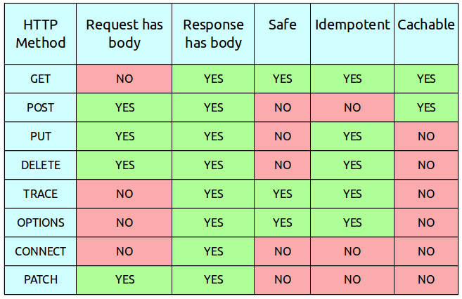

### HTTP

* HTTP는 HTML 문서와 같은 리소스들을 가져올 수 있도록 해주는 프로토콜이다.
* 신뢰 가능한 전송 프로토콜이라면 이론상으로는 무엇이든 사용할 수 있으나 TCP 혹은 암호화된 TCP 연결인 TLS를 통해 전송된다.
* HTTP Request Method
  * 

#### HTTP 상태 코드

* ## 정보 응답

* ## 성공 응답

  * `200 OK`
    * 요청이 성공적으로 되었습니다. 성공의 의미는 HTTP 메소드에 따라 달라집니다:
    * `GET`: 리소스를 불러와서 메시지 바디에 전송되었습니다.
    * `HEAD`: 개체 해더가 메시지 바디에 있습니다.
    * `PUT` 또는 `POST`: 수행 결과에 대한 리소스가 메시지 바디에 전송되었습니다.
    * `TRACE`: 메시지 바디는 서버에서 수신한 요청 메시지를 포함하고 있습니다.
  * `201 Created`
    * 요청이 성공적이었으며 그 결과로 새로운 리소스가 생성되었습니다. 이 응답은 일반적으로 `POST`요청 또는 일부` PUT` 요청 이후에 따라옵니다.

* ## 리다이렉션 메시지

* ## 클라이언트 에러 응답

  * `400 Bad Request`
    * 이 응답은 잘못된 문법으로 인하여 서버가 요청을 이해할 수 없음을 의미합니다.
  * `401 Unauthorized`
    * 비록 HTTP 표준에서는 "미승인(unauthorized)"를 명확히 하고 있지만, 의미상 이 응답은 "비인증(unauthenticated)"을 의미합니다. 클라이언트는 요청한 응답을 받기 위해서는 반드시 스스로를 인증해야 합니다.
  * `403 Forbidden`
    * 클라이언트는 콘텐츠에 접근할 권리를 가지고 있지 않습니다. 예를들어 그들은 미승인이어서 서버는 거절을 위한 적절한 응답을 보냅니다. 401과 다른 점은 서버가 클라이언트가 누구인지 알고 있습니다.
  * `404 Not Found`
    * 서버는 요청받은 리소스를 찾을 수 없습니다. 브라우저에서는 알려지지 않은 URL을 의미합니다. 

* ## 서버 에러 응답

  * `500 Internal Server Error` 
    * 서버가 처리 방법을 모르는 상황이 발생했습니다. 서버는 아직 처리 방법을 알 수 없습니다.

  

### HTTPS

#### SSL

>  SSL(Secure Sockets Layer) 인증서는 웹사이트의 신원을 확인하는 디지털 인증서이며 SSL 기술을 이용하여 서버에 전송되는 정보를 암호화합니다. 암호화는 데이터를 판독할 수 없는 포맷으로 변환하는 과정이며 이 포맷은 적합한 암호 해독 키로만 판독 가능한 포맷으로 되돌릴 수 있습니다.

##### TLS

> SSL과 같은 말이다. 네스케이프에 의해서 SSL이 발명되었고, 이것이 점차 폭넓게 사용되다가 표준화 기구인 IETF의 관리로 변경되면서 TLS라는 이름으로 바뀌었다. TLS 1.0은 SSL 3.0을 계승한다. 하지만 TLS라는 이름보다 SSL이라는 이름이 훨씬 많이 사용되고 있다.

##### SSL 인증서의 주요 기능

1. 클라이언트가 접속한 서버가 신뢰 할 수 있는 서버임을 보장합니다.
2. SSL 통신에 사용할 공개키를 클라이언트에게 제공합니다.

##### SSL 인증서의 포함된 정보

1. 인증서 발행 기관의 디지털 서명
2. 서비스의 정보 (인증서를 발급한 CA, 서비스의 도메인 등등)
3. 인증서 보유자의 공개 키 사본 (공개키의 내용, 공개키의 암호화 방법)
4. 인증서 보유자의 이름
5. 인증서의 일련 번호 및 만료일

#### 동작 과정

- 실제 데이터 : 대칭키
- 대칭키의 키 : 공개키

___

### CA

> 인증서의 역할은 클라이언트가 접속한 서버가 클라이언트가 의도한 서버가 맞는지를 보장하는 역할을 한다. 이 역할을 하는 민간기업들이 있는데 이런 기업들을 CA(Certificate authority) 혹은 Root Certificate 라고 부른다.

* CA의 리스트와 함께 각 CA의 공개키를 브라우저는 이미 알고 있다.

### 암호화

#### 대칭키

* 키가 하나

#### 공개키(비대칭키)

* 키두 두개
  * 비공개키(private key)
  * 공개키(public key)
* 공개키로 암호화 -> 비공개키로 복호화
* 비공개키로 암호화 -> 공개키로 복호화

