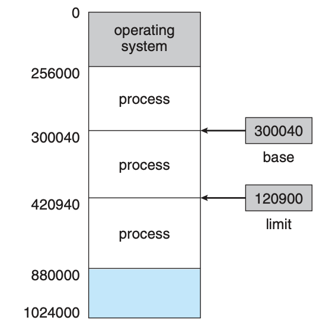
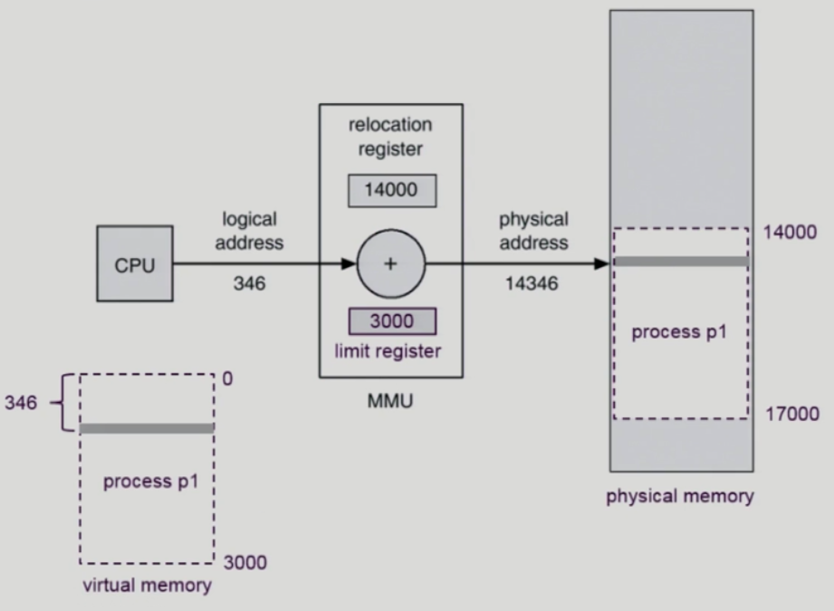
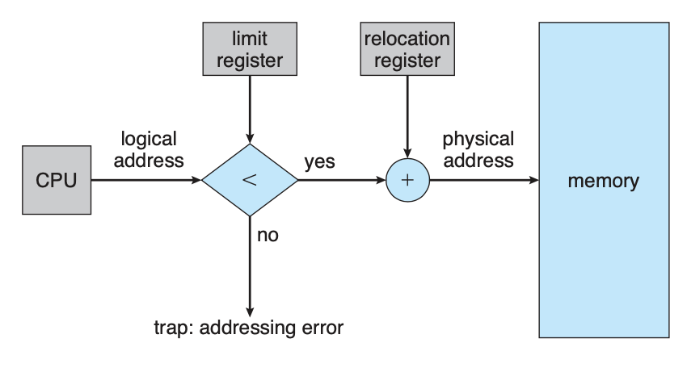
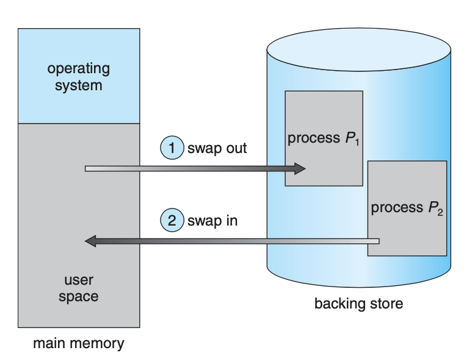
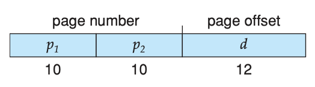
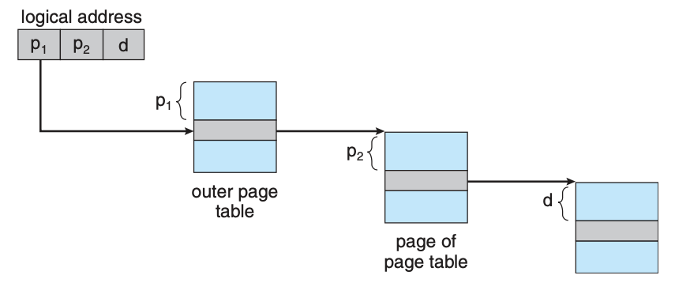

# Memory Management

* **CPU**가 직접 접근할 수 있는 저장장치는 **메인 메모리**와 CPU 자체에 내장되어 있는 **레지스터**뿐이다
* CPU에 내장되어 있는 레지스터들은 일반적으로 클록의 한 사이클 내에 접근이 가능하다
* 그러나 메모리 버스를 통해 전송되는 메인 메모리는 많은 사이클이 소요된다
  * CPU가 필요한 데이터가 없어서 명령어를 수행하지 못하고 지연되는 현상을 `stall`이라 한다
  * 이 문제를 해결하기 위해 CPU와 메인 메모리 사이에 빠른 속도의 메모리를 추가하는데 이를 `cache`라 한다

# 1. Logical Address & Physical Address

**Logical Address**

* 프로세스 마다 독립적으로 가지는 주소 공간
* 각 프로세스마다 0번지부터 시작한다
* CPU가 사용하는 주소는 **Logical Address**이다

**Physical Address**

* 메모리에 실제 올라가는 위치

## 1.1 MMU(Memory Management Unit)

* 논리 주소를 물리 주소로 바꿔주는 하드웨어
* base register(relocation register): 접근할 수 있는 **물리적 메모리 주소의 최소값**
* limit register: 논리적 주소의 범위

# 2. Address Binding

**Address Binding 과정**

* Symbolic Address -> Logical Address -> Physical Address
* Symbolic Address
  * 쉽게 말하면 변수 명을 의미한다
* Logical Address
  * 컴파일시 Symbolic Address를 Logical Address로 변환한다
* Physical Address
  * Logical Address에서 Physical Address로 변환되는 시점에 따라 **compile time binding**, **load time binding**, **execution time binding**으로 구분된다

## 2.1 Compile Time Binding

* 컴파일 시점에 Logical Address가 Physical Address로 변환됨
* 프로세스가 메모리 내에 들어갈 위치를 컴파일 시간에 미리 아는 경우
* 컴파일러는 **절대 코드(absolute code)**를 생성한다
* 메모리 시작 위치가 달라지면 다시 컴파일 해야된다 

## 2.2 Load Time Binding

* Loader가 Logical Address를 Physical Address로 변환함
* 컴파일 시점에 메모리 내 어디로 올려야할지 모르는 경우
* 컴파일로가 **재배치 가능한 코드(relocatable code)**를 생성한다

## 2.3 Execution Time Binding

* 수행이 시작된 이후에도 프로세스의 메모리 상 위치를 변경할 수 있다
* CPU가 주소를 참조할 때마다 바인딩을 점검
* 하드웨어 지원이 필요하다
  * Base and Limit registers, MMU

# 3. Swapping

> 프로세스는 실행되기 위해 반드시 메모리에 올라와 있어야한다. 그러나 프로세스가 일시적으로 메모리에서  backing store로 쫓아낼 수 있는데 이를 **swap out**이라고 한다. 이후 실행을 재개하기 위해 다시  backing store에서 메모리로 올라오는데 이를 **swap in**이라고 한다. Swap in 과 swap out을 합하여 Swapping이라고 하며 이를 통해 프로세스들의 물리적 주소 공간의 총 합이 실제 물리적 메모리 공간을 초과하는 것을 가능하게 하기 때문에 degree of multiprogramming을 높일 수 있다.

* 프로세스를 일시적으로 **메모리에서 backing store로 쫓아내는 것**
  * backing store: 디스크
* swap in & swap out
  * 중기 스케줄러가 swap out 시킬 프로세스 선정
* Compile Time Binding과 Load Time Binding은 원래 메모리 위치로 swap in해야 한다
* Execution Time Binding은 추후 빈 메모리 영역 어디에나 올릴 수 있다

# 4. 연속 메모리 할당(Contiguous Memory Allocation)

* 한 프로세스가 메모리의 연속적인 공간에 적재되도록 하는 것
* 고정 분할 방식과 가변 분할 방식이 있다

## 4.1 Memory Allocation

* Dynamic Stroage Allocation Problem
  * 가변 분할 방식에서 size n인 요청을 만족하는 가장 적절한 hole을 찾는 문제
* 실험 결과 **First-fit** 과 **Best-fit** 이 시간과 메모리 이용 효율 측면에서 **Worst-fit** 보다 좋다는 것이 입증됨

**First-fit**

* size n인 이상인 최초로 찾은 hole에 할당하는 방식

**Best-fit**

* size n인 이상인 hole중 가장 작은 hole에 할당하는 방식
* 리스트가 크기 순으로 정렬되어 있지 않다면 전 리스트를 검색해야 한다
* 아주 작은 가용 공간을 만들어 낸다

**Worst-fit**

* size n인 이상인 hole중 가장 큰 hole에 할당하는 방식

**compaction**

* External fragmentation 문제를 해결하는 방법
* 사용 중인 메모리 영역을 한군데로 몰고 hole들 다른 한 곳으로 몰아 큰 bolck을 만드는 것
* 많은 비용이 드는 작업이다
  * 최소한의 메모리 이동으로 compaction 하는 방법은 매우 복잡한 문제이다
* compaction은 프로세스의 주소가 실행 시간에 동적으로 재배치 가능한 경우에만 적용할 수 있다

## 4.2 Fragmentation

* 프로세스들이 메모리에 적재되고 제거되는 일이 반복되다보면, 프로세스들이 차지하는 메모리 틈 사이에 사용 하지 못할 만큼의 작은 자유공간들이 늘어나게 되는데, 이것이 **Fragmentation(단편화)** 이다.
* Fragmentation에는 **external fragmentation(외부 단편화)**과 **internal fragmentation(내부 단편화)**이 있다

**external fragmentation(외부 단편화)**

* 메모리 공간 중 사용하지 못하게 되는 일부분. 물리 메모리(RAM)에서 사이사이 남는 공간들을 모두 합치면 충분한 공간이 되는 부분들이 **분산되어 있을때 발생한다고 볼 수 있다.**
* 흩어진 조각들을 한 블록이 될 수 있도록 프로세스들을 재배치하여 외부 단편화를 해결할 수 있다. 이를 **compaction**이라 한다.
  * 프로세스의 relocation을 런타임에 할 수 있어야 compaction이 가능하다.

**internal fragmentation(내부 단편화)**

* 프로세스가 사용하는 메모리 공간 에 포함된 남는 부분. 
* 예를들어 **메모리 분할 자유 공간이 10,000B 있고 Process A 가 9,998B 사용하게되면 2B 라는 차이** 가 존재하고, 이 현상을 내부 단편화라 칭한다.

# 5. Segmentation

* 프로그램은 **의미 단위**인 여러 개의 **segment**로 구성되어 있다
* 작게는 함수 하나하나를 세그먼트로 정의할 수 있다
* 크게는 프로그램 전체를 하나의 세그먼트로 정의할 수 있다
* 일반적으로 code, data, stack을 각각 세그먼트로 정의한다

## 5.1 Segmentation Architecture

* Logicl Address는 <세그먼트 번호, offest> 으로 구성된다

**Segmentation Table**

* 세그먼트 테이블의 엔트리는 <base, limit>으로 구성된다
  * base: 세그먼트의 물리 주소 시작 위치
  * Limit: 세그먼트의 길이

**registers**

* Segment Table Base Register: 세그먼트의 물리 주소 시작 위치
* Segment Table Length Register: 프로세스의 세그먼트 수

**Segmentation hardware**

# 6. Paging

* 프로세스의 가상 메모리를 동일한 사이즈의 page 단위로 나눈다
* 가상 메모리의 내용이 page 단위로 메모리에 비연속적으로 저장된다
* 일부는 backing store에 일부는 physical memory에 저장된다
* External fragmentation이 발생하지 않는다
* Internal fragmentation은 발생할 수 있다

## 6.1 기본 방법

* **physical memory**를 동일한 크기의 **frame**으로 나눈다
* **logical memory**를 동일 크기의 **page**로 나눈다
  * page의 크기는 frame의 크기와 같다
* 가용 frame을 관리한다
* **page table**을 이용하여 **logical address를 physical address로 변환**한다

* CPU에서 나오는 모든 주소는 **페이지 번호**와 **페이지 변위**로 두 개의 부분으로 나누어진다
  * `p` : 페이지 번호
  * `d(offset)`: 페이지 변위
* 페이지 번호는 페이지 테이블을 액세스할 때 사용된다
* 페이지 테이블은 메모리에서 각 페이지가 점유하는 주소를 가지고 있다
  * 이 페이지 주소에 페이지 변위를 더하면 물리 주소가 된다

## 6.2 Page Table의 구현

**Page-Table Base Register(PTBR)**

* 대부분의 컴퓨터는 페이지 테이블이 백만 항목이 넘는다 따라서 **레지스터를 사용해 페이지 테이블을 구현하는 것은 부적절**하다
* 대부분의 컴퓨터는 **페이지 테이블을 메인 메모리에 저장**하고 **Page-Table Base Register가 페이지 테이블을 가리킴**
* 모든 메모리 접근 연산에 **2번의 메모리 액세스가 필요**하다는 문제점이 있다
  * 페이지 테이블을 위해 한번
  * 실제 데이터 한번
  * 이 문제를 해결하기 위해 **TLB**라고 불리는 하드웨어 캐시를 사용한다

**Page-Table Length Register(PTLR)**

* 페이지 테이블의 크기를 보관한다

**Translation Look-aside Buffer(TLB)**

* TLB의 각 엔트리는 **페이지 번호**와 이와 대응되는 **프레임 번호를 쌍으로** 가진다
* TLB에 페이지를 찾아달라고 요청하면 **병렬적으로 페이지 번호를 찾아** 대응되는 프레임 번호를 알려준다
* TLB는 페이지 테이블 일부만을 저장한다
* TLB hit
  * 찾고자 하는 페이지 번호가 TLB에 있는 경우 해당 프레임 번호를 즉시 알 수 있다
* TLB miss
  * 찾고자 하는 페이지 번호가 TLB에 없는 경우 페이지 테이블을 접근하기 위한 메모리 참조가 일어난다
* context swtiching시 TLB의 데이터도 다 비워야 한다

## 6.3 Hierarchical Paging

* 32-bit logical address space에서 페이지 사이즈가 4KB인 경우 페이지 테이블의 엔트리의 수는 백만개이다
  * 엔트리가 4 bytes 라면 각각의 프로세스마다 페이지 테이블을 위해 4MB의 physical address space가 필요하다
* 이렇게 크기가 큰 페이지 테이블을 메모리에 연속적으로 할당하는 것을 막기 위해 계층적 Paging을 사용한다
  * 페이지 테이블도 페이징하는 것이다
* 각 단계의 페이지 테이블이 메모리에 존재하므로 주소 변환 시에 더 많은 메모리 접근이 필요하다
  * TLB를 통해 메모리 접근 시간을 줄일 수 있다

**logical address의 구조**

* p1: 외부 테이블의 인덱스
* p2: 내부 테이블의 변위
  * 
* d1: 페이지 오프셋
  * 페이지의 크기가 4KB 4K의 요소를 구분하기 위해 12비트가 필요

**주소 변환 과정**

