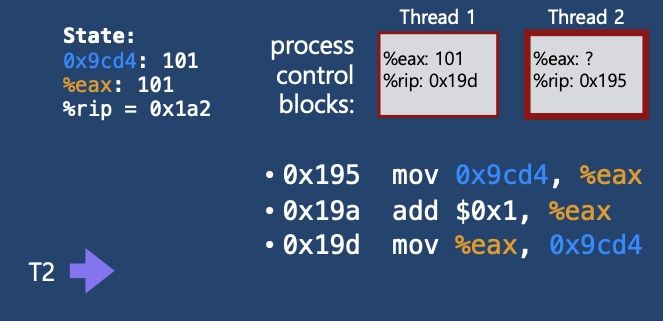

# Process Synchronization

* 협력적 프로세스는 다른 프로세스의 실행에 영향을 주거나 영향을 받는 프로세스이다
* 협력적 프로세스들은 논리 **주소 공간을 직접 공유**하거나 **메시지에 의해서 데이터를 공유**한다
* 공유 데이터에 대한 동시 접근은 **데이터의 비일관성**을 초래할 수 있다
* **Process Synchronization** 은 협력적 프로세스들의 질서있는 실행을 보장하여 데이터의 일관성을 유지하는 메커니즘이다

## 1. Race Condition

* 동시에 여러 개의 프로세스가 동일한 자료를 접근하여 조작하고, 그 **실행 결과가 접근이 발생한 특정 순서에 의존하는 상황**을 의미한다.
* 실행 결과가 공유 변수의 마지막으로 접근한 프로세스에 의해서 좌우된다

### **예시 1**

* `Thread1` 과 `Thread2`가 공유변수 balance의 값을 증가시키는 상황
* `0x195` : balance의 메모리 주소
* `%eax` : 레지스터

1-1

* balance의 값을 eax 레지스터로 옮김

1-2

* eax 레지스터의 값을 1 증가시킴

1-3

* eax의 값을 balance로 옮김

1-4

* Context siwthching 발생

1-5

* balance의 값을 eax로 옮김

1-6

* eax의 값을 1 증가

1-7

* eax의 값을 balance로 옮김

1-8

* 최종적으로 balance의 값이 102가 됨

### 예시 2

* Race Condition 이 발생하는 예시를 살펴보자

2-1

2-2

2-3

* `0x19d` 번지의 명령을 수행하기 전 **context switch** 발생

2-4

2-5

2-6

2-7

2-8

* Context siwtch 발생

2-9

* eax의 값을 balance로 옮김

2-10

* 최종적으로 balanc의 값이 101이 되었다 이는 우리가 원하는 결과가 아니다 

# The Critical-Section Problem

* 여러 프로세스가 공유 데이터를 동시에 사용하기를 원하는 경우 각 프로세스의 code segment에는 공유 데이터를 접근하는 **critical section**이 존재한다.
*  **critical section**: 공유 데이터를 접근하는 곳
* race conditiond을 방지하기 위해 하나의 프로세스가 critical section에 있을 때 다른 모든 프로세스는 critical section에 들어갈 수 없어야한다.
* 각 프로세스는 critical section으로 진입하려면 진입 허가를 요청해야 한다.
* entry section
  * critical section으로 진입하려면 진입 허가를 요청하는 코드 부분
* exit section
  * critical section을 빠져나오는 코드 부분

## 1. Critical-Section Problem의 해결 법

**인터럽트를 비활성화 한다**

* 인터럽트를 비활성화 하면 한 프로세스가 CPU를 빼앗기는 일 없이 Critical-Section을 모두 실행 후 빠져나간다
* 즉 공유 데이터를 프로세스들이 순차적으로 접근하기 때문에 race condition이 발생하지 않는다
* 단일 처리기 환경에서만 적용할 수 있다
  * 인터럽트를 비활성화하기 위해서 메세지를 모든 처리기에 보내야한다. 
  * 이는 상당한 시간을 소비하고 시스템 효율을 떨어뜨린다
  * 또한 시스템 클록에 대한 영향도 고려해야 한다

**Nonpreemptive Kernel**

* Nonpreemptive Kernel은 한 프로세스가 커널 모드로 실행 중일 때 다른 프로세스가 CPU를 선점할 수 없다는 것을 의미한다
* 커널 안에서 오직 하나의 프로세스만 활성화 되기 때문에 커널 데이터는 race condition으로 부터 자유롭다.
* 그러나 **Preemptive Kernel**의 경우  race condition이 발생할 수 있다

**소프트웨어적 해결법**

* 대표적으로 Peterson's Solution(피터슨 해결안)이 있다
* 허나 현대의 컴퓨터 구조에서 올바른 작동이 보장되지 않는다

**하드웨어적 해결법**

* **원자적**인 하드웨어 명령어를 이용해 Critical-Section Problem을 해결한다
* TestAndSet instruction
* Compared and Swap instruction

**세마포어**

**Using high-level synchronization construct**

* Monitor

## 2. critical section Problem 해결법의 충족 조건

* 다음의 세 가지 요구조건을 충족해야한다.

**Mutual Exclusion(상호배제)**

* 한 프로세스가 가지의 임계구경에서 실행된다면, 다른 프로세스들은 그들 자신의 임계구역에서 실행될 수 없다

**Progress(진행)**

* critical section에서 실행되는 프로세스가 없는 상태에서 critical section에 들어가고자 하는 프로세스가 있으면 critical section에 들어가게 해줘야 한다.

**Bounded Wating(한정된 대기)**

* 프로세스가 critical section에 들어가려고 요청한 후부터 그 요청이 허용될 때까지 다른 프세스들이 critical section에 들어가는 횟수에 한계가 있어야한다.
* 즉 **starvation** 현상이 없어야 한다

## 3. Peterson's Solution(피터슨 해결안)

* Mutual Exclusion, Progress, Bounded Wating 세 가지 요구조건을 모두 만족한다.
* 단점
  * busy waiting(=spin lock): 계속 CPU와 메모리를 쓰면서 기다리기 때문에 비효율적이다.

## 4. Synchronization Hardware(동기화 하드웨어)

* critical section 문제는 단일 처리기 환경에서는 공유 변수가 변경되는 동안 인터럽트 발생을 허용하지 않으면 해결할 수 있다.
  * 이 해결책은 다중 처리기 환경에서는 적욜할 수 없다.
  * 다중 처리기 상에서 인터럽트의 사용불가능화 메시지가 모든 처리기에 전달되기 때문에 상당한 시간을 소비해 시스템 효율을 떨어뜨린다.
* 현대 기계들은 한 워드(word)의 내용을 검사하고 변경하거나, 두 워드의 내용을 원자적으로 교환할 수 있는, 즉 인터럽트 되지 않는 하나의 단위로서 특별한 하드웨어 명령어를 제공한다.
  * `test_and_set()`
  * `compare_and_swap()`
  * 이 명령어들로 critical section 문제를 간단히 해결할 수 있다

## 5. Semaphores

* critical section 문제를 해결하기 위한 추상적인 자료형
* Busy-wait 방식과 block/wakeup 방식이 있으며 아래는 block/wakeup방식을 설명하고 있다.
  * critical section이 짧은 경우 Busy-wait 방식이 적절할 수 있다. -> block/wakeup 오버헤드가 더 클 수 있으므로
  * 일반적으로는 block/wakeup 방식이 더 효율적이다.
* Semaphores를 아래와 같이 정의한다.

* Semaphores S는 정수 변수로 초기화를 제외하고 두가지 표준 원자적 연산만을 제공한다.
* 원자적 연산: 한 스레드가 세마포 값을 변경하면 다른 어떤 스레드도 동시에 동일한 세마포 값을 변경할 수 없다.
  * wait() 또는 P() : 
    * 자원을 획득할때 사용한다.
    * value를 1감소 시키고 value가 0보다 작다면 wait queue L에 추가하고 block된다.
  * signal() 또는 V() : 
    * 자원을 반납할때 사용한다.
    * value를 1 증가시키고 value가 0이하하면 wait queue에서 기다리고 있는 프로세스를 queue에서 제거하고 wakeup시켜준다.

## 6. Monitor

## 7. Deadlock

