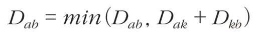

# 1 Floyd Warshall Algorithm

* 모든 노드에서 다른 모든 노드까지의 최단 경로를 모두 계산한다
* 다이나믹 프로그래밍 유형에 속한다

# 2 점화식

* 각 단계마다 특정한 노드 k를 거쳐 가는 경우를 확인한다
* a에서 b로 가는 최단 거리보다 a에서 k를 거쳐 b로 가는 거리가 더 짧은지 검사한다

# 3 시간복잡도

* O(N^3)

참고 자료

* https://www.youtube.com/watch?v=acqm9mM1P6o&list=PLRx0vPvlEmdAghTr5mXQxGpHjWqSz0dgC&index=7