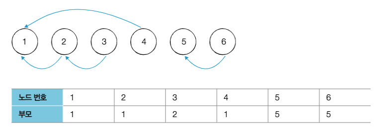

# 1 Disjoint Set

* 서로소 집합이란 공통 원소가 없는 두 집합을 의미한다
* 두 집합 {1, 2}와 {3, 4}는 공통 원소가 없기 때문에 서로소 집합이다
* 서로소 집합 자료구조는 그래프 알고리즘에서 매우 유용하게 사용된다
  * 예를 들면 여러 노드에서 두 노드를 선택했을 때 두 노드가 서로 같은 그래프에 속하는지 판별할 때 사용된다
* 각 원소의 집합 정보를 표현하기 위해 트리 자료구조를 이용한다


**집합 정보 표현**

* 같은 집합에 포함된 원소는 번호가 큰 노드가 번호가 작은 노드를 가리키도록 아래와 같이 표현한다



# 2 연산

* stack 자료구조가 push와 pop 연산으로 이루어진 것처럼 Disjoint Set은 union과 find라는 2개의 연산으로 조작한다


## 2.1 Union 연산

* 2개의 원소가 포함된 집합을 하나의 집합으로 합치는 연산이다
* a와 b 노드의 루트 노드를 각각 구하고 노드 번호가 큰쪽이 작은쪽을 가리키도록 하여 두 집합을 합친다

```python
def uinon(disjoint_set, a, b):
  root_a = find(disjoint_set, a)
  root_b = find(disjoint_set, b)
  if root_a < root_b:
    disjoint_set[root_b] = root_a
  else:
    disjoint_set[root_a] = root_b
```


## 2.2 Find 연산

* 특정한 원소가 속한 집합을 조회하는 연산이다
* 재귀적으로 특정 노드의 부모 노드를 조회해 최종적으로 루트 노드를 찾는 연산
* 루트 노드의 번호가 자신의 속한 집합이 된다

```python
def find(disjoint_set, x):
  if disjoint_set[x] != x:
    return find(disjoint_set, disjoint_set[x])
  return x
```

**경로 압축 기법**

```python
def find(disjoint_set, x):
  if disjoint_set[x] != x:
    disjoint_set[x] = find(disjoint_set, disjoint_set[x])
  return disjoint_set[x]
```


# 3 응용

## 3.1 사이클 판별

* 서로소 집합을 이용해 무방향 그래프의 사이클 여부를 판별할 수 있다
  * 방향 그래프의 사이클 여부는 DFS를 사용해 판별한다
* [Kruskal-algorithm.md](../../Algorithm/Kruskal-algorithm/Kruskal-algorithm.md) 참고


**그래프의 사이클 유무 판별**

1. 간선의 두 노드의 루트 노드를 확인한다
   * 루트 노드가 다르다면 두 노드에 대해서 union 연산
   * 루트 노드가 같다면 사이클이 발생한 것
2. 그래프의 모든 간선에 대해서 1번 과정을 반복


# 4 예제

* https://www.acmicpc.net/problem/1717

**최소 신장 트리 관련**

* https://www.acmicpc.net/problem/1197