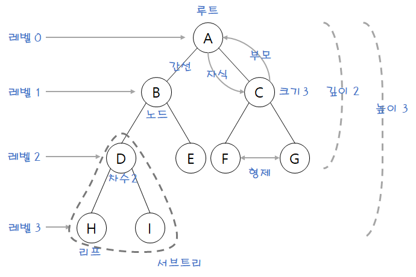
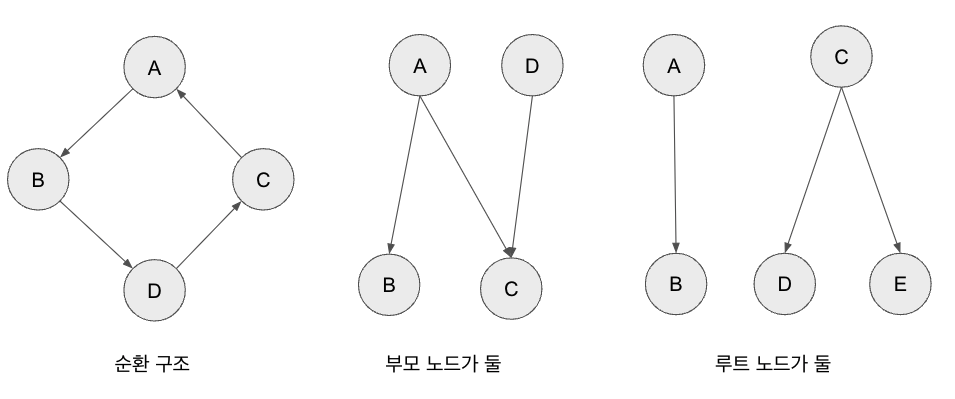
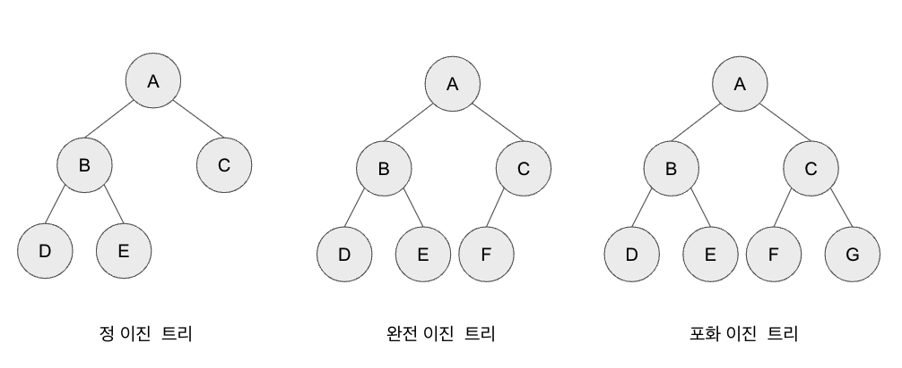

# 1 Tree

* 트리는 하나의 뿌리에서 위로 뻗어나가는 형상처럼 생겨서 트리라는 명칭이 붙음
* 트리 구조를 표현할 때는 나무의 형상과는 반대로 아래로 뻗어나가게 표현함
* 트리의 중요한 속성중 하나는 재귀로 정의된 자기참조 자료구조
  * 트리는 자식도 트리고 또 그 자식도 트리다

# 2 Tree의 각 명칭

[이미지 출처](https://harlie-98.tistory.com/16)

## 2.1 Root

* 트리는 항상 루트부터 시작된다
* 루트는 자식을 노드를 가지며 간선으로 연결되어 있다

## 2.2 차수(Degree)

* 자식 노드의 개수는 차수(Degree)라고 한다

## 2.3 크기(Size)

* 자신을 포함해 모든 자식 노드의 개수

## 2.4 높이(Height)

* 현재 위치에서부터 리프까지의 거리

## 2.5 깊이(Depth)

* 루트에서부터 현재 노드까지의 거리

# 3 그래프와 비교

* **트리는 순환 구조를 갖지 않는 그래프**
* 트리는 특수한 형태의 그래프의 일종이며 크게 그래프의 범주에 속한다
* 한번 연결된 노드가 다시 연결되는 법이 없다
  * 부모가 하나다!
* 단방향, 양방향을 모두 가리킬 수 있는 그래프와 달리 트리는 부모에서 자식노드를 가리키는 단방향만 가능하다
* 트리는 루트가 하나여야 한다

**트리가 아닌 경우**

# 4 트리의 종류

* 트리 자료구조는 이진 트리와 이진 탐색 트리가 가장 널리 사용된다

# 5 이진 트리

* 트리의 모든 노드의 차수가 2 이하일 때 이 트리를 이진트리라고 부른다
* 대체로 트리라고하면 대체러 이진 트리를 일컫는다

## 5.1 이진 트리의 유형

* 트리 용어는 제대로 표준화되어 있지 않아 논문에서도 각기 다르게 쓰인다
* 이진 트리의 유형을 위키피디아를 기준으로 정리해보자

## 5.2 정 이진 트리

* 모든 노드의 차수가 0 또는 2이다

## 5.3 완전 이진 트리

* 마지막 레벨을 제외하고 모든 레벨이 완전히 채워져 있다
* 마지막 레벨의 모든 노드는 가장 왼쪽부터 채워져 있다

## 5.4 포화 이진 트리

* 모든 노드(리프 노드 제외)의 차수가 2다
* 모든 리프 노드가 동일한 깊이 또는 레벨을 갖는다