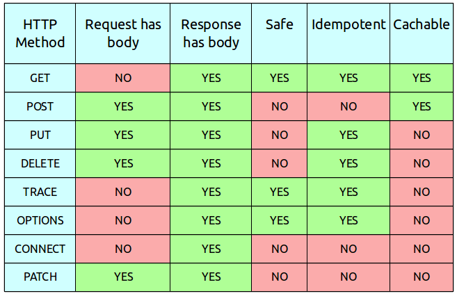

# HTTP

> 하이퍼텍스트 전송 프로토콜(HTTP)은 HTML과 같은 하이퍼미디어 문서를 전송하기위한 애플리케이션 레이어 프로토콜입니다. 웹 브라우저와 웹 서버간의 커뮤니케이션을위해 디자인되었지만, 다른 목적으로도 사용될 수 있습니다. HTTP는 클라이언트가 요청을 생성하기 위한 연결을 연다음 응답을 받을때 까지 대기하는 전통적인 클라이언트-서버 모델을 따릅니다. HTTP는 무상태 프로토콜이며, 이는 서버가 두 요청간에 어떠한 데이터(상태)도 유지하지 않음을 의미합니다. 일반적으로 안정적인 전송 레이어로 UDP와 달리 메세지를 잃지 않는 프로토콜인 TCP/IP 레이어를 기반으로 사용 합니다.

## 1. HTTP의 특징

* HTTP는 클라이언트-서버 프로토콜입니다
* HTTP는 상태를 저장하지 않습니다(Stateless)

### 1.1 클라이언트-서버

**클라이언트**

* 사용자 에이전트는 사용자를 대신하여 동작하는 모든 도구입니다. 
* 이 역할은 주로 **브라우저**에 의해 수행됩니다
* 브라우저는 **항상** 요청을 보내는 개체입니다. 결코 서버가 될 수 없습니다

**서버**

* 통신 채널의 반대편에는 클라이언트에 의한 요청에 대한 문서를 *제공*하는 서버가 존재합니다

### 1.2 Stateless

> HTTP는 **상태를 저장하지 않습니다(Stateless)**. 동일한 연결 상에서 연속하여 전달된 **두 개의 요청 사이에는 연결고리가 없습니다**. 이는 e-커머스 쇼핑 바구니처럼, 일관된 방식으로 사용자가 페이지와 상호작용하길 원할 때 문제가 됩니다. 하지만, HTTP의 핵심은 상태가 없는 것이지만 HTTP 쿠키는 상태가 있는 세션을 만들도록 해줍니다.
> 헤더 확장성을 사용하여, 동일한 컨텍스트 또는 동일한 상태를 공유하기 위해 각각의 요청들에 세션을 만들도록 HTTP 쿠키가 추가됩니다.

## 2. HTTP Request Method(HTTP 요청 메서드)

* HTTP는 **요청 메서드**를 정의하여, 주어진 리소스에 수행하길 원하는 행동을 나타냅니다.

**GET**

* **HTTP `GET` 메서드**는 특정한 리소스를 가져오도록 요청합니다. `GET` 요청은 데이터를 가져올 때만 사용해야 합니다.

**HEAD**

* `HEAD` 메서드는 `GET` 메서드의 요청과 동일한 응답을 요구하지만, 응답 본문을 포함하지 않습니다.

**POST**

* `POST` 메서드는 특정 리소스에 엔티티를 제출할 때 쓰입니다. 이는 종종 서버의 상태의 변화나 부작용을 일으킵니다.

**DELETE**

* `DELETE` 메서드는 특정 리소스를 삭제합니다.

**PUT**

* `PUT` 메서드는 목적 리소스 모든 현재 표시를 요청 payload로 바꿉니다.
* 이와 달리 `PATCH` 메서드는 리소스의 부분만을 수정하는 데 쓰입니다.

**PATCH**

* `PATCH` 메서드는 리소스의 부분만을 수정하는 데 쓰입니다.

**OPTIONS**

* `OPTIONS` 메서드는 통신을 설정하는 데 쓰입니다.

## 3. HTTP 상태 코드

### 3.1 정보 응답

### 3.2 성공 응답

`200 OK`

* 요청이 성공적으로 되었습니다. 성공의 의미는 HTTP 메소드에 따라 달라집니다:
* `GET`: 리소스를 불러와서 메시지 바디에 전송되었습니다.
* `HEAD`: 개체 해더가 메시지 바디에 있습니다.
* `PUT` 또는 `POST`: 수행 결과에 대한 리소스가 메시지 바디에 전송되었습니다.
* `TRACE`: 메시지 바디는 서버에서 수신한 요청 메시지를 포함하고 있습니다.

`201 Created`

* 요청이 성공적이었으며 그 결과로 새로운 리소스가 생성되었습니다. 이 응답은 일반적으로 `POST`요청 또는 일부` PUT` 요청 이후에 따라옵니다.

### 3.3 리다이렉션 메시지

### 3.4 클라이언트 에러 응답

`400 Bad Request`

* 이 응답은 잘못된 문법으로 인하여 서버가 요청을 이해할 수 없음을 의미합니다.

`401 Unauthorized`

* 비록 HTTP 표준에서는 "미승인(unauthorized)"를 명확히 하고 있지만, 의미상 이 응답은 "비인증(unauthenticated)"을 의미합니다. 클라이언트는 요청한 응답을 받기 위해서는 반드시 스스로를 인증해야 합니다.

`403 Forbidden`

* 클라이언트는 콘텐츠에 접근할 권리를 가지고 있지 않습니다. 예를들어 그들은 미승인이어서 서버는 거절을 위한 적절한 응답을 보냅니다. 401과 다른 점은 서버가 클라이언트가 누구인지 알고 있습니다.

`404 Not Found`

* 서버는 요청받은 리소스를 찾을 수 없습니다. 브라우저에서는 알려지지 않은 URL을 의미합니다. 

### 3.5 서버 에러 응답

`500 Internal Server Error` 

* 서버가 처리 방법을 모르는 상황이 발생했습니다. 서버는 아직 처리 방법을 알 수 없습니다.

참고

* https://developer.mozilla.org/en-US/docs/Web/HTTP/Methods
