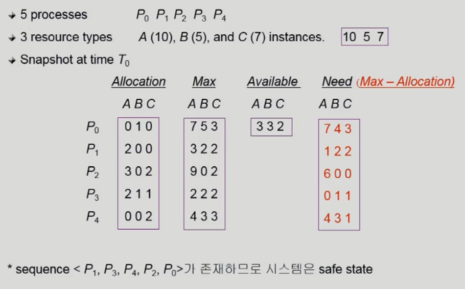

# 1 Deadlock

* 일련의 프로세스들이 서로 가진 자원을 기다리며 bolck된 상태
* 자원(Recource)
  * 하드웨어, 소프트웨어 등을 포함하는 개념
  * 예시) I/O device, memory space, semaphore

# 2 Deadlock 발생 조건

* Deadlock이 발생하려면 아래 4가지 조건을 모두 만족해야한다

## 2.1 Mutual Exclusion

* **매 순간 하나의 프로세스**만이 자원을 사용할 수 있다

## 2.2 No Preemption

* 프로세스는 자원을 스스로 내어놓을 뿐 **강제로 빼앗기지 않는다**

## 2.3 Hold and Wait

* 자원을 가진 프로세스가 다른 자원을 기다릴 때 보유 **자원을 놓지 않고 계속 가지고 있는다**

## 2.4 Circular Wait

* 자원을 기다리는 프로세스간에 **사이클**이 형성되어야한다

# 3 Deadlock 처리 방법

* Deadlock을 처리하난 방법에는 아래와 같이 4가지 방법이 있다
* **Deadlock Prevention, Deadlock Avoidance**는 Deadlock을 **미연에 방지**하는 방식이다
* **Deadlock Detection and revovery, Deadlock Ignorance**는 Deadlock을 방지하지 않고 Deadlock 발생 **후 처리**를 하는 방식이다

## 3.1 Deadlock Prevention

* Deadlock 발생 조건 4가지 중 어느 하나가 만족되지 않도록 하는 방법
* Deadlock Prevention 방식은 Utilization 저하, Throughtput 감소, Starvation 문제 등이 있다
* **Mutual Exclusion**
  * 공유해서는 안되는 자원의 경우 이 조건은 반드시 성립해야한다
  * 따라서 Mutual Exclusion은 배제할 수 없다
* **Hold and Wait**
  * 방법1: 프로세스 시작 시 모든 필요한 자원을 할당 받는다
  * 방법2: 자원이 필요한 경우 보유 자원을 모두 놓고 다시 요청한다
* **No Preemption**
  * 프로세스가 어떤 자원을 기다려야 하는 경우 이미 보유한 자원이 선점될 수 있다
  * 모든 필요한 자원을 얻을 수 있을 때 그 프로세스는 다시 시작된다
  * State를 쉽게 저장하고 복구할 수 있는 자원에서 주로 사용된다
    * 예) CPU, Memory
* **Circular Wait**
  * 모든 자원 유형에 할당 순서를 정하여 정해진 순서대로만 자원을 할당한다

## 3.2 Deadlock Avoidance

* 자원 요청에 대한 부가적인 정보를 이용해서 deadlock의 가능성이 없는 경우만 자원을 할당하는 방법
* 각 프로세스가 한 시점에서 최대로 사용하는 자원의 수를 이용한다

**Banker's Alogorithm**

* Allocation: 각 프로세스가 현재 할당 받은 자원의 수를 의미한다
* Max: 각 프로세스가 한 시점에 할당 받은 최대 자원 수를 의미한다
* Available: 현재 할당되지 않은 자원의 수를 의미한다
* Need: 각 프로세스가 앞으로 요청할 수 있는 최대 자읜 수를 의마한다
* **Banker's Alogorithm** 은 한 프로세스가 자원을 요청했을 때 `Need`가 `Available` 보다 높은 경우 데드락 방지를 위해 요청을 거절한다
  * 위 그림의 상태에서
  * P0의 요청은 `Available` 자원 그 이상을 요청하기 때문에 데드락이 발생할 수 있기 때문에 받아들이지 않는다
  * P1의 요청은 허용된다
* sequence <P1, P3, P4, P2, P0> 가 존재한다
  * sequence 순서대로 프로세스에 자원을 할당하고 해당 프로세스가 모든 처리를 끝내고 자원을 반납하면 가용할 수 있는 자원의 범위 내에서만 요청하기 때문에 데드락이 발생하지 않는다
  * 이런 sequence가 존재할 때 시스템이 `safe state`하다라고 한다

 

## 3.3 Deadlock Detection and revovery

* Deadlock 발생은 허용하되 이를 감지하여 회복시키는 방법

**Detection**

* 자원 할당 그래프를 통해 교착 상태를 탐지함
* 자원 요청 시, 탐지 알고리즘을 실행시켜 그에 대한 오버헤드 발생함

**revovery**

* Process termination
  * 데드락이 발생한 모든 프로세스 종료
  * 데드락이 발생하지 않을 때까지 프로세스 중 하나를 종료한다
* Resource Preemption
  * 교착 상태의 프로세스가 점유하고 있는 자원을 선점해 다른 프로세스에게 할당 (해당 프로세스 일시정지 시킴)
  * 우선 순위가 낮은 프로세스나 수행 횟수 적은 프로세스 위주로 프로세스 자원 선점

## 3.4 Deadlock Ignorance

* Deadlock을 시스템이 책임지지 않는 방법
* Deadloc은 매우 드물게 발생하므로 Deadlock에 대한 조치 자체가 overhead일 수 있다
* Deadlock이 발생한 경우 사람이 느낀 후 직접 프로세스를 종료하는 방식으로 대처한다
* Unix를 포함한 대부분의 운영체제가 이 방법을 채택했다