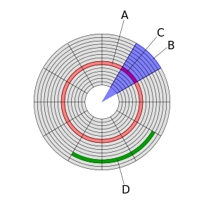

# 1 Magnetic Disks(자기 디스크)

## 1.1 Disk 구조

### 1.1.1 Platter

* 디스크는 자기 물질로 만들어진 여러 **플래터**로 이루어짐
* 각 플래터 마다 2 개의 **read-write 헤드**가 있다
* 각 플래터는 **트랙**과 **섹터**로 구분됨

### 1.1.2 Track

* 정보는 디스크 표면 상의 동심원(트랙)을 따라 저장됨
* 위 그림에서 A가 Track

### 1.1.3 Cylinder

* 여러 플래터에서 같은 지름을 갖는 트랙들을 **실린더**라고 부른다
* 한 파일을 같은 실린더에 저장하면 헤드를 움직이지 않고 데이터를 읽을 수 있어 효율적임

### 1.1.3 Sector

* 블록은 한 개 이상의 섹터들로 이루어짐
* 일반적으로 512 bytes 크기
* 위 그림에서 
  * B: Geometrical sector
  * C: Sector
  * D: Cluster

### 1.1.4 read-write head

* 암 끝에 달린 head

### 1.1.5 arm

* 원하는 트랙 위에 read-write head를 놓기위해 움직인다

## 1.1 디스크 읽기 방식

* 최근 자기 디스크 원판에 의존하는 하드 디스크보다 SSD 드라이브가 많이 활용되고 있지만 여전히 데이터 저장 매체로 컴퓨터에서 가장 느린 하드 디스크를 사용하고 있다
* 데이터베이스의 성능 튜닝은 어떻게 디스크 I/O를 줄이느냐가 관건

> `디스크에서 임의의 블록을 읽어오거나 기록하는데 걸리는 시간 = SEEK + ROTATION, TRANSFER`
>
> * SEEK 시간: 암 끝에 달린 헤드를 원하는 트랙 위치로 옮기는 시간
> * ROTATION 시간: 트랙을 찾았으면 원하는 섹터가 올 때까지 회전 지연 시간이 걸린다
> * TRANSFER 시간: 데이터의 총 길이 만큼 플래터가 회전하면서 데이터를 읽고 쓰는 시간
> * SEEK 타임이 가장 오래걸리기 때문에 자기 디스크에 성능은 여기서 결정된다

## 1.2 순차 I/O와 랜덤 I/O

**순차 I/O**

* 디스크의 헤더를 움직이지 않고 한 번에 많은 데이터를 읽는 방식을 순차 I/O라고 한다
* 순차 I/O의 경우 SSD가 하드 디스크보다 조금 빠르거나 비슷한 성능을 보이기도 한다

**랜덤 I/O**

* 랜덤 I/O는 디스크 드라이브의 플래터를 돌려서 읽어야할 데이터가 저장된 위치로 헤더를 옮긴 다음 데이터를 읽는 것을 의미한다
* SSD의 장점은 하드 디스크와 비교하여 랜덤 I/O가 훨신 빠르다는 것

**순차 I/O와 랜덤 I/O 비교**

* 데이터베이스 서버에서 순차 I/O 작업의 비중이 낮고 랜덤 I/O를 통해 작은 데이터를 읽고 쓰는 작업이 대부분
* 따라서 SSD가 DBMS용 스토리지에 최적이다 
* 예시
  * 순차 I/O는 3개의 페이지를 디스크에 기록하기 위해 1번 시스템 콜을 요청하지만 랜덤 I/O는 3개의 페이지를 디스크에 기록하기 위해 3번의 시스템 콜 요청을 한다
  * 순차 I/O 디스크 헤드를 한번 움직이고 랜덤 I/O는 헤드를 3번 움직이니 순차 I/O가 약 3배 빠르다고 볼 수 있다

# 2 SSD(Solid State Disks)

* 컴퓨터에서 CPU나 메모리 같은 주요 장치는 대부분 전자식 장치지만 하드 디스크 드라이브는 기계식 장치다
* SSD는 기존 하드 디스크 드라이브에서 저장용 플래터를 제거하고 그 대신 플래시 메모리를 장착하고 있다
* 플래터를 기계적으로 회전시킬 필요가 없으므로 아주 빨리 데이터를 읽고 쓸 수 있다
* 플래시 메모리는 전원이 공급되지 않아도 데이터가 삭제되지 않는다

## 2.1 순차 I/O와 랜덤 I/O

* 디스크 원판을 가지지 않는 SSD는 순차 I/O와 랜덤 I/O의 차이가 없을 것 같지만 실제로 그렇지 않다.
* 랜덤 I/O는 여전히 순차 I/O보다 Throughput이 떨어진다.

> Sometimes old technologies are used in new ways as economics change or the technologies evolve. An example is the growing importance of **solid-state disks**, or **SSD****s**. Simply described, an SSD is nonvolatile memory that is used like a hard drive. There are many variations of this technology, from DRAM with a battery to allow it to maintain its state in a power failure through flash-memory technologies like single-level cell (SLC) and multilevel cell (MLC) chips.
>
> SSDs have the same characteristics as traditional hard disks but can be more reliable because they have no moving parts and faster because they have no seek time or latency. In addition, they consume less power. However, they are more expensive per megabyte than traditional hard disks, have less capacity than the larger hard disks, and may have shorter life spans than hard disks, so their uses are somewhat limited. One use for SSDs is in storage arrays, where they hold file-system metadata that require high performance. SSDs are also used in some laptop computers to make them smaller, faster, and more energy-efficient.
>
> Because SSDs can be much faster than magnetic disk drives, standard bus interfaces can cause a major limit on throughput. Some SSDs are designed to connect directly to the system bus (PCI, for example). SSDs are changing other traditional aspects of computer design as well. Some systems use them as a direct replacement for disk drives, while others use them as a new cache tier, moving data between magnetic disks, SSDs, and memory to optimize performance.
>
> In the remainder of this chapter, some sections pertain to SSDs, while others do not. For example, because SSDs have no disk head, disk-scheduling algorithms largely do not apply. Throughput and formatting, however, do apply.

# 3 Magnetic Tapes

# 4 Disk Structure