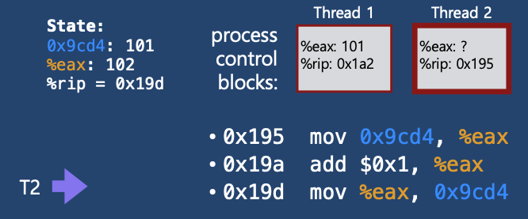

# 1 Process Synchronization

* 협력적 프로세스는 다른 프로세스의 실행에 영향을 주거나 영향을 받는 프로세스이다
* 협력적 프로세스들은 논리 **주소 공간을 직접 공유**하거나 **메시지에 의해서 데이터를 공유**한다
* 공유 데이터에 대한 동시 접근은 **데이터의 비일관성**을 초래할 수 있다
* **Process Synchronization** 은 협력적 프로세스들의 질서있는 실행을 보장하여 데이터의 일관성을 유지하는 메커니즘이다


## 1.1 Race Condition

* 동시에 여러 개의 프로세스가 동일한 자료를 접근하여 조작하고, 그 **실행 결과가 접근이 발생한 특정 순서에 의존하는 상황**을 의미한다.
* 실행 결과가 공유 변수의 마지막으로 접근한 프로세스에 의해서 좌우된다


**예시 1**

* `Thread1` 과 `Thread2`가 공유변수 balance의 값을 증가시키는 상황
* `0x195` : balance의 메모리 주소
* `%eax` : 레지스터

1-1


* balance의 값을 eax 레지스터로 옮김

1-2


* eax 레지스터의 값을 1 증가시킴

1-3


* eax의 값을 balance로 옮김

1-4


* Context siwthching 발생

1-5


* balance의 값을 eax로 옮김

1-6


* eax의 값을 1 증가

1-7



* eax의 값을 balance로 옮김

1-8


* 최종적으로 balance의 값이 102가 됨


**예시 2**

* Race Condition 이 발생하는 예시를 살펴보자

2-1


2-2


2-3


* `0x19d` 번지의 명령을 수행하기 전 **context switch** 발생

2-4


2-5


2-6


2-7


2-8


* Context siwtch 발생

2-9


* eax의 값을 balance로 옮김

2-10


* 최종적으로 balanc의 값이 101이 되었다 이는 우리가 원하는 결과가 아니다 


# 2 The Critical-Section Problem

* 여러 프로세스가 공유 데이터를 동시에 사용하기를 원하는 경우 각 프로세스의 code segment에는 공유 데이터를 접근하는 **critical section**이 존재한다.
* race conditiond을 방지하기 위해 **하나의 프로세스가 critical section에 있을 때 다른 모든 프로세스는 critical section에 들어갈 수 없어야한다.**


**critical section**

* critical section은 공유 데이터를 접근하는 구역
* 각 프로세스는 critical section으로 진입하려면 진입 허가를 요청해야 한다.
* **entry section**
  * critical section으로 진입하기 위해서 진입 허가를 요청하는 코드 부분
  * 예) Lock 획득하기
* **exit section**
  * critical section을 빠져나오는 코드 부분
  * 예) Lock 반납하기


## 2.1 Critical-Section Problem의 해결 법

**인터럽트를 비활성화 한다**

* 인터럽트를 비활성화 하면 한 프로세스가 CPU를 빼앗기는 일 없이 Critical-Section을 모두 실행 후 빠져나간다
* 즉 공유 데이터를 프로세스들이 순차적으로 접근하기 때문에 race condition이 발생하지 않는다
* 단일 처리기 환경에서만 적용할 수 있다
  * 인터럽트를 비활성화하기 위해서 메세지를 모든 처리기에 보내야한다. 
  * 이는 상당한 시간을 소비하고 시스템 효율을 떨어뜨린다
  * 또한 시스템 클록에 대한 영향도 고려해야 한다

**Nonpreemptive Kernel**

* Nonpreemptive Kernel은 한 프로세스가 커널 모드로 실행 중일 때 다른 프로세스가 CPU를 선점할 수 없다는 것을 의미한다
* 커널 안에서 오직 하나의 프로세스만 활성화 되기 때문에 커널 데이터는 race condition으로 부터 자유롭다.
* 그러나 **Preemptive Kernel**의 경우 race condition이 발생할 수 있다

**소프트웨어적 해결법**

* 대표적으로 Peterson's Solution(피터슨 해결안)이 있다
* 허나 현대의 컴퓨터 구조에서 올바른 작동이 보장되지 않는다

**하드웨어적 해결법**

* **원자적**인 하드웨어 명령어를 이용해 Critical-Section Problem을 해결한다
* TestAndSet instruction
* Compared and Swap instruction

**세마포어**

**Using high-level synchronization construct**

* Monitor


## 2.2 critical section Problem 해결법의 충족 조건

* critical section Problem을 해결하려면 아래 세 가지 요구조건을 충족해야한다.

**Mutual Exclusion(상호배제)**

* 한 프로세스가 critical section에 들어가면 수행 중이면, 다른 모든 프로세스들은 critical section에 들어갈 수 없다

**Progress(진행)**

* critical section에서 실행되는 프로세스가 없는 상태에서 critical section에 들어가고자 하는 프로세스가 있으면 critical section에 들어가게 해줘야 한다.

**Bounded Wating(한정된 대기)**

* 프로세스가 critical section에 들어가려고 요청한 후부터 그 요청이 허용될 때까지 다른 프로세스들이 critical section에 들어가는 횟수에 한계가 있어야한다.
* 즉 **starvation** 현상이 없어야 한다


## 2.3 Critical-Section Problem 해결책

* 충족 조건을 만족하지 못하는 알고리즘 2 가지 예시를 살펴보자


**Algorithm 1**

```c
int turn = 0; // Synchronization Variable: Process0의 차례로 초기화

do{
  while(turn != 0); // enrty section: 나의 차례인지 확인
  // Critical Section
  turn = 1; // exit section: 다음 차례로 Process1을 설정
} while (1);
```

* enrty section에서 자신의 차례인지 확인하고 Critical Section에 진입하기 때문에 상호배제 조건을 충족한다
* 그러나 만약 `int turn = 1;` 로 초기화 되어있고 Process1이 Critical Section에 들어가 있지 않고 러닝상태가 아닐 때 Process0은 Critical Section에 아무 프로세스도 없지만 들어갈 수 없어 Progress 조건을 충족하지 못한다


**Algorithm 2**

```c
// Synchronization Variable 초기화
// Critical Section에 들어가고 싶은 Process는 자신의 플래그를 true로 설정해 의사를 표시한다
bool flag[2] = [false, false]; 

do{
  flag[i] = true 	// Critical Section에 들어가고 싶다고 표시
  while(flag[j]);	// 상대 Process가 들어가고 싶은지 확인
  // Critical Section
  flag[i] = false // exit section: 일을 마치고 플래그를 false로 설정
} while (1);
```

* 프로세스1이 `flag[1] = true`로 설정하고 곧바로 컨텍스트 스위칭 후 프로세스2가 flag[2] = true로 설정하면 어떠한 프로세스도 Critical Section에 들어갈 수 없다
* Progress 조건 불만족


# 3 Peterson's Solution

* Critical Section Problem을 해결하는 대표적인 소프트웨어적 방법
* Mutual Exclusion, Progress, Bounded Wating 세 가지 요구조건을 모두 만족한다.


**Peterson's Solution의 단점**

* busy waiting(=spin lock)을 사용해 계속 CPU와 메모리를 쓰면서 기다리기 때문에 비효율적이다.


# 4 Synchronization Hardware

* 앞에서 본 소프트웨어적인 해결책인 Peterson's Solution은 Enrty Section 코드가 복잡하다
  * 그 이유는 Enrty Section 코드가 원자적이지 못해 중간에 CPU를 빼앗길 수 있기 때문이다
  * Enrty Section 코드를 실행하는 도중 CPU를 빼앗겨도 정상적으로 동작할 수 있게하기 위해서 코드가 복잡함

* 인터럽트 되지 않는 하나의 단위로서 특별한 하드웨어 명령어를 사용하면 Enrty Section 코드를 간결하게 작성할 수 있다
* 원자적인 하드웨어 명령어
  * `test_and_set()`
  * `compare_and_swap()`


**test_and_set 예시**

* test_and_set() 명령어는 아규먼트의 값을 반환하고 해당 값을 true로 세팅한다

```c
bool lock = false;

do {
  while(test_and_set(lock)); // enrty section
  // crtical sections
  lock = false; // exit section
}
```


# 5 Semaphores

* Critical Section 문제를 해결하기 위한 추상적인 자료형
  * 추상적인 자료형이란 자료들과 그 자료들에 대한 연산들을 명기한 것이다
  * 아래에 Semaphores의 자료(value)와 그 자료에 대한 연산(P(), V())이 나온다

* 추상 자료형이기 때문에 여러 구현 방식이 있다
  * **Busy-wait** 방식과 **block/wakeup** 방식이 있으며 아래는 block/wakeup방식을 설명하고 있다.
  * critical section이 짧은 경우(경쟁이 심하지 않은 경우) Busy-wait 방식이 적절할 수 있다.
    * block/wakeup 오버헤드가 더 클 수 있으므로

  * 일반적으로는 block/wakeup 방식이 더 효율적이다.


## 5.1 Semaphores의 자료


**`value`** 

* Synchronization Variable
* value는 그 가용한 **자원의 개수**로 초기화 된다
  * 자원을 사용하면 값이 감소, 방출하면 값이 증가 한다.
* `양수` : 현재 공유 자원이 놀고 있다
* `0` 현재 놀고 있는 공유 자원이 없다
* `음수` : 현재 놀고 있는 공유 자원이 없어 프로세스가 wait queue에서 기다리고 있다

**`L`** 

* 공유 자원이 모두 사용중일 때 공유 자원을 요청한 프로세스를 wait queue에 넣는다 
* `L` 은 **wait queue**를 의미한다


## 5.2 Semaphores의 원자적 연산 

* Semaphores는 `value` 초기화를 제외하고 아래와 같이 두가지 표준 원자적 연산만을 제공한다.
  * wait()
  * signal()

* 원자적 연산을 이용해 한 스레드가 세마포 값을 변경하면 다른 어떤 스레드도 동시에 동일한 세마포 값을 변경할 수 없다.

**wait() 또는 P()**

```c
S.value--;
if(S.value < 0){
  S.L.add(process);
  block();
}
```

* 자원을 획득할때 사용한다.
* value를 1감소 시키고 value가 0보다 작다면 L(wait queue)에 추가하고 block된다.


**signal() 또는 V()**

```c
S.value++;
if(S.value <= 0){
  process = S.L.remove();
  wakeup(process)
}
```

* 자원을 반납할때 사용한다.
* value를 1 증가시키고 value가 0이하하면 wait queue에서 기다리고 있는 프로세스를 queue에서 제거하고 wakeup시켜준다.


## 5.3 Semaphores 사용

```c
semaphore mutex; // value를 1로 초기화한 semaphore를 특별히 mutex라고 한다

do {
  P(mutex); // entry section
  // critical section
  V(mutex);	// exit section
}
```


## 5.4 Mutex

* Semaphores는 그 가용한 **자원의 개수** 로 초기화 된다. 자원을 사용하면 세마포가 감소, 방출하면 세마포가 증가 한다.
* **Mutex**는 value(Synchronization Variable)를 1로 초기화 한 것을 의미한다.
* 즉 Critical Section에 하나의 프로세스만 들어가는 것을 의미한다.
* 다중 프로세스들 사이의 Critical Section 문제를 해결하기 위해 사용한다.


## 5.5 Semaphores의 문제점

* 저수준이라 개발자가 직접 사용하기 힘들다
* 정확성의 입증이 어렵다
* 자발적 협력이 필요하다
* 한번의 실수가 시스템에 치명적인 영향을 미친다
* 이를 극복하기 위해 **Monitor**라는 것을 사용한다.
  * Monitor는 Semaphores를 더 추상화한 고수준 솔루션이다


# 6 동기화 문제들


## 6.1 Bounded Buffer Problem


## 6.2 Readers and Writers Problem

* Readers and Writers Problem를 풀기 위해선 아래 두 가지 조건을 만족시켜야 한다
  * Writer가 DB에 접근하고 있을 때 다른 프로세스(Writer, Reader)는 접근할 수 없다
  * 한 Reader가 DB에 접근하고 있을 때 다른 Reader가 DB에 접근할 수 있다

**해결법**

* Writer가 DB 접근 허가를 받지 못한 상태에서는 모든 대기중인 Reader가 DB에 접근하게 해준다
* Writer는 대기 중인 Reader가 하나도 없을 때 DB 접근이 허용된다
* 일단 Writer가 DB에 접근 중이면 Reader들은 접근이 금지된다
* Writer가 빠져나가야만 Reader의 접근이 허용된다


**해결법 예시**

* 처음 공유 자원인 DB를 얻는 Reader가 P(db) 연산을 통해 DB를 얻는다
* 이후에 들어온 Reader는 미리 얻어진 DB를 그대로 사용한다
* 마지막으로 DB를 사용하고 나오는 Reader가 V(db) 연산을 통해 DB를 반납한다
* Reader들이 공유하는 공유 변수 readcount를 수정하기 위해선 mutex를 얻어야한다
* Reader가 끊임없이 도착한다면 writer는 starvation 문제를 겪을 수 있다


## 6.3 Dining Philosophers Problem


* Deadlock 발생 가능성이 있다
  * 모든 철학자가 동시에 왼쪽 젓가락울 집는 경우

**해결책**

* 젓가락을 둘다 집을 수 있을 때만 젓가락을 집을 수 있게 한다
* 짝수 철학자는 왼쪽 젓가락은 홀수 철학자는 오른쪽 젓가락을 먼저 집게 한다


**젓가락을 둘다 집을 수 있을 때만 젓가락을 집을 수 있게 하는 방법**


# 7 Monitor


## 7.1 Bounded Buffer Problem


## 7.2 Dining Philosophers Problem


