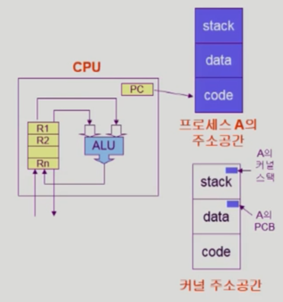
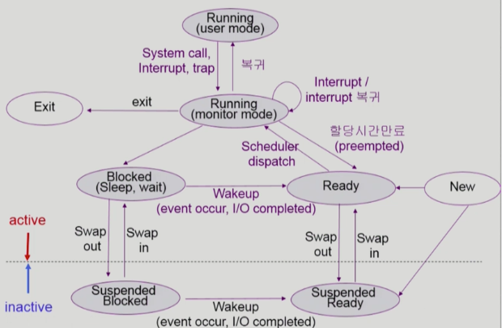
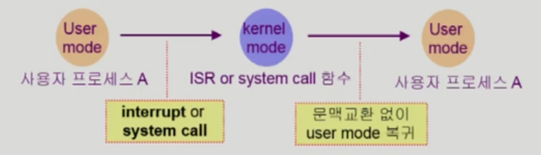
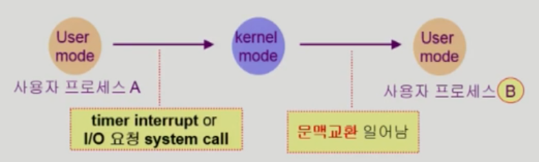
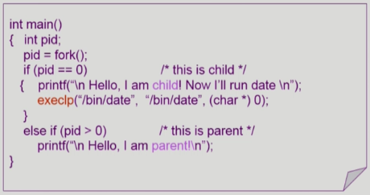

# Process

## 1 Process의 개념

* **프로세스**란 실행 중인 프로그램이다
* **프로그램**은 명령어 리스트를 내용으로 가진 디스크에 저장된 파일과 같은 수동적인 존재이다
* **실행 파일**이 메모리에 적재될 때 프로그램은 **프로세스**가 된다
* 프로세스는 프로그램과 다르게 문맥(Context)를 가지고 있다

## 2 Context

* 프로세스의 현재 상태를 나타내기 위한 모든 정보를 Context라 한다.
* 프로세스의 문맥에는 **하드웨어 문맥**, **주소 공간**, **PCB**, **커널 스택**이 있다

**하드웨어 문맥**

* 하드웨어 문맥은 CPU의 수행 상태를 나타낸다
* program counter, 각종 register

**주소 공간**

* 프로세스가 할당 받은 메모리의 논리적인 공간을 의미한다
* Process 주소 공간(Address Space)은 stack, heap, data, text로 구성된다

**PCB**

* 운영체제의 커널이 프로세스를 관리하기 위해 사용하는 자료 구조
* 커널의 데이터 영역에 프로세스의 context를 저장한다
* 커널의 주소 공간 중 data 영역에 존재한다 아래 그림 참조

**Kernel Stack**

* 프로세스 마다 별도의 커널 스택이 할당된다

## 3 Process의 주소 공간

* 프로세스가 할당 받은 메모리의 논리적인 공간을 의미한다
* Process 주소 공간(Address Space)은 stack, heap, data, text로 구성된다

**stack**

* 임시적인 자료
* 함수의 매개변수
* 복귀 주소
* 로컬 변수

**heap**

* 프로세스 실행중에 동적으로 할당되는 메모리

**data**

* 전역 변수

**code(text)**

* 프로그램 코드

## 4 Process의 상태

* 프로세스는 실행되면서 상태가 변하며 아래 상태들 중 하나에 있게 된다

**new**

* 프로세스가 생성 중인 상태

**ready**

* 프로세스가 메모리에 올라와 있으며 처리기에 할당되기를 기다리는 상태
* CPU에 할당되면 바로 명령어를 처리할 수 있는 상태

**running**

* 명령어들이 실행되고 있는 상태

**wating(blocked)**

* 프로세스가 어떤 이벤트가 일어나기를 기다리는 상태
* CPU에 할당되어도 명령어를 처리할 수 없는 상태
* 입출력 완료 또는 신호의 수신을 기다린다
* 예) 디스크에서 file을 읽어와야 하는 경우

**suspended(stopped)**

* **외부적인 이유**로 프로세스의 수행이 정지된 상태
* 외부에서 다시 재개를 시켜야지만 **active**한 상태가 된다
* 예) 메모리 부족으로 프로세스가 **중기 스케줄러**에 의해 메모리에서 디스크로 swap out된 경우
* 예) 사용자가 프로세스를 일시 정지 시킨 경우
* wating(blocked)와의 차이점
  * suspended 상태는 일의 수행이 완전히 정지된 상태라는 점
  * wating(blocked)는 이벤트가 일어나기를 기다리는 상태이며 기다리는 이벤트는 진행중이기 때문에 일이 진행중인 상태

**terminated**

* 프로세스의 실행이 종료된 상태

## 5 PCB(Process Controll Block)

* PCB는 운영체제가 각 프로세스를 관리하기 위해 프로세스마다 유지하는 자료구조이다
  * 즉 프로세스의 Context를 저장하고 관리하기 위한 자료구조

* 커널의 주소공간 중 data 영역에 PCB를 가지고 있다
* Context Switch 과정에서 현재 실행중인 프로세스의 정보를 저장하고 이후 중단된 부분부터 다시 실행하기 위해 사용한다
* 아래와 같은 구성 요소를 가진다

**OS의 관리 용도**

* 프로세스 상태
* 프로세스 ID
* 스케줄링 정보, 프로세스의 우선순위

**CPU 수행 관련 하드웨어 정보**

* Program Counter
* Registers
  * 누산기, 인덱스 레지스터, 스택 레지스터, 범용 레지스터, 상태 코드

**메모리 관련**

* base와 limit 레지스터의 값
* code, data, stack의 위치 정보

**입출력 상태 정보**

* 프로세스에 할당된 입출력 장치들과 열린 파일의 목록

## 6 Context Switch

* CPU를 다른 프로세스로 교환하려면 이전의 프로세스의 상태를 보관하고 새로운 프로세스의 보관된 상태를 복구하는 작업이 필요
* 이 작업을 문맥 교환(Context Switch)라고 한다.

**Context Switch 과정**

* 프로세스A에서 프로세스B로 Context Switch되는 과정을 알아보자

1. 운영체제 커널은 교체될 프로세스A의 문맥을 프로세스A의 PCB에 저장한다
2. 실행이 스케줄된 프로세스B의 문맥을 복구하기 위해 프로세스B의 PCB를 읽어온다 

**Context Switch가 아닌 경우**

* **시스템 콜**이나 **인터럽트** 발생시 반드시 Context Switch가 일어나는 것은 아니다
* 시스템 콜이나 인터럽트 발생시 **커널 모드**로 진입하는데 이는 Context Switch가 아니다
  * 이 경우에도 CPU 수행 정보 등 context의 일부를 PCB에 저장해야 하지만 두 사용자 프로세스의 문맥교환보다 비용이 적게든다.

* 사용자 프로세스 A를 실행중 시스템콜이나 인터럽트 발생시 커널 모드에 진입 이후 문맥 교환 없이 프로세스 A의 user mode로 복귀하는 경우 Context Switch가 일어난다고 할 수 없다.

* 허나 timer interrupt나 프로세스 A의  I\O 요청 system call인 경우에는 항상 문맥교환이 일어난다

# Process Scheduling

> 다중 프로그래밍의 목적은 CPU 이용을 최대하기 위해 항상 어떤 프로세스가 실행되도록 하는데 있다. 시분할의 목적은 각 프로그램이 실행되는 동안 사용자가 상호 작용할 수 있도록 프로세스들 사이에 CPU를 빈번히 교체하는 것이다. 이 목적을 달성하기 위해 프로세스 스케줄러는 CPU에서 실행 가능한 여러 프로세스중에서 하나의 프로세스를 선택하며 이를 프로세스 스케줄링이라고 한다.

## 1 스케줄링 큐

* 프로세스는 일생 동안에 다양한 스케줄링 큐들 사이를 이주한다. 
* 큐의 종류로는 Job 큐, ready 큐 등이 있다

**Job queue**

* 현재 시스템 내에 있는 모든 프로세스의 집합

**ready queue**

* 현재 메모리 내에 있으면서 CPU 할당을 기다리는 프로세스의 집합

**device queue**

* I\O 장치의 처리를 기다리는 프로세스의 집합
* 각 장치는 그 자신의 `device queue`를 가진다

## 2 Scheduler

> 프로세스는 일생 동안에 다양한 스케줄링 큐들 사이를 이주한다. 운영체제는 어떤 방식으로든지 스케줄링 목적은 위해 프로세스들을 이들 큐에서 반드시 선택해야한다. 이 선택을 적절한 스케줄러가 하게 된다. 스케줄러는 아래와 같이 구분된다.

**Short-term scheduler(단기 스케줄러)**

* 어떤 프로세스에 **CPU를 할당**할지 결정한다

**Long-term scheduler(장기 스케줄러)**

* 시작 프로세스 중 어떤 것을 `ready queue`로 보낼지 결정한다.
* 프로세스에 **memory 및 각종 자원을 할당**한다.
  * 즉 장기 스케줄러는 프로세스를 메모리에 올리는 기능을 한다

* Degree of Mutilprograming을 제어한다.
  * 메모리에 올라가있는 프로세스의 수를 의미한다.
* **시분할 시스템에서는 보통 `Long-term scheduler`가 없어 프로세스가 시작되면 바로 `ready queue` 에 들어간다.**

**Medium-term scheduler(중기 스케줄러 or swapper)**

* 메모리의 여유 공간을 마련하기 위해 어떤 프로세스를 **메모리에서 디스크로 쫓아낼지**를 결정한다.
* 메모리에서 디스크로 내려간 프로세스의 상태는 Suspended(Stopped)가 된다
* 이러한 기법을 **swapping**이라 한다.
* Degree of Mutilprograming을 제어한다.
* 시분할 시스템에서는 **Long-term scheduler**가 없기 때문에 **Medium-term scheduler**가 사용된다
  * Long-term scheduler가 없기 때문에 모든 프로세스가 메모리에 올라가며 메모리 관리를 위해 중기 스케줄러가 작동한다

# Process Management

## 1 Process 생성

> 실행되는 동안 프로세스는 여러 개의 새로운 프로세스를 생성할 수 있다. 생성하는 프로세스를 **부모 프로세스**라고 부르고, 새로운 프로세스는 **자식 프로세스**라고 부른다.이 새로운 프로세스는 각각 다시 새로운 프로세스를 생성할 수 있으며 그 결과 프로세스의 트리를 형성한다.

**자식 프로세스의 자원**

* 자식 프로세스가 실행되려면 자원(CPU, 메모리, 파일, 입출력 등)이 필요하다. 
  * 운영체제로 부터 직접 자원을 할당 받는다
  * 부모의 자원을 공유한다.
* 부모 프로세스와의 자원의 공유에는 3가지 모델이 있다
  * 모든 자원을 공유하는 모델
  * 일부를 공유하는 모델
  * 공유하지 않는 모델

**자식 프로세스의 실행**

* 프로세스를 실행하는 두가지 방법
  * 부모와 자식 공존하며 실행을 계속한다.
  * 부모가 일부 또는 모든 자식이 실행을 종료할 때까지 기다린다.

**자식 프로세스의 주소 공간**

* 자식 프로세스는 부모 프로세스의 주소 공간을 복사한다
* 자식 프로세스가 부모로 부터 복사된 주소 공간에 새로운 프로그램을 적재한다.
* 유닉스의 예시
  * fork() 시스템 콜이 새로운 프로세스를 복제 생성한다.
  * 부모의 주소 공간을 그대로 복사해 주소 공간을 할당한다
  * exec() 시스템 콜을 통해 새로운 프로그램을 주소 공간에 적재한다.

## 2 Process 종료

> 프로세스가 마지막 문장의 실행을 끝내고 exit 시스템 콜을 사용하여 운영체제에게 자신의 삭제를 요청하면 종료한다. 이 시점에서 프로세스는 부모 프로세스에게 wait 시스템 콜 호출을 통해 상태 값을 반환할 수 있다. 물리 메모리와 가상 메모리, 열린 파일, 입출력 버퍼를 포함한 프로세스의 모든 자원이 운영체제로 반납된다.

* 오직 부모 프로세스가 자식의 실행을 종료 시킬 수 있다.
* 언제 부모 프로세스가 자식 프로세스를 종료 시킬까?
  * 할당된 자원의 한계치를 넘어선 경우
  * 자식에게 할당된 태스크가 더 이상 필요하지 않을 경우
  * 부모가 종료(exit)하는데, 운체제제는 부모가 exit한 후에 자식이 실행을 계속하는 것을 허용하지 않는 경우 연쇄식 종료

## 3 Process 관련 시스템 콜

**fork() 시스템 콜**

* fork() 시스템 콜을 사용해 프로세스를 생성할 수 있다
* 호출자의 주소공간을 복제한 새로운 주소공간을 만든다.
* fork()의 반환값
  * 부모: 자식의 PID
  * 자식: 0

**exec() 시스템 콜**

* exec() 시스템 콜을 통해 프로세스는 다른 프로그램을 실행할 수 있다.
* 호출자의 주소공간을 새로운 프로그램으로 교체한다.

**wait() 시스템 콜**

* 프로세스 A가 wait() 시스템 콜을 호출하면
* 커널은 child가 종료될 때까지 프로세스 A를 sleep시킨다.(block 상태)
* Child process가 종료되면 커널은 프로세스 A를 깨운다.(ready 상태)

**exit() 시스템 콜**

* 프로세스의 종료 
* 모든 자원을 반납하고 부모에게 상태 값을 반환한다.
* 자발적 종료
  * 마지막 statement 수행후 exit() 시스템 콜 직접 호출
  * 프로그램에 명시적으로 적어주지 않아도 main함수가 리턴되는 위치에 컴파일러가 넣어준다.
* 비자발적 종료
  * 부모 프로세스가 자식 프로세스를 종료시킴
  * 부모 프로세스가 종료되는 경우
  * kill, break 명령어를 통해

# Interprocess Communication

* 운영체제 내에서 실행되는 병행 프로스세들은 **독립적**이거나 또는 **협력적**인 프로세스이다

**독립적 프로세스**

* 다른 프로세스에게 영향을 주거나 받지 않는 프로세스

**협력적 프로세스**

* 다른 프로세스에게 영향을 주거나 받는 프로세스

## 1 프로세스 협력의 이유

* 정보공유: 여러 사용자가 흥미를 가진 정보를 병행적으로 접근할 수 있는 환경 제공
* 계산 가속화: 태스크를 서브 태스크로 나누어 병렬로 실행하여 계산을 가속화
* 모듈성: 시스템 기능을 별도의 프로세스들 또는 스레드로 나누어 시스템을 구성할 수 있다
* 편의성: 개별 사용자들이 한 순간 많은 태스크를 가질 수 있다

## 2 IPC(interprocess communication)

* **IPC**는 협력적 프로세스간 통신 기법으로 기본적으로 **공유 메모리**와 **메세지 전달** 모델이 있다

## 3 Shared Memory(공유 메모리)

* 협력적 프로세스들에 의해 **공유되는 메모리**의 영역이 구축된다
* 프로세스들은 이 영역에 데이터를 읽고 쓰고 함으로써 정보를 교환할 수 있다

## 4 Message Passing(메세지 전달)

* 프로세스들이 커널을 통해  **메세지**를 전달해 통신한다
* 적은 양의 데이터를 교환하는데 유용하다
* 분산 시스템에서 공유 메모리 보다 구현이 쉽다

