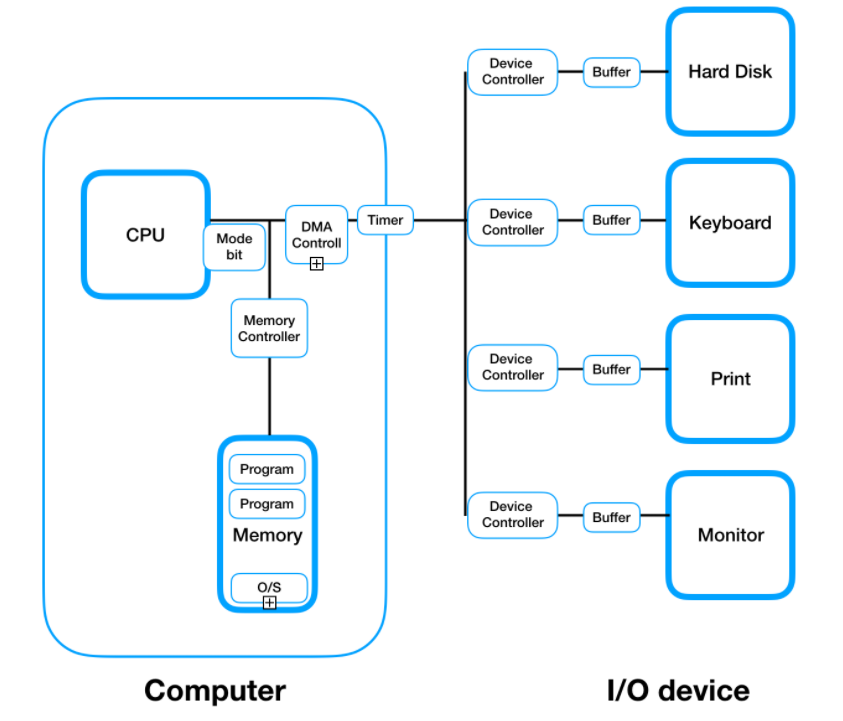

#   1 System Structure

* System Structure는 `CPU`, `Memory`, `DMA Controller`, `Timer,` `I/O device(controller, buffer)`로 구성되어 있다

# 2 CPU

## 2.1 CPU의 구성

* `register`, `interrupt line`, `mode bit` 등으로 구성되어 있다

## 2.2 mode bit

* 운영체제 코드를 실행중인지 사용자의 코드를 실행중인지 구별하기위해 사용되는 비트
* 사용자 모드와 커널 모드로 구분된다.
  * `1` : 사용자 모드
  * `0`: 커널(모니터, 시스템) 모드
* 사용자 프로그램의 잘못된 수행으로 다른 프로그램 및 운영체제에 피해가 가지 않도록 하기위한 보호 장치로 사용된다
  * 시스템의 해를 끼칠 수 있는 인스트럭션들은 커널 모드에서만 동작하게해서 운영체제를 보호한다.
  * 이러한 인스트럭션을 `privileged instructions`이라 한다.
  * 예) 유저 모드에서 커널 모드로 전환하는 인스트럭션, I/O 명령
* 사용자 모드에서 특권 명령이 실행되면 Exception이 발생하고 CPU가 운영체제로 넘어가며 운영체제가 적절한 조치를 취한다

## 2.3 Interrupt line

* CPU가  다음 인스트럭션을 실행하기 앞서 Interrupt line을 읽고 새로운 Interrupt이 들어왔는지 확인한다

**Interrupt**

* 하드웨어는 어느 순간이든 시스템 버스를 통해 CPU에 신호를 보낼 수 있다
* 이 신호를 Interrupt라고 부른다
* 소프트웨어는 시스템 콜이라 불리는 특별한 연산을 실행하여 Interrupt를 발생시킬 수 있다
* CPU가 Interrupt를 받으면 하던 일을 중단하고 즉시 고정된 위치로 실행을 옮긴다
* 일반적으로 고정된 위치는 해당 인터럽트를 처리하는 인터럽트 처리 루틴의 주소를 가리킨다
* 그리고 인터럽트 처리 루틴이 실행되고 완료되면 CPU는 인터럽트 된 연산을 재개한다

**Trap**

* 소프트웨어가 발생시킨 Interrupt를 특별히 Trap이라고 부른다
* Trap의 종류에는 Exception, System call이 있다
  * Exception: 프로그램이 오류를 범한 경우
  * System Call: 프로그램이 커널 함수를 호출하는 경우

**인터럽트 벡터**

* 인터럽트의 처리 루틴 주소를 가지고 있다
* 즉 발생한 인터럽트를 처리하는 인터럽트 처리 루틴의 코드 주소를 가리킨다

**인터럽트 처리 루틴**

* 인터럽트를 처리하는 커널 함수

## 2.4 registers

* program counter 등으로 구성되어있다
* program counter
  * 다음 실행한 인스트럭션의 메모리 주소를 저장한다

# 2 Timer

* 특정 프로세스가 CPU를 독점하는 것을 막기위해 사용되는 하드웨어
* 프로세스가 CPU에 할당될 때 타이머에 시간을 세팅되고 매 클락마다 시간이 줄어든다
* 시간을 다 쓰면 Timer가 인터럽트를 발생시키고 커널 모드로 전환되며 CPU 제어권이 운영체제로 넘어간다

# 3 Memory

* CPU는 실행할 인스트럭션을 오직 메모리에서만 가져올 수 있다. 따라서 어떤 프로그램이든 실행하기 위해선 메모리에 올라가야한다.
* 메모리는 휘발성 저장소로 전원이 꺼지면 모든 내용이 손실된다.

# 4 DMA Controller

* direct memory access controller
* 입출력 장치에서 바이트 단위로 인터럽트가 발생하면 CPU 너무 많은 인터럽트가 발생해 효율적이지 못하다. 이를 해결하기위해 DMA Controller가 사용된다.
* CPU의 중재없이 `device controller`가 device의 buffer storage의 내용을 메모리에 블록 단위로 전송한다
* DMA Controller는 블록 단위로 오직 한번만 인터럽트를 발생시킨다.

# 5 I/O device

## 5.1 device controller

* 해당 I/O device를 관리하는 일종의 **CPU**라고 보면 된다.
* 제어 정보를 위해 control register, status register를 가진다.
* 실제 I/O는 device와 local buffer 사이에서 일어난다.
* device controller는 I/O가 끝났을 때 **인터럽트**로 CPU에게 그 사실을 알린다.
* 예) 하드 디스크의 헤드를 어떻게 움직일지 관리하는 것은 CPU가 아니라 하드 디스크의 device controller가 관리한다.

## 5.2 device driver

* 소프트웨어
* device controller가 수행하는 코드가 아니라 CPU가 수행하는 코드이다
  * 예) CPU가 디스크에 입출력을 요청할 때 수행되는 코드

## 5.3 local buffer

* CPU의 작업 공간인 memory가 있듯이 **device controller**의 작업 공간인 **local buffer**가 존재한다.

참조

* https://core.ewha.ac.kr/publicview/C0101020140311132925816476?vmode=f 
