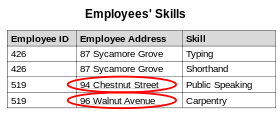
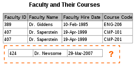
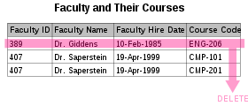

# 1 Database Normalization

* 데이터베이스 정규화는 데이터 중복을 줄이고 데이터 무결성을 향상시키기 위해 일련의 정규 양식에 따라 관계형 데이터베이스를 구성하는 과정이다. 
* 에드가 F에 의해 처음 제안되었다
* 정규화에는 데이터베이스의 Column과 table을 구성하여 데이터베이스 무결성 제약 조건에 의해 종속성이 적절하게 적용되도록 하는 작업이 수반됩니다. 
* 이것은 합성 과정(새 데이터베이스 설계 생성) 또는 분해 과정(기존 데이터베이스 설계 개선)에 의해 일부 공식 규칙을 적용함으로써 달성된다.

# 2 이상(anomaly)

* 정규화를 거치지 않은 데이터베이스에서 발생할 수 있는 현상
* 데이터들이 불필요하게 중복되어 릴레이션 조작에 예기치 못한 문제 발생

**이상의 원인**

* 이상은 속성들 간에 존재하는 여러 종류의 종속 관계를 하나의 릴레이션에 표현할 때 발생한다

## 2.1 Update anomaly

* 속성값 갱신 시 일부 튜플만 갱신되어 모순 발생

**예시**

* 직원의 스킬을 나타내는 릴레이션
* Employee ID, Employee Address, Skill 속성으로 구성됨
* 한 직원이 이사를 가서 주소가 변경됨
  * 96 Walnut Avenue -> 94 chestnut street
  * 따라서 아래 2개의 레코드의 주소를 모두 변경해야 한다
  * 만약 모두를 변경하지 않고 일부만 변경한 경우 해당 릴레이션은 일관성이 깨진 상태가 된다

## 2.2 Insertion anomaly

* 릴레이션에 새로운 레코드를 삽입할 수 없는 현상
* 데이터 삽입 시 의도와 다른 값들도 삽입됨

**예시**

* 교수와 자신의 수업을 나타내는 테이블이 있다
* Faculty ID, Faculty Name, Faculty Hire Date, Course Code의 속성을 가짐
* 만약 새롭게 임명된 교수는 현재 진행하는 수업이 없기 때문에 테이블에 삽입 할 수 없다
  * Course Code가 not null인 경우

## 2.3 Deletion anomaly

* 특정 데이터를 삭제할 때 삭제하지 말아야할 다른 데이터까지 삭제되는 현상
* 데이터 삭제 시 의도와 다른 값들도 연쇄 삭제됨

**예시**

* 교수와 자신의 수업을 나타내는 테이블이 있다
* Faculty ID, Faculty Name, Faculty Hire Date, Course Code의 속성을 가짐
  * Course Code는 not null
* 교수가 일시적으로 수업을 그만두는 경우 Course Code 속성만 null로 만들 수 없기 때문에 해당 레코드를 삭제해야한다
  * 교수의 수업 데이터만 삭제하고 싶은데 교수의 데이터까지 삭제되는 문제 발생

# 3 함수 종속(functional dependency)

* 데이터베이스의 릴레이션(relation)에서 두 개의 애트리뷰트(attribute) 집합 간 제약의 일종이다.
* 어떤 릴레이션 R에서, X와 Y를 각각 R의 애트리뷰트 집합의 부분 집합이라 하자. 
* 애트리뷰트 **X의 값 각각에 대해** 시간에 관계없이 항상 애트리뷰트 **Y의 값이 오직 하나만 연관**되어 있을 때 Y는 X에 함수 종속이라 한다 
* X → Y라고 표기한다
* X를 결정자(determinant set)이라 하고, Y를 종속자(dependent attribute)라고 한다

## 3.1 완전 함수 종속

* 종속자가 기본키에만 종속되며, 기본키가 여러 속성으로 구성되어 있을경우 기본키를 구성하는 모든 속성이 포함된 기본키의 부분집합에 종속된 경우

## 3.2 부분적 함수 종속

* 릴레이션에서 종속자가 기본키가 아닌 다른 속성에 종속되거나, 기본키가 여러 속성으로 구성되어 있을경우 기본키를 구성하는 속성 중 일부만 종속된 경우

## 3.3 이행적 함수 종속

* 릴레이션에서 X, Y, Z라는 3 개의 속성이 있을 때 X→Y, Y→Z 이란 종속 관계가 있을 경우, X→Z가 성립될 때 이행적 함수 종속이라고 합니다. 즉, X를 알면 Y를 알고 그를 통해 Z를 알 수 있는 경우

# 4 정규화

* 중복을 배제하여 삽입, 삭제, 갱신 이상의 발생을 방지
* 각 릴레이션에 중복된 종속성을 여러개의 릴레이션에 분할

## 4.1 1NF

* 릴레이션에 속한 모든 도메인이 원자값이어야 한다
* 원자값이란 단일 값을 의미한다. 따라서 다중 값을 갖으면 안된다

**1NF를 만족하지 않는 릴레이션**

| 수강과목 |      수강자      |
| :------: | :--------------: |
|   수학   |      홍길동      |
|   과학   | 임꺽정, 신사임당 |
|   사회   |  홍길동, 임꺽정  |

- 발생할 수 있는 이상(Anomaly)의 예
  - 갱신이상: 홍길동이 사회과목을 '역사'로 바꾸었다. 그럼 임꺽정이 듣고 있는 사회 과목도 바뀌어버린다.
    - UPDATE 과목 SET 수강과목 = '역사' WHERE 수강과목 = '사회' AND 수강자 = '홍길동'
  - 삭제 이상: 임꺽정이 '과학' 과목을 수강취소했다. 그럼 신사임당의 수강 정보도 삭제된다.
    - DELETE FROM 과목 WHERE 수강과목 = '과학' AND 수강자 = '임꺽정'

**1NF를 만족시키는 릴레이션**

* 가장 간단한 것은 원자값으로 분해해 튜플로 구분하고 다른 키를 추가하는 것이다.

| 수강과목 |  수강자  | 일련번호 |
| :------: | :------: | :------: |
|   수학   |  홍길동  |    1     |
|   과학   |  임꺽정  |    2     |
|   과학   | 신사임당 |    3     |
|   사회   |  홍길동  |    4     |
|   사회   |  임꺽정  |    5     |

## 4.2 2NF

* 2NF를 만족하려면 부분적 함수 종속을 제거해야 한다.
* 즉 완전 함수 종속이 되도록 해야 한다.

**2NF를 만족하지 않는 릴레이션**

| 학번 |   이름   | 소속학과 | 학과장 |
| :--: | :------: | :------: | :----: |
| 1901 |  홍길동  | 컴퓨터과 | 김교수 |
| 1845 |  임꺽정  |  전자과  | 박교수 |
| 1706 | 신사임당 |  기계과  | 천교수 |
| 1925 |  장영실  | 컴퓨터과 | 김교수 |

* 학번이 기본키(한 학과내의 이름은 중복되지 않는다고 가정)
* 부분적 함수 종속
  * 학번 -> 학과장
  * 소속학과 -> 학과장
  * 학과장이라는 종속자가 기본키(학번)가 아닌 다른 속성(소속학과)에 종속되므로 부분적 함수 종속이다
  * 즉 학과장이라는 속성이 이 릴레이션에 꼭 필요한 속성이 아니며 이 릴레이션에 있는 순간 '김교수'와 같이 계속 중복적재 될것이다.
* 발생할 수 있는 이상(Anomaly)의 예
  - 삽입이상: 컴퓨터과, 전자과, 기계과 학생을 추가하고자 할 경우 더이상 불필요한 중복정보인 학과장 정보가 삽입되야 한다.
  - 갱신이상: 컴퓨터과의 학과장이 변경되었다. 하나만 변경하면 모순이 발생하므로 다 찾아서 변경해야 한다.
  - 삭제이상: 신사임당이 자퇴해서 삭제하고자 한다. 이 삭제로 인해 기계과 학과장의 정보가 사라져버린다.

**2NF를 만족시키는 릴레이션**

* 아래와 같이 릴레이션을 구분하는 것이 바람직하다

| 학번 |   이름   | 소속학과 |
| :--: | :------: | :------: |
| 1901 |  홍길동  | 컴퓨터과 |
| 1845 |  임꺽정  |  전자과  |
| 1706 | 신사임당 |  기계과  |
| 1925 |  장영실  | 컴퓨터과 |

|   학과   | 학과장 |
| :------: | :----: |
| 컴퓨터과 | 김교수 |
|  전자과  | 박교수 |
|  기계과  | 천교수 |

## 4.3 3NF

* 3NF를 만족하려면 이행적 함수 종속을 제거해야 한다.

**3NF를 만족하지 않는 릴레이션**

| 학번 |   이름   | 소속학과 | 대학 |
| :--: | :------: | :------: | :--: |
| 1901 |  홍길동  | 컴퓨터과 | 공대 |
| 1845 |  임꺽정  |  전자과  | 공대 |
| 1706 | 신사임당 |   경제   | 경상 |
| 1925 |  장영실  |   경영   | 경상 |

* 이행적 함수 종속발생
  * 이름 -> 소속학과 종속 관계(한 학과내의 이름은 중복되지 않는다고 가정)
  * 소속학과 -> 대학 종속 관계
* 발생할 수 있는 이상(Anomaly)의 예
  - **삽입이상**: 컴퓨터과, 전자과 학생을 추가하고자 할 경우 더이상 불필요한 중복정보인 대학 정보가 삽입되어야 한다.
  - **갱신이상**: 컴퓨터과의 소속 대학이 'IT대학'으로 변경되었다. 하나만 변경하면 모순이 발생하므로 다 찾아서 변경해야 한다.
  - **삭제이상**: 홍길동이 자퇴해서 삭제하고자 한다. 이 삭제로 인해 컴퓨터과의 대학 정보가 사라져 버린다.

**3NF를 만족시키는 릴레이션**

| 학번 |   이름   | 소속학과 |
| :--: | :------: | :------: |
| 1901 |  홍길동  | 컴퓨터과 |
| 1845 |  임꺽정  |  전자과  |
| 1706 | 신사임당 |   경제   |
| 1925 |  장영실  |   경영   |

| 소속학과 | 대학 |
| :------: | :--: |
| 컴퓨터과 | 공대 |
|  전자과  | 공대 |
|   경제   | 경상 |
|   경영   | 경상 |

## 4.2 BCNF

* BCNF를 만족하려면 결정자이면서 후보키가 아닌 것을 제거해야 한다.

**BCNF를 만족하지 않는 릴레이션**

| 학번 |     과목     |  교수  |
| :--: | :----------: | :----: |
| 100  | 데이터베이스 | 홍길동 |
| 100  |   자료구조   | 임꺽정 |
| 200  |   네트워크   | 장영실 |
| 300  |   인공지능   | 유관순 |

- 제약사항
  - 한 학생은 동일한 과목에 대해 한교수에게만 수강가능
  - 각 교수는 하나의 과목만 담당
  - 한 과목은 여러 교수가 담당가능
- (학번 + 과목)은 교수를 결정 짓는다.
- 교수는 과목을 결정 짓는다.
- 즉, 교수 또한 결정자인데 교수는 학번을 결정 지을 수 없으므로 후보키는 아니다.
- 발생할 수 있는 이상(Anomaly)의 예
  - **삽입이상**: 200학생이 데이터베이스를 수강하고자 할 경우, 현재 불필요한 홍길동 교수 정보가 한번 더 삽입된다.
  - **갱신이상**: 홍길동의 담당 과목이 알고리즘으로 바뀌었다. 담당 과목을 변경할 경우, 학생의 수강 과목이 변경되어 버린다.
  - **삭제이상**: 300학생이 자퇴해서 삭제하고자 한다. 이 삭제로 인해 인공지능 과목을 유관순 교수가 담당하고 있다는 정보가 사라진다.

**BCNF를 만족시키는 릴레이션**

| 학번 | 과목코드 |
| :--: | :------: |
| 100  |   DB01   |
| 100  |   DS01   |
| 200  |   NW01   |
| 300  |   AI01   |

| 과목코드 |     과목     |  교수  |
| :------: | :----------: | :----: |
|   DB01   | 데이터베이스 | 홍길동 |
|   DS01   |   자료구조   | 임꺽정 |
|   NW01   |   네트워크   | 장영실 |
|   AI01   |   인공지능   | 유관순 |

참고

* https://itwiki.kr/w/%EB%8D%B0%EC%9D%B4%ED%84%B0%EB%B2%A0%EC%9D%B4%EC%8A%A4_%EC%A0%95%EA%B7%9C%ED%99%94