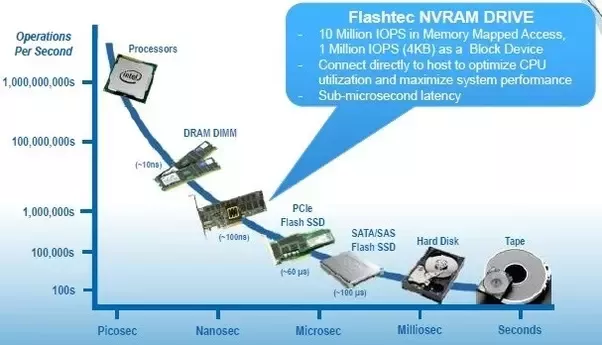
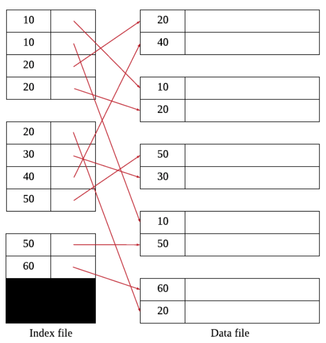
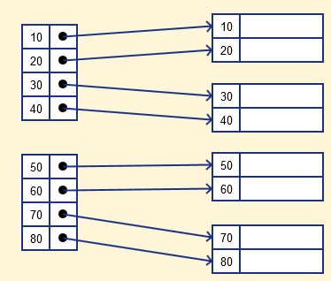
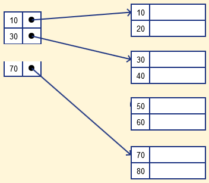

# 1 Index

* 인덱스는 조회 성능을 향상 시킬 수 있는 자료구조이다.
	* 데이터의 저장 성능을 희생하고 그 대신 데이터의 읽기 속도를 높인다
	* 인덱스 자료구조를 관리하기 위한 추가적인 저장 공간(인덱스 파일)을 소비한다.
* 인덱스는 하나 이상의 컬럼을 이용하여 생성할 수 있다
* 인덱스는 데이터 파일과는 별도의 파일에 저장한다.
* 인덱스 파일은 일반적으로 데이터 파일에 비하면 훨씬 작다
* 하나의 데이터 파일에 여러개의 인덱스를 정의할 수 있다.

 

## 1.1 Disk Structure

- 인덱스는 자료구조를 이용해 디스크 접근 횟수를 줄여 조회 성능을 최적화한다.
- 최근에는 하드 디스크보다 SSD 드라이브가 많이 활용되고 있지만, 여전히 데이터 저장 매체는 컴퓨터에서 가장 느린 부분이다.
- 따라서 데이터베이스의 성능 튜닝은 어떻게 디스크 I/O를 줄이느냐가 관건이다.
- [Mass-Storage-Structure.md](../../Computer-Science/OS/Mass-Storage-Structure/Mass-Storage-Structure.md) 디스크의 구조 참고

 

**주요 장치의 초당 처리 횟수**

 

## 1.2 Entry

* 인덱스 파일은 인덱스 엔트리라고 불리는 레코드를 가지고있다
* 인덱스 엔트리는 <탐색 키, 포인터>의 구조를 가지고 있다
	* 탐색 키: 레코드를 찾고자 할 때 사용되는 애트리뷰트의 집합이다.
	* 포인터: 데이터의 위치

 

## 1.3 인덱스의 장점과 단점

**장점**

* 검색 속도가 향상된다.

**단점**

* 인덱스를 저장하기위한 공간이 추가적으로 필요하다.
* 삽입, 삭제, 수정 연산의 속도가 저하된다.
	* 따라서 인덱스를 하나 더 추가할지 말지는 데이터의 저장 속도를 어디까지 희생할 수 있는지에 따라 결정된다.
	* WHERE 절에 사용되는 컬럼이라고 전부 인덱스를 생성하면 데이터 저장 성능이 떨어지고 인덱스의 크기가 비대해져 오히려 역효과가 날 수 있다.

 

## 1.4 인덱스 적용 지침

1. 기본 키는 클러스터링 인덱스를 정의할 훌륭한 후보
2. 외래 키도 인덱스를 정의할 중요한 후보
3. 한 애트리뷰트에 들어있는 상이한 값들의 개수가 거의 전체 레코드 수와 비슷하고 그 애트리뷰트가 동등 조건에 사용된다면 비클러스터링 인덱스를 생성하는 것이 좋음
4. 튜플이 많이 들어 있는 릴레이션에서 대부분의 질의가 검색하는 튜플이 2%~4% 미만인 경우에는 인덱스를 생성
5. 자주 갱신되는 애트리뷰트에는 인덱스를 정의하지 않는 것이 좋다.
6. 갱신이 빈번하게 이루어지는 릴레이션에는 인덱스를 많이 만드는 것을 피한다.
7. 대량의 데이터를 삽입할 때는 인덱스를 제거하고 데이터 삽입이 끝난 후에 다시 생성하는 것이 좋다.
8. ORDER BY, GROUP BY 절에 자주 사용되는 애트리뷰트는 인덱스를 정의할 후보

 

# 3 Single-level Indexing

* Index는 보는 관점에 따라 여러 종류의 Index가 존재한다
* Single-level Indexing 관점에서는 Primary indexing과 Secondary Indexing로 나누어진다

## 3.1 Primary indexing

* data file의 기본키로 생성된 인덱스를 Primary indexing이라고 한다
* data file은 이미 기본키를 기준으로 정렬되어 있다
* 따라서 엔트리의 구조는 아래와 같다
	* <기본키, 데이터위치>

 

## 3.2 Secondary Indexing

* non-clustering Index라고도 한다
* 인덱스의 탐색 키 값에 따라 **데이터 파일이 정렬되어 있는 않은 경우**를 말한다.
* Secondary Indexing는 Dense index를 사용한다
	* Data file이 탐색키에 따라 정렬되어 있지 않기 때문에 Sprase Index를 사용할 수 없다
* 보조 인덱스는 일반적으로 밀집 인덱스이므로 같은 수의 레코드들을 접근할 때 보조 인덱스를 통하면 기본 인덱스를 통하는 경유보다 디스크 접근 횟수가 증가 할 수 있다.
* 레코드를 순서대로 탐색할 때 비효율적이다

 

# 4 Dense & Sparce Index

* Index는 보는 관점에 따라 여러 종류의 Index가 존재한다
* 인덱스의 데이터 파일 참조의 횟수 관점에서 Dense Index와 Sparse Index 두 종류가 존재한다
* 데이터 파일이 탐색키를 기준으로 정렬되어 있다면 Dense Index와 Sparse Index 모두 적용할 수 있다
* 만약 데이터 파일이 탐색키를 기준으로 정렬되어 있지 않다면 Dense Index만 적용할 수 있다

 

## 4.1 Dense Index

* Dense Index는 데이터 파일의 모든 레코드에 대해 일대일로 엔트리가 만들어진다
* 따라서 Dense Index는 데이터 파일의 레코드 수만큼 엔트리를 가지고 있다

 

## 4.2 Sparse Index

* 데이터 파일을 블록 단위로 자르고 각각 블록의 첫 번째 레코드(Anchor record)를 가리키는 엔트리를 만든다
* 블록의 첫 번째 레코드를 Anchor record 또는 Block anchor라고 부른다
* 데이터 파일이 기본키로 이미 정렬되어 있기 때문에 엔트리는 정확한 데이터의 위치를 가리키는 것이 아니라 데이터가 속한 블록의 위치를 가리킨다
	* 실제 데이터를 찾기 위해서는 블록안에서 레코드를 하나씩 조회
	* 따라서 dense Index와 비교하면 조회 성능이 좋지 않다
* Sparse Index는 데이터 파일의 레코드 수보다 적은 엔트리를 가지고 있다
* dense Index와 비교하여 인덱스 파일의 크기가 작다

 

# 5 Clustered and non-clustered indexes

* Index는 보는 관점에 따라 여러 종류의 Index가 존재한다
* Data File의 정렬 관점에서 Clustered Index와 non-clustered Index가 존재한다

> Clustered and non-clustered indexes 참고
>
> https://www.ibm.com/docs/en/ias?topic=indexes-clustered-non-clustered

## 5.1 Clustered Index

* 데이터 파일의 레코드의 순서와 인덱스의 엔트리와 일치하는 인덱스를 Clustered Index라고 한다
* 즉 인덱스의 탐색키를 기준으로 데이터 파일이 정렬되어 있다는 것
	* 따라서 하나의 데이터 파일에는 하나의 Clustered Index만 존재할 수 있다
	* 다른 탐색키를 기준으로 하면 데이터 파일이 정렬된 상태가 아니기 때문
* 데이터 파일의 레코드는 삽입 순서대로 저장되는 것으로 생각하지만 실제로 그렇지 않다.
	* 레코드를 전혀 삭제하지 않거나 변경하지 않고 삽입만 했다면 그럴 수 있다.
	* 하지만 레코드를 삭제하여 빈 공간이 생기면 그 다음의 삽입은 가능한 삭제된 공간을 사용하도록 DBMS를 설계하기 때문이다.
* 대부분의 RDBMS는 데이터 파일이 정렬되어 있지 않다.
	* InnoDB 테이블에서 레코드는 기본적으로 프라이머리 키 순서로 정렬되어 저장된다.

 

## 5.2 non-clustered Index

* 데이터 파일의 레코드의 순서와 인덱스의 엔트리와 일치하는 않는 인덱스를 non-clustered Index라고 한다
* Clustered Index와 달리 한 데이터 파일에 여러개의 non-clustered Index를 생성할 수 있다

 

# 6 구현 알고리즘

* 대표적으로 B-Tree와 Hash 자료구조를 이용해 구현한다

 

## 6.1 B-Tree

* 가장 일반적으로 사용되는 인덱스 알고리즘
* 칼럼의 값을 변형하지 않고 원래의 값을 이용해 인덱싱하는 알고리즘

 

## 6.2 B+Tree

* B-Tree를 개선시킨 자료구조이다.
* B-Tree의 모든 노드에 존재하는 Key마다 Record Pointer를 가지고 있다
	* B+Tree는 리프 노드만 Key마다 Record Pointer를 가지고 있다
* 리프노드들은 LinkedList로 연결되어 있다.
* BTree의 리프노드들을 LinkedList로 연결하여 순차검색을 용이하게 하는 등 BTree를 인덱스에 맞게 최적화하였다

 

## 6.3 `B*Tree`

## 6.4 Hash Table

* Hash Table은 키와 값을 쌍으로 저장할 수 있는 자료구조
	* Key: 탐색키
	* Value: 데이터의 위치
	* 탐색키의 값으로 해시값을 계산해서 데이터의 위치를 찾는다

 

**장점**

* 해시 테이블의 가장 큰 특징은 대부분의 연산이 분할 상환 분석에 따른 시간 복잡도가 O(1)이라는 점이다
* WHERE 조건의 등호(=) 연산에는 효율이 좋다

**단점**

* 값을 변경해서 인덱싱하므로 Prefix 일치와 같이 값의 일부만 검색하거나 범위를 검색할 때는 해시 인덱스를 사용할 수 없다
* 부등호 연산(>, <)은 부적합

 

# 7 파일 조직

## 7.1 힙 파일

* 레코드들이 삽입된 순서대로 파일에 저장됨
* 삽입: 새로 삽입되는 레코드는 파일 가장 끝에 추가됨
* 검색: 레코드를 찾기 위해서는 모든 레코드들은 순차적으로 접근해야함
* 삭제 : 원하는 레코드를 찾은 후 그 레코드를 삭제하고 삭제된 레코드가 차지하던 공간을 재사용하지 않음
* 좋은 성능을 위해 힙 파일을 주기적으로 재조직 해야한다.

| 연산             | 시간   |
| ---------------- | ------ |
| 삽입             | 효율   |
| 삭제             | 비효율 |
| 탐색             | 비효율 |
| 순서대로 탐색    | 비효율 |
| 특정 레코드 탐색 | 비효율 |

## 7.2 순차 파일

* 레코드들이 하나 이상의 필드 값에 따라 순서대로 저장된 파일
* 레코드들이 탐색 키 값의 순서에 따라 저장된다.
* 탐색 키는 순차 파일을 정렬하는데 사용되는 필드를 의미한다.
* 삽입시 레코드 순서를 고려 시간이 많이 소요된다
* 삭제시 레코드가 사용하던 공간이 빈공간으로 남아 주기적인 재조직이 필요하다

| 연산                               | 시간   |
| ---------------------------------- | ------ |
| 삽입                               | 비효율 |
| 삭제                               | 비효율 |
| 탐색키를 기반으로 검색             | 효율   |
| 탐색키가 아닌 필드를 사용하여 탐색 | 비효율 |

참고

* https://www.youtube.com/watch?v=aZjYr87r1b8
* https://tecoble.techcourse.co.kr/post/2021-09-18-db-index/
* http://www.kocw.net/home/search/kemView.do?kemId=1154374
* http://www.kocw.net/home/search/kemView.do?kemId=1173887
* http://www.kocw.net/home/search/kemView.do?kemId=1064626
* https://www.geeksforgeeks.org/primary-indexing-in-databases/#:~:text=Primary%20indexing%20is%20defined%20mainly,fixed%20length%20with%20two%20fields.
* https://www.guru99.com/indexing-in-database.html