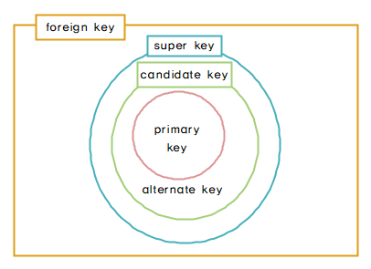
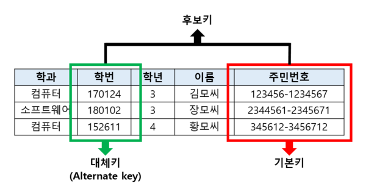
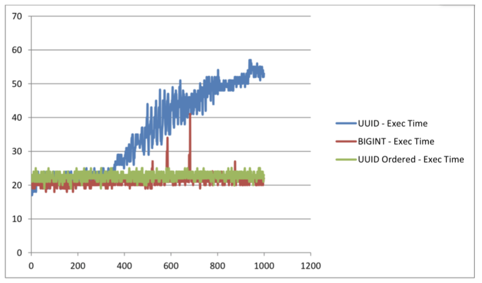
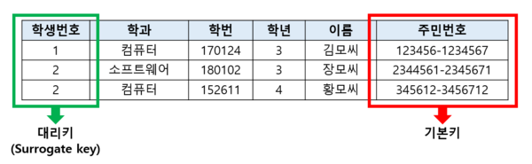

# 1 Key

* 키(key)는 데이터베이스에서 조건에 만족하는 튜플을 찾거나 순서대로 정렬할 때 튜플들을 서로 구분할 수 있는 기준이 되는 속성을 말한다. 
* 키의 종류로는 기본키(Priamry), 후보키(Candidate Key), 대체키(Alternate Key), 수퍼키(Super Key), 외래키(Foreign Key)가 있다.

 

# 2 후보키(Candidate key)

* 후보키는 기본키가 될 수 있는 후보들이다
* 후보키는 **유일성**과 **최소성**을 만족하는 속성 또는 속성들의 집합이다
* 유일성
	* 키값으로 하나의 튜플을 유일하게 구별할 수 있어야한다.
* 최소성
	* 모든 레코드들을 유일하게 식별하는데 꼭 필요한 속성만으로 구성되어 있어야 한다.
	* 즉 하나의 속성이 없어도 유일성을 만족한다면 이 속성은 제거해야한다.
* 수퍼키 중에서 최소성을 만족하는 것이 후보키가 된다.
* 후보키가 되기 위해 만족해야 하는 유일성과 최소성의 특성은 새로운 튜플이 삽입되거나 기존 튜플의 속성값이 바뀌어도 유지되어야 한다.

> 후보키 참고
>
> http://wiki.hash.kr/index.php/%ED%9B%84%EB%B3%B4%ED%82%A4

 

# 3 기본키(Primary Key)

* 주 키 또는 프라이머리 키라고 한다.
* 후보키 중에서 특별히 선정된 키로 중복된 값을 가질 수 없으며, 후보키의 성질을 갖는다. 
	* 즉, 유일성과 최소성을 가지며 튜플을 식별하기 위해 반드시 필요한 키이다. 
* 기본키는 Null 값을 가질 수 없기 때문에 튜플에서 기본 키로 설정된 속성에 Null 값이 있어서는 안 된다.
* 테이블당 하나만 만들 수 있다

 

**기본키 선정 팁**

* 속성 값이 변경될 가능성이 높은 속성은 기본키로 선정하지 않는게 좋다
* 가능하면 작은 정수 값이나 짧은 문자열을 가지는 속성을 기본키로 선정하는게 좋은데 많은 데이터 중 빠르게 검색하기 위함이다
* 복합 기본키는 피하는 것이 좋으며 기본키가 없는 테이블이 규칙에 어긋나는 것은 아니지만 모든 테이블에 기본키를 두는 것이 좋다. 
	* 테이블에 기본키가 없으면 반복적이고 일관성이 없는 데이터들이 쌓여 자신이 원하는 데이터를 추출하기 위해 명령을 내렸을 때 이를 수행하는 속도가 느릴 수 있고 다양한 문제를 일을킬 가능성이 있기 때문이다. 

> 기본키 참고
>
> http://wiki.hash.kr/index.php/%EA%B8%B0%EB%B3%B8%ED%82%A4

 

# 4 외래키(Foreign Key)

* 외래키란 하나(또는 여러개)의 다른 릴레이션의 기본키 필드를 참조하는 데이터의 참조 무결성을 확인하기 위해 사용되는 키를 의미한다.
* 외래키는 한 릴레이션을 다른 릴레이션과 연결해주는 역할을 한다.
	* 즉, 외래키는 하나의 릴레이션을 다른 릴레이션에 의존하게 만든다.
* 외래키를 설정할 때, 참조되는 릴레이션의 필드는 반드시 UNIQUE나 PRIMARY KEY 제약 조건이 설정되어 있어야 한다.

 

**외래키 특징**

* 참조하고(외래키) 참조되는(기본키) 양쪽 릴레이션의 도메인은 서로 같아야 한다.
* 참조되는 값이 변경되면 참조하는 값도 변경된다
* NULL값과 중복 값이 허용된다
* 자기 자신의 기본키(PK)를 참조하는 외래키도 가능하다. 
* 외래키가 기본키의 일부가 될 수 있다.

> 외래키 참고
>
> http://wiki.hash.kr/index.php/%EC%99%B8%EB%9E%98%ED%82%A4

 

# 5 슈퍼키(Super key)

* 릴레이션에 존재하는 필드들의 부분집합으로서, 유일성을 만족해야 한다.
* 후보키와의 차이점으로 유일성과 최소성이 있는데, 수퍼키는 유일성은 만족하지만, 최소성을 만족하지 못한다.

> 슈퍼키 참고
>
> http://wiki.hash.kr/index.php/%EC%88%98%ED%8D%BC%ED%82%A4

 

# 6 대체키(Alternate key)

* 후보키 중에서 기본키로 선택되지않고 남은 키를 의미한다. 
* 보조키라고도 불린다.

> 대체키 참고
>
> http://wiki.hash.kr/index.php/%EB%8C%80%EC%B2%B4%ED%82%A4

 

## 6.1 대체키 언제 사용할까?

* 시스템 내부에서 튜플의 식별자는 대리키(숫자)를 사용하고 보안을 강화하기 위해 외부에 오픈하여 사용할 때에는 String 기반의 대체키를 사용하는 방법이 있다.

 

**random string 대체키의 성능**

* MySQL 기준 1천만건 이상으로 넘어가기 전까지 random string으로 사용해도 조회 성능에 크게 이슈가 없다
* 성능을 고려한다면 UUID를 수정해서 사용하는 것을 검토해보자
	* https://www.percona.com/blog/2014/12/19/store-uuid-optimized-way/

 

**대체키 사용 예시**

> 2020년 5월 특정 서비스에서 Bigint 형태의 유저 아이디를 URL PATH로 사용하여 유저의 거래내역을 노출하는 GET API가 있었다. 이런 경우 인증 과정이 없다면 URL의 숫자만 조작하면 다른 이의 거래 내역을 쉽게 볼 수 있게 된다. 이슈 이후 랜덤 스트링 형태의 대체키로 변환하여 API를 수정하였다

> 외부 협력사와 자사 서비스 간에 상품 데이터 연동 과정에서 키 값을 시스템 내부의 PK로 사용하면 양사간의 데이터는 자사 시스템 내부의 PK로 강하게 묶이게 된다. 이후 자사 시스템에서 데이터베이스를 MySQL에서 MongoDB 등으로 변경하면 달라진 PK 체계로 인해 많은 공수가 발생한다.

 

# 7 대리키(Surrogate Key)

* 기본키가 보안을 필요로 하는 속성을 가지고 있거나, 여러 개의 속성으로 구성되어 있어 복잡하거나, 기본키로 사용할 속성이 없을 경우에 일련번호 같은 가상의 속성을 생성하여 기본키로 사용하는 키이다
* 대리키의 값은 보통 숫자를 사용하며, 주로 런타임으로 레코드가 테이블에 삽입되기 전에 만들어진다. 
* 대리키의 값은 다른 컬럼들과 연관성은 전혀 없다.
* 기본키가 여러 속성으로 구성된 경우에는 데이터를 수정하거나 검색할 때 수행 속도가 떨어질 수 있는데 대리키는 이를 해결해준다.

 

## 7.1 대리키를 사용하는 이유

**기본키의 저장 공간을 줄여서 성능을 향상시키기 위해 사용된다.** 

* 기본키의 데이터 길이가 너무 길거나 여러 개의 속성으로 구성되어 있는 경우 기본키를 이용하여 처리할 때 기본키를 읽어드리는데 많은 시간이 소요된다.
* 이로인해 성능의 효율이 떨어지는데 대리키를 이용함으로써 식별자를 단순하게 바꿔 처리 시간을 단축시킬 수 있어 성능이 향상된다.

 

**중요한 데이터를 대체하여 보안의 이득을 얻기 위해 사용된다.** 

* 사용자의 주민번호나 아이디 등 개인정보는 식별자로써 사용하기에 좋지만, 중요한 정보이기 때문에 직접적으로 사용하는데에 위험요소들이 따른다. 
* 이와 같은 경우 중요한 데이터의 식별자를 대신으로 대리키를 사용한다면 개인정보 노출의 위험으로부터 좀 더 안전해질 수 있다.

 

**데이터 변경에 영향을 덜 받기 위해 사용한다**

* 식별자 속성 중 일부 데이터가 변경되면 이로인해 영향을 받는 다른 데이터들을 모두 일일이 변경해줘야하는 수고가 따르게 된다. 
* 하지만 대리키를 사용한다면 대리키에 대한 정보만 변경하면 된다

 

## 7.2 단점

**데이터베이스의 쿼리문이 복잡해진다**

* 기본키는 처리시 필요한 데이터를 직접적으로 갖고 있지만 대리키는 사실상 데이터와 연관이 없는 값이나 마찬가지다. 
* 그렇기 때문에 간단한 처리를 해야할 경우에도 조인(Join)을 사용해야되기 때문에 쿼리문이 복잡해진다.

 

## 7.3 예시

속성 중 '주민번호'를 기본키로 사용하면 데이터의 길이가 길기 때문에 처리시 처리시간이 길어져 성능이 떨어진다. 또한 주민번호 속성은 개인정보이기 때문에 유출의 위험이 있어서는 안된다. 이를 해결하기 위해 '학생번호' 속성을 임의로 생성하여 대리키로 사용한다.

> 대리키 참고
>
> http://wiki.hash.kr/index.php/%EB%8C%80%EB%A6%AC%ED%82%A4

참고

* https://fastcampus.co.kr/dev_red_lhc