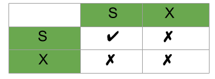

# 1 Optimistic Locking

* 기본적으로 각 트랜잭션이 같은 레코드를 변경할 가능성이 희박할 것이라고 가정한다
* 따라서 우선 변경 작업을 수행하고 마지막에 잠금 충돌이 있었는지 확인해 문제가 있다면 ROLLBACK 처리한다

# 2 Pessimistic Locking

* 현재 변경하고자 하는 레코드를 다른 트랜잭션에서 변경할 수 있다고 가정한다
* 따라서 현재 트랜잭션에서 변경하고자 하는 레코드에 대해 잠금을 획득하고 변경 작업을 처리한다
* 일반적으로 높은 동시성 처리에는 비관적 잠금이 유리하다고 알려져있다
  * InnoDB는 비관적 잠금 방식을 채댁했다

# 3 Shared Lock & Exclusive Lock

## 3.1 Shared Lock

* Shared Lock을 사용하면 데이터 읽기만 가능하다
* Shared Lock은 Read Lock이라고도 불린다
* Shared Lock은 read integrity를 보장한다
  * 한 레코드를 읽고 있을 동안 레코드가 업데이트 되지 않음을 보장한다

**예시**

예를 들어 A=100이라고 했을 때 A를 읽고 있는 두 개의 트랜잭션이 있다고 가정해보자. 만약 한 트랜잭션에서 A를 업데이트 하려고 한다면  Shared lock이 다른 트랜잭션이 읽기를 끝내지 않는 이상 업데이트를 막는다

## 3.2 Exclusive Lock

* Exclusive Lock을 사용하면 데이터를 읽고 쓸 수 있다
* Exclusive Lock은 write lock이라고도 불린다
* 한 아이템에 Exclusive Lock이 걸리면 종류와 상관없이 또 다른 Lock이 걸리는 것을 막는다
* 따라서 한 아이템의 Exclusive Lock은 한 시점에 오직 하나의 트랜잭션만 소유하고 있다 

## 3.3 Lock Compatibility Matrix

* 트랜잭션1이 아이템 A에 대해서 Shared Lock을 가지고 있을 때
  * 트랜잭션2가 아이템 A에 대해서 Shared Lock을 획득할 수 있다
  * 트랜잭션2가 아이템 A에 대해서 Exclusive Lock을 획득할 수 없다
* 트랜잭션1이 아이템 A에 대해서 Exclusive Lock을 가지고 있을 때
  * 트랜잭션2가 아이템 A에 대해서 Shared Lock을 획득할 수 없다
  * 트랜잭션2가 아이템 A에 대해서 Exclusive Lock을 획득할 수 없다

## 3.4 Shared Lock과 Exclusive Lock 비교

* Shared Lock은 읽기 전용이고 Exclusive Lock은 읽기 쓰기 모두 가능하다
* Shared Lock은 아이템이 업데이트 되는 것을 막고 Exclusive Lock은 아이템을 읽거나 업데이트하는 것을 막는다
* Shared Lock은  Exclusive Lock을 가지고 있지 않은 아이템을 읽고 싶을 때 획득하고 Exclusive Lock은 Lock이 걸리지 않은 아이템을 업데이트할 때 획득해야한다
* 한 아이템에 대해 여러 트랜잭션이 Shared Lock을 가질수 있는 반면 Exclusive Lock은 오직 한 트랜잭션만 가질 수 있다

관련 자료

* [Difference between Shared Lock and Exclusive Lock - geeksforgeeks](https://www.geeksforgeeks.org/difference-between-shared-lock-and-exclusive-lock/)
