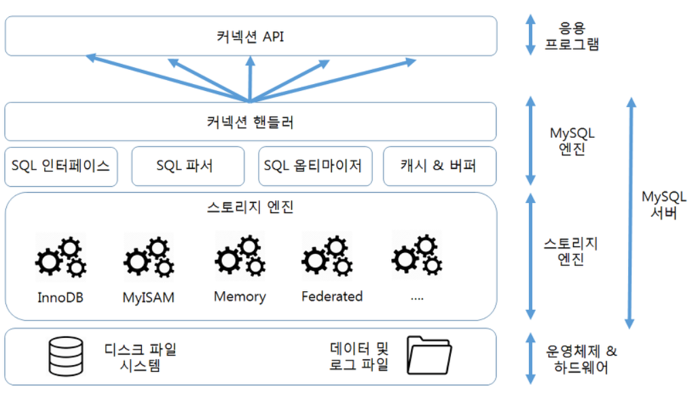

# 1 Architecture



[이미지 출처](https://user-images.githubusercontent.com/43127088/108531720-5bb71080-731a-11eb-8b51-288f49a4a600.PNG)

* MySQL 서버는 크게 **MySQL 엔진**과 **스토리지 엔진**으로 구분된다


# 2 MySQL 엔진 아키텍처

* 클라이언트로부터 접속 및 쿼리 요청을 처리하는 **커넥션 핸들러**와 **SQL 파서 및 전처리기** 그리고 쿼리의 최적화된 실행을 위한 **옵티마이저**가 중심을 이룬다
* 실질적인 GROUP BY나 ORDER BY 등 많은 복잡한 처리는 스토리지 엔진 영역이 아니라 MySQL 엔진의 처리 영역인 **쿼리 실행기**에서 처리된다

 

## 2.1 파서

* 사용자 요청으로 들어온 쿼리 문장을 토큰(MySQL이 인식할 수 있는 최소 단위의 어휘나 기호)으로 분리해 트리 형태의 구조로 만들어 내는 작업을 의미한다. 
* 쿼리문장의 기본 문법 오류는 이 과정에서 발견되며 사용자에게 오류 메시지를 전달하게 된다.


## 2.2 전처리기

* 파서 과정에서 만들어진 파서 트리를 기반으로 쿼리 문장에 구조적인 문제점이 있는지 확인한다. 
* 각 토큰을 테이블 이름이나 칼럼 이름 또는 내장 함수와 같은 개체를 매핑에 해당 객체의 존재 여부와 객체의 접근권한 등을 확인하는 과정을 이 단계에서 수행한다. 
* 존재 하지 않거나 권한상 사용할 수 없는 개체의 토큰은 이 단계에서 걸러진다.


## 2.3 옵티마이저

* 사용자의 요청으로 들어온 쿼리 문장을 저렴한 비용으로 가장 빠르게 처리할지 결정하는 역할을 한다.
* 옵티마이저가 더 나은 선택을 할 수 있게 유도하는 것이 아주 중요하다


## 2.4 실행엔진

* 실행 엔진은 만들어진 계획대로 각 핸들러에게 요청해서 받은 결과를 또 다른 핸들러 요청의 입력으로 연결하는 역할을 수행한다.


**예시**

* 옵티마이저가 GROUP BY를 처리하기 위해 임시 테이블을 사용하기로 결정했다고 가정했을때,

1. 실행 엔진은 핸들러에게 임시 테이블을 만들라고 요청
2. 다시 실행 엔진은 WHERE 절에 일치하는 레코드를 읽어오라고 핸들러에 요청
3. 읽어온 레크코들을 1번에서 준비한 임시 테이블에 저장하라고 다시 핸들러에 요청
4. 데이터가 준비된 임시 테이블에서 필요한 방식으로 데이터를 읽어 오라고 핸들러에게 다시 요청
5. 최종적으로 실행 엔진은 결과를 사용자나 다른 모듈로 넘긴다

* ex) 실행엔진이 핸들러에게 `테이블을 만들어`, `WHERE 절에 일치하는 레코드 읽어와`, `읽어온 레코드들 임시 테이블로 저장해`등을 요청하고 최종적으로 실행 엔진은 결과를 사용자나 다른 모듈에게 넘긴다.


# 3 스토리지 엔진

* MySQL 엔진은 요청된 SQL 문장을 분석하거나 최적화하는등 DBMS의 두뇌에 해당하는 처리를 수행하고 실제 데이터를 디스크 스토리지에 저장하거나 데이터를 읽어오는 부분은 스토리지 엔진이 담당한다
* MySQL 엔진은 하나지만 여러 스토리지 엔진을 동시에 사용할 수 있다
* 아래와 같이 테이블이 사용할 스토리지 엔진을 지정하면 이후 테이블의 모든 읽기 작업이나 변경 작업은 정의된 스토리지 엔진이 처리한다.
  * `mysql > CREATE TABLE test_table (fd1 IT, fd2 INT) ENGINE = INNODB;`


## 3.1 핸들러 API

* MySQL 엔진의 쿼리 실행기에서 데이터를 쓰거나 읽어야 할 때는 각 스토리지 엔진에게 쓰기 또는 읽기를 요청하는데,
* 이러한 요청을 핸들러(Handler) 요청이라고 하고, 여기서 사용되는 API를 핸들러 API라고 한다.

```sql
"SHOW GLOBAl STATUS LIKE 'Handler%';"
```

* 위 명령으로 이 핸들러 API를 통해 얼마나 많은 데이터(레코드) 작업이 있엇는지 확인가능하다.


## 3.2 핸들러

* 핸들러는 MySQL 서버의 가장 밑단에서 실행 엔진의 요청에 따라 데이터를 디스크로 저장하고 읽어오는 역할을 담당한다
* **핸들러가 결국 스토리지 엔진을 의미한다**


# 4 MySQL 스레딩 구조

* MySQL은 프로세스 기반이 아니라 스레드 기반으로 작동하며, 크게 포그라운드 스레드와 백그라운드 스레드로 구분할 수 있다.


## 4.1 포그라운드 스레드

* 포그라운드 스레드는 최소한 MySQL 서버에 접속된 클라이언트의 수만큼 존재한다
* 주로 각 클라이언트 사용자가 요청하는 쿼리 문장을 처리하는 것이 임무다.
* 사용자가 작업을 마치고 커넥션을 종료하면, 해당 커넥션을 담당하던 스레드는 다시 스레드 캐시(Thread pool)로 되돌아간다. 
* 이때 이미 스레드 캐시에 일정 개수 이상의 대기 중인 스레드가 있으면 스레드 캐시에 넣지 않고 스레드를 종료시켜 일정 개수의 스레드만 스레드 캐시에 존재하게 한다.
* 이렇게 스레드의 개수를 일정하게 유지하게 만들어주는 파라미터가 `thread_cache_size`다. 
* InnoDB 테이블은 데이터 버퍼나 캐시까지만 포그라운드 스레드가 처리하고, 나머지 버퍼로부터 디스크까지 기록하는 작업은 백그라운드 스레드가 처리한다.


## 4.2 백그라운드 스레드

* 인서트 버퍼를 병합하는 스레드 로그를 디스크로 기록하는 스레드, InnoDB 버퍼 풀의 데이터를 디스크에 기록하는 스레드, 데이터를 버퍼로 읽어들이는 스레드, 그리고 기타 여러 가지 잠금이나 데드락을 모니터링 하는 스레드가 있다.
* 이러한 모든 스레드를 총괄하는 메인 스레드도 있다.
* 가장 중요한 것은 로그 스레드(Log thread)와 버퍼의 데이터를 디스크로 내려쓰는 작업을처리하는 쓰기 쓰레드 일 것이다.
* 쓰기 스레드의 개수 지정: `innodb_write_io_threads` 
* 읽기 스레드의 개수 지정: `innodb_read_io_threads`


# 5 InnoDB 스토리지 엔진 아키텍처

* InnoDB는 MySQL에서 사용할 수 있는 스토리지 엔진 중 거의 유일하게 레코드 기반 잠금을 제공한다
* 따라서 높은 동시성 처리가 가능하고 안정적이며 성능이 뛰어나다


## 5.1 프라이머리 키에 의한 클러스터링

* InnoDB의 모든 테이블은 기본적으로 프라이머리 키를 기준으로 클러스터링되어 저장된다
  * 즉 프라이머리 키 값의 순서대로 디스크에 저장된다
* 프라이머리 키가 클러스터링 인덱스이기 때문에 프라이머리 키를 이용한 레인지 스캔은 상당히 빠르게 처리된다
* 결과적으로 쿼리의 실행 계획에서 프라이머리 키는 기본적으로 다른 보조 인덱스에 비해 비중이 높게 설정된다
  * 쿼리의 실행 계획에서 다른 보조 인덱스보다 프라이머리 키가 선택될 학률이 높음


## 5.2 MVCC

* Mulit Version Concurrency Control
* 레코드 레벨의 트랙잭션을 지원하는 DBMS가 제공하는 기능
* MVCC 목적은 잠금을 사용하지 않는 일관된 읽기는 제공하는 것에 있다
  * 언두 로그를 이용해 이러한 이 기능을 제공한다
* 멀티 버전은 하나의 레코드에 대해 여러 개의 버전이 동시에 관리된다는 의미이다


**MVCC 예시**

* UPDATE 쿼리가 실행되면 InnoDB 버퍼 풀에 새로운 데이터로 변경된다
* 기존 데이터는 언두 영역으로 복사된다
  * InnoDB 버퍼 풀과 언두 영역은 메모리에 있으며 InnoDB 버퍼 풀의 변경 내용은 InnoDB 스토리지 엔진의 백그라운드 스레드에 의해서 기록된다. 
  * 그래서 InnoDB 버퍼 풀의 변경 내용이 디스크의 데이터 파일에 기록됐는지 여부는 시점에 따라 다를 수 있다
* 이 상태에서 COMMIT 명령을 실행하면 InnoDB는 더이상의 변경 작업 없이 지금의 상태를 영구적인 데이터로 만든다
* 롤백을 실행하면 언두 영역에 있는 백업된 데이터를 InnoDB 버퍼 풀로 다시 복구하고 언두 영역의 내용을 삭제한다
* UPDATE 쿼리 실행하고 아직 COMMIT 되지 않은 상태에서 다른 사용자가 작업 중인 레코드를 조회하면 어떻게 될까?
  * 격리수준마다 다르다
  * `READ_UNCOMMITTED`: InnoDB 버퍼 풀이 현재 가지고 있는 변경된 데이터를 반환한다
  * `READ_COMMITTED`: InnoDB 버퍼 풀이나 데이터 파일에 있는 내용 대신 변경되기 이전의 내용을 보관하고 있는 언두 영역의 데이터를 반환한다


## 5.3 잠금 없는 일관된 읽기

* InnoDB 스토리지 엔진은 MVCC 기술을 이용해 잠금을 걸지 않고 읽기 작업을 수행한다
* 잠금을 걸지 않아 InnoDB에서 읽기 작업은 다른  트랜잭션이 가지고 있는 잠금을 기다리지 않고 읽기가 가능하다
* 특정 사용자가 레코드를 변경하고 아직 커밋을 수행하지 않아 잠금이 된 레코드를 읽으면 InnoDB에서는 변경되기 전의 데이터를 읽기 위해 언두 로그를 사용하기 때문에 읽는 것이 가능함
* 오랜 시간 동안 활성 상태인 트랙잭션으로 인해 MySQL 서버가 느려지는 문제가 발생하는데 일관된 읽기를 위해 언두 로그를 삭제하지 못하고 계속 유지해야 하기 때문이다
  * 따라서 트랜잭션이 시작됐다면 가능한 빨리 롤백이나 커밋을 해야한다


## 5.4 InnoDB 버퍼 풀

* InnoDB 스토리지 엔진에서 가장 핵심적인 부분이다
* 디스크의 데이터 파일이나 인덱스 정보를 메모리에 캐시해 두는 공간이다
* 쓰기 작업을 지연시켜 일괄 작업으로 처리할 수 있게 해주는 버퍼 역할도 같이 한다
  * INSERT, UPDATE, DELETE 처럼 데이터를 변경하는 쿼리는 데이터 파일의 이곳 저곳에 위치한 레코드를 변경해 랜덤한 디스크 작업을 발생시킴
  * 버퍼 풀이 변경된 데이터를 모아서 처리하면 랜덤한 디스크 작업 횟수를 줄일 수 있다


## 5.5 언두 로그

* InnoDB 스토르지 엔진은 트랜잭션 격리 수준을 보장하기 위해 DML(INSERT, UPDATE, DELETE)로 변경되기 이전 버전의 데이터를 별도로 백업한다
* 이렇게 백업된 데이터를 언두 로그라고 한다

**트랜잭션 보장**

* 트랜잭션이 롤백되면 트랜잭션 도중 변경된 데이터를 변경 전 데이터로 복구해야 하는데 이때 언두 로그에 백업해둔 이전 버전의 데이터를 이용해 복구한다

**격리 수준 보장**

* 특정 커넥션에서 데이터를 변경하는 도중에 다른 커넥션에서 데이터를 조회하면 트랜잭션 격리 수준에 맞게 변경중인 레코드를 읽지 않고 언두 로그에 백업해둔 데이터를 읽어서 반환하기도 한다


참고

* [개발자와 DBA를 위한 Real MySQL](http://www.kyobobook.co.kr/product/detailViewKor.laf?ejkGb=KOR&mallGb=KOR&barcode=9788992939003&orderClick=LAG&Kc=)