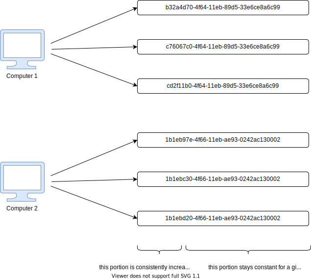
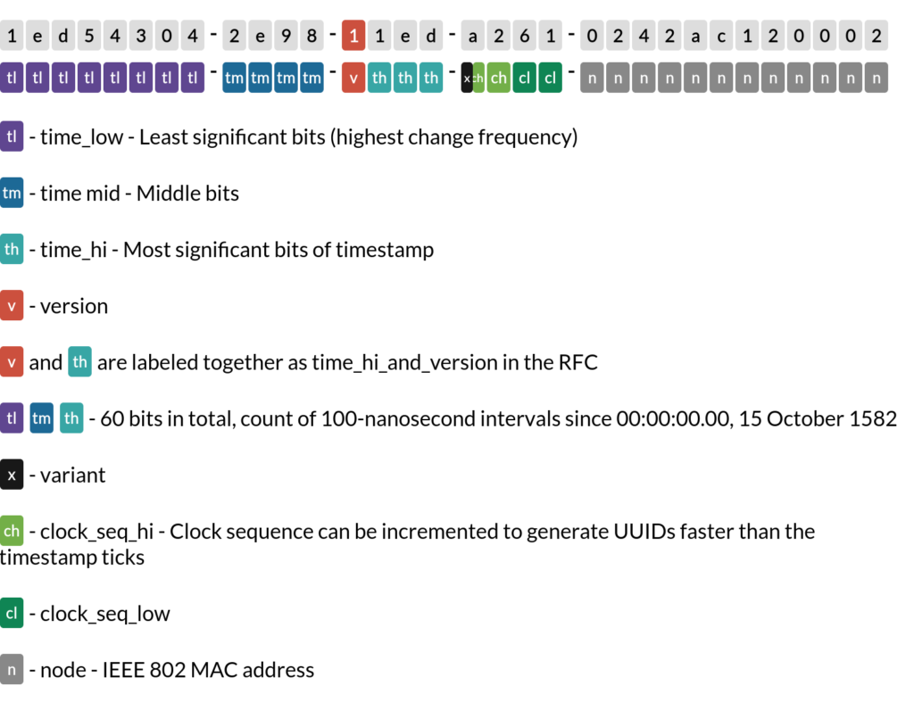
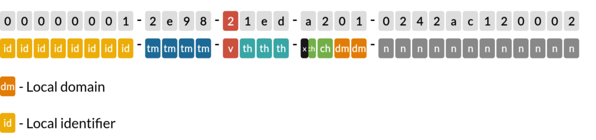

# 1 개요

- primary key의 형식으로 UUID와 Sequential ID의 장단점을 알아보자
- database를 설계할 때 적절한 primary key 형식을 선택하는 것이 매우 중요하다.
  - 시스템의 성능, 확장성, 데이터 무결성에 영향을 미친다.

# 2 UUID(Universally Unique Identifier)

- [RFC 4122](https://www.rfc-editor.org/rfc/rfc4122)에서 정의되었으며 128 비트로 구성된다.
- 32개의 16진수로 이루어져 있으며 하이픈을 통해 5가지 그룹으로 구분된다.
  - ex) `123e4567-e89b-12d3-a456-426655440000`

## 2.1 장점

**Distributed Systems**

- UUID는 시스템 전체적으로 봐도 고유하다.
  - 여러 테이블, 여러 데이터베이스, 여러 시스템에서 UUID는 고유하다.
- 이는 distributed systems에서 매우 중요한 성질이다.

**additional security**

- Sequential ID는 순차적으로 증가하기 때문에 값을 예측할 수 있지만 UUID는 다음 값을 예측할 수 없다.
  - URL path에 나의 유저 아이디가 Sequential ID 100이라면 내가 100번째로 가입했다는 것을 알 수 있다.
- 따라서 악의적인 유저가 다른 유저의 아이디를 예측할 수 없게 한다.

**Generating the Value**

- UUID는 애플리케이션 또는 데이터베이스 자체에서 생성이 가능하다.
- 여기서 애플리케이션에서 UUID를 직접 만들 수 있다는 것이 장점이다.
- Sequential ID의 경우 애플리케이션에는 생성할 수 없고 데이터베이스에서 생성해야 한다.
  - Sequential ID 타입의 primary key는 유니크해야 하고 순차적으로 증가해야하기 때문에 데이터베이스 테이블에 insert문을 실행해 실제 레코드가 삽일될 때 실제 Sequential ID를 알 수 있다.
  - 따라서 애플리케이션에서 바로 ID를 알 수 없고 데이터베이스에 insert문을 날린 후에 ID를 알 수 있다.

## 2.2 단점

**메모리 사용량**

- UUID는 128 비트로 BIGINT의 사이즈의 두배이다.
- primary key의 사이즈가 조회 쿼리와 인덱싱의 악영향을 미칠 수 있다.

**가독성**

- UUID는 32개의 16진수로 이루어져있다.
  - ex) `123e4567-e89b-12d3-a456-426614174000`
- 읽고 기억하기 쉽지 않다.

**정렬**

- UUID에는 **natural order**가 없기 때문에 생성된 순서로 정렬할 수 없다.
- 이런 경우 다른 creational timestamp와 같은 다른 컬럼을 이용해 정렬하자.
  - primary key가 아닌 다른 컬럼을 사용하기 때문에 결과적으로 쿼리 성능이 나빠질 수 있다.

# 3 Sequential ID

## 3.1 장점

**가독성**

- UUID와 비교하면 읽고 기억하기 쉽다.
- 릴레이션이 있는 경우 UUID 보다 파악하기 쉽다.

**Indexing**

- 조회 성능을 높이기 위해 primary 와 foreign keys에 index를 사용한다.
- UUID는 index가 잘 작동하지 않는다.
  - 키가 길어질수록 인덱스 엔트리가 더 많은 메모리를 요구하게 된다.
  - UUID는 값이 랜덤하기 때문에 인덱싱 팩터가 낮다. 
- 테이블을 수정할 때마다 인덱스가 업데이트되어야 하기 때문에 UUID를 사용하면 메모리를 더 사용할 수 있다.
- 조인된 테이블에서 외부 키를 인덱싱할 수 있으므로 UUID 값과 관련하여 또 다른 성능 저하가 발생할 수 있다.

## 3.2 단점

**예측 가능함**

- Sequential ID는 순차적으로 증가하기 때문에 값을 예측할 수 있다.
- URL path에 나의 유저 아이디가 Sequential ID 100이라면 내가 100번째로 가입했다는 것을 알 수 있다.
  - 즉 private한 데이터와 비즈니스 로직이 유출될 수 있다.

**동시성**

- 애플리케이션에서 Sequential ID를 만드는 것이 복잡하다.
- distributed systems 환경에서 애플리케이션이 Sequential ID를 직접 생성할 때 문제점
  - 같은 데이터베이스를 쓰는 두 개의 애플리케이션이 있다고 가정한다.
  - 두 애플리케이션이 동시에 데이터베이스와 통신해 다음 Sequential ID의 값을 알아낸다.
  - 예를 들어  Sequential ID 100이란 값을 두 애플리케이션이 읽어간다.
  - 두 애플리케이션이 Sequential ID의 값을 101로 지정해 데이터베이스에 insert한다.
  - Primary key는 고유하므로 충돌이 발생한다.
- 이 문제를 해결하기 위해 Sequential 값을 생성하는 별도의 서비스를 구현하는 방법이 있다.
  - 이 방식의 문제점은 해당 서비스가 single point of failure가 된다는 점이다.

**사이즈 제한**

- BIGINT를 사용한다고해도 사이즈가 유한하기 때문에 사이즈 제한이 존재한다.

# 4 무엇을 사용할까?

|                 UUID                 |                        Sequential ID                         |
| :----------------------------------: | :----------------------------------------------------------: |
|               128 bits               |                       64 bits(BIGINT)                        |
| Collision is only possible in theory |        Collision is possible due to a size limitation        |
|  distributed systems에서 잘 작동함   | distributed systems에서 충돌을 막기위한 추가적인 작업이 필요하다 |
|         값을 예측할 수 없다          |                     값을 예측할 수 있다                      |
|          가독성이 좋지 않다          |                        가독성이 좋다                         |

# 5 UUID

## 5.1 UUID V1

- [레퍼런스](https://www.sohamkamani.com/uuid-versions-explained/#v1--uniqueness)
- 호스트 컴퓨터의 맥 주소와 현재 시간을 조합해 UUID을 생성한다.
- 따라서 같은 컴퓨터에서 정확히 같은 시간에 생성하지 않는 한 충돌이 발생할 수 없다.
- 그러나 호스트 컴퓨터의 맥 주소 정보가 들어가기 때문에 익명성이 떨어진다는 단점이 있다.
  - UUID를 통해 어떤 컴퓨터에서 언제 객체가 생성되었는지 알 수 있음

- UUID의 앞 부분이 creation time을 나타내고 노란 부분이 컴퓨터의 맥 주소를 나타낸다.

## 5.2 UUID V2

## 5.4 UUID V4

- UUID V4는 맥 주소, 생성 시간 등을 전혀 이용하지 않고 랜덤한 스트링을 만들어 낸다.
- 앞서 V1에서는 충돌이 일어날 수 없다는 것을 보았지만 완전 랜덤한 스트링을 생성하는 V4에는 충돌이 발생 할 수 있다.
  - UUID는 128 비트이기 때문에 총 가짓수는 2^128개로 충돌을 걱정할 수준은 아니지만 아예 없는 것은 아니다
- 하지만 충돌이 일어나면 안되는 도메인에서는 UUID V4 충돌을 막기 위한 uniqueness constraint 필수적으로 추가하자.

참고

- https://www.baeldung.com/uuid-vs-sequential-id-as-primary-key
- https://www.percona.com/blog/store-uuid-optimized-way/
- https://www.toomanyafterthoughts.com/uuids-are-bad-for-database-index-performance-uuid7/