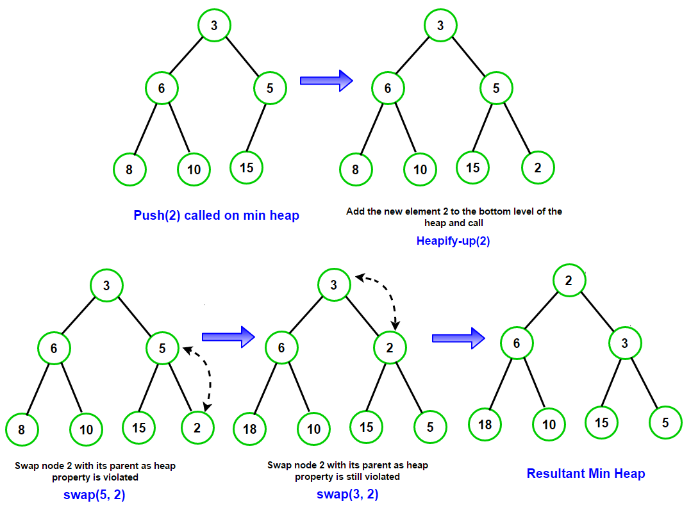
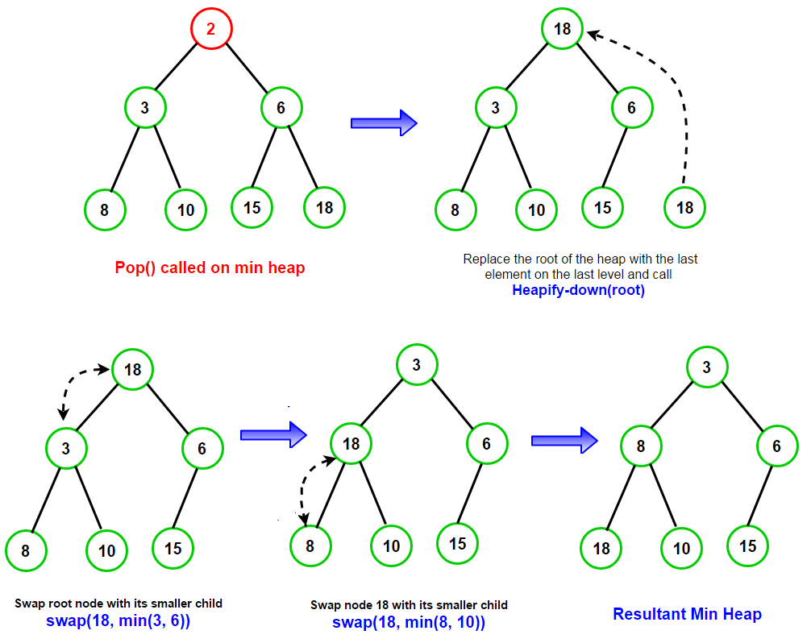

# Heap

* 힙은 트리 기반의 자료구조이다
* 파이썬에는 최소 힙만 구현되어 있다.
* 최소 힙은 부모가 항상 자식보다 작기 때문에 루트가 결국 가장 작은 값을 가지게 된다
* 우선순위 큐는 주로 힙으로 구현하고 힙은 주로 배열로 구현한다.
  * 힙은 완전 이진 트리이기 때문에 배열에 순서대로 표현하기에 적합하다.
* 힙은 정렬된 구조가 아니다.
  * 최소 힙의 경우 부모 노드가 항상 작다는 조건만 만족할 뿐 정렬되어 있지 않다.

## 삽입

* 시간복잡도: O(log n)

1. 요소를 가장 하위 레벨의 최대한 왼쪽으로 삽입한다. (배열로 표현하면 가장 마지막에 삽입한다)
2. 부모 값과 비교해 값이 더 작은 경우 위치를 변경한다.
3. 계속해서 부모 값과 비교해 위치를 변경한다.(가장 작은 값일 경우 루트까지 올라간다)

## 추출

* 시간복잡도: O(log n)

1. 루트를 추출한다.
2. 비어 있는 루트에 가장 하위 레벨의 가장 오른쪽 원소를 집어넣는다.(배열로 표현하면 가장 마지막에 원소)
3. 자식 노드의 값과 비교해서 자식보다 크다면 내려가는 다운힙 연산을 수행한다.
4. 계속해서 자식 값과 비교해 위치를 변경한다.

