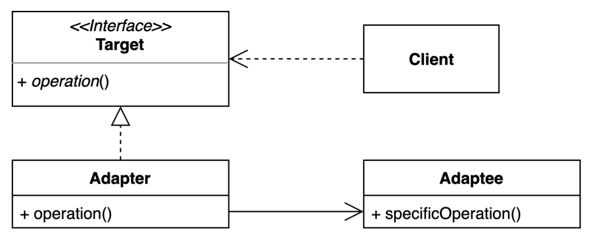
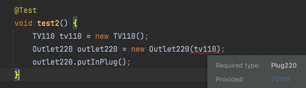

# 1 Adapter

* 기존 코드를 클라이언트가 사용하는 인터페이스의 구현체로 바꿔주는 패턴
* 클라이언트가 사용하는 인터페이스를 따르지 않는 기존 코드를 재사용할 수 있게 해준다


## 1.1 Adapter가 하는 일

* Client는 Target 인터페이스를 구현한 구현체를 사용하고 있는 상황
* 기존 시스템에 새로운 클래스 라이브러리(Adaptee)를 사용해야 하는데 Adaptee가 Target 인터페이스를 구현하지 않았다
* Client와 Adaptee의 코드 변경없이 기존 Client가 사용하고 있는 Target 인터페이스의 구현체를 Adaptee로 변경할 수 있을까?
* 위와 같은 일을 Adapter가 담당한다

# 2 Adapter의 구조

**Adapter의 구조**




## 1.1 Client

* 새로운 써드파티 라이브러리나 외부시스템(Adaptee)을 사용하려는 사용자
* Client의 코드는 변경할 수 없는 상황


## 1.2 Adaptee

* 써드파티 라이브러리나 외부시스템을 의미한다.
* 실제로 Client가 사용하고자 하는 대상이된다
* Adaptee의 코드는 변경할 수 없는 상황


## 1.3 Target

* Adapter가 구현(implements) 하는 인터페이스이다. 
* Client는 Target 인터페이스를 통해 Adaptee인 써드파티 라이브러리를 사용하게 된다.


## 1.4 Adapter

* Client 와 Adaptee 중간에서 호환성이 없는 둘을 연결시켜주는 역할을 담당한다. 
* Target 인터페이스를 구현하며, 클라이언트는 Target 인터페이스를 통해 어댑터에 요청을 보낸다.
* Adapter는 Adaptee를 감싸는 Composition이다
* 어댑터는 클라이언트의 요청을 Adaptee가 이해할 수 있는 방법으로 전달하고, 처리는 Adaptee에서 이루어진다.


# 2 어댑터 패턴 호출 과정

1. 클라이언트에서 Target 인터페이스의 메서드를 호출하는 것 처럼 보인다. 
2. 실제로 클라이언트의 요청을 전달받은 Adapter는 자신이 감싸고 있는 Adaptee에게 실질적인 처리를 위임한다.


# 3 Adapter 예시


## 3.1 Client

**Sockett220.java**

* 클라이언트인 Sockett220은 타켓인 Plug220 인터페이스를 사용한다
* 한국의 소켓은 220V 인터페이스를 구현한 가전 제품만 사용할 수 있다
* 우리가 목표하는 것은 소켓을 변경하지 않고 110V 인터페이스를 사용하는 것이다

```java
@AllArgsConstructor
public class Sockett220 {
  private Plug220 plug220;

  public void putInPlug() {
    plug220.putIn220();
  }
}
```


## 3.2 Adaptee

* TV110은 Plug220을 구현하지 않고 Plug110를 구현했다
* 즉 이 TV는 110v 플러그를 구현한 가전제품으로 Adaptee에 해당된다
* Sockett220의 타겟 인터페이스는 Plug220이기 때문에 TV110을 구현체로 그대로 사용할 수 없다
* Sockett220 클래스의 변경없이 어떻게 Sockett220이 TV110을 사용할 수 있을까?
  * 이 역할은 Adapter에서 담당한다


```java
public class TV110 implements Plug110{
  @Override
  public void putIn110() {
    System.out.println("TV110 on");
  }
}
```


## 3.3 Target

**Plug220.java**

* Client인 Sockett220의 타켓 인터페이스
* 220v의 가전제품은 이 인터페이스를 구현한다

```java
public interface Plug220 {
    void putIn220();
}
```


## 3.4 Adapter

**돼지코.java**

* 호환성이 없는 Sockett220과 TV110을 연결시켜주는 역할을 담당

```java
@AllArgsConstructor
public class 돼지코 implements Plug220{
  private Plug110 plug110;

  @Override
  public void putIn220() {
    plug110.putIn110();
  }
}
```

* Client 와 Adaptee 중간에서 호환성이 없는 둘을 연결시켜주는 역할을 담당한다. 
* Target 인터페이스를 구현하며, 클라이언트는 Target 인터페이스를 통해 어댑터에 요청을 보낸다. 
* 어댑터는 클라이언트의 요청을 Adaptee가 이해할 수 있는 방법으로 전달하고, 처리는 Adaptee에서 이루어진다.


## 3.5 결과


**TV(220V) 220 볼트 콘센트에 연결하기**

* Plug220의 구현체인 TV220은 Sockett220에 어댑터 없이 주입이 가능하다

```java
@Test
void test() {
  TV220 tv220 = new TV220();
  Sockett220 sockett220 = new Sockett220(tv220);
  sockett220.putInPlug();
}
```

```
TV220 on
```


**TV(110V) 220 볼트 콘센트에 연결하기**

* 110V 플러그를 220 볼트 콘센트에 연결할 수 없다




**TV(110V) 돼지코(어댑터) 써서 220 볼트 콘센트에 연결하기**

```java
@Test
void test3() {
  TV110 tv110 = new TV110();
  돼지코 돼지코 = new 돼지코(tv110);
  Outlet220 outlet220 = new Outlet220(돼지코);
  outlet220.putInPlug();
}
```

```
TV110 on
```


# 4 Adapter의 장점

## 4.1 OCP(Open Closed Principle)

* 기존 코드를 변경하지 않고 원하는 인터페이스 구현체를 만들어 재사용할 수 있다
* Client와 Adaptee의 코드를 변경하지 않고 Adapter만 구현하면 됨


## 4.2 SRP(Single Responsibility Principle)

* 기존 코드가 하던 일과 특정 인터페이스 구현체로 변환하는 작업을 각기 다른 클래스로 분리하여 관리한다
* Adaptee: 기존 코드 
* Adapter: 변환하는 작업


# 5 Adapter의 단점

* 새 클래스가 생겨 복잡도가 증가할 수 있다
* Adaptee를 수정할 수 있다면 Target 인터페이스를 구현하도록 수정하는 것이 대안이 될 수 있다