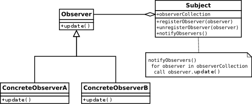

# 1 Observer

* Observer 패턴이란 한 객체의 상태가 바뀌면 그 객체의 의존하는 다른 객체에게 연락이 가고 자동으로 내용이 갱신되는 방식으로 일대다 의존성을 정의하는 것
* 신문 구독 메커니즘만 제대로 이해하면 옵저버 패턴을 쉽게 이해할 수 있다
* 신문사를 `Subject`, 구독자를 `Observer`로 부른다는 것만 외우자

<br>

## 1.1 Observer 패턴 동작과정

1. `Observer`가 `Subject`를 구독한다.
2. `Subject`는 데이터를 관리하며 이 데이터가 변경될 때마다 이 소식을 `Observer `에게 알린다.
3. 더 이상 `Subject`의 관심이 없는 `Observer`는 구독을 해지한다.

  <br>

# 2 Observer의 구조



<br>

## 2.1 Subject 인터페이스

* `registerObserver` : `Subject`의 구독자에 `Observer`를 추가하는 메서드
* `unregisterObserver` : `Subject`의 구독자에서 `Observer`를 삭제하는 메서드
* `notifyObservers` : 데이터 변경 사항을 `Observer`에게 알려주는 메서드
	* `Subject`를 구독한 모든 `Observer`의 update 메서드를 호출데 변경된 데이터를 전달한다.

<br>


## 2.2 Observer 인터페이스

* `update` : 구독한 `Subject`의 데이터 변경 소식을 전달받기 위한 메서드 

<br>

# 3 Observer 패턴의 장점

- 객체 사이의 결합을 느슨하게 만든다.
- `Subject`는 `Observer`가 특정 인터페이스를 구현한다는 사실만 알고있다.
- 즉 `Subject`는 추상화에 의존하기 때문에 새로운 Observer 인터페이스 구현체를 추가하여도  `Subject`를 수정할 필요가 없다.

<br>

# 4 Observer 패턴 예시

## 4.1 Subject 인터페이스

```java
public interface Subject {
   public void registerObserver(Observer o);
   public void removeObserver(Observer o);
   public void notifyObservers();
}
```

<br>

## 4.2 Subject 인터페이스 구현체

```java
public class WeatherData implements Subject {
   private List<Observer> observers;
   private float temperature;
   private float humidity;
   private float pressure;
   
   public WeatherData() {
      observers = new ArrayList<Observer>();
   }
   
   // 구독자 등록
   public void registerObserver(Observer o) {
      observers.add(o);
   }
   
   // 구독자 삭제
   public void removeObserver(Observer o) {
      observers.remove(o);
   }
   
   // 모든 구독자에게 변경된 소식 알려주기
   public void notifyObservers() {
      for (Observer observer : observers) {
         observer.update(temperature, humidity, pressure);
      }
   }
   
   // 데이터가 변경되면 호출되는 메서드로 변경된 소식을 구독자에게 알리기 위해 notifyObservers 호출
   public void measurementsChanged() {
      notifyObservers();
   }
   
   // 데이터가 변경되면 measurementsChanged 메서드 호출
   public void setMeasurements(float temperature, float humidity, float pressure) {
      this.temperature = temperature;
      this.humidity = humidity;
      this.pressure = pressure;
      measurementsChanged();
   }

   public float getTemperature() {
      return temperature;
   }
   
   public float getHumidity() {
      return humidity;
   }
   
   public float getPressure() {
      return pressure;
   }

}
```

- WeatherData 클래스로 Subject 인터페이스의 구현체
- 날씨 정보(temperature, humidity, pressure)가 바뀌면 구독자들한테 알려주는 역할

<br>

## 4.3 Observer 인터페이스

```java
public interface Observer {
   public void update(float temp, float humidity, float pressure);
}
```

<br>

## 4.4 Observer 인터페이스 구현체

**CurrentConditionsDisplay 클래스**

```java
public class CurrentConditionsDisplay implements Observer {
  private float temperature;
  private float humidity;
  private WeatherData weatherData;

  public CurrentConditionsDisplay(WeatherData weatherData) {
    this.weatherData = weatherData;
    weatherData.registerObserver(this);
  }

  public void update(float temperature, float humidity, float pressure) {
    this.temperature = temperature;
    this.humidity = humidity;
    display();
  }

  public void display() {
    System.out.println("Current conditions: " + temperature
                       + "F degrees and " + humidity + "% humidity");
  }
}
```

- CurrentConditionsDisplay 생성시 Subject 구현체를 주입받아 구독한다.
-  Subject의 데이터가 변경되면 update 메서드를 통해 변경된 데이터를 받아 화면에 출력한다.

<br>

**StatisticsDisplay 클래스**

```java
public class StatisticsDisplay implements Observer {
    private float maxTemp = 0.0f;
    private float minTemp = 200;
    private float tempSum= 0.0f;
    private int numReadings;
    private WeatherData weatherData;

    public StatisticsDisplay(WeatherData weatherData) {
        this.weatherData = weatherData;
        weatherData.registerObserver(this);
    }

    public void update(float temp, float humidity, float pressure) {
        tempSum += temp;
        numReadings++;

        if (temp > maxTemp) {
            maxTemp = temp;
        }

        if (temp < minTemp) {
            minTemp = temp;
        }

        display();
    }

    public void display() {
        System.out.println("Avg/Max/Min temperature = " + (tempSum / numReadings)
                           + "/" + maxTemp + "/" + minTemp);
    }
}
```

- StatisticsDisplay 생성시 Subject 구현체를 주입받아 구독한다.
- Subject의 데이터가 변경되면 update 메서드를 통해 변경된 데이터를 받아 화면에 출력한다.

<br>

**ForecastDisplay 클래스**

```java
public class ForecastDisplay implements Observer {
  private float currentPressure = 29.92f;  
  private float lastPressure;
  private WeatherData weatherData;

  public ForecastDisplay(WeatherData weatherData) {
    this.weatherData = weatherData;
    weatherData.registerObserver(this);
  }

  public void update(float temp, float humidity, float pressure) {
    lastPressure = currentPressure;
    currentPressure = pressure;
    display();
  }

  public void display() {
    System.out.print("Forecast: ");
    if (currentPressure > lastPressure) {
      System.out.println("Improving weather on the way!");
    } else if (currentPressure == lastPressure) {
      System.out.println("More of the same");
    } else if (currentPressure < lastPressure) {
      System.out.println("Watch out for cooler, rainy weather");
    }
  }
}
```

- ForecastDisplay 생성시 Subject 구현체를 주입받아 구독한다.
- Subject의 데이터가 변경되면 update 메서드를 통해 변경된 데이터를 받아 화면에 출력한다.

<br>

## 4.5 테스트

```java
@Test
void testWeatherStation() {
    WeatherData weatherData = new WeatherData();

    CurrentConditionsDisplay currentDisplay = new CurrentConditionsDisplay(weatherData);
    StatisticsDisplay statisticsDisplay = new StatisticsDisplay(weatherData);
    ForecastDisplay forecastDisplay = new ForecastDisplay(weatherData);

    weatherData.setMeasurements(80, 65, 30.4f);
    weatherData.setMeasurements(82, 70, 29.2f);
    weatherData.setMeasurements(78, 90, 29.2f);

    weatherData.removeObserver(forecastDisplay);
    weatherData.setMeasurements(62, 90, 28.1f);
}
```

- WeatherData에 CurrentConditionsDisplay, StatisticsDisplay, ForecastDisplay 구독자 추가 후
- 3 번 데이터 변경
- forecastDisplay 구독 해지 후 데이터 변경


**결과**

```
Avg/Max/Min temperature = 80.0/80.0/80.0
Forecast: Improving weather on the way!
Current conditions: 82.0F degrees and 70.0% humidity
Avg/Max/Min temperature = 81.0/82.0/80.0
Forecast: Watch out for cooler, rainy weather
Current conditions: 78.0F degrees and 90.0% humidity
Avg/Max/Min temperature = 80.0/82.0/78.0
Forecast: More of the same
Current conditions: 62.0F degrees and 90.0% humidity
Avg/Max/Min temperature = 75.5/82.0/62.0
Current conditions: 80.0F degrees and 65.0% humidity
```


참고

- [헤드 퍼스트 디자인 패턴](http://www.kyobobook.co.kr/product/detailViewKor.laf?mallGb=KOR&ejkGb=KOR&barcode=9791162245262&orderClick=JAj)