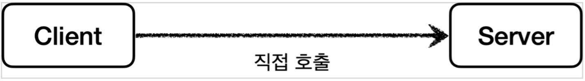
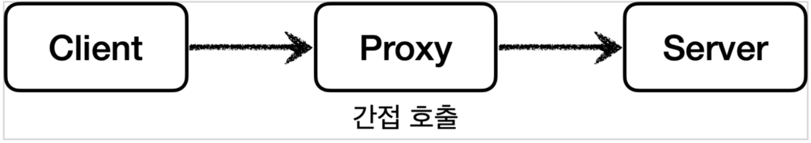
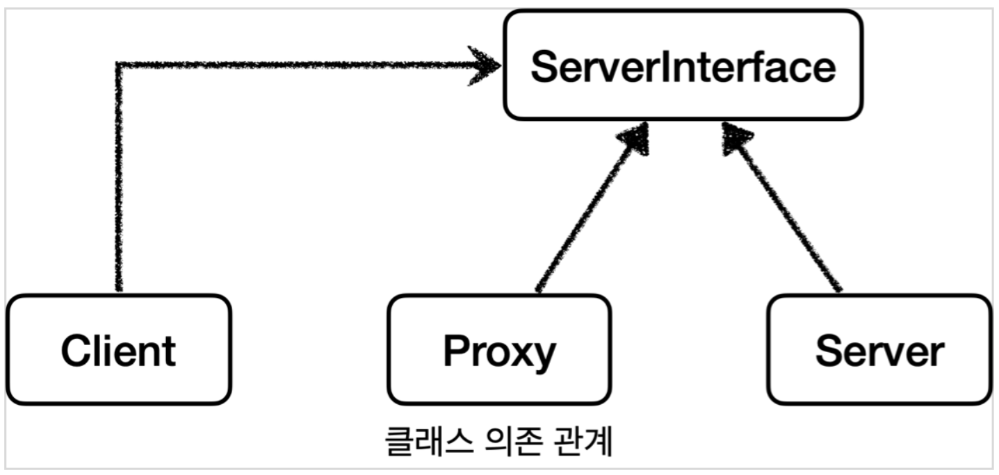
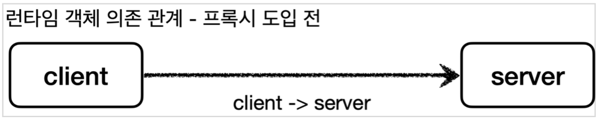
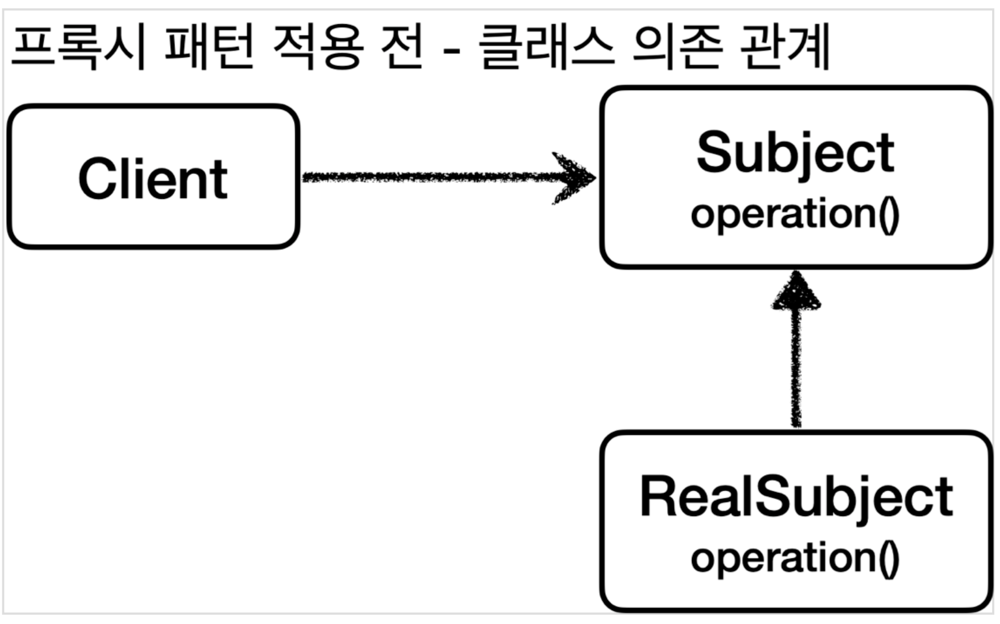
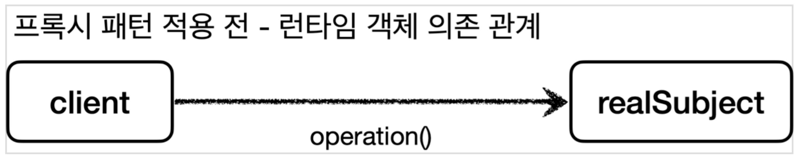
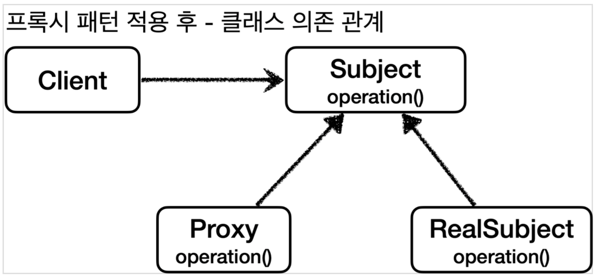
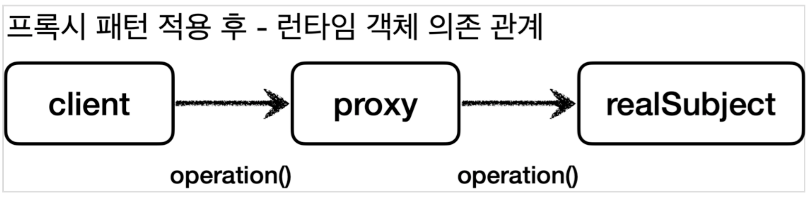

# 1 Proxy Pattern

* **클라이언트**는 의뢰인이라는 뜻이고, **서버**는 '서비스나 상품을 제공하는 사람이나 물건'을 뜻하는 서버-클라이언트 구조를 생각해보자
* 이 개념을 **네트워크**에 도입하면 **클라이언트는 웹 브라우저**가 되고, 요청을 처리하는 **서버는 웹 서버**가 된다.
* 이 개념을 **객체**에 도입하면, **요청하는 객체는 클라이언트**가 되고, **요청을 처리하는 객체는 서버**가 된다.


**직접 호출**

* 일반적으로 클라이언트가 서버를 직접 호출하고, 처리 결과를 직접 받는다. 
* 이것을 직접 호출이라 한다.


**프록시를 통한 간접 호출**

* 클라이언트가 요청한 결과를 서버에 직접 요청하는 것이 아니라 어떤 대리자를 통해서 대신 간접적으로 서버에 요청할 수 있다
* 여기서 대리자를 **프록시**라 한다


# 2 Proxy의 역할

* 클라이언트는 서버에게 요청을 한 것인지, 프록시에게 요청을 한 것인지 조차 몰라야 한다. 
* **따라서 서버와 프록시는 같은 인터페이스를 사용**해야 한다.
* 같은 인터페이스를 사용하기 때문에 클라이언트가 사용하는 서버 객체를 프록시 객체로 변경해도 클라이언트 코드를 변경하지 않고 동작할 수 있다
* 프록시는 클라이언트와 서버 중간에 위치하며 아래와 같은 기능을 한다.


**클래스 의존 관계**



* 클라이언트는 ServerInterface에 의존하고 있으며 Server와 Proxy는 같은 인터페이스를 구현하고 있다


**런타임 객체 의존 관계**




* 런타임 객체 의존 관계가 클라이언트 -> Server인 상태에서 DI를 사용해서 Server 대신 Proxy를 주입해도 클라이언트의 코드를 변경하지 않아도 된다
* 같은 인터페이스를 사용하기 때문에 Server를 Proxy로 교체해도 예전처럼 그대로 사용가능 


## 2.1 Proxy의 주요 기능

* 프록시에의 주요 기능에는 크게 2가지로 구분된다

**접근 제어**

* 권한에 따른 접근 차단
* 캐싱
* 지연 로딩

**부가 기능 추가**

* 서버가 제공하는 기능에 더해 부가 기능을 수행한다
* 로그 서비스
* 요청이나 응답 값 중간 수정
* 부가 기능 추가의 목적을 가진 프록시 패턴을 데코레이터 패턴이라 부른다


## 2.2 GOF의 Proxy 정의

* 프록시 패턴과 데코레이터 패턴은 둘다 프록시를 사용하지만 의도에 따라서 구분한다.
  * 프록시 패턴: **접근 제어가 목적**
  * 데코레이터 패턴: **새로운 기능 추가가 목적**
  * [Decorator.md](../Decorator/Decorator.md) 참고


> 프록시라는 개념은 클라이언트 서버라는 큰 개념안에서 자연스럽게 발생할 수 있다. 프록시는 객체안에서의 개념도 있고, 웹 서버에서의 프록시도 있다. 객체안에서 객체로 구현되어있는가, 웹 서버로 구현되어 있는가 처럼 규모의 차이가 있을 뿐 근본적인 역할은 같다.


# 3 Proxy Pattern 예제 코드

* 서버의 응답을 캐시에 클라이언트의 접근을 제어하는 프록시를 만들어보자


## 3.1 Client 클래스

* 클라이언트 클래스로 Subject 인터페이스를 의존하고 있다

```java
public class Client {

  private Subject subject;

  public Client(Subject subject) {
    this.subject = subject;
  }

  public void execute() {
    subject.operation();
  }

}
```


## 3.2 Subject 인터페이스

* 클라이언트가 의존하는 인터페이스
* Subject 인터페이스는 단순히 operation() 메서드 하나만 가지고 있다.

```java
public interface Subject {
    String operation();
}
```


## 3.3 RealSubject 클래스

* Server 인터페이스를 구현한 구현체
* operation() 메서드는 호출할 때 마다 시스템에 큰 부하를 주는 데이터 조회를 시뮬레이션한 것으로 1초가 소요됨

```java
@Slf4j
public class RealSubject implements Subject {
  @Override
  public String operation() {
    log.info("RealSubject 호출");
    sleep(1000);
    return "data";
  }

  private void sleep(int millis) {
    try {
      Thread.sleep(millis);
    } catch (InterruptedException e) {
      e.printStackTrace();
    }
  }
}
```


## 3.4 클래스 의존 관계




**런타임 객체 의존 관계**

* 런타임에는 클라이언트 객체는 realSubject 객체를 의존하고 있다




## 3.5 테스트 코드

```java
@Test
void noProxyTest() {
  RealSubject realSubject = new RealSubject();
  Client client = new Client(realSubject);
  client.execute();
  client.execute();
  client.execute();
}
```

* RealSubject 객체를 만들어 Client에 의존성 주입 후 `client.execute()` 메서드 3회 호출
* 아래는 테스트 결과로 RealSubject 호출한 것을 볼 수 있다
* 바로 위 그림에서 런타임 객체 의존 관계가 client -> realSubject 이기 때문

```
RealSubject - RealSubject 호출
RealSubject - RealSubject 호출
RealSubject - RealSubject 호출
```


## 3.6 프록시 패턴 적용

* 테스트 코드를 통해 데이터를 조회하는 데 3초 가량 소요되었다
* 만약 데이터가 변하지 않는 데이터라면 데이터를 캐싱해두고 캐싱된 데이터를 조회하는 것이 성능상 좋다
* 이처럼 캐시를 적용하고 싶다면 프록시 패턴를 이용할 수 있다
  * 캐시는 프록시 패턴의 주요 기능 중 접근 제어 기능이다


**Proxy 클래스**



* Proxy는 Subject 인터페이스를 구현한다.
* RealSubject도 Subject 인터페이스를 구현해 Proxy와 RealSubject는 인터페이스가 같음



* proxy는 client와 realSubject 사이에 존재하기 때문에 realSubject 객체를 참조하고 있다
* 따라서 런타임 시 객체 의존 관계는 `client -> proxy -> realSubject`
* client는 realSubject의 operation 메서드를 직접 호출하지 않고 proxy의 operation 메서드를 호출하게 된다
* proxy의 operation 메서드는 아래와 같이 작동한다
  * 프록시는 캐싱된 값이 없으면 realSubject의 operation 메서드를 호출하고 결과 값을 `cacheValue` 변수에 저장한다
  * 캐싱된 값이 있으면 realSubject의 operation 메서드를 호출하지 않고 캐싱된 `cacheValue` 의 값을 반환한다


**Proxy.java**

* 프록시도 실제 객체와 그 모양이 같아야 하기 때문에 Subject 인터페이스를 구현
* `private Subject target` 
  * 클라이언트가 프록시를 호출하면 프록시가 최종적으로 실제 객체를 호출
  * 따라서 내부에 실제 객체의 참조를 가지고 있어야 한다

```java
@Slf4j
public class Proxy implements Subject {
    private Subject target;
    private String cacheValue;

    public Proxy(Subject target) {
        this.target = target;
    }

    @Override
    public String operation() {
        log.info("프록시 호출");
        if (cacheValue == null) {
            cacheValue = target.operation();
        }
        return cacheValue;
    }

}
```


## 3.7 프록시 적용 Test 코드

* 클라이언트가 프록시를 의존하고 있다.
* 런타임 객체 의존 관계: client -> proxy -> realSubject
* 클라이언트와 서버 사이에 프록시가 존재에 접근 제어
  * `RealSubject - 실제 객체 호출` 이 한번만 일어났다

```java
@Test
void cacheProxyTest() {
  Subject realSubject = new RealSubject();
  Subject proxy = new Proxy(realSubject);
  Client client = new Client(proxy);
  client.execute();
  client.execute();
  client.execute();
}
```

**실행결과**

```
Proxy - 프록시 호출
RealSubject - RealSubject 호출
Proxy - 프록시 호출
Proxy - 프록시 호출
```


## 3.8 결론

* 프록시 패턴의 핵심은 접근 제어 또는 새로운 기능의 추가를 Client의 코드 변경없이 추가할 수 있다는 점


참고

* [스프링 핵심 원리 - 고급편](https://www.inflearn.com/course/%EC%8A%A4%ED%94%84%EB%A7%81-%ED%95%B5%EC%8B%AC-%EC%9B%90%EB%A6%AC-%EA%B3%A0%EA%B8%89%ED%8E%B8/dashboard)
