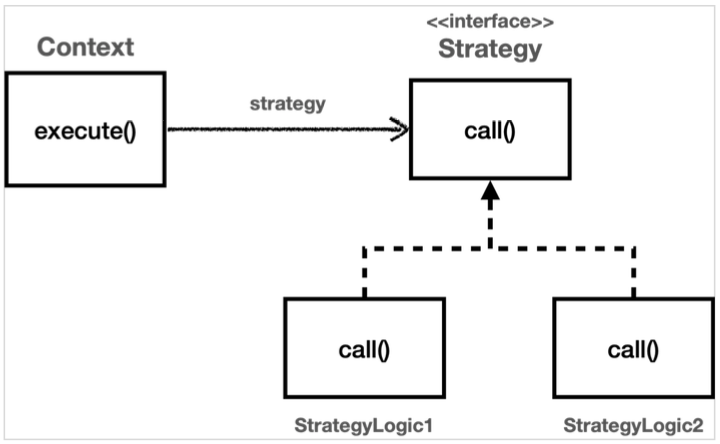

# 1 Strategy

* 탬플릿 메서드 패턴은 부모 클래스에 변하지 않는 템플릿을 두고, 변하는 부분을 자식 클래스에 두어서 상속을 사용해서 문제를 해결했다.
* 전략 패턴은 변하지 않는 부분을 Context 라는 곳에 두고, 변하는 부분을 Strategy 라는 인터페이스를 만들고 해당 인터페이스를 구현하도록 해서 문제를 해결한다. 
  * 상속이 아니라 위임으로 문제를 해결하는 것이다.
* 전략 패턴에서 Context 는 변하지 않는 템플릿 역할을 하고, Strategy 는 변하는 알고리즘 역할을 한다.

> GOF
>
> 알고리즘 제품군을 정의하고 각각을 캡슐화하여 상호 교환 가능하게 만들자. 
>
> 전략을 사용하면 알고리즘을 사용하는 클라이언트와 독립적으로 알고리즘을 변경할 수 있다.


# 2 구성




## 2.1 Strategy 인터페이스

* 이 인터페이스는 변하는 알고리즘 역할을 한다.

```java
public interface Strategy {
  void call();
}
```


## 2.2 Strategy 인터페이스 구현

* 변하는 알고리즘은 Strategy 인터페이스를 구현하면 된다.

```java
@Slf4j
public class StrategyLogic1 implements Strategy {
  @Override
  public void call() {
    log.info("비즈니스 로직1 실행"); }
}
```

```java
@Slf4j
public class StrategyLogic2 implements Strategy {
  @Override
  public void call() {
    log.info("비즈니스 로직2 실행"); }
}
```


## 2.3 Context

* 컨텍스트는 변하지 않는 로직을 가지고 있는 템플릿 역할을 하는 코드이다. 
  * 텍스트(문맥)는 크게 변하지 않지만, 그 문맥 속에서 strategy 를 통해 일부 전략이 변경된다
* 전략 패턴의 핵심은 Context 는 Strategy 인터페이스에만 의존한다는 점이다. 
  * 덕분에 Strategy 의 구현체를 변경하거나 새로 만들어도 Context 코드에는 영향을 주지 않는다.
  * 바로 스프링에서 의존관계 주입에서 사용하는 방식이 바로 전략 패턴이다.