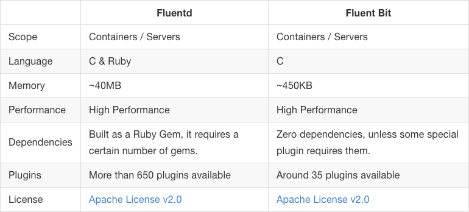
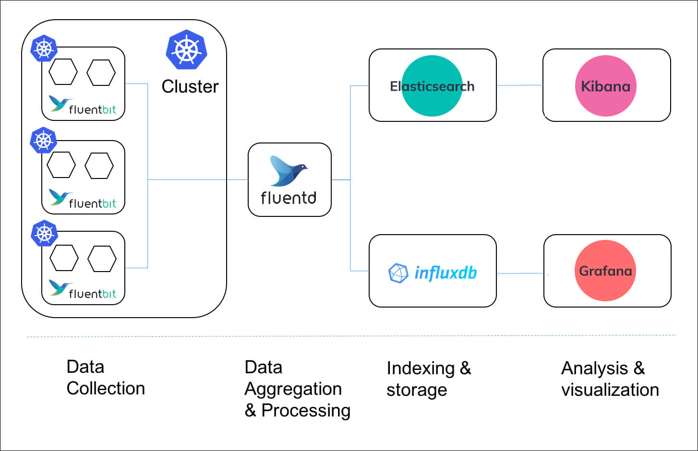
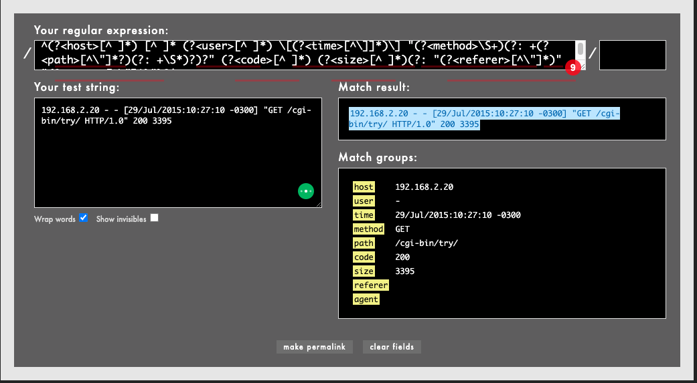

# 1 Fluent Bit

- Fluent Bit은 Fluentd의 경량 버전이라고 생각하면 된다.


## 1.1 Fluent Bit과 Fluentd

**Fluent Bit과 Fluentd 비교**



- Fluentd와 Fluentbit은 상호 배타적 관계가 아니다.
  - Fluentbit은 Fluentd의 경량 버전이라고 생각하면 쉽다.
  - Fluentbit과 Fluentd의 관계는 Beats와 Logstash의 관계와 유사하다.
  - https://logz.io/blog/fluentd-vs-fluent-bit/를 참고하자.


**Fluent Bit과 Fluentd를 같이 사용하는 아키텍처가 가능하다**



- Fluent Bit을 daemonset을 이용해서 노드마다 하나씩 배포한다.
- Fluent Bit은 데이터를 수집하고 Fluentd로 포워딩한다.
- Fluentd는 클러스터 당 하나의 인스턴스를 배포한다.
  - Fluent Bit로부터 받은 데이터를 aggregation하고 다시 포워딩한다. 


## 1.2 Key Concept


### 1.2.1 Event or Record

- [레퍼런스](https://docs.fluentbit.io/manual/concepts/key-concepts#event-or-record)
- Fluent Bit로 들어오는 모든 데이터 조각들을 Event 또는 Record라고 부른다.
  - 데이터: 로그 또는 메트릭


**Event의 포맷**

- Event는 아래 3가지로 구성된다.
  - timestamp
  - key/value metadata (since v2.1.0)
  - payload

```
[[TIMESTAMP, METADATA], MESSAGE]
```

- TIMESTAMP: 초 단위로 표현된 정수 또는 부동소수점 값으로 나타내는 타임스탬프입니다(문자열이 아님).
- METADATA: 이벤트 메타데이터를 포함하는 가능성이 있는 객체
- MESSAGE: 이벤트 본문을 포함하는 객체


**Structured Messages**

- Messages는 아래와 같이 Structure를 가질수도 있고 아닐수도 있다.
  - `{"project": "Fluent Bit", "created": 1398289291}`
  - `"Project Fluent Bit created on 1398289291"`
- structure가 있는 메시지를 처리하는 것이 더 빠르다.


### 1.2.2 Tag

- 모든 이벤트에는 Tag가 부여된다.
- Tag는 이후 필터 단계와 아웃풋 단계에서 사용된다.
- 대부분의 Tag는 설정을 통해 직접 부여된다.
- 만약 Tag를 명시하지 않으면 Fluent Bit는 자동으로 인풋 플러그인의 이름을 Tag로 부여한다.


## 1.3 Data Pipeline

%20(2)%20(2)%20(2)%20(2)%20(2)%20(2)%20(2)%20(1).png?alt=media)

- Fluent Bit로 들어오는 데이터는 아래와 같은 파이프라인을 거친다.
  - input
  - Parser
  - Filter
  - Buffer
  - Router
  - Output


# 2 Input 

- [레퍼런스](https://docs.fluentbit.io/manual/concepts/data-pipeline/input)
- Fluent Bit는 여러 가지 소스로부터 정보를 모으기 위해 여러 Input Plugin을 제공한다.
  - 여러 인풋 플러그인 https://docs.fluentbit.io/manual/pipeline/inputs 참고


## 2.1 Tail Plugin

- **tail** input plugin은 텍스트 파일을 모니터링한다.
  - `tail -f`와 유사하게 작동한다.
- Tail은 `Path` 패턴에 매칭되는 모든 파일을 모니터링한다.
  - 텍스트 파일에 새로운 줄이 추가되면 새로운 이벤트(레코드)를 생성한다.


**Configuration Parameters**

- [레퍼런스](https://docs.fluentbit.io/manual/pipeline/inputs/tail#config)

| Key               | Description                                                  | Default |
| ----------------- | ------------------------------------------------------------ | ------- |
| Buffer_Chunk_Size | Set the initial buffer size to read files data. This value is used to increase buffer size. The value must be according to the [Unit Size]() specification. | 32k     |
| Buffer_Max_Size   | Set the limit of the buffer size per monitored file. When a buffer needs to be increased (e.g: very long lines), this value is used to restrict how much the memory buffer can grow. If reading a file exceeds this limit, the file is removed from the monitored file list. The value must be according to the [Unit Size]() specification. | 32k     |
| Path              | Pattern specifying a specific log file or multiple ones through the use of common wildcards. Multiple patterns separated by commas are also allowed. |         |
| Path_Key          | If enabled, it appends the name of the monitored file as part of the record. The value assigned becomes the key in the map. |         |
| Exclude_Path      | Set one or multiple shell patterns separated by commas to exclude files matching certain criteria, e.g: `Exclude_Path *.gz,*.zip` |         |
| Offset_Key        | If enabled, Fluent Bit appends the offset of the current monitored file as part of the record. The value assigned becomes the key in the map |         |
| Read_from_Head    | For new discovered files on start (without a database offset/position), read the content from the head of the file, not tail. | False   |
| Refresh_Interval  | The interval of refreshing the list of watched files in seconds. | 60      |
| Rotate_Wait       | Specify the number of extra time in seconds to monitor a file once is rotated in case some pending data is flushed. | 5       |
| Ignore_Older      | Ignores files which modification date is older than this time in seconds. Supports m,h,d (minutes, hours, days) syntax. |         |
| Skip_Long_Lines   | When a monitored file reaches its buffer capacity due to a very long line (Buffer_Max_Size), the default behavior is to stop monitoring that file. Skip_Long_Lines alter that behavior and instruct Fluent Bit to skip long lines and continue processing other lines that fits into the buffer size. | Off     |
| Skip_Empty_Lines  | Skips empty lines in the log file from any further processing or output. | Off     |
| DB                | Specify the database file to keep track of monitored files and offsets. |         |
| DB.sync           | Set a default synchronization (I/O) method. Values: Extra, Full, Normal, Off. This flag affects how the internal SQLite engine do synchronization to disk, for more details about each option please refer to [this section](https://www.sqlite.org/pragma.html#pragma_synchronous). Most of workload scenarios will be fine with `normal` mode, but if you really need full synchronization after every write operation you should set `full` mode. Note that `full` has a high I/O performance cost. | normal  |
| DB.locking        | Specify that the database will be accessed only by Fluent Bit. Enabling this feature helps to increase performance when accessing the database but it restrict any external tool to query the content. | false   |
| DB.journal_mode   | sets the journal mode for databases (WAL). Enabling WAL provides higher performance. Note that WAL is not compatible with shared network file systems. | WAL     |
| Mem_Buf_Limit     | Set a limit of memory that Tail plugin can use when appending data to the Engine. If the limit is reach, it will be paused; when the data is flushed it resumes. |         |
| Exit_On_Eof       | When reading a file will exit as soon as it reach the end of the file. Useful for bulk load and tests | false   |
| Parser            | Specify the name of a parser to interpret the entry as a structured message. |         |
| Key               | When a message is unstructured (no parser applied), it's appended as a string under the key name *log*. This option allows to define an alternative name for that key. | log     |
| Inotify_Watcher   | Set to false to use file stat watcher instead of inotify.    | true    |
| Tag               | Set a tag (with regex-extract fields) that will be placed on lines read. E.g. `kube.<namespace_name>.<pod_name>.<container_name>`. Note that "tag expansion" is supported: if the tag includes an asterisk (*), that asterisk will be replaced with the absolute path of the monitored file (also see [Workflow of Tail + Kubernetes Filter]()). |         |
| Tag_Regex         | Set a regex to extract fields from the file name. E.g. `(?<pod_name>[a-z0-9]([-a-z0-9]*[a-z0-9])?(\.[a-z0-9]([-a-z0-9]*[a-z0-9])?)*)_(?<namespace_name>[^_]+)_(?<container_name>.+)-` |         |
| Static_Batch_Size | Set the maximum number of bytes to process per iteration for the monitored static files (files that already exists upon Fluent Bit start). | 50M     |


**Multiline Support**

- Fluent Bit 1.8버전 부터 Multiline 기능이 추가되었다.
- 그래서 현재 old configuration mechanism과 new configuration mechanism 두가지 방식이 존재한다.
  - 하위 호환성을 위해 old configuration mechanism은 그대로 남겨두었다.
- new configuration mechanism을 이용하면 `multiline.parser`라는 키를 이용하면 된다.
  - multiline.parser를 사용하게 되면 old configuration mechanism인 아래의 키를 사용할 수 없다.
  - parser
  - parser_firstline
  - parser_N
  - multiline
  - multiline_flush
  - docker_mode


# 3 Parser

- Parser는 structure가 없는 데이터에 structure를 부여하는 역할을 한다.
- 구조가 없는 데이터 처리하는 것은 매우 비효율적이기 때문에 Input 단계에서 구조가 없는 데이터가 들어오면 바로 Parser에 의해 구조를 부여한다.


**예시**

```
192.168.2.20 - - [28/Jul/2006:10:27:10 -0300] "GET /cgi-bin/try/ HTTP/1.0" 200 3395
```

- 위와 같은 구조가 없는 데이터를 Parser를 이용해 아래와 같이 구조를 가진 데이터로 만든다.

```json
{
  "host":    "192.168.2.20",
  "user":    "-",
  "method":  "GET",
  "path":    "/cgi-bin/try/",
  "code":    "200",
  "size":    "3395",
  "referer": "",
  "agent":   ""
 }
```


## 3.1 JSON Parser

- **JSON는 원본 로그 소스가 JSON 형태일 경우 사용**할 수 있다.
- 로그 소스를 구조화하고 직접적으로 내부 바이너리 표현으로 변환한다.


```yaml
[PARSER]
    Name        docker
    Format      json
    Time_Key    time
    Time_Format %Y-%m-%dT%H:%M:%S %z
```


````
{"key1": 12345, "key2": "abc", "time": "2006-07-28T13:22:04Z"}
````

- 원본 로그 소스가 위처럼 JSON 형태일 경우

```
[1154103724, {"key1"=>12345, "key2"=>"abc"}]
```

- JSON Parser를 거치면 위와 같이 표현으로 변환된다.


## 3.2 Regular Expression Parser

- [레퍼런스](https://docs.fluentbit.io/manual/pipeline/parsers/regular-expression)
- Ruby Regular Expression을 사용해서 원본 소스에 구조를 부여할 수 있다.
- Ruby Regular Expression이 제대로 동작하는 아래 사이트에서 테스트할 수 있다.
  - http://rubular.com/


**예시**

```yaml
[PARSER]
    Name   apache
    Format regex
    Regex  ^(?<host>[^ ]*) [^ ]* (?<user>[^ ]*) \[(?<time>[^\]]*)\] "(?<method>\S+)(?: +(?<path>[^\"]*?)(?: +\S*)?)?" (?<code>[^ ]*) (?<size>[^ ]*)(?: "(?<referer>[^\"]*)" "(?<agent>[^\"]*)")?$
    Time_Key time
    Time_Format %d/%b/%Y:%H:%M:%S %z
    Types code:integer size:integer
```

위 Parser 설정은 Apache HTTP Server log entry를 정규 표현식으로 구조화한다.

```
192.168.2.20 - - [29/Jul/2015:10:27:10 -0300] "GET /cgi-bin/try/ HTTP/1.0" 200 3395
```

위는 Apache HTTP Server log entry로 보시다시피 구조가 없는 상태다.



위 정규 표현식 테스트 사이트에 원본 로그 데이터와 정규 표현식을 넣으면 오른쪽 아래와 같이 구조화된 데이터를 얻을 수 있다.


## 3.1 Parser Plugin

- 기본적으로 Fluent Bit 여러 타입의 로그에 대한 미리 정의된 Parser를 제공한다.

  - Apache

  - Nginx

  - Docker

  - Syslog rfc5424

  - Syslog rfc3164


**Configuration Parameters**

- [레퍼런스](https://docs.fluentbit.io/manual/pipeline/parsers/configuring-parser#configuration-parameters)

| Key               | Description                                                  |
| ----------------- | ------------------------------------------------------------ |
| Name              | Set an unique name for the parser in question.               |
| Format            | Specify the format of the parser, the available options here are: [json](), [regex](), [ltsv]() or [logfmt](). |
| Regex             | If format is *regex*, this option *must* be set specifying the Ruby Regular Expression that will be used to parse and compose the structured message. |
| Time_Key          | If the log entry provides a field with a timestamp, this option specifies the name of that field. |
| Time_Format       | Specify the format of the time field so it can be recognized and analyzed properly. Fluent-bit uses `strptime(3)` to parse time so you can refer to [strptime documentation](https://linux.die.net/man/3/strptime) for available modifiers. |
| Time_Offset       | Specify a fixed UTC time offset (e.g. -0600, +0200, etc.) for local dates. |
| Time_Keep         | By default when a time key is recognized and parsed, the parser will drop the original time field. Enabling this option will make the parser to keep the original time field and it value in the log entry. |
| Types             | Specify the data type of parsed field. The syntax is `types <field_name_1>:<type_name_1> <field_name_2>:<type_name_2> ...`. The supported types are `string`(default), `integer`, `bool`, `float`, `hex`. The option is supported by `ltsv`, `logfmt` and `regex`. |
| Decode_Field      | Decode a field value, the only decoder available is `json`. The syntax is: `Decode_Field json <field_name>`. |
| Skip_Empty_Values | Specify a boolean which determines if the parser should skip empty values. The default is `true`. |


## 3.3 Multiline Parsing

- [레퍼런스](https://docs.fluentbit.io/manual/administration/configuring-fluent-bit/multiline-parsing)
- 이상적으로, 애플리케이션들은 로그 메시지를 한 줄로 기록할 수 있지만, 실제로는 애플리케이션들이 같은 컨텍스트에 속한 여러 로그 메시지를 생성한다.
  - 이런 정보를 처리할 때는 매우 복잡하다.
  - 예를 들어, 애플리케이션 stack trace는 항상 여러 로그 라인을 가지고 있기 때문이다.
- Multiline parser를 사용하는 방법에는 2가지가 있다.
  - Built-in multiline parser를 이용하기
  - Configurable multiline parser를 이용하기


**Built-in Multiline Parsers**

- 추가 설정 없이 Fluent Bit에서 미리 설정한 Built-in Multiline Parsers를 사용할 수 있다.
- 아래표 참고해서 적합한 **Built-in Multiline Parsers**가 있다면 바로 사용할 수 있다.

| Parser | Description                                                  |
| ------ | ------------------------------------------------------------ |
| docker | Process a log entry generated by a Docker container engine. This parser supports the concatenation of log entries split by Docker. |
| cri    | Process a log entry generated by CRI-O container engine. Same as the *docker* parser, it supports concatenation of log entries |
| go     | Process log entries generated by a Go based language application and perform concatenation if multiline messages are detected. |
| python | Process log entries generated by a Python based language application and perform concatenation if multiline messages are detected. |
| java   | Process log entries generated by a Google Cloud Java language application and perform concatenation if multiline messages are detected. |


**Configurable Multiline Parsers**

- [레퍼런스](https://docs.fluentbit.io/manual/administration/configuring-fluent-bit/multiline-parsing)
- **Built-in Multiline Parsers**가 맞지 않는다면 설정을 이용해 커스텀한 **Multiline Parsers**를 직접 정의할 수 있다.
- Configurable Multiline Parsers는 `[MULTILINE_PARSER]` 키워드를 사용해서 정의한다.


[MULTILINE_PARSER]가 가지는 프로퍼티

| Property      | Description                                                  | Default |
| ------------- | ------------------------------------------------------------ | ------- |
| name          | Specify a unique name for the Multiline Parser definition. A good practice is to prefix the name with the word `multiline_` to avoid confusion with normal parser's definitions. |         |
| type          | Set the multiline mode, for now, we support the type `regex`. |         |
| parser        | Name of a pre-defined parser that must be applied to the incoming content before applying the regex rule. If no parser is defined, it's assumed that's a raw text and not a structured message.Note: when a parser is applied to a raw text, then the regex is applied against a specific key of the structured message by using the `key_content` configuration property (see below). |         |
| key_content   | For an incoming structured message, specify the key that contains the data that should be processed by the regular expression and possibly concatenated. |         |
| flush_timeout | Timeout in milliseconds to flush a non-terminated multiline buffer. Default is set to 5 seconds. | 5s      |
| rule          | Configure a rule to match a multiline pattern. The rule has a specific format described below. Multiple rules can be defined. |         |


**설정하기**

- 파서를 설정하기 전에 알아야 할 것!
  1. multiline message의 첫 번째 라인과 매칭되는 정규 표현식
  2. 이어지는 두 번째 라인과 마지막 라인까지 매칭되는 정규 표현식
- 1번 정규 표현식과 매칭되면 start_state 상태라고 한다.
- 2번 정규 표현식과 매칭되면 커스텀한 state 이름을 붙인다.


# 4 Filter

- [레퍼런스](https://docs.fluentbit.io/manual/concepts/data-pipeline/filter)
- Filter가 하는 역할
  - 데이터 수정하기
  - 데이터에 정보 추가하기
  - 데이터 드롭하기


## 4.1 Kubernetes Plugin

- [레퍼런스](https://docs.fluentbit.io/manual/pipeline/filters/kubernetes)

- Kubernetes Filter는 이벤트에 Kubernetes 메타 데이터를 넣어준다.

- Fluent Bit은 쿠버네티스 클러스터에 데몬셋으로 배포했을 때 Fluent Bit이 컨테이너의 로그 파일을 읽고 이벤트를 생성한다.

- 이렇게 생성된 이벤트에 Kubernetes 필터가 아래와 같은 Kubernetes 메타 데이터를 추가해준다.

  - Pod Name

  - Namespace

  - Container Name

  - Container ID

  - Pod ID

  - Labels

  - Annotations


# 5 Buffer

- [레퍼런스](https://docs.fluentbit.io/manual/concepts/data-pipeline/buffer)


# 6 Router

- [레퍼런스](https://docs.fluentbit.io/manual/concepts/data-pipeline/router)
- Data 파이프라인을 거친 데이터를 최종적으로 어디로 보낼것인가를 결정하는 역할을 한다.
- 라우팅 과정에서 Tag와 Match가 사용된다.
  - Input 단계에서 모든 데이터는 Tag가 부여된다.
  - output 단계에서 설정한 Match 룰을 토대로 어디로 보낼지가 결정된다.


**예시**

```
[INPUT]
    Name cpu
    Tag  my_cpu

[INPUT]
    Name mem
    Tag  my_mem

[OUTPUT]
    Name   es
    Match  my_cpu

[OUTPUT]
    Name   stdout
    Match  my_mem
```

- CPU metrics은 Elasticsearch로 보내고 Memory metrics은 standard output으로 보내는 Match Rule


# 7 Output

- Input 소스가 다양한 만큼 Output 소스도 다양하다.
  - 지원되는 아웃풋 솟 https://docs.fluentbit.io/manual/pipeline/outputs 참고


## 7.1 Elasticsearch Plugin

- [레퍼런스](https://docs.fluentbit.io/manual/pipeline/outputs/elasticsearch)