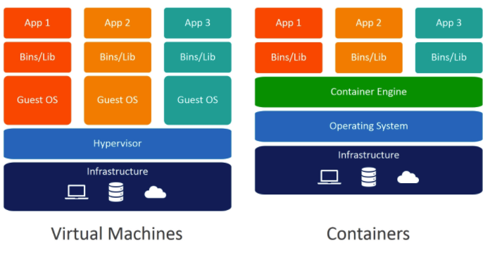

# 1 도커

- 리눅스 컨테이너에 여러 기능을 추가해 애플리케이션을 컨테이너로서 좀 더 쉽게 사용할 수 있게 만들어진 오픈소스 프로젝트
- 기존에 쓰이던 가상화 방법인 가상 머신과는 달리 도커 컨테이너는 성능의 손실이 거의 없다
- 도커와 관련된 프로젝트는 Docker Compose, Private Registry, Docker Hub, Docker for Desktop 등 여러가지가 있지만 일반적으로 도커는 Docker Engine을 의미한다.
- 핵심은 Docker Engine으로 여러 프로젝트들은 Docker Engine을 효율적으로 사용하기 위한 보조 역할을 합니다.


# 2 도커와 기존 가상화 기술




## 2.1 Virtual Machines

- 하이퍼바이저를 통해 여러 개의 운영체제를 하나의 호스트에서 생성해 사용한다.
- 하이퍼바이저에 의해 생성되고 관리되는 운영체제를 Guest OS라고 한다.
- 각 Guest OS는 다른  Guest OS와 완전히 독립적인 시스템 자원을 할당받아 사용한다.
- 대표적인 가상화 툴로 VirtualBox, VMware 등이 있다


**단점**

- 하이퍼바이저를 반드시 거치기 때문에 일반 호스트에 비해 성능 손실이 있다
- 가상 머신에는 Guest OS를 사용하기 위한 라이브러리, 커널 등을 전부 포함하기 때문에 가상 머신을 배포하기 위한 이미지의 크기가 크다
  - 수 기가바이트에 달하는 가상 머신 이미지를 애플리케이션으로 배포하기 어렵다


## 2.2 Docker

- 가상화된 공간을 생성하기 위해 리눅스의 자체 기능인 chroot, namespace, cgroup을 사용함으로써 프로세스 단위의 격리 환경을 만들기 때문에 성능 손실이 거의 없다.
- 컨테이너에 필요한 커널은 호스트의 커널을 공유한다
  - 가상 이미지와 달리 Docker의 이미지는 커널을 포함하지 않는다.
- 컨테이너 안에는 애플리케이션을 구동하는데 필요한 라이브러리 및 실행 파일만 존재한다.
  - 따라서 이미지의 크기가 가상 머신과 비교하면 매우 작다


# 3 Docker의 장점

## 3.1 애플리케이션의 개발과 배포 용이성

- 도커 컨테이너는 호스트 OS 위에서 실행되는 격리된 공간이다
- 컨테이너 내부에 수많은 소프트웨어를 설치하고 설정 파일을 수정해도 호스트 OS에는 영향이 없다.
- 컨테이너 내부에서 여러 작업을 마친 뒤 이를 운영 환경에 배포할 때
  - 해당 컨테이너를 이미지로 만들어 운영 서버에 전달하면 된다
- 서비스를 개발했을 때 사용했던 환경을 다른 서버에서도 컨테이너로 똑같이 복제해 개발/운영 환경의 통합이 가능하다


# 4 Docker Engine 설치

- 도커는 다양한 운영체제에서 사용할 수 있다
- 도커는 리눅스 컨테이너를 제어하는 API를 Go 언어로 구현한 libcontainer를 사용하기 때문에 대부분의 리눅스 운영체제에서 사용 가능하다


## 4.1 우분투

```shell
#Uninstall old versions
sudo apt-get remove docker docker-engine docker.io containerd runc

#SET UP THE REPOSITORY
sudo apt-get update
sudo apt-get install \
    apt-transport-https \
    ca-certificates \
    curl \
    gnupg-agent \
    software-properties-common

#Add Docker’s official GPG key
curl -fsSL https://download.docker.com/linux/ubuntu/gpg | sudo apt-key add -

sudo add-apt-repository \
   "deb [arch=amd64] https://download.docker.com/linux/ubuntu \
   $(lsb_release -cs) \
   stable"
   
#INSTALL DOCKER ENGINE
sudo apt-get update
sudo apt-get install docker-ce docker-ce-cli containerd.io

#To run Docker without root privileges
sudo usermod -aG docker $USER
```


## 4.2 아마존 리눅스

```bash
sudo yum update -y

# 최신 도커 엔진 패키지를 설치합니다.
sudo amazon-linux-extras install docker

sudo yum install docker

# 도커 서비스를 시작합니다.
sudo service docker start

# ec2-user를 사용하지 않고도 도커 명령을 실행할 수 있도록 docker 그룹에 sudo.를 추가합니다.
sudo usermod -a -G docker ec2-user

# 도커 컴포즈 설치
sudo curl -L "https://github.com/docker/compose/releases/download/1.28.2/docker-compose-$(uname -s)-$(uname -m)" -o /usr/local/bin/docker-compose

sudo chmod +x /usr/local/bin/docker-compose

#섪치 확인
docker-compose --version
```


## 4.3 cent os

```bash
#Uninstall old versions
sudo yum remove docker \
                  docker-client \
                  docker-client-latest \
                  docker-common \
                  docker-latest \
                  docker-latest-logrotate \
                  docker-logrotate \
                  docker-engine
  
#Set up the repository
sudo yum install -y yum-utils
sudo yum-config-manager \
--add-repo \
https://download.docker.com/linux/centos/docker-ce.repo

#Install Docker Engine
sudo yum install docker-ce docker-ce-cli containerd.io

#Start Docker
sudo systemctl start docker
sudo usermod -a -G docker $USER

#docker-compose install
sudo curl -L "https://github.com/docker/compose/releases/download/1.29.2/docker-compose-$(uname -s)-$(uname -m)" -o /usr/local/bin/docker-compose
sudo chmod +x /usr/local/bin/docker-compose
```
