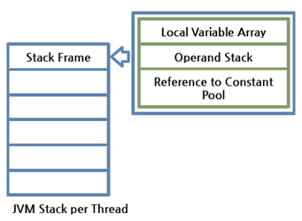

**용어정리**

## Java bytecode(자바 바이트코드)

> 자바 컴파일러는 C/C++ 등의 컴파일러처럼 고수준 언어를 기계어, 즉 직접적인 CPU 명령으로 변환하는 것이 아니라, 개발자가 이해하는 자바 언어를 JVM이 이해하는 자바 바이트코드로 번역한다.
>
> 자바 바이트코드(Java bytecode)는 자바 가상 머신이 실행하는 명령어의 형태이다. 각각의 바이트코드는 1바이트로 구성되지만 몇 개의 파라미터가 사용되는 경우가 있어 총 몇 바이트로 구성되는 경우가 있다. 256개의 명령코드 모두가 사용되지는 않는다.
>
> 자바 프로그래머가 자바 바이트코드를 꼭 인지하거나 이해할 필요는 없다. 하지만 IBM의 developerWorks journal에서 제안했듯이 "바이트코드를 이해하고 자바 컴파일러에 의해 바이트코드가 어떻게 생성될 것인지를 이해하는 것은 C나 C++ 프로그래머가 어셈블리어를 이해하는 것과 같다" 라고 볼 수 있다.

예시

```java
for (int i = 2; i < 1000; i++) {
    for (int j = 2; j < i; j++) {
        if (i % j == 0)
            continue outer;
    }
    System.out.println (i);
}
```

자바 컴파일러는 위의 자바 코드를 아래와 같은 바이트 코드로 번역한다:

```
0:   iconst_2
1:   istore_1
2:   iload_1
3:   sipush  1000
6:   if_icmpge       44
9:   iconst_2
10:  istore_2
11:  iload_2
12:  iload_1
13:  if_icmpge       31
16:  iload_1
17:  iload_2
18:  irem
19:  ifne    25
22:  goto    38
25:  iinc    2, 1
28:  goto    11
31:  getstatic       #84; // Field java/lang/System.out:Ljava/io/PrintStream;
34:  iload_1
35:  invokevirtual   #85; // Method java/io/PrintStream.println:(I)V
38:  iinc    1, 1
41:  goto    2
44:  return
```


## **JAR**

> JAR(Java Archive, 자바 아카이브)는 여러개의 자바 클래스 파일과, 클래스들이 이용하는 관련 리소스(텍스트, 그림 등) 및 메타데이터를 하나의 파일로 모아서 자바 플랫폼에 응용 소프트웨어나 라이브러리를 배포하기 위한 소프트웨어 패키지 파일 포맷이다. JAR 파일은 실제로 ZIP 파일 포맷으로 이루어진 압축 파일로서, 파일 확장자는 .jar이다. 


___


## JVM

> 자바 가상 머신(Java Virtual Machine, JVM)은 자바 바이트코드를 실행할 수 있는 주체이다. 자바 바이트코드는 플랫폼에 독립적이며 모든 자바 가상 머신은 자바 가상 머신 규격에 정의된 대로 자바 바이트코드를 실행한다. 따라서 표준 자바 API까지 동일한 동작을 하도록 구현한 상태에서는 이론적으로 모든 자바 프로그램은 CPU나 운영 체제의 종류와 무관하게 동일하게 동작할 것을 보장한다. 크게 `Class Loader`,  `Runtime Data Area`, `Execution Engine` 로 구성되어 있다.
>
> JVM의 역할은 자바 애플리케이션을 클래스 로더(Class Loader)를 통해 읽어 들여서 자바 API와 함께 실행하는 것입니다.


### JVM의 구조


### Class Loader

> 자바는 동적 로드, 즉 컴파일타임이 아니라 런타임에 클래스를 처음으로 참조할 때 해당 클래스를 로드하고 링크하는 특징이 있다. 이 동적 로드를 담당하는 부분이 JVM의 클래스 로더이며 컴파일된 자바 바이트코드를 런타임 데이터 영역(Runtime Data Areas)에 로드한다.

* 클래스 로더가 아직 로드되지 않은 클래스를 찾으면, 다음 그림과 같은 과정을 거쳐 클래스를 로드하고 링크하고 초기화한다.
* `Loading`, `Linking`, `Initalization` 단계를 거친다.


**Loading 단계**

* 자바파일을 컴파일해서 만든 class파일을 메모리에 로드하는 역할을 한다.

* 아래와 같이 3가지 종류의 클래스 로더가 있다.

1. BOOTSTRAP Class Loader
   * JVM을 기동할 때 생성되며, Object 클래스들을 비롯하여 자바 API들을 로드한다.
   * <JAVA_HOME>/jre/lib 디렉터리에 위치한 핵심 자바 JDK class를 로드한다.
   * 다른 클래스 로더와 달리 자바가 아니라 네이티브 코드로 구현되어 있다.

2. EXTENSION Class Loader
   * 기본 자바 API를 제외한 확장 클래스들을 로드한다. 다양한 보안 확장 기능 등을 여기에서 로드하게 된다.
   * <JAVA_HOME>/jre/lib/ext에 위치한 class를 로드한다.
3. APPLICATION Class Loader
   * 사용자가 지정한 $CLASSPATH 내의 클래스들을 로드한다.
   * CLASSPATH ENV variable로 명시된 위치에서 jar 와 class를 로드한다. 
     * CLASSPATH, -cp


**Linking 단계**

3가지 단계를 거친다

1. Verification 단계
   * 읽어 들인 클래스가 자바 언어 명세(Java Language Specification) 및 JVM 명세에 명시된 대로 잘 구성되어 있는지 검사한다. 
2. Preparation 단계
   * Static 변수가 메모리에 할당되고 default value로 초기화한다.
   * 클래스가 필요로 하는 메모리를 할당하고, 클래스에서 정의된 필드, 메서드, 인터페이스들을 나타내는 데이터 구조를 준비한다.
3. Resolution 단계

   * 클래스의 상수 풀 내 모든 심볼릭 레퍼런스를 다이렉트 레퍼런스로 변경한다.


**Initalization 단계** 

* 클래스 변수들을 적절한 값으로 초기화한다
* Static 변수에 실제 값이 할당된다.
* static initalizer를 실행한다.


___


### Runtime Data Area

> 런타임 데이터 영역은 JVM이라는 프로그램이 운영체제 위에서 실행되면서 할당받는 메모리 영역이다. 런타임 데이터 영역은 6개의 영역으로 나눌 수 있다. 이중 PC 레지스터(PC Register), JVM 스택(JVM Stack), 네이티브 메서드 스택(Native Method Stack)은 스레드마다 하나씩 생성되며 힙(Heap), 메서드 영역(Method Area), 런타임 상수 풀(Runtime Constant Pool)은 모든 스레드가 공유해서 사용한다.


#### **PC 레지스터**

> PC(Program Counter) 레지스터는 각 스레드마다 하나씩 존재하며 스레드가 시작될 때 생성된다. PC 레지스터는 현재 수행 중인 JVM 명령의 주소를 갖는다.

#### **JVM 스택** 

>  JVM 스택은 각 스레드마다 하나씩 존재하며 스레드가 시작될 때 생성된다. 스택 프레임(Stack Frame)이라는 구조체를 저장하는 스택으로, JVM은 오직 JVM 스택에 스택 프레임을 추가하고(push) 제거하는(pop) 동작만 수행한다. 예외 발생 시 printStackTrace() 등의 메서드로 보여주는 Stack Trace의 각 라인은 하나의 스택 프레임을 표현한다.

#### **스택 프레임**

>  JVM 내에서 메서드가 수행될 때마다 하나의 스택 프레임이 생성되어 해당 스레드의 JVM 스택에 추가되고 메서드가 종료되면 스택 프레임이 제거된다. 각 스택 프레임은 지역 변수 배열(Local Variable Array), 피연산자 스택(Operand Stack), 현재 실행 중인 메서드가 속한 클래스의 런타임 상수 풀에 대한 레퍼런스를 갖는다. 지역 변수 배열, 피연산자 스택의 크기는 컴파일 시에 결정되기 때문에 스택 프레임의 크기도 메서드에 따라 크기가 고정된다.



#### **네이티브 메서드 스택**

>   자바 외의 언어로 작성된 네이티브 코드를 위한 스택이다. 즉, JNI(Java Native Interface)를 통해 호출하는 C/C++ 등의 코드를 수행하기 위한 스택으로, 언어에 맞게 C 스택이나 C++ 스택이 생성된다.

#### **메서드 영역**

> 메서드 영역은 모든 스레드가 공유하는 영역으로 JVM이 시작될 때 생성된다. JVM이 읽어 들인 각각의 **클래스와 인터페이스에 대한 런타임 상수 풀, 필드와 메서드 정보**, **Static 변수**, **메서드의 바이트코드** 등을 보관한다. 메서드 영역은 JVM 벤더마다 다양한 형태로 구현할 수 있으며, 오라클 핫스팟 JVM(HotSpot JVM)에서는 흔히 Permanent Area, 혹은 Permanent Generation(PermGen)이라고 불린다. 메서드 영역에 대한 가비지 컬렉션은 JVM 벤더의 선택 사항이다.

#### **런타임 상수 풀**

> 클래스 파일 포맷에서 constant pool 테이블에 해당하는 영역이다. 메서드 영역에 포함되는 영역이긴 하지만, JVM 동작에서 가장 핵심적인 역할을 수행하는 곳이기 때문에 JVM 명세에서도 따로 중요하게 기술한다. 각 클래스와 인터페이스의 상수뿐만 아니라, 메서드와 필드에 대한 모든 레퍼런스까지 담고 있는 테이블이다. 즉, 어떤 메서드나 필드를 참조할 때 JVM은 런타임 상수 풀을 통해 해당 메서드나 필드의 실제 메모리상 주소를 찾아서 참조한다.

#### **힙**

>  쓰레드간 공유가 가능한 지역이며 인스턴스를 저장하는 공간으로 가비지 컬렉션 대상이다. JVM 성능 등의 이슈에서 가장 많이 언급되는 공간이다. 힙 구성 방식이나 가비지 컬렉션 방법 등은 JVM 벤더의 재량이다.

**힙의 구조**


___


### Execution Engine

> 클래스 로더를 통해 JVM 내의 런타임 데이터 영역에 배치된 바이트코드는 실행 엔진에 의해 실행된다. 실행 엔진은 자바 바이트코드를 명령어 단위로 읽어서 실행한다. CPU가 기계 명령어을 하나씩 실행하는 것과 비슷하다. 바이트코드의 각 명령어는 1바이트짜리 OpCode와 추가 피연산자로 이루어져 있으며, 실행 엔진은 하나의 OpCode를 가져와서 피연산자와 함께 작업을 수행한 다음, 다음 OpCode를 수행하는 식으로 동작한다.
>
> 그런데 자바 바이트코드는 기계가 바로 수행할 수 있는 언어보다는 비교적 인간이 보기 편한 형태로 기술된 것이다. 그래서 실행 엔진은 이와 같은 바이트코드를 실제로 JVM 내부에서 기계가 실행할 수 있는 형태로 변경하며, 그 방식은 다음 두 가지가 있다.

**Execution Engine의 구조**


#### **Interpreter**

* 바이트코드 명령어를 하나씩 읽어서 해석하고 실행한다. 
* 하나씩 해석하고 실행하기 때문에 바이트코드 하나하나의 해석은 빠른 대신 인터프리팅 결과의 실행은 느리다는 단점을 가지고 있다. 
* 단점은 메소드가 여러번 호출될 때 마다 바이트코드를 중복적으로 변환하고 실행하는 과정을 거친다.


#### **JIT Compiler**

> 전통적인 입장에서 컴퓨터 프로그램을 만드는 방법은 두 가지가 있는데, 인터프리트 방식과 정적 컴파일 방식으로 나눌 수 있다. 이 중 인터프리트 방식은 실행 중 프로그래밍 언어를 읽어가면서 해당 기능에 대응하는 기계어 코드를 실행하며, 반면 정적 컴파일은 실행하기 전에 프로그램 코드를 기계어로 번역한다.
>
> 인터프리터의 단점을 보완하기 위해 도입된 것이 JIT 컴파일러이다. 인터프리터 방식으로 실행하다가 적절한 시점에 바이트코드 전체를 컴파일하여 네이티브 코드로 변경하고, 이후에는 해당 메서드를 더 이상 인터프리팅하지 않고 네이티브 코드로 직접 실행하는 방식이다. 네이티브 코드를 실행하는 것이 하나씩 인터프리팅하는 것보다 빠르고, 네이티브 코드는 캐시에 보관하기 때문에 한 번 컴파일된 코드는 계속 빠르게 수행되게 된다.
>
> JIT 컴파일러가 컴파일하는 과정은 바이트코드를 하나씩 인터프리팅하는 것보다 훨씬 오래 걸리므로, 만약 한 번만 실행되는 코드라면 컴파일하지 않고 인터프리팅하는 것이 훨씬 유리하다. 따라서, JIT 컴파일러를 사용하는 JVM들은 내부적으로 해당 메서드가 얼마나 자주 수행되는지 체크하고, 일정 정도를 넘을 때에만 컴파일을 수행한다.


#### Garbage Collector

> Java는 프로그램 코드에서 메모리를 명시적으로 지정하여 해제하지 않는다. 개발자가 프로그램 코드로 메모리를 명시적으로 해제하지 않기 때문에 가비지 컬렉터(Garbage Collector)가 더 이상 필요 없는 (쓰레기) 객체를 찾아 지우는 작업을 한다. 이 가비지 컬렉터는 두 가지 가설 하에 만들어졌다(사실 가설이라기보다는 가정 또는 전제 조건이라 표현하는 것이 맞다).
>
> - 대부분의 객체는 금방 접근 불가능 상태(unreachable)가 된다.
> - 오래된 객체에서 젊은 객체로의 참조는 아주 적게 존재한다.

**가비지 컬렉션 과정(mark and sweep)**

1. stack의 모든 변수를 스캔하면서 어떤 객체를 참조하고 있는지 찾아 마킹을한다.
2. Reachable Object가 참조하고 있는 객체도 찾아서 마킹한다.
3. Heap 영역에서 마킹되지 않은 객체를 제거한다.

**Yong Generation & Old Generation**

> 가설의 장점을 최대한 살리기 위해서 HotSpot VM에서는 크게 2개로 물리적 공간을 나누었다. 둘로 나눈 공간이 Young 영역과 Old 영역이다.
>
> Young 영역(Yong Generation 영역)
>
> 새롭게 생성한 객체의 대부분이 여기에 위치한다. 대부분의 객체가 금방 접근 불가능 상태가 되기 때문에 매우 많은 객체가 Young 영역에 생성되었다가 사라진다. 이 영역에서 객체가 사라질때 Minor GC가 발생한다고 말한다.
>
> Old 영역(Old Generation 영역)
>
> 접근 불가능 상태로 되지 않아 Young 영역에서 살아남은 객체가 여기로 복사된다. 대부분 Young 영역보다 크게 할당하며, 크기가 큰 만큼 Young 영역보다 GC는 적게 발생한다. 이 영역에서 객체가 사라질 때 Major GC(혹은 Full GC)가 발생한다고 말한다.
>
> ​													GC 영역 및 데이터 흐름도
>
> 
>
> Permanent Generation 영역
>
> Method Area라고도 한다. 객체나 억류(intern)된 문자열 정보를 저장하는 곳이며, Old 영역에서 살아남은 객체가 영원히 남아 있는 곳은 절대 아니다. 이 영역에서 GC가 발생할 수도 있는데, 여기서 GC가 발생해도 Major GC의 횟수에 포함된다.

**Young 영역**

Young 영역은 3개의 영역으로 나뉜다.

- Eden 영역
- Survivor 영역(2개)

Young 영역에 대한 GC 절차

1. 새로 생성한 대부분의 객체는 Eden 영역에 위치한다.
2. Eden 영역에서 GC가 한 번 발생한 후 살아남은 객체는 Survivor 영역 중 하나로 이동된다.
3. Eden 영역에서 GC가 발생하면 이미 살아남은 객체가 존재하는 Survivor 영역으로 객체가 계속 쌓인다.
4. 하나의 Survivor 영역이 가득 차게 되면 그 중에서 살아남은 객체를 다른 Survivor 영역으로 이동한다. 
5. 그리고 가득 찬 Survivor 영역은 아무 데이터도 없는 상태로 된다.
6. 이 과정을 반복하다가 계속해서 살아남아 있는 객체는 Old 영역으로 이동하게 된다.

**Old 영역**

Old 영역은 기본적으로 데이터가 가득 차면 GC를 실행한다. GC 방식에 따라서 처리 절차가 달라지므로, 어떤 GC 방식이 있는지 살펴보면 이해가 쉬울 것이다. GC 방식은 JDK 7을 기준으로 5가지 방식이 있다.

- Serial GC
- Parallel GC
- Parallel Old GC(Parallel Compacting GC)
- Concurrent Mark & Sweep GC(이하 CMS)
- G1(Garbage First) GC

> 이 중에서 운영 서버에서 절대 사용하면 안 되는 방식이 Serial GC다. Serial GC는 데스크톱의 CPU 코어가 하나만 있을 때 사용하기 위해서 만든 방식이다. Serial GC를 사용하면 애플리케이션의 성능이 많이 떨어진다.

참조

* https://d2.naver.com/helloworld/1230
* https://d2.naver.com/helloworld/1329
* Java Performance Fundamental"(김한도, 서울, 엑셈, 2009) 읽기를 추천