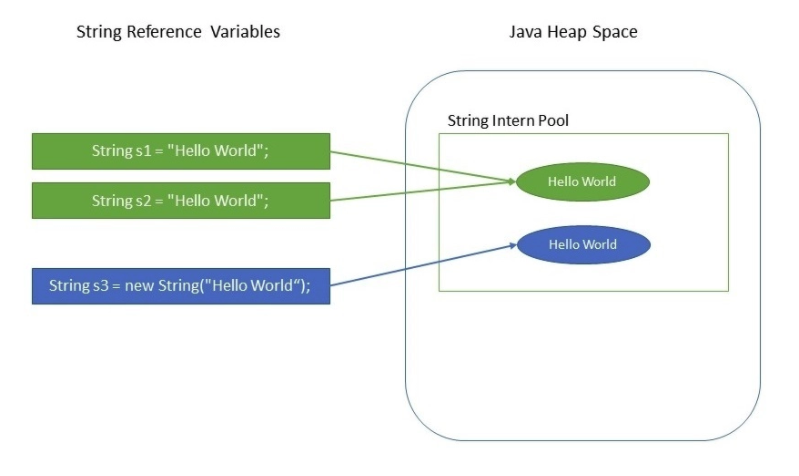

# String

> 자바의 문자열은 java.lang 패키지의 String 클래스의 인스턴스로 관리된다. 소스상에 문자열 리터렁은 String 클래스로 자동 생성되지만 String 클래스의 다양한 생성자를 이용해서 직접 String 클래스를 생성할 수도 있다.


## String은 왜 immutable할까?

* immutable이란?
  * 객체의 내부 상태가 생성 후 변하지 않는 것을 의미한다.
* immutable의 장점
  * 캐싱
  * 보안
  * 동기화
  * 성능

## String Pool

* String이 저장되는 메모리의 특수한 공간을 의미한다.
* String은 immutable하기 때문에 JVM은 String에게 할당되는 메모리의 양을 최적화할 수 있다.
* 오직 하나의 String객체를 String Pool에 생성하고 여러개의 다른 변수들이 하나의 같은 String 객체를 가르키게하여 메모리 자원을 절약할 수 있다.

```java
// s1과 s2 모두 String Pool의 같은 String 객체를 가르키기 때문에 결과는 True이다.
String s1 = "Hello World";
String s2 = "Hello World";
         
assertThat(s1 == s2).isTrue();
```

* 메모리 구조
  * s1과 s2 모두 String Pool의 같은 String 객체를 가르키고 있다.



## immutable의 장점

**Security**

* 

### **Synchronization**

* immutable하면 thread safe하다고 말할 수 있다. 그 이유는 객체의 내부 상태가 생성 후 변하지 않기 때문이다.

### **Hashcode Caching**

* 객체의 내부 상태가 생성 후 변하지 않기 때문에 hashCode() 메소드의 결과를 캐싱할 수 있다.

### **Performance**

* *String* pool의 존재로 메모리를 절약할 수 있다.


## 자주 사용되는 String 메소드

| Modifier and Type | Method                                    | Description                                                  |
| :---------------- | :---------------------------------------- | :----------------------------------------------------------- |
| `char`            | `charAt(int index)`                       | Returns the `char` value at the specified index.             |
| `boolean`         | `equals(Object anObject)`                 | Compares this string to the specified object.                |
| `byte[]`          | `getBytes()`                              | Encodes this `String` into a sequence of bytes using the platform's default charset, storing the result into a new byte array. |
| `int`             | `indexOf(String str)`                     | Returns the index within this string of the first occurrence of the specified substring. |
| `int`             | `length()`                                | Returns the length of this string.                           |
| `String`          | `substring(int beginIndex, int endIndex)` | Returns a string that is a substring of this string          |
| `String`          | `substring(int beginIndex)`               | Returns a string that is a substring of this string.         |
|                   |                                           |                                                              |
|                   |                                           |                                                              |


---


## StringTokenizer 클래스

> 문자열이 특정 구분자로 연결되어 있을 경우, 구분자를 기준으로 부분 문자열을 분리 하기 위해서는 String의 split() 메소드를 이용하거나, java.util 패키지의 StringTokenizer 클래스를 이용할 수 있다. split()은 정규 표현식으로 구분하고, StringTokenizer는 무자로 구분한다는 차이점이 있다.

**StringTokenizer 메소드**

| Modifier and Type | Method                    | Description                                                  |
| :---------------- | :------------------------ | :----------------------------------------------------------- |
| `int`             | `countTokens()`           | Calculates the number of times that this tokenizer's `nextToken` method can be called before it generates an exception. |
| `boolean`         | `hasMoreElements()`       | Returns the same value as the `hasMoreTokens` method.        |
| `boolean`         | `hasMoreTokens()`         | Tests if there are more tokens available from this tokenizer's string. |
| `Object`          | `nextElement()`           | Returns the same value as the `nextToken` method, except that its declared return value is `Object` rather than `String`. |
| `String`          | `nextToken()`             | Returns the next token from this string tokenizer.           |
| `String`          | `nextToken(String delim)` | Returns the next token in this string tokenizer's string.    |

**예시**

```java
StringTokenizer st = new StringTokenizer("문자열", "구분자");
StringTokenizer st = new StringTokenizer("문자열"); 					// 구분자 생략시 공백이 기본 구분자가 된다.

// 모든 token 접근 방식1
int countTokens = st.countTokens();
for (int i = 0; i < countTokens; i++) {
  String token = st.nextToken();
}

// 모든 token 접근 방식2
while (st.hasMoreTokens()){
  String token = st.nextToken();
}
```


---


## StringBuilder 클래스

> 문자열을 저장하는 String 내부의 문자열을 수정할 수 없다. 예를 들어 String의 replace() 메소드는 내부의 문자를 대치하는 것이 아니라 대치된 새로운 문자열을 리턴한다. 문자열을 더하는 연산도 마찬가지다. 문자열을 결합하는 + 연산자를 많이 사용하면 그만큼 String 객체의 수도 늘어나기에 성능 저하의 요인이된다. 따라서 문자를 변경하는 작업이 많을 경우 String 클래스보다 StringBuffer 클래스 또는 StringBuilder 클래스를 사용하는 것이 좋다.

자주 사용되는 메소드

| Modifier and Type | Method                                    | Description                                                  |
| :---------------- | :---------------------------------------- | :----------------------------------------------------------- |
| `StringBuilder`   | `append(String str)`                      | Appends the specified string to this character sequence.     |
| `StringBuilder`   | `insert(int offset, String str)`          | Inserts the string into this character sequence.             |
| `StringBuilder`   | `replace(int start, int end, String str)` | Replaces the characters in a substring of this sequence with characters in the specified `String`. |
| `StringBuilder`   | `reverse()`                               | Causes this character sequence to be replaced by the reverse of the sequence. |
| `StringBuilder`   | `delete(int start, int end)`              | Removes the characters in a substring of this sequence.      |
| `StringBuilder`   | `deleteCharAt(int index)`                 | Removes the `char` at the specified position in this sequence. |
|                   |                                           |                                                              |
|                   |                                           |                                                              |


---


## StringBuffer 클래스

> 문자열을 저장하는 String 내부의 문자열을 수정할 수 없다. 예를 들어 String의 replace() 메소드는 내부의 문자를 대치하는 것이 아니라 대치된 새로운 문자열을 리턴한다. 문자열을 더하는 연산도 마찬가지다. 문자열을 결합하는 + 연산자를 많이 사용하면 그만큼 String 객체의 수도 늘어나기에 성능 저하의 요인이된다. 따라서 문자를 변경하는 작업이 많을 경우 String 클래스보다 StringBuffer 클래스 또는 StringBuilder 클래스를 사용하는 것이 좋다.
>
> * StringBuilder와 차이점
>   * 멀티 스레드 환경에서 사용할 수 있도록 동기화가 적용되어 있어 Thread safe하다


참고

* 이것이 자바다
* https://www.baeldung.com/java-string-immutable


