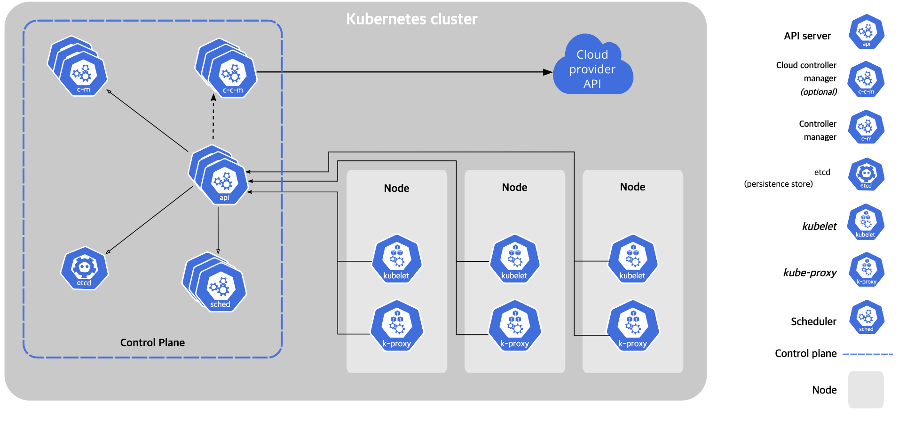

# 1 Kubernetes Components

**Cluster**

* 노드의 집합으로 Master Node와 Worker Node로 구성되어 있다

**Master Node**

* 다른 노드를 관리한다.
* Control Plane Components가 실행되는 곳

**Worker Node**

* 컨테이너화된 애플리케이션을 실행한다.

# 2 Control Plane Components

> 전체 쿠버네티스 시스템을 관리하고 통제하는 쿠버네티스 컨트롤 플레인을 관장

* Control Plane Components에는 API Server, Scheduler, Controller Manager, etcd가 있다.
* Control Plane Components는 클러스터를 관리하는 기능을 제공한다
* Control Plane Components는 단일 마스터 노드에서 실행되거나 여러 노드로 분할되고 복제돼 고가용성이 보장된다
* 마스터 노드에서는 클러스터의 상태를 유지하고 제어하지만 애플리케이션을 직접 실행하는 것은 아니다.

## 2.1 API Server

* API Server는 Control Plane Component이다.
* API Server는 control plane의 프론트엔드라고 할 수 있다.
* Worker Node의 kubelet과 커뮤니케이션 한다.
* 오직 API Server만이 etcd와 직접적인 커뮤니케이션이 가능하다.
* kubectl 요청이 API Server에 전달된다
* 쿠버네티스 시스템 구성 요소는 오직 API 서버하고만 통신한다.
  * 서로 직접 통신하지 않는다.
  * 다른 구성 요소는 etcd와 직접 통신하지 않고 API 서버를 통해 클러스터 상태를 변경한다.

### 2.1.1 API Server의 기능

- API Server는 쿠버네티스의 모든 구성 요소와 kubectl 같은 클라이언트에서 사용하는 중심 구성 요소다.
- API Server는 클러스터 상태를 조회하고 변경하기 위해RESTful API로 CRUD 인터페이스를 제공한다.
  - 상태는 etcd 안에 저장한다.
- 오브젝트를 etcd에 저장하는 일관된 방법은 제공하는 것 외에 오브젝트 유효성 검사를 하기 때문에 잘못 설정된 오브젝트를 저장할 수 없다.

**kubectl**

- 예를 들어 JSON 파일에서 리소스를 생성할 때 kubectl은 파일 내용을 API Server에 HTTP POST 요청으로 전달한다.

### 2.1.2 요청 처리 과정

1. 인증 플러그인으로 클라이언트 인증

   - 요청을 보낸 클라이언트를 인증하며 하나 이상으로 구성된 인증 플러그인에 의해 수행된다.
   - HTTP 요청을 검사해 수행하는데 인증 방법에 따라 클라이언트 인증서 HTTP 헤더에서 사용자를 가져온다.
   - 인증 플러그인은 다음 방법을 사용해 클라이언트의 아이덴티티를 얻는다.
     - 클라이언트의 인증서
     - HTTP 헤더로 전달된 인증 토큰
     - 기본 HTTP 인증
     - HTTP 헤더로 전달된 인증 토큰과 기본 HTTP 인증 추천하지 않는 방식
       - 1.19 버전부터 Deprecated 됨
       - 스태틱한 페스워드 파일 또는 토큰 파일을  kube-api 서버 설정에 지정하면 된다.
       - `비밀번호,유저이름,유저ID` 엔트리를 갖는 `user-details.csv` 파일을 만들어 kube-apiserver 설정에 `--basic-auth-file=user-details.csv`를 등록한다.

   - 인증 플러그인은 인증된 사용자의 이름과 그룹을 반환하며 이를 인가 플러그인이 사용한다.

2. 인가 플러그인으로 클라이언트 인가

   - 하나 이상의 인가 플러그인에 의해 인가가 수행된다.
   - 인증된 사용자가 요청한 작업이 요청한 리소스 대상으로 수행할 수 있는지를 판별
   - 예를 들어 사용자가 요청한 네임스페이스에 파드를 생성할 수 있는지 권한을 판별한다.

3. 어드미션 컨트롤 플러그인으로 요청된 리소스 확인과 수정

   - 리소스를 생성, 수정, 삭제하려는 요청인 경우 어드미션 컨트롤로 보내진다.

   - 데이터를 읽는 요청의 경우 어드미션 컨트롤을 거치지 않는다.
   - 어드미션 컨트롤 플러그인은 리소스 정의에서 누락된 필드를 기본값으로 초기화하거나 재정의하는 역할을 한다.

4. 리소스 유효성 확인 및 영구 저장

   - 오브젝트의 유효성을 검증하고 etcd에 저장한다.

5. 클라이언트에 응답 반환

### 2.1.3 API Server가 리소스 변경을 클라이언트에 통보하는 방법

- API Server는 앞서 알아본 요청 처리 과정 외에 다른 것을 아무것도 하지 않는다.
- 예를 들어 레플리카셋을 만들 때 파드를 만들거나 서비스의 엔드포인트를 관리하지 않는다.
  - 이것은 컨트롤러 매니저의 역할이다
  - 또한 API Server가 이러한 컨트롤러에 무엇을 해야하는지 알려주지 않는다.
  - 단지 컨트롤러와 다른 구성 요소가 배포된 리소스의 변경 사항을 관찰할 수 있도록 하면 된다.
- 컨트롤 플레인 요소는 리소스가 생성, 수정, 삭제될 때 통보를 받을 수 있도록 API Server에 요청할 수 있다.
  - 이렇게 해서 구성 요소가 클러스터 메타데이터 변경에 대응에 각자의 작업을 수행할 수 있다.

**통보 받는 방법**

- 클라이언트는 API Server에 HTTP 연결을 맺고 변경 사항을 감지한다.
- 이 연결을 통해 클라이언트는 대상 오브젝트의 변경을 알 수 있는 스트림을 받는다.
- 대상 오브젝트가 변경되면 API Server는 연결된 모든 클라이언트에게 새로운 버전의 오브젝트를 보낸다.

**kubectl**

- kubectl은 리소스 변경을 감시할 수 있는 API Server의 클라이언트 중 하나다.
- `kubectl get pods --watch` 명령어로 파드의 생성, 수정, 삭제 통보를 받을 수 있다.

## 2.2 Scheduler

* 현재 노드의 상태를 점검하고 pod를 배치할 최상의 노드를 결정하는 역할을 한다

* API Server가 etcd의 노드 정보를 가지고 Scheduler에게 파드를 어디에 배치할지 요청한다.
* 스케줄러는 API 서버로 파드 정의를 갱신하고 API 서버는 감시 메커니즘을 통해 kubelet에 파드가 스케줄링 된 것을 통보한다.
* 대상 노드의 kubelet은 파드가 해당 노드에 스케줄링 된 것을 확인하고 파드의 컨테이너를 생성하고 실행한다.

**Schedule 과정**

- Schedule 과정은 아래와 같이 크게 두 부분으로나눌 수 있다.

1. 모든 노드 중에서 파드를 스케줄링할 수 있는 노드 목록을 필터링 한다.
2. 수용 가능한 노드의 우선순위를 정하고 점수가 가장 높은 노드를 선택한다.
   - 가장 높은 점수를 가진 노드가 여려개라면 라운드 로빈을 사용한다.

### 2.2.1 수용 가능한 노드 찾기

- 파드를 수용할 수 있는 노드를 찾기 위해 스케줄러는 미리 설정된 조건 함수 목록에 각 노드를 전달한다.
- 조건 함수는 다음과 같은 다양한 조건을 확인한다.
  - 노드가 하드웨어 리소스에 대한 파드 요청을 충족시킬 수 있는가?
  - 노드에 리소스가 부족한가?
  - 파드가 특정 노드로 스케줄링하도록 요청한 경우에 해당 노드인가?
  - 노드가 파드 정의에 노드 셀렉터와 일치하는 레이블을 가지고 있는가?
  - 파드가 노드의 테인트를 허용하는가?
  - 파드가 노드와 파드의 어피니티, 안티 어피니티 규칙을 지정했는가? 지정했다면 이 노드에 파드를 스케줄링하면 이러한 규칙을 어기게 되는가?

### 2.2.2 파드에 적합한 노드 선택

- 수용 가능한 노드의 우선순위를 정하고 점수가 가장 높은 노드를 선택한다.
- 가장 높은 점수를 가진 노드가 여려개라면 라운드 로빈을 사용한다.

## 2.3 Controller-Manager

* Worker Node를 모니터링하고 제어한다.
* 구성 요소 복제, 워커 노드 추적, 노드 장애 처리 등 클러스터 수준 기능을 실행
* Node Controller와  Replication Controller등으로 구성된다

**Node Controller**

* 노드의 상태를 모니터링 하고 적절한 조치를 취하는 역할을 한다
* 일정 간격으로 워커 노드로 부터 하트 비트를 받는다
* 일정 기간동안 한 워커 노드로 부터 하트 비트를 받지 못하면 해당 노드의 팟을 다른 정상적인 노드로 옮긴다

**Replication Controller**

* Replica Set의 상태를 모니터링 하고 Replica Set의 목표 상태를 유지하도록 조치하는 역할을 한다
* 예시) pod하나가 죽으면 pod을 새로 뛰운다

## 2.4 etcd

* etcd는 클러스터 구성을 지속적으로 저장하는 안정적인 분산 키 밸류 데이터 스토리지다.
* 분산저장이 가능하므로 하나의 etcd에 장애가 나더라도 시스템의 가용성을 확보할 수 있다.
* 클러스터의 구성 요소들의 모든 상태 값이 저장되는 곳
  * Node, Pod, Config, Secrets, Accounts, Roles 등의 정보
  * `kubectl get` 로 조회하는 모든 정보들이 etcd에 들어있다
* etcd 외의 다른 구성요소는 상태 값을 관리하지 않는다
* 오직 API Server만이 etcd와 직접적인 커뮤니케이션이 가능하다.
  * 다른 구성 요소들은 API 서버를 통해 간접적으로 데이터를 읽거나 쓸 수 있다.

## 2.5 kubelet

- 컨트롤 플레인 구성 요소를 파드로 실행하기 위해 kubelet도 마스터 노드에 배포된다.

## 2.6 Ports

- [레퍼런스](https://kubernetes.io/docs/reference/ports-and-protocols/#control-plane)

| Protocol | Direction | Port Range | Purpose                 | Used By              |
| -------- | --------- | ---------- | ----------------------- | -------------------- |
| TCP      | Inbound   | 6443       | Kubernetes API server   | All                  |
| TCP      | Inbound   | 2379-2380  | etcd server client API  | kube-apiserver, etcd |
| TCP      | Inbound   | 10250      | Kubelet API             | Self, Control plane  |
| TCP      | Inbound   | 10259      | kube-scheduler          | Self                 |
| TCP      | Inbound   | 10257      | kube-controller-manager | Self                 |

# 3 Node Components

* Node Components에는 docker, kubelet, kube-proxy가 있다.
* Node Components는 모든 node에서 실행된다
  * 즉 master node, worker node 모두에서 실행된다

## 3.1 kubelet

* 클러스터 내에 모든 노드에서 실행되는 에이전트이다.
* Master Node와 커뮤니케이션을 위해 필요함
* kubelet은 파드가 아니라 시스템 구성 요소(데몬)으로 실행된다.

**kubelet의 역할**

* 쿠버네티스 클러스터에 노드를 등록한다
* pod를 생성하기 위해 컨테이너 런타임에 요청을 전달한다.
* 노드와 pod 모니터링하고 그 결과를 kube-apiserver에 주기적으로 전송한다.

**cAdvisor**

- kubelet에는 cAdvisor가 포함됨
- cAdvisor는 Node의 자원 사용량을 모니터링하고 컨테이너의 성능을 분석한다.
- 특정 Node에서 실행되고 있는 모든 Container의 CPU와 Memory, File, Network 사용량 등 System metrics 정보를 수집한다.
- cAdvisor는 수집한 정보를 kubelet의 메모리에 올려놓는다.

## 3.2 kube-proxy

* kube-proxy는 쿠버네티스 클러스터 내 모든 노드에서 실행되는 프로세스다.
* Node 와 Pod 의 네트워크 커뮤니케이션을 관리힌다
* kube-proxy는 각각의 노드에서 network rules을 관리한다.
* 기본적으로 kube-proxy가 iptable(network rules)을 관리해 파드 네트워크를 가능하게 한다.

## 3.3 Container runtime

* 컨테이너 런타임은 컨테이너 실행을 담당하는 소프트웨어이다.
* Kubernetes는 CRI를 지키는 컨테이너 런타임을 필요로한다.
  * 대표적으로 Docker, CRI-O, containerd가 있다.

## 3.4 Ports

| Protocol | Direction | Port Range  | Purpose            | Used By             |
| -------- | --------- | ----------- | ------------------ | ------------------- |
| TCP      | Inbound   | 10250       | Kubelet API        | Self, Control plane |
| TCP      | Inbound   | 30000-32767 | NodePort Services† | All                 |

# 4 애드온 구성 요소

- 컨트롤 플레인과 노드에서 실행되는 구성 요소 외에도 클러스터에 지금까지 설명한 모든 기능을 제공하기 위해 몇 가지 추가 구성 요소가 필요하다
- 쿠버네티스 DNS 서버
- 대시보드
- 인그레스 컨트롤러
- 힙스터
- 컨테이너 네트워크 인터페이스 플러그인

참고

- https://kubernetes.io/docs/concepts/overview/components/