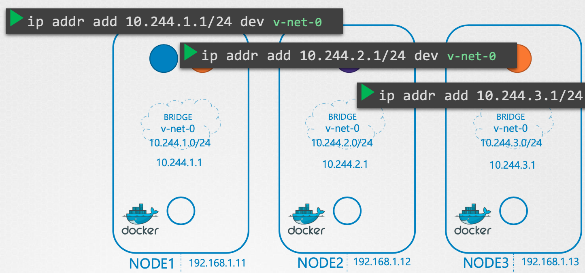
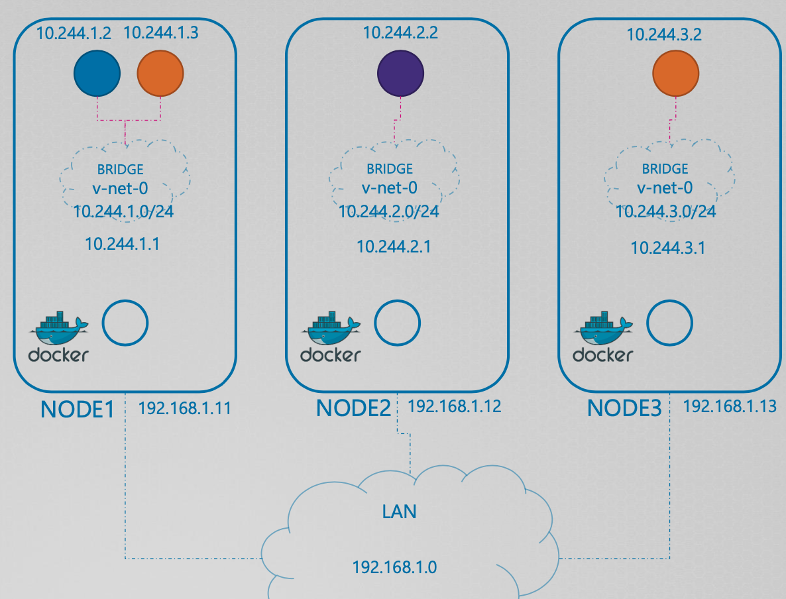
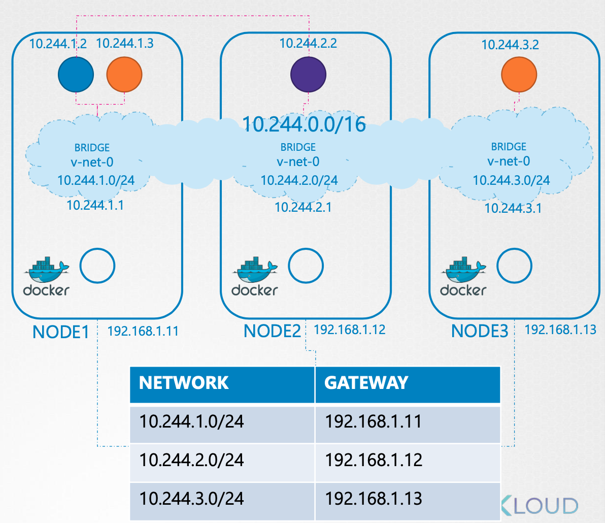

# 1 Pod

* 하나 이상의 어플리케이션 컨테이너와 그들의 리소스(volumes, IP, run config)를 가지고있다.

  * 하나의 container를 갖는 것이 권장된다.

* 쿠버네티스(Master Node)에 의해 생성되고 관리된다.

* 다른 pod와 리소스(volumes)를 공유 할 수 있다.

* Cluster-internal IP를 가지고 있다.

  * 클러스터 밖에서 접근 할 수 없다.
  * pod가 교체되면 IP 주소 또한 바뀐다.

* 한 pod에 포함된 container끼리  localhost를 통해 통신할 수 있다.

* pod는 수명이 짧다. 

  * 쿠버네티스는 필요에따라 pod를 시작하고 중지하고 교체한다.


**파드에는 항상 하나의 컨테이너만 존재해야 할까?**

* Nginx 컨테이너가 실행되기 위해 부가적인 기능이 필요할 수 있다.
  * 하나의 완전한 어플리케이션을 주된 컨테이너와 보조적인 컨테이너가 구성하는 것
  * 예를 들면 로그 수집를 수집해주는 컨테이너를 Nginx 컨테이너와 함께 포드에 포함시킬 수 있다
* 이런 부가적인 컨테이너를 `사이드카 컨테이너`라고 부른다
* 사이드카 컨테이너는 포드 내의 다른 컨테이너와 네트워크 환경을 공유하기 때문에 포드에 포함된 컨테이너들은 모두 같은 워커 노드에서 실행된다


# 2 Resource sharing and communication

- [레퍼런스](https://kubernetes.io/docs/concepts/workloads/pods/#resource-sharing-and-communication)
- 파드에 속한 컨테이너들은 데이터를 공유, 네트워크 통신을 손쉽게 할 수 있다.


## 2.1 Storage

- 파드에 공유되는 스토리지 볼륨을 정의할 수 있다.
- 파드에 속한 모든 컨테이너들은 공유 스토리지에 접근이 가능하다.


## 2.2 Pod networking

- 파드에 속한 각각의 컨테이너들은 네트워크 네임스페이스를 공유한다.
  - 동일한 IP 주소를 할당받는다.

- 같은 파드에 속한 컨테이너와 `localhost`로 통신이 가능하다


# 3 Pod 생성하기

- Pod를 아래처럼 직접 정의해서 사용하는 일은 없다.

* 일반적으로 `Deployment를` 이용해 `Pod`를 관리한다


**nginx-pod.yml 작성**

```yml
apiVersion: v1
kind: Pod
metadata:
  name: my-nginx-pod
spec:
  containers:
  - name: my-nginx-container
    image: nginx:latest
    ports:
    - containerPort: 80
      protocol: TCP
```

`apiVersion`: 오브젝트 API 버전을 나타낸다

`kind`: 리소스의 종류를 나타낸다

`metadata`: 라벨, 주석, 이름 등과 같은 리소스의 부가 정보를 입력한다

`spec`: 리소스를 생성하기 위한 자세한 정보를 입력한다.


**포드 생성하기**

```bash
# 포드 생성
$ kubectl apply -f nginx-pod.yml
pod/my-nginx-pod created

# 포드 조회
$ kubectl get pods
NAME                       READY   STATUS    RESTARTS   AGE
my-nginx-pod               1/1     Running   0          20s
```


# 4 Container probes

- [레퍼런스](https://kubernetes.io/docs/concepts/workloads/pods/pod-lifecycle/#container-probes)
- `kubelet`이 컨테이너의 상태를 진단하는데 이를 `probe `라고 한다.
- `kubelet`은 주기적으로 probe를 실행한다.
- probe의 결과로  `Success`, `Failure`, `Unknown`가 있으며 `Failure` 인 경우 정책에 따라 컨테이너를 재시작 할 수 있다.


## 4.1 Check mechanisms

- `kubelet`은 아래 4 가지 방법을 이용해서 컨테이너의 상태를 진단한다.


**exec**

- 지정된 command를 컨테이너 안에서 실행하고 status code 0 로 끝나면 성공으로 간주한다.


**grpc**

- gRPC를 사용하여 원격 프로시저 호출을 수행한다. 
- 대상은 gRPC 상태 검사를 구현해야 한다. 응답 상태가 SERVING인 경우 진단이 성공한 것으로 간주된다.


**httpget** 

- 파드의 IP 주소와 지정된 포트와 path로 HTTP GET 요청을 보낸다
- 응답으로 200에서 400 미만의 status code를 받으면 성공으로 간주한다.
- 전혀 응답하지 않으면 probe가 실패한 것으로 간주한다.


**tcpSocket**

- 컨테이너의 지정된 포트에 TCP 연결을 시도한다.
- 연결에 성공하면 probe가 성공한 것이고 그렇지 않으면 실패로 간주한다.


## 4.2 Types of probe

**livenessProbe**

- 컨테이너가 `실행 중`임을 나타낸다.
- livenessProbe가 실패하면 kubelet은 해당 컨테이너를 죽이고 restart policy에 따라 후 처리한다.


**readinessProbe**

- 컨테이너가 `요청을 응답할 준비`가 되었음을 나타낸다.
- readiness probe가 실패하면 엔드포인트 컨트롤러가 해당 파드의 IP를 모든 서비스의 엔드포인트에서 제거한다.


**startupProbe**

- 컨테이너의 애플리케이션이 `시작되었음`을 나타낸다.
- startup probe가 완료되기 전 까지 다른 모든 probe는 비활성화 된다.
- startup probe가 실패하면 kubelet은 해당 컨테이너를 죽이고 restart policy에 따라 후 처리한다.


## 4.3 livenessProbe

- 운영 환경에서는 실행 중인 파드는 반드시 라이브니스 프로브를 정의해야 한다.
- 라이브니스 프로브는 너무 많은 연산 리소스를 사용해서는 안된다.
- 프로브의 CPU 사용 시간은 컨테이너 CPU 시간 할당량으로 계산되어 라이브니스 프로브가 무거운 경우 컨테이너가 사용할 수 있는 CPU 시간이 줄어들게 된다.


**HTTP request**

- [Define a liveness HTTP request](https://kubernetes.io/docs/tasks/configure-pod-container/configure-liveness-readiness-startup-probes/#define-a-liveness-http-request)
- kublet이 HTTP GET를 요청하고 컨테이너의 응답으로 200에서 400 미만의 status code를 받으면 성공으로 간주한다.


```yaml
apiVersion: v1
kind: Pod
metadata:
  labels:
    test: liveness
  name: liveness-http
spec:
  containers:
  - name: liveness
    image: registry.k8s.io/liveness
    args:
    - /server
    livenessProbe:
      httpGet:
        path: /healthz
        port: 8080
        httpHeaders:
        - name: Custom-Header
          value: Awesome
      initialDelaySeconds: 3
      periodSeconds: 3
      timeoutSeconds: 1
```

`periodSeconds`

- kubelet이 liveness probe를 지정된 시간 마다 진행한다.

`timeoutSeconds`

- HTTP 요청의 응답을 기다리는 시간 해당 시간이 지나면 실패로 간주한다.

`initialDelaySeconds`

- kubelet이 지정된 시간 만큼 대기한 후 liveness probe를 시작한다.
- 애플리케이션의 시작 시간을 고려해 초기 지연을 설정해야 한다.

`livenessProbe.httpGet`

- HTTP GET 요청으로 liveness probe를 진행한다.

`path, port`

- HTTP GET 요청의 path와 port를 지정한다.
- HTTP path 엔드포인드테 인증이 필요하지 않은지 확인하자.
  - 인증이 필요한 경우 프로브가 항상 실패해 컨테이너가 무한정 재시작된다.


**예시**

- [Define a liveness command](https://kubernetes.io/docs/tasks/configure-pod-container/configure-liveness-readiness-startup-probes/#define-a-liveness-command)

- [Define a TCP liveness probe](Define a TCP liveness probe)


## 4.4 readinessProbe

- 파드의 레이블이 서비스의 레이블 셀렉터와 일치할 경우 파드가 서비스의 엔드포인트로 포함된다.
- 새로운 파드가 만들어지자마자 서비스의 일부가 돼 요청이 해당 파드로 전달되면 어떻게 될까?
  - 해당 파드가 즉시 요청을 처리할 준비가 돼 있지 않을 수 있다.
- 이러한 경우 `readinessProbe`를 통해 특정 `파드가 클라이언트 요청을 수신할 수 있는지 진단`한다.
- 라이브니스 프로브와 마찬가지로 exec, tcp, httpget 메커니즘을 사용할 수 있다.
- 프로브 결과에 따라 파드가 준비되지 않았다고 하면 서비스에서 제거되고 준비되면 서비스에 다시 추가된다.
  - 레디니스 프로브에 실패한 파드로 요청이 전달되지 않는다.
- 라이브니스 프로브와 달리 결과가 실패하더라도 컨테이너를 재시작하지 않는다.


**주의사항**

- 레디니스 프로브를 항상 정의하라
- 레디니스 프로브를 정의하지 않으면 파드가 시작하는 즉시 서비스 엔드포인트가 된다.


## 4.5 startupProbe


# 5 Pod Networking

- 쿠버네티스는 파드 네트워크 솔루션을 직접 제공하지 않는다.
- 쿠버네티스는 네트워크 모델을 정의했고 이 정의를 구현한 구현체를 사용해 파드 네트워크를 형성한다.
- 구현체로 weave, flannel, calico 등이 있다.


## 5.1 Networking Model(CNI)

- 쿠버네티스가 정의한 스펙은 아래와 같다.

1. Every POD should have an IP Address
2. Every POD should be able to communicate with every other POD in the same node.
3. Every POD should be able to communicate with every other POD on other nodes without NAT.


## 5.2 구현체 살펴보기

구현체들이 어떻게 구현했는지 리눅스의 기술을 사용해서 모방해보자. 먼저 아래와 같이 노드 3개가 있고 각각 포드들이 있다. 각각의 컨테이너 마다 네트워크 네임스페이스를 가지고 있다. 이를 연결하기 위해 각각의 노드마다 브리지를 만들고 up 시킨다.

```bash
$ ip link add v-net-0 type bridge
$ ip link set dev v-net-0 up
```


각각 노드의 브리지는 자신만의 서브넷을 가지고있으며 아래와 같이 각각 브리지 인터페이스에 IP 주소를 할당한다.




기본 세팅은 끝났고 이제 컨테이너가 생성될 때 마다 적용할 수 있는 스크립트가 필요하다. 스크립트가 하는 일은 아래와 같다. 브리지 네트워크와 연결할 수 있는 veth 쌍을 만들고 하나는 네임스페이스에 다른 하나는 브리지에 연결한다.이후 아이피 주소를 할당하고 인테페이스를 업 상태로 변경한다.

**net-script.sh**

```sh
# Create veth pair
ip link add ......

# Attach veth pair
ip link set ...... ip link set ......

# Assign IP Address
ip -n <namespace> addr add ...... 
ip -n <namespace> route add ......

# Bring Up Interface
ip -n <namespace> link set ...... 
```


모든 컨테이너가 생성될 때 해당 스크립트를 실행하면 아래와 같이 컨테이너가 각 브리지의 서브넷 안에서 IP를 할당받은 상태가 된다. 이 상태로 1, 2번 조건을 만족한다. 모든 파드가 IP 주소를 가지고 있고 같은 노드의 파드와 통신할 수 있다.




아래와 같은 라우팅 테이블을 가지면 각각의 브리지 네트워크를 묶는 10.244.0.0/16 이라는 네트워크 하나로 묶을 수 있다. 다른 포드와 통신이 가능해 진다.




## 5.3 kubelet and CNI

- 이전 예시로 리눅스 기술을 사용해 파드 네트워크를 구성해 봤다.
- 파드가 생성될 때 이러한 스크립트를 자동으로 실행시킬 수 없을까?
- kubelet은 각각의 노드에서 컨테이너를 생성하는 역할을 담당한다.
- kubelet은 컨테이너를 생성할 때 CNI 기준에 맞는 스크립트를 자동으로 실행해 컨테이너 네트워크 설정을 한다.
  - `--cni-bin-dir=/etc/cni/bin` :/etc/cni/bin에서 스크립트를 찾아 실행한다
  - `./net-script.sh add <container> <namespace>` 이러한 스크립트를 실행시킴


```bash
ps -aux | grep kubelet
root        3295  1.7  1.2 1935536 96624 ?       Ssl  13:01   7:59 /usr/bin/kubelet --bootstrap-kubeconfig=/etc/kubernetes/bootstrap-kubelet.conf --kubeconfig=/etc/kubernetes/kubelet.conf --config=/var/lib/kubelet/config.yaml --container-runtime=remote --container-runtime-endpoint=unix:///var/run/containerd/containerd.sock --pod-infra-container-image=registry.k8s.io/pause:3.8
kim        50806  0.0  0.0  19176  2628 pts/0    S+   20:32   0:00 grep --color=auto kubelet
```


**net-script.sh**

```sh
ADD)
# Create veth pair
ip link add ......

# Attach veth pair
ip link set ...... ip link set ......

# Assign IP Address
ip -n <namespace> addr add ...... 
ip -n <namespace> route add ......

# Bring Up Interface
ip -n <namespace> link set ...... 

# DEL
ip link del
```


# 6 Static Pod

- Static Pod이란 API server의 관여없이 kubelet 데몬이 직접 관리하는 파드를 말한다.
- 대부분의 파드는 컨트롤 플레인에 의해서 관리되지만 스태틱 파드는 kubelet이 직접 관리하며 파드가 실패하면 자동으로 재시작한다.
- kubelet은 자동으로 미러 파드를 만들어 API Server로 부터 보여지지만 관리는 받지 않는다.
  - 미러 파드는 읽기 전용으로 API Server가 디테일을 볼 수 있지만 수정하거나 삭제할 수 없다.


**Static Pod 정의하기**

- 파드 디테일을 API server로 부터 받지 않기 때문에 특정 경로에 파드 데피니션 파일을 정의한다.
- 특정 디렉토리에 pod.yaml을 작성하면 kublet 주기적으로 체크해서 파일에 정의된 파드를 생성하고 파일을 제거하면 파드를 제거한다.


**경로 확인하기**

- kublet의 설정 파일 `/var/lib/kubelet/config.yaml` 에서 `staticPodPath`를 확인한다.
- `/etc/kubernetes/manifests` 경로에 파드 데피니션을 정의하면 Static Pod를 만들 수 있다.
- `staticPodPath`을 수정하면 kubelet을 꼭 재시작해야한다.

``` bash
$ sudo cat /var/lib/kubelet/config.yaml
...
staticPodPath: /etc/kubernetes/manifests
...
```


**용도**

- 스태픽 파드는 컨트롤 플레인의 관여가 없는 파드이기 때문에 컨트롤 플레인 컴포넌트를 생성할 때 사용된다.
- 스태틱 파드의 이름 끝에 노드의 이름을 붙인다.
- 아래의 파드 목록에서 `etcd`, `kube-apiserve`, `kube-controller-manager`, `kube-scheduler`가 스태틱 파드다.

```
kubectl get pods -n kube-system
NAME                                  READY   STATUS             RESTARTS          AGE
coredns-565d847f94-56rrx              1/1     Running            0                 6d14h
coredns-565d847f94-rjjzq              1/1     Running            0                 6d14h
etcd-master-node                      1/1     Running            127 (6d14h ago)   6d14h
kube-apiserver-master-node            1/1     Running            153 (6d14h ago)   6d14h
kube-controller-manager-master-node   1/1     Running            169 (6d14h ago)   6d14h
kube-proxy-7rv28                      1/1     Running            0                 6d13h
kube-proxy-999bd                      0/1     CrashLoopBackOff   1208 (43s ago)    6d13h
kube-proxy-ntf6g                      1/1     Running            0                 6d13h
kube-proxy-sd6ww                      1/1     Running            0                 6d13h
kube-proxy-sxsj9                      1/1     Running            1 (6d14h ago)     6d14h
kube-scheduler-master-node            1/1     Running            170 (6d14h ago)   6d14h
```

```bash
# 컨트롤 플레인의 스태틱 파드 확인
$ ls /etc/kubernetes/manifests/
etcd.yaml  kube-apiserver.yaml  kube-controller-manager.yaml  kube-scheduler.yaml
```


# 7 Pod Phase

- [레퍼런스](https://kubernetes.io/docs/concepts/workloads/pods/pod-lifecycle/#pod-phase)


## 7.1 Pending

- 포드가 쿠버네티스 클러스터에서 승인되었지만 하나 이상의 컨테이너가 설정되지 않았으며 실행할 준비가 되지 않은 상태
- 파드가 스케쥴링 되기를 기다리거나 컨테이너 이미지를 다운 받는 상태가 `Pending` 상태이다


## 7.2 Running

- 포드가 노드에 바인딩되었으며 모든 컨테이너가 생성된 상태를 말한다.
- 하나 이상의 컨테이너가 아직 실행 중이거나 시작 중 또는 다시 시작 중일 수 있다.


## 7.3 Succeeded

- 포드의 모든 컨테이너가 성공적으로 종료되었으며 다시 시작되지 않는 상태를 말한다.


## 7.4 Failed

- Pod의 모든 컨테이너가 종료되었으며 하나 이상의 컨테이너가 오류로 종료된 상태다. 
- 즉, 컨테이너가 0이 아닌 상태로 종료되었거나 시스템에 의해 종료되었음을 나타낸다.


# 8 init Container

- [레퍼런스](https://kubernetes.io/docs/concepts/workloads/pods/init-containers/)
- 앱 컨테이너를 실행하기 전에 미리 실행되는 컨테이너를 의미한다.
- 앱 컨테이너가 실행되기 전에 사전 작업이 필요한 경우에 사용한다.
- 여러개의 init container를 사용하는 경우 kubelet은 순차적으로 실행한다.
  - 각각의 init container가 성공해야 다음 init container가 실행된다.
  - 모든 init container가 완료되면 kubelet은 앱 컨테이너를 실행한다.


## 8.1 사용하기

- 아래의 예시는 두 개의 init container를 사용하고 있다.
- 먼저 myservice를 실행되기를 기다리고 두 번째로 mydb가 실행되기를 기다린다.
- 두 개의 init container가 완료되면 앱 컨테이너가 실행된다.

```yaml
apiVersion: v1
kind: Pod
metadata:
  name: myapp-pod
  labels:
    app.kubernetes.io/name: MyApp
spec:
  containers:
  - name: myapp-container
    image: busybox:1.28
    command: ['sh', '-c', 'echo The app is running! && sleep 3600']
  initContainers:
  - name: init-myservice
    image: busybox:1.28
    command: ['sh', '-c', "until nslookup myservice.$(cat /var/run/secrets/kubernetes.io/serviceaccount/namespace).svc.cluster.local; do echo waiting for myservice; sleep 2; done"]
  - name: init-mydb
    image: busybox:1.28
    command: ['sh', '-c', "until nslookup mydb.$(cat /var/run/secrets/kubernetes.io/serviceaccount/namespace).svc.cluster.local; do echo waiting for mydb; sleep 2; done"]
```


# 9 pause Container

- 파드를 만들면 pause라는 infra container가 포함된다.
- 파드 정의에 컨테이너를 하나만 명시해도 실제로 파드를 생성할 때 pause container도 같이 생성되고 삭제할 때 같이 삭제된다.


## 9.1 목적

- pause Container는 IP, 호스트 네임등 인프라를 관리하기 위해 사용된다.


# 10 명령어와 인자

- 컨테이너 이미지에 정의된 기본 명령을 실행하는 대신 다른 명령과 인자를 사용해 실행하는 것이 가능하다.


## 10.1 도커에서 명령어와 인자 정의

- 먼저 컨테이너에서 실행하는 전체 명령이 명령어와 인자의 두 부분으로 구성되어 있다.
- Dockerfile의 `ENTRYPOINT `와 `CMD` 으로 구성됨


`ENTRYPOINT`

- 컨테이너가 시작될 때 호출될 **명령어**를 정의한다.


`CMD`

- ENTRYPOINT에 전달되는 **인자**를 정의한다.
- `CMD` 명령어를 사용해 이미지가 실행될 때 실행할 명령어를 지정할 수 있지만 올바른 방법은 `ENTRYPOINT`로 명령어를 지정하고 기본 의자를 정의하려는 경우만 `CMD`를 지정하는 것이다.
- 그러면 아무런 인자도 지정하지 않고 이미지를 실행할 수 있다.


## 10.2 쿠버네티스에서 명령과 인자 재정의

- 쿠버네티스에서 컨테이너를 정의할 때 `ENTRYPOINT`와 `CMD` 둘 다 재정의할 수 있다

- `ENTRYPOINT`는 `spec.containers[].command`로 재정의할 수 있다
- `CMD`는 `spec.containers[].args`로 재정의할 수 있다

```yaml
apiVersion: v1
kind: Pod
metadata:
  name: nys
spec:
  containers:
  - image: some/image
    command: ["bin/command"]
    args: ["arg1", "arg2", "arg3"]
```

`spec.containers[].command`

- 컨테이너 안에서 실행되는 실행파일
- 파드 생성 이후 업데이트할 수 없다.


`spec.containers[].args`

- 실행파일에 전달되는 인자
- 파드 생성 이후 업데이트할 수 없다.
- 문자열 값을 따옴표로 묶을 필요는 없지만 숫자는 묶어야 한다.


# 11 환경변수

- 컨테이너화된 애플리케이션은 종종 환경변수를 설정 옵션의 소스로 사용한다.
- 파드의 각 컨테이너를 위한 환경변수 목록을 설정할 수 있다.
- 환경변수 목록은 파드 생성 후에는 업데이트할 수 없다.


**예시**

- 파드 레벨이 아닌 컨테이너 레벨에 환경변수를 설정한다.
- INTERVAL이란 환경변수의 값을 30으로 설정한다.
- 아래의 예시처럼 직접 value를 지정할 수 있고 `valueFrom` 필드를 사용해 컨피그맵 또는 시크릿에서 값을 가져올 수 있다.

```yaml
apiVersion: v1
kind: Pod
metadata:
  name: fortune-env
spec:
  containers:
  - name: html-generator 
  	image: luksa/fortune:env
    env:
    - name: INTERVAL
      value: "30"
```


참고

- [시작하세요! 도커/쿠버네티스](http://www.yes24.com/Product/Goods/84927385)
- https://kubernetes.io/docs/concepts/workloads/pods/
