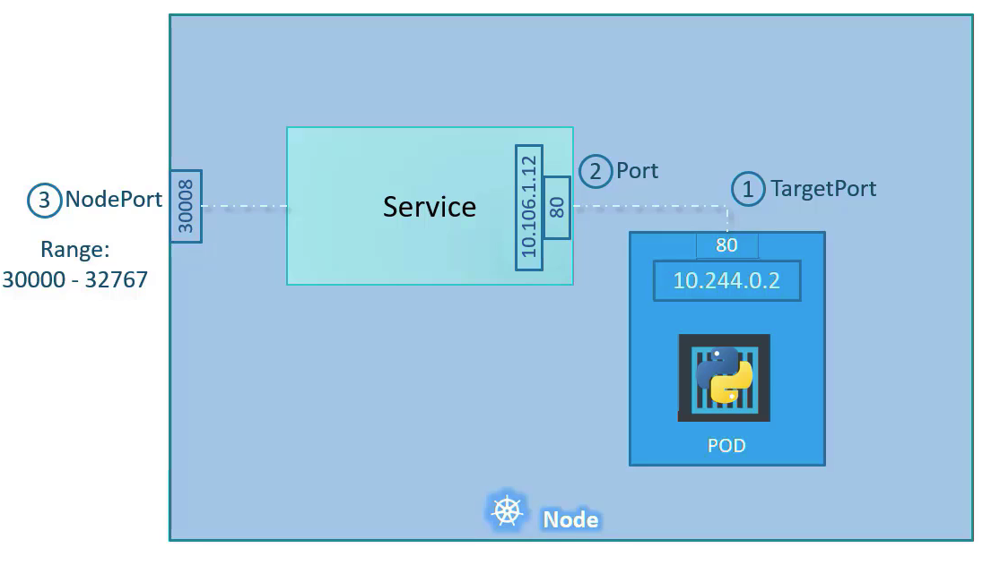

# 1 Service

* pod의 내부 IP 주소를 확인하고 포드로 접근할 수 있지만 이는 로컬 개발 환경 또는 쿠베네티스 클러스터 내부에서만 사용할 수 있다
  * 게다가 포드의 IP 주소는 영속적이지 않아 변할 수 있다
* Deployment가 pod를 생성할 때 pod를 외부로 노출하지 않는다
  * `containerPort`를 지정해도 pod가 바로 외부로 노출되는 것이 아니다
* pod를 외부로 노출해 사용자가 접근할 수 있도록 하려면 **Service**라는 오브젝트를 사용해야 한다
* Service는 여러 종류가 있으나 `ClusterIP`, `NodePort`, `LoadBalancer` 3가지 종류를 주로 사용한다.

 

## 1.1 Service의 핵심 기능

* 여러 개의 포드에 쉽게 접근할 수 있도록 고유한 도메인 이름을 부여한다
* 여러 개의 포드에 접근할 때, 요청을 분산하는 로드 밸랜서 기능을 제공한다
* 클라우드 플랫폼의 로드 밸랜서, 클러스터 노드의 포트 등을 통해 포트를 외부로 노출한다


**가상 아이피**

- 여러개의 파드를 묶어 `단일 진입점`을 제공하는 것이 서비스다.
- 서비스는 가상 아이피를 가지고 있고 이 가상 아이피 주소에 요청하면 요청을 로드밸런싱해서 파드로 요청을 전달한다.
- 모든 노드에는 `kube-proxy`가 작동 중인데 kube-proxy가 서비스에 가상 아이피를 할당하는 역할을 한다.
- 이 가상 아이피 주소와 포트는 서비스가 존재하는 동안 절대 바뀌지 않는다.


## 1.2 Defining a Service

```yaml
apiVersion: v1
kind: Service
metadata:
  name: my-service
spec:
  selector:
    app.kubernetes.io/name: MyApp
  ports:
    - protocol: TCP
      port: 80
      targetPort: 9376
```

`spec.selector`

* 어떠한 라벨을 가진 포드에 접근할 수 있게 만들지 결정한다

`spec.ports.port`

* 생성된 서비스는 서비스는 클러스터 내부에서 사용할 수 있는 IP를 할당 받는다
* `spec.ports.port`는 할당 받은 IP에 접근할 때 사용할 포트를 설정한다

`spec.ports.targetPort`

* `selector` 접근하려는 pod들이 내부적으로 사용하고 있는 포트를 입력한다
* pod 템플릿에 정의된 `containerPort`와 같은 값으로 설정한다

`spec.type`

* 서비스의 타입을 지정한다
* ClusterIP, NodePort, LoadBalancer 등을 설정할 수 있다


## 1.3 service의 타입

- ClusterIP, NodePort, LoadBalancer, ExternalName 타입을 제공한다.


## 1.4 세션 어피니티

- 클라이언트가 동일한 명령을 요청하면 서비스 프록시가 각 연결을 임의의 파드를 선택해 요청마다 다른 파드가 선택된다.
- 특정 클라이언트의 모든 요청을 매번 같은 파드로 리디렉션하려면 서비스의 `sesstionAffinity `를 사용하면 된다.
- `service.spec.sessionAffinity`를 `ClientIP `로 설정하면 된다.
- 서비스는 쿠키 기반 세션 어피니티를 제공하지 않는다. 
  - 서비스가 L4 수준의 로드밸랜서이기 때문이다.
  - 서비스는 TCP와 UDP 패킬을 처리하고 그들이 가지고 있는 페이로드는 신경쓰지 않기 때문이다.


# 2 ClusterIP

* 서비스에 클러스터 내부에서만 사용할 수 있는 주소인 ClusterIP가 할당된다.
* 쿠버네티스 내부에서만 pod를 접근할 때 ClusterIP 타입의 서비스를 사용한다
  * 외부로 pod를 노출하지 않기 때문에 클러스터 내부에서만 사용되는 pod에 사용한다

* 서비스의 타입을 명시하지 않으면 기본으로 ClusterIP 타입이 적용된다.


## 2.1 yaml 작성

**실습을 위한 deployment**

* 호스트의 이름을 반환하는 웹 서버

```yaml
apiVersion: apps/v1
kind: Deployment
metadata:
  name: hostname-deployment
spec:
  replicas: 3
  selector:
    matchLabels:
      app: webserver
  template:
    metadata:
      name: my-webserver
      labels:
        app: webserver
    spec:
      containers:
      - name: my-webserver
        image: alicek106/rr-test:echo-hostname
        ports:
        - containerPort: 80
```


**hostname-svc-clusterip.yaml 작성**

```yaml
apiVersion: v1
kind: Service
metadata:
  name: hostname-svc-clusterip
spec:
  ports:
    - name: web-port
      port: 8080
      targetPort: 80
  selector:
    app: webserver
  type: ClusterIP
```


## 2.2 생성 및 확인

```bash
# 서비스 생성
$ kubectl apply -f hostname-svc-clusterip.yaml

# 서비스 목록 조회
$  kubectl get svc
NAME                     TYPE           CLUSTER-IP      EXTERNAL-IP   PORT(S)          AGE
hostname-svc-clusterip   ClusterIP      10.108.80.60    <none>        8080/TCP         78s
kubernetes               ClusterIP      10.96.0.1       <none>        443/TCP          47h
```


## 2.3 접근

* 생성된 서비스를 통해 pod에 접근하려면 CLUSTER-IP 와 PORT를 통해 요청을 보내면 된다
* CLUSTER-IP는 쿠버네티스 클러스터에서만 사용할 수 있는 내부 IP이다
* 서비스의 IP 또는 서비스의 이름과 포트 통해 pod에 접근할 수 있다
* 별도의 설정 없이 로드 밸런싱이 수행된다

```bash
# 임시 pod를 만들어 요청을 전송해보자
$ kubectl run -it --rm debug --image=alicek106/ubuntu:curl --restart=Never -- bash

# 서비스의 IP와 포트로 pod 접근하기
$ curl 10.108.80.60:8080 --silent | grep Hello
        <p>Hello,  hostname-deployment-7dfd748479-jm7b4</p>     </blockquote>
$ curl 10.108.80.60:8080 --silent | grep Hello
        <p>Hello,  hostname-deployment-7dfd748479-lxf5f</p>     </blockquote>
$ curl 10.108.80.60:8080 --silent | grep Hello
        <p>Hello,  hostname-deployment-7dfd748479-qxvhx</p>     </blockquote>

# 서비스의 이름으로 pod 접근하기
$ curl hostname-svc-clusterip:8080 --silent | grep Hello
        <p>Hello,  hostname-deployment-7dfd748479-jm7b4</p>     </blockquote>
$ curl hostname-svc-clusterip:8080 --silent | grep Hello
        <p>Hello,  hostname-deployment-7dfd748479-lxf5f</p>     </blockquote>
$ curl hostname-svc-clusterip:8080 --silent | grep Hello
        <p>Hello,  hostname-deployment-7dfd748479-lxf5f</p>     </blockquote>
```


# 3 NodePort

* NodePort는 ClusterIP의 기능을 모두 포함한다.
  * 즉 클러스터 내에서만 사용가능한  ClusterIP 주소를 갖는다.

* 추가적으로 NodePort 타입을 사용하면 외부에서 pod에 접근할 수 있다
  * pod에 접근할 수 있는 포트를 클러스터의 모든 노드에 동일하게 개방한다
  * 클러스터의 모든 노드의 내부 IP(클러스터 아이피) 또는 외부 IP를 통해 개방된 포트로 접근하면 pod에 접근할 수 있다

* 접근할 수 있는 포트는 랜덤으로 정해진다
  * 특정 포트로 접근할 수 있게 설정할 수도 있다
* 실제 운영 환경에서 NodePort로 서비스를 외부에 제공하는 경우는 많지 않다
  * SSL 인증서 적용, 라우팅 등과 같은 복잡한 설정을 서비스에 적용하기 어렵기 때문
  * NodePort 서비스 그 자체를 사용하기 보다 인그레스 오브젝트를 통해 간접적으로 사용하는 경우가 많다





## 3.1 yaml 작성

**hostname-svc-nodeport.yaml 작성**

```yaml
apiVersion: v1
kind: Service
metadata:
  name: hostname-svc-nodeport
spec:
  type: NodePort
	selector:
    app: webserver
  ports:
    - name: web-port
      port: 8080
      targetPort: 80
      #nodePort: 30008
```

`spec.ports[].port`

- ClusterIP에서 수신할 포트

`spec.ports[].targetPort`

- 목적지 컨테이너 포트 번호

`spec.ports[].nodePort`

- 모든 쿠버네티스 노드 IP 주소에서 수신할 포트


## 3.2 생성 및 확인

* 서비스의 `30914`라는 포트는 모든 노드에서 동일하게 접근할 수 있게 개방된 포트를 의미한다
* 개방되는 포트는 기본적으로 30000 ~ 32768 중 랜덤으로 선택된다
  * 포트를 지정하고 싶다면 yaml에 `spec.ports.nodePort`으로 원하는 포트를 선택할 수 있다

```bash
# 서비스 생성
$ kubectl apply -f hostname-svc-nodeport.yaml
service/hostname-svc-nodeport created

# 서비스 목록 조회
$ kubectl get svc
NAME                    TYPE        CLUSTER-IP       EXTERNAL-IP   PORT(S)          AGE
hostname-svc-nodeport   NodePort    10.100.132.250   <none>        8080:30914/TCP   13s
kubernetes              ClusterIP   10.96.0.1        <none>        443/TCP          4m13s
```


## 3.3 접근

* 클러스터의 모든 노드에 내부 IP 또는 외부 IP를 통해 `30914` 포트로 접근하면 동일한 서비스에 연결할 수 있다
* `NodePort`  타입의 서비스가 `ClusterIP` 타입의 서비스의 기능을 포함하고 있기 때문에 CLUSTER-IP 또는 서비스 이름을 이용해 pod에 접근할 수 있다
  * 즉 `NodePort` 타입의 서비스는 내부 네트워크와 외부 네트워크 양쪽에서 접근할 수 있다
  * 외부에서 접근할 경우 노드의 IP와 개방된 포트로 접근한다
  * 내부에서 접근할 경우 서비스의 이름 또는 IP로 접근한다.
* `NodePort`를 사용하면 노드의 IP를 알아야만 포드에 접근할 수 있지만 `LoadBalancer`를 이용하면 클라우드 플랫폼으로부터 도메인 이름과 IP를 할당받기 때문에 더 쉽게 접근할 수 있다.

```bash
# 노드 목록 조회
$ kubectl get nodes -o wide
NAME         STATUS   ROLES                  AGE   VERSION   INTERNAL-IP   EXTERNAL-IP   OS-IMAGE                KERNEL-VERSION                CONTAINER-RUNTIME
gcloud-238   Ready    control-plane,master   47h   v1.21.3   10.7.27.17    <none>        CentOS Linux 7 (Core)   3.10.0-1160.15.2.el7.x86_64   docker://20.10.6
gcloud-239   Ready    <none>                 47h   v1.21.3   10.7.27.18    <none>        CentOS Linux 7 (Core)   3.10.0-1160.15.2.el7.x86_64   docker://20.10.6
gcloud-240   Ready    <none>                 47h   v1.21.3   10.7.27.19    <none>        CentOS Linux 7 (Core)   3.10.0-1160.25.1.el7.x86_64   docker://20.10.7

# 임시 pod를 만들어 요청을 전송해보자
$ kubectl run -it --rm debug --image=alicek106/ubuntu:curl --restart=Never -- bash

# 클러스터의 모든 노드의 내부 IP:`30914` 포트로 접근하면 동일한 서비스에 연결할 수 있다
$ curl 10.7.27.17:30914  --silent | grep Hello
        <p>Hello,  hostname-deployment-7dfd748479-lxf5f</p>     </blockquote>
$ curl 10.7.27.18:30914  --silent | grep Hello
        <p>Hello,  hostname-deployment-7dfd748479-lxf5f</p>     </blockquote>
$ curl 10.7.27.19:30914  --silent | grep Hello
        <p>Hello,  hostname-deployment-7dfd748479-jm7b4</p>     </blockquote>

# CLUSTER-IP "10.100.132.250"을 사용해 요청
$ curl 10.100.132.250:8080 --silent | grep Hello
        <p>Hello,  hostname-deployment-7dfd748479-qxvhx</p>     </blockquote>
$ curl 10.100.132.250:8080 --silent | grep Hello
        <p>Hello,  hostname-deployment-7dfd748479-jm7b4</p>     </blockquote>
$ curl 10.100.132.250:8080 --silent | grep Hello
        <p>Hello,  hostname-deployment-7dfd748479-lxf5f</p>     </blockquote>

# 서비스의 이름을 사용해 요청
$ curl hostname-svc-nodeport:8080 --silent | grep Hello
        <p>Hello,  hostname-deployment-7dfd748479-qxvhx</p>     </blockquote>
$ curl hostname-svc-nodeport:8080 --silent | grep Hello
        <p>Hello,  hostname-deployment-7dfd748479-qxvhx</p>     </blockquote>
$ curl hostname-svc-nodeport:8080 --silent | grep Hello
        <p>Hello,  hostname-deployment-7dfd748479-jm7b4</p>     </blockquote>
```


# 4 LoadBalancer

* 클라우드 플랫폼에서 제공하는 로드 밸런서를 동적으로 프로비저닝해 포드에 연결한다
* 외부에서 pod를 접근할 수 있다
* 일반적으로 AWS, GCP 등과 같은 클라우드 플랫폼 환경에서 사용할 수 있다
  * 온프레미스 환경에서 LoadBalancer를 사용하려면 MetalLb나 오픈스택 같은 특수한 환경을 직접 구축해야한다
* LoadBalancer 타입의 서비스는 클라우드 플랫폼으로부터 도메인 이름과 IP 주소를 할당받기 때문에 NodePort 보다 쉽게 pod에 접근할 수 있다
  * NodePort 는 각 노드의 IP 주소를 알아야 pod에 접근할 수 있다 


## 4.1 yaml 작성

```yaml
apiVersion: v1
kind: Service
metadata:
  name: hostname-svc-lb
spec:
  ports:
    - name: web-port
      port: 80
      targetPort: 80
  selector:
    app: webserver
  type: LoadBalancer
```


## 4.2 비교

- 앞서 NodePort는 ClusterIP의 기능을 포함한다고 했다.
- LoadBalancer는 ClusterIP와 NodePort 두 기능을 모두 포함한다.
- ClusterIP 처럼 클러스터 내부에서 사용할 수 있는 IP 주소가 할당되고 NodePort처럼 모든 노드에 특정 포트가 열러 LoadBalancer가 접근할 수 있도록 한다.


# 5 ExternalName

- 클러스터 안에서 외부에 접속 시 사용할 도메인을 서비스의 이름으로 접근할 수 있다.
  - `서비스이름.네임스페이스.svc.cluster.local` 이름으로 접근 가능

- 클러스터 DNS에 CNAME 레코드를 만든다고 생각하면 된다.
  - CNAME 레코드는 별칭과 도메인을 매핑해주는 레코드다
  - 여기서 별칭은 서비스의 이름이다.


## 5.1 yaml 작성

```yaml
apiVersion: v1
kind: Service
metadata:
  name: my-service
  namespace: prod
spec:
  type: ExternalName
  externalName: my.database.example.com
```

`spec.externalName`

- 외부 도메인을 설정한다.
- `my-service.prod.svc.cluster.local` 호스트를 조회하면 `my.database.example.com` 을 반환하도록 클러스터 DNS 서비스가 세팅된다.


# 6 kube-proxy

- Service는 가상의 객체로 실제 프로세스도 아니며 네임스페이스나 인터페이스를 가지고 있지 않다.
- 그런데 어떻게 서비스가 IP 주소를 가지고 파드에 요청을 전달할 수 있을까?
- 여기서 kube-proxy가 작동한다.
- kube-proxy는 특정 서비스의 아이피 주소 요청이 오면 이를 파드의 아이피 주소로 바꾸어 전달하는 포워딩 룰을 가지고 있다.
- kube-proxy의 이러한 포워딩 룰을 어떻게 만들까?
  - 3 가지 모드를 지원한다.
  - User space
  - iptables: 기본값
  - ipvs
- User space 모드는 현재 잘 사용하지 않는다.


## 6.1 iptables 모드

아래와 같이 3개의 파드가 있다.

```bash
$ kubectl get pods -o wide
NAME                                READY   STATUS    RESTARTS          AGE     IP                NODE      NOMINATED NODE   READINESS GATES
nginx-deployment-68fc675d59-kg8j9   1/1     Running   0                 2d21h   192.168.189.82    worker2   <none>           <none>
nginx-deployment-68fc675d59-mpdnw   1/1     Running   0                 2d21h   192.168.235.147   worker1   <none>           <none>
nginx-deployment-68fc675d59-nvmwh   1/1     Running   587 (2m24s ago)   2d21h   192.168.199.167   worker4   <none>           <none>
```


ClusterIP 타입의 서비스를 만들었다.

```bash
$ kubectl get service
NAME         TYPE        CLUSTER-IP     EXTERNAL-IP   PORT(S)   AGE
kubernetes   ClusterIP   10.96.0.1      <none>        443/TCP   6d17h
my-nginx     ClusterIP   10.96.82.159   <none>        80/TCP    35s
```


iptables을 확인해보면 서비스의 아이피 주소와 포트 넘버 10.96.82.159:80 의 요청을 3 개의 파드로 192.168.189.82:80, 192.168.199.167:80, 192.168.235.147:80로 포워딩하는 것을 볼 수 있다.

```bash
$ sudo iptables -L -t nat | grep my-nginx
KUBE-SVC-SV7AMNAGZFKZEMQ4  tcp  --  anywhere             10.96.82.159         /* default/my-nginx:http cluster IP */ tcp dpt:http
KUBE-MARK-MASQ  tcp  -- !192.168.0.0/16       10.96.82.159         /* default/my-nginx:http cluster IP */ tcp dpt:http
KUBE-SEP-UVOFIZSEWI2RUYNM  all  --  anywhere             anywhere             /* default/my-nginx:http -> 192.168.189.82:80 */ statistic mode random probability 0.33333333349
KUBE-SEP-LCU7RGNP43CTIDND  all  --  anywhere             anywhere             /* default/my-nginx:http -> 192.168.199.167:80 */ statistic mode random probability 0.50000000000
KUBE-SEP-IDBVHPLVKZAHS24Y  all  --  anywhere             anywhere             /* default/my-nginx:http -> 192.168.235.147:80 */
```


따라서 kube-proxy는 각각의 노드에서 service가 생성될 때 iptables rule을 생성한다. NodePort의 경우 해당하는 포트로 listen하고 클라이언트 연결을 받아서 iptables rule을 통해 파드와 연결한다.


# 7 Headless Service

- ClusterIP가 없는 서비스를 Headless Service라고 한다.
  - 다른 서비스에서 부하 분산을 위해 가상 IP를 제공했다.

- `서비스명.네임스페이스명.svc.cluster.local`로 coredns에 질의하면 라운드 로빈으로 Headless Service가 묶고있는 여러 파드의 IP 주소가 반환된다.

- 스테이트풀셋이 헤드리스 서비스를 사용하는 경우에만 파드명으로 IP주소를 디스커버리할 수 있다.
  - 이 경우 `파드명.서비스명.네임스페이스명.svc.cluster.local`로 질의하면 파드의 IP 주소가 반환된다.


**각 서비스와 엔드포인트 내용**

| 서비스 종류  | IP 엔드포인트 내용                                   |
| ------------ | ---------------------------------------------------- |
| ClusterIP    | 클러스터 내부에서만 통신이 가능한 가상 IP 주소       |
| NodePort     | 모든 클러스터 노드의 모든 IP 주소                    |
| LoadBalancer | 클러스터 외부에서 제공되는 로드밸런스의 가상 IP 주소 |


## 7.1 Headless Service 생성

- Headless Service를 생성하려면 아래 두가지 조건을 만족해야 한다.
  - `spec.type: ClusterIp`
  - `spec.clusterIp: None`
- 스테이트풀셋으로 생성된 파드명으로 디스커버리하는 경우
  - 서비스의 `metadata.name과` 스테이트풀셋의 `spec.serviceName` 이 같아야한다.


**sample-headless.yaml**

```yaml
apiVersion: v1
kind: Service
metadata:
  name: sample-headless
spec:
  type: ClusterIP
  clusterIP: None
  ports:
    - name: "http-port"
      protocol: "TCP"
      port: 80
      targetPort: 80
  selector:
    app: sample-app
```


**sample-statefulset-headless.yaml**

- `metadata.name과` 스테이트풀셋의 `spec.serviceName`이 같다.

```yaml
apiVersion: apps/v1
kind: StatefulSet
metadata:
  name: sample-statefulset-headless
spec:
  serviceName: sample-headless
  replicas: 3
  selector:
    matchLabels:
      app: sample-app
  template:
    metadata:
      labels:
        app: sample-app
    spec:
      containers:
        - name: nginx-container
          image: nginx:1.12
```


```bash
# 파일 확인
$ ls
headless-service.yaml  sample-statefulset-headless.yaml

# 오브젝트 생성
$ kubectl create -f . -n study

# 파드 IP 주소 확인
$ kubectl get pods -n study -o wide
NAME                            READY   STATUS    RESTARTS   AGE   IP             NODE      NOMINATED NODE   READINESS GATES
sample-statefulset-headless-0   1/1     Running   0          12m   10.244.4.109   worker1   <none>           <none>
sample-statefulset-headless-1   1/1     Running   0          12m   10.244.3.80    worker2   <none>           <none>
sample-statefulset-headless-2   1/1     Running   0          12m   10.244.2.38    worker3   <none>           <none>

# centos 파드를 하나 띄우고 dig을 사용하기 위한 패키지 설치
$ kubectl run --image=centos:7 -it testpod
[root@testpod /]# yum -y install bind-utils


# '서비스명.네임스페이스명.svc.cluster.local'로 질의하면 ClusterIP DNS 라운드 로빈에서 여러 파드의 IP 주소가 반환된다.
[root@testpod /]# dig sample-headless.study.svc.cluster.local

...
;; QUESTION SECTION:
;sample-headless.study.svc.cluster.local. IN A

;; ANSWER SECTION:
sample-headless.study.svc.cluster.local. 30 IN A 10.244.3.80
sample-headless.study.svc.cluster.local. 30 IN A 10.244.2.38
sample-headless.study.svc.cluster.local. 30 IN A 10.244.4.109
...

# '파드명.서비스명.네임스페이스명.svc.cluster.local'로 질의하면 파드의 IP 주소가 반환된다.
[root@testpod /]dig sample-statefulset-headless-0.sample-headless.study.svc.cluster.local
...
; QUESTION SECTION:
;sample-statefulset-headless-0.sample-headless.study.svc.cluster.local. IN A

;; ANSWER SECTION:
sample-statefulset-headless-0.sample-headless.study.svc.cluster.local. 30 IN A 10.244.4.109
...
```


# 8 기타

## 8.1 서비스 IP Range 확인

```bash
$ cat /etc/kubernetes/manifests/kube-apiserver.yaml | grep cluster-ip-range
- --service-cluster-ip-range=10.96.0.0/12
```


 참고

* http://www.yes24.com/Product/Goods/84927385