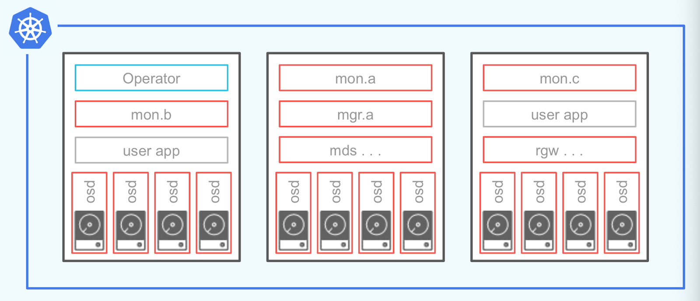

# 1 Rook Ceph

- [레퍼런스](https://rook.io/docs/rook/v1.9/quickstart.html)
- 일반적으로 스토리지 클래스를 통해 동적으로 퍼시스턴트 볼륨을 생성한다.
- 스토리지 인프라가 제공되는 퍼블릭 클라우드과 같은 환경이라면 연동을 위한 CSI 드라이버 설치 및 스토리지 클래스를 정의하면 끝이다.
- 이런 환경이 아니라면 스토리지 시스템을 직접 구성해야한다.

<br>

## 1.1 Ceph

- Ceph는 수년간 운영 환경을 구축한 블록 스토리지, 객체 스토리지 및 공유 파일 시스템을 위한 확장성이 뛰어난 분산 스토리지 솔루션이다.
- [ceph architecture](https://docs.ceph.com/en/quincy/architecture/)

<br>

## 1.2 Rook

- Rook은 쿠버네티스의 구성 요소를 사용해 쿠버네티스 상에서 ceph가 동작하게 해준다.
- ceph이 쿠버네티스 클러스터에 동작중이면 쿠버네티스의 애플리케이션은 rook에 의해 관리되는 블록 디바이스와 파일 시스템을 마운트할 수 있다.
- Rook operator가 스토리지 설정을 자동화해주며 스토리지의 사용 여부와 상태를 모니터링 한다. 

<br>

# 2 Rook의 구조

- Ceph의 각 서비스 데몬들이 POD로 실행된다. 
- 서비스 데몬이 사용자 어플리케이션과 같은 노드에서 실행된다.
  - 별도의 전용 스토리지 노드로 구성하는 것도 가능하다.
- 더 자세한 구조가 궁금하면 [여기](https://docs.ceph.com/en/latest/architecture/#the-ceph-storage-cluster)



<br>

## 2.1 Operator

- Operator는 storage cluster를 부트스트랩하고 모니터링하는 컨테이너다.
- Operator는 MON을 시작하고 모니터링한다.

<br>

## 2.2 [Ceph Manager](https://docs.ceph.com/en/quincy/mgr/#ceph-manager-daemon)

- The Ceph Manager daemon (ceph-mgr) runs alongside monitor daemons, to provide additional monitoring and interfaces to external monitoring and management systems.
- By default, the manager daemon requires no additional configuration, beyond ensuring it is running. 
- If there is no mgr daemon running, you will see a health warning to that effect, and some of the other information in the output of ceph status will be missing or stale until a mgr is started.
- 고가용성을 위해 2개 이상의 인스턴스가 필요 하나는 활성화하고 하는 준비상태.

<br>

## 2.3 [MDS](https://docs.ceph.com/en/quincy/cephfs/add-remove-mds/#cephfs-add-remote-mds)

- The Ceph **M**eta**D**ata **S**erver daemon. Also referred to as “ceph-mds”. 
- The Ceph metadata server daemon must be running in any Ceph cluster that runs the CephFS file system. 
- The MDS stores all filesystem metadata.

<br>

## 2.4 MON

- The Ceph monitor software.
- A daemon that maintains a map of the state of the cluster. 
- This “cluster state” includes the monitor map, the manager map, the OSD map, and the CRUSH map. 
- A Ceph cluster must contain a minimum of three running monitors in order to be both redundant and highly-available. 
- Ceph monitors and the nodes on which they run are often referred to as “mon”s.


## 2.5 [OSD](https://docs.ceph.com/en/quincy/glossary/#term-Ceph-OSD)

- Ceph **O**bject **S**torage **D**aemon.
- OSD는 logical disks와 상호작용하는 소프트웨어다.
- OSD pod의 수는 cluster 생성 시 설정한 노드와 디바이스 설정을 통해 지정한다.


## 2.6 [RGW](https://docs.ceph.com/en/quincy/glossary/#term-RGW)

- RADOS Gate Way.
- The component of Ceph that provides a gateway to both the Amazon S3 RESTful API and the OpenStack Swift API. 
- Also called “RADOS Gateway” and “Ceph Object Gateway”


# 3 install

- v1.9 버전 기준


## 3.1 Prerequisites

- 몇가지 전제 조건만 만족하면 Rook은 임의의 쿠버네티스 클러스터에 설치할 수 있다.
- [레퍼런스](https://rook.io/docs/rook/v1.9/pre-reqs.html)


**Kubernetes 버전**

- Kubernetes의 버전이 **v1.16** 이상


**Ceph Prerequisites**

- Ceph storage cluster 설정을 위해 아래에서 최소 한개의 local storage 조건이 충족되어야 한다.
  - Raw devices (no partitions or formatted filesystems)
  - Raw partitions (no formatted filesystem)
  - PVs available from a storage class in `block` mode


**partitions 또는 devices의 formatted 여부 확인하기**

```bash
$ lsblk -f
NAME                  FSTYPE      LABEL UUID                                   MOUNTPOINT
vda
└─vda1                LVM2_member       >eSO50t-GkUV-YKTH-WsGq-hNJY-eKNf-3i07IB
 ├─ubuntu--vg-root   ext4              c2366f76-6e21-4f10-a8f3-6776212e2fe4   /
 └─ubuntu--vg-swap_1 swap              9492a3dc-ad75-47cd-9596-678e8cf17ff9   [SWAP]
vdb
```

- FSTYPE가 비어있지 않으면 formatted된 것
- 위에서는 `vda`은 이미 formatted되어 사용할 수 없고 `vdb`는 formatted되지 않아 사용할 수 있다.


**LVM package**

- Ceph OSD는 아래와 같은 상황에서 LVM에 대한 의존성을 가진다.
  - OSDs are created on raw devices or partitions
  - If encryption is enabled (`encryptedDevice: true` in the cluster CR)
  - A `metadata` device is specified
- Ceph OSD가 LVM에 의존성을 가지는 경우 OSD가 작동하는 호스트에 LVM이 설치되어 있어야한다.
- 노드가 재기동되면 해당 노드에서 작동하고 있는 OSD가 실패할 것 따라서 아래 명령어로 LVM을 설치하자.


**LVM package 설치**

```bash
# CentOS
sudo yum install -y lvm2

# Ubuntu
sudo apt-get install -y lvm2
```

- [레퍼런스](https://rook.io/docs/rook/v1.9/pre-reqs.html#lvm-package)


## 3.2 Helm Charts

- Rook Ceph v1.9 기준
- Rook은 아래 두 가지 helm 차트를 제공한다.
- Rook Ceph Operator: Ceph CR(사용자 지정 리소스)을 모니터링할 Ceph Operator를 설치한다.
- Rook Ceph Cluster: Operator가 클러스터를 구성하는 데 사용할 Ceph CR을 생성한다.


**Prerequisites**

- Kubernetes 1.17+
- Helm 3.x


**Installing Operator**

- Operator의 설정 값은 아래 참조
- [values.yaml](https://github.com/rook/rook/blob/release-1.9/deploy/charts/rook-ceph/values.yaml)
	- Default values for rook-ceph-operator

```bash
helm repo add rook-release https://charts.rook.io/release
helm install --create-namespace --namespace rook-ceph rook-ceph rook-release/rook-ceph -f values.yaml

helm delete --namespace rook-ceph rook-ceph
```


**Installing Cluster**

- Cluster의 설정 값은 아래 참조
- https://github.com/rook/rook/blob/master/deploy/charts/rook-ceph-cluster/values.yaml
- https://rook.io/docs/rook/v1.10/CRDs/Cluster/ceph-cluster-crd/

```bash
helm repo add rook-release https://charts.rook.io/release
helm install --create-namespace --namespace rook-ceph rook-ceph-cluster \
   --set operatorNamespace=rook-ceph rook-release/rook-ceph-cluster -f values-override.yaml
   
helm delete --namespace rook-ceph rook-ceph-cluster
```


# 4 Clean Up

- [레퍼런스](https://rook.io/docs/rook/v1.9/ceph-teardown.html)


## 4.1 Delete the Block and File artifacts

```bash
kubectl delete -f ../wordpress.yaml
kubectl delete -f ../mysql.yaml
kubectl delete -n rook-ceph cephblockpool replicapool
kubectl delete storageclass rook-ceph-block
kubectl delete -f csi/cephfs/kube-registry.yaml
kubectl delete storageclass csi-cephfs
```


## 4.2 Delete the CephCluster CRD

```bash
$ kubectl -n rook-ceph patch cephcluster rook-ceph --type merge -p '{"spec":{"cleanupPolicy":{"confirmation":"yes-really-destroy-data"}}}'

$ kubectl -n rook-ceph delete cephcluster rook-ceph

# 확인
$ kubectl -n rook-ceph get cephcluster
```


## 4.3 Delete the Operator and related Resources

```bash
kubectl delete -f operator.yaml
kubectl delete -f common.yaml
kubectl delete -f crds.yaml
```


## 4.4 Delete the data on hosts

- Connect to each machine and delete `/var/lib/rook`, or the path specified by the `dataDirHostPath`.


```bash
$ sudo rm -rf /var/lib/rook
```


## 4.5 Zapping Devices

- Disks on nodes used by Rook for osds can be reset to a usable state with methods suggested below. 
- Note that these scripts are not one-size-fits-all. Please use them with discretion to ensure you are not removing data unrelated to Rook and/or Ceph.


```bash
DISK="/dev/sdX"

# Zap the disk to a fresh, usable state (zap-all is important, b/c MBR has to be clean)
sgdisk --zap-all $DISK

# Wipe a large portion of the beginning of the disk to remove more LVM metadata that may be present
dd if=/dev/zero of="$DISK" bs=1M count=100 oflag=direct,dsync

# SSDs may be better cleaned with blkdiscard instead of dd
blkdiscard $DISK

# Inform the OS of partition table changes
partprobe $DISK
```


## 4.6 Remove device mappers from disk

- https://thomas.trocha.com/blog/remove-device-mappers-from-disk/


```bash
$ lsblk -f
NAME                                                    FSTYPE LABEL UUID                                 MOUNTPOINT
sda
└─ceph--3bfa653f--0d9d--4d70--8b06--c09efde3b1f8-osd--block--5ba5209f--4c50--495c--a061--d6456321a84b
```

```bash
$ sudo fdisk -l

...
Disk /dev/mapper/ceph--3bfa653f--0d9d--4d70--8b06--c09efde3b1f8-osd--block--5ba5209f--4c50--495c--a061--d6456321a84b: 233.3 GiB, 250446086144 bytes, 489152512 sectors
Units: sectors of 1 * 512 = 512 bytes
Sector size (logical/physical): 512 bytes / 512 bytes
I/O size (minimum/optimal): 512 bytes / 512 bytes
...
```

```bash
$ dmsetup info

> Name:              ceph--7ae25770--3171--466d--ab5c--7c1baa6bf8eb-osd--block--eaf63452--31c6--42af--b8cd--4a8265c1739b
> State:             ACTIVE
> Read Ahead:        256
> Tables present:    LIVE
> Open count:        0
> Event number:      0
> Major, minor:      252, 1
> Number of targets: 1
> UUID: LVM-DbOk82x1IjzzDnudve307QUBys9bLSUj8a5Yrcfv00Z3LjDTi1JLGxECSTd021Wa
```

```bash
$ dmsetup remove ceph--7ae25770--3171--466d--ab5c--7c1baa6bf8eb-osd--block--eaf63452--31c6--42af--b8cd--4a8265c1739b
```

```bash
$ lsblk
NAME        MAJ:MIN RM   SIZE RO TYPE MOUNTPOINT
sda           8:0    1   3.7T  0 disk
```


## 4.7 


```bash
for CRD in $(kubectl get crd -n rook-ceph | awk '/ceph.rook.io/ {print $1}'); do
    kubectl delete crd -n rook-ceph "$CRD"\
done
```


```bash
kubectl get crd -n rook-ceph --no-headers=true | awk '/[[:lower:]]*ceph*/ { print $1}' | xargs  kubectl delete crd -n rook-ceph
```


```
kubectl get pod -n rook-ceph --no-headers=true | awk '/[[:lower:]]*ceph*/ { print $1}' | xargs  kubectl delete pod -n rook-ceph
```


# 5 Troubleshooting


## 5.1 OSD pods are not created on my devices

- operator와 cluster를 Helm Charts를 통해 배포한 상황
- V1.9 기준


```bash
$ kubectl -n rook-ceph get pod -l app=rook-ceph-osd-prepare
NAME                                           READY   STATUS      RESTARTS   AGE
rook-ceph-osd-prepare-af-k8s-worker-01-ctslj   0/1     Completed   0          13h
rook-ceph-osd-prepare-af-k8s-worker-02-94vgc   0/1     Completed   0          13h
```

- osd-prepare pod가 Completed 상태이지만 osd pod가 생성되지 않았다.


```bash
$ kubectl logs rook-ceph-osd-prepare-af-k8s-worker-01-ctslj -n rook-ceph
...
2023-02-15 12:03:31.362150 I | cephosd: skipping device "sda": ["Insufficient space (<5GB)"].
...
```

- 로그 확인
- Cluster 설정을 통해 지정한 디바이스 `sda`를 스킵하고 있다.


```bash
$ lsblk -f
NAME        FSTYPE LABEL UUID                                 MOUNTPOINT
sda
nvme0n1
├─nvme0n1p1 vfat         D341-77E6                            /boot/efi
└─nvme0n1p2 ext4         56247860-e9f8-4a0c-a172-5ea2c9821c30 /
```

- sda은 FSTYPE 필드가 비어있는 raw 디바이스다
- https://rook.io/docs/rook/v1.10/Getting-Started/Prerequisites/prerequisites/#ceph-prerequisites
- 용량도 많고 위 조건에 만족하는데 왜 스킵하는걸까?

```bash
$ lsblk
NAME        MAJ:MIN RM   SIZE RO TYPE MOUNTPOINT
sda           8:0    1   3.7T  0 disk
nvme0n1     259:0    0 931.5G  0 disk
├─nvme0n1p1 259:1    0   512M  0 part /boot/efi
└─nvme0n1p2 259:2    0   931G  0 part /
```

- sda의 RM 필드 1의 의미는 removable device라는 의미다.
- removable device의 경우 OSD를 생성할 수 없기 때문에 sda가 스킵된 것 오류 메시지  `"Insufficient space (<5GB)"` rook의 버그다.
- [참고 이슈](https://github.com/rook/rook/issues/11474)ex
- https://tracker.ceph.com/issues/38833
- removable device에 OSD를 생성하고 싶은 경우 removable device를 직접 사용하지 않고 removable device 위에 LV를 생성해서 LV를 사용하면 된다.


```bash
2023-02-17 00:24:23.601438 I | cephosd: device "dm-0" is available.
2023-02-17 00:24:23.601470 I | cephosd: skipping device "dm-0" that does not match the device filter/list ([{/dev/ceph/ceph-lv-1 1  0   false false}]). <nil>
2023-02-17 00:24:23.601476 I | cephosd: skipping device "nvme0n1p1" with mountpoint "efi"
2023-02-17 00:24:23.601480 I | cephosd: skipping device "nvme0n1p2" with mountpoint "rootfs"
```


```bash
2023-02-18 03:51:37.100798 I | cephosd: skipping device "dm-0", detected an existing OSD. UUID=0ed80701-6cad-4ccb-bda7-dd401ae0feb0
2023-02-18 03:51:37.100806 I | cephosd: skipping device "nvme0n1p1" with mountpoint "efi"
2023-02-18 03:51:37.100810 I | cephosd: skipping device "nvme0n1p2" with mountpoint "rootfs"
2023-02-18 03:51:37.110655 I | cephosd: configuring osd devices: {"Entries":{}}
2023-02-18 03:51:37.110668 I | cephosd: no new devices to configure. returning devices already configured with ceph-volume.
2023-02-18 03:51:37.110791 D | exec: Running command: stdbuf -oL ceph-volume --log-path /tmp/ceph-log lvm list  --format json
2023-02-18 03:51:37.431721 D | cephosd: {}
2023-02-18 03:51:37.431748 I | cephosd: 0 ceph-volume lvm osd devices configured on this node
2023-02-18 03:51:37.431765 D | exec: Running command: stdbuf -oL ceph-volume --log-path /tmp/ceph-log raw list --format json
2023-02-18 03:51:37.819921 D | cephosd: {}
2023-02-18 03:51:37.819948 I | cephosd: 0 ceph-volume raw osd devices configured on this node
2023-02-18 03:51:37.819959 W | cephosd: skipping OSD configuration as no devices matched the storage settings for this node "af-k8s-worker-01"
```


## 5.2 Monitors are the only pods running

- [레퍼런스](Rook operator is running)


**증상**

- Rook operator is running
- Either a single mon starts or the mons start very slowly (at least several minutes apart)
- The crash-collector pods are crashing
- No mgr, osd, or other daemons are created except the CSI driver


- operator가 클러스터를 시작할 때 하나의 mon을 먼저 실행한다.
- 이후 mon을 체크하여 정상 상태인 경우 이후 추가적인 mon을 실행하여 총 3개의 mon을 실행한다.
- 만약 첫 번째 mon이 정상이 아니라면 operator가 계속적으로 점검한다.
- crash-collector pods은 mon quorum이 형성되지 않으면 블록된다.


**원인**

- operator pod가 mon pod와 네트워크 연결이 되지 않는 경우
  - 네트워크 설정의 문제
- 하나 이상의 mon pod가 running 상태이지만 operator 로그에서 쿼럼을 생성할수 없다고 출력함
- mon이 이전 클러스터 설정을 사용하는 경우
  - [cleanup guide](https://rook.io/docs/rook/v1.9/Storage-Configuration/ceph-teardown/#delete-the-data-on-hosts)를 통해 이전 클러스터의 설정을 지운다.
- 방화벽
  - mon 쿼럼을 형성하기 위해 6789, 3300 포트가 열려있어야함
- There may be MTU mismatch between different networking components. Some networks may be more susceptible to mismatch than others. If Kubernetes CNI or hosts enable jumbo frames (MTU 9000), Ceph will use large packets to maximize network bandwidth. If other parts of the networking chain don't support jumbo frames, this could result in lost or rejected packets unexpectedly.


**해결**

- mon이 이전 클러스터 설정을 지워도 그대로인 상황에서 operator를 재시작하니 mon들이 생성됨


## 5.3 One or more MONs are restarting periodically

- [레퍼런스](https://rook.io/docs/rook/v1.10/Troubleshooting/ceph-common-issues/#cluster-failing-to-service-requests)
- dataDirHostPath는 이미 지정했는데 왜 MON이 계속 재시작될까?
  - calico의 문제였다.


참고

- https://devocean.sk.com/search/techBoardDetail.do?ID=163760&
- https://devocean.sk.com/experts/techBoardDetail.do?ID=163924