# kube-network-starter
study kube network

* 출처: https://www.udemy.com/course/docker-kubernetes-the-practical-guide/

## 데모 프로젝트 구조

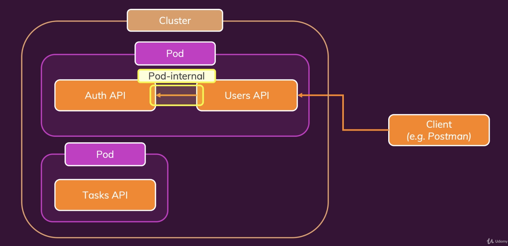

* Auth API
  * User API 서버와  같은 `pod` 에 위치한다.
* User API 
  * Auth API 서버와  같은 `pod` 에 위치한다.
  * Auth API 서버에 요청을 보낸다.
    * Pod-internal communication


## User API


### 코드 수정

* user API 서버를 먼저 실행하기위해 auth 서버와의 의존성을 제거한다.
* users-app.js파일 수정

```javascript
# 수정 전
const hashedPW = await axios.get('http://auth/hashed-password/' + password);
# 수정 후
const hashedPW = 'dummy text'

#수정 전
const response = await axios.get('http://auth/token/' + hashedPassword + '/' + password);
#수정 후
const response = {status: 200, data: {token: 'abc'}}
```


### 이미지 빌드

* users-api 디렉토리에서 진행

```bash
$ docker build -t neptunes032/kub-demo-user .
$ docker push neptunes032/kub-demo-user
```


### Deployment 리소스 생성

* Users-deployment.yaml 작성

```yaml
apiVersion: apps/v1
kind: Deployment
metadata:
  name: users-deployment
spec:
  replicas: 1
  selector:
    matchLabels:
      app: users
  template:
    metadata:
      labels:
        app: users
    spec:
      containers:
        - name: users
          image: neputunes032/kub-demo-user
```


### Service 리소스 생성

**Service**

* 변하지 않는 IP 주소
* pod를 클러스터 외부에서 접근할 수 있게 해준다.
* Users-service.yaml 작성하고 적용

**type**

* ClusterIP
  * 타입을 설정하지 않으면 기본적으로 ClusterIP 타입이 된다.
  * 클러스터 내부에서만 해당 IP로 접근할 수 있다.
* NodePort
  * 외부에서 접근이 가능하다.
  * 노드의 IP 주소를 사용한다.
    * 즉 IP 주소가 변경될 가능성이 있다.
* LoadBalncer
  * 노드와 독립적인 새로운 IP 주소를 사용한다.

```yaml
apiVersion: v1
kind: Service
metadata:
  name: users-service
spec:
  selector:
    app: users
  type: LoadBalancer
  ports:
    - protocol: TCP
      port: 8080
      targetPort: 8080
```

```bash
$ kubectl apply -f users-service.yaml
$ minikube service users-service
|-----------|---------------|-------------|-----------------------------|
| NAMESPACE |     NAME      | TARGET PORT |             URL             |
|-----------|---------------|-------------|-----------------------------|
| default   | users-service |        8080 | http://192.168.99.100:30785 |
|-----------|---------------|-------------|-----------------------------|
🎉  Opening service default/users-service in default browser...
```


### 작동 확인

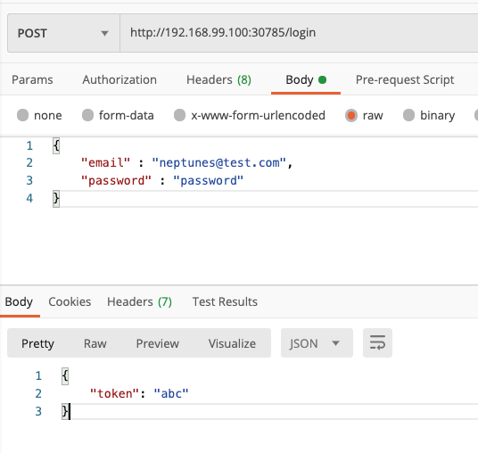


## Auth API


### 코드 수정

1. users-app.js파일 수정

* 도커 컴포즈 환경과 쿠버네티스 환경에서 서비스끼리 커뮤니케이션을 하기위해 사용하는 도메인이 다르다
* 따라서 외부에서 환경변수를 받아 사용하도록 수정한다.

```javascript
# 수정 전
const hashedPW = 'dummy text'
# 수정 후
const hashedPW = await axios.get(`http://${process.env.AUTH_ADDRESS}/hashed-password/` + password);

#수정 전
const response = {status: 200, data: {token: 'abc'}}
#수정 후
const response = await axios.get(
  `http://${process.env.AUTH_ADDRESS}/token/` + hashedPassword + '/' + password
);
```

2. 도커 컴포즈 수정

* 도커 컴포즈로 만들어진 컨테이너는 같은 네트워크로 묶여 컨테이너 이름 또는 서비스 이름을 도메인으로 사용해 컨테이너 끼리 커뮤니케이션이 가능하다.
* 따라서 환경변수로 커뮤니케이션 하고자 하는 컨테이너의 이름(서비스 이름)을 적용했다.

```yaml
version: "3"
services:
  auth:
    build: ./auth-api
  users:
    build: ./users-api
    environment:
      AUTH_ADDRESS: auth
    ports:
      - "8080:8080"
  tasks:
    build: ./tasks-api
    ports:
      - "8000:8000"
    environment:
      TASKS_FOLDER: tasks

```


### 이미지 빌드

* users-api 디렉토리에서 진행
* 수정된 코드 반영 재빌드

```bash
$ docker build -t neptunes032/kub-demo-user .
$ docker push neptunes032/kub-demo-user
```

* auth-api 디렉토리에서 진행

```bash
$ docker build -t neptunes032/kub-demo-auth  .
$ docker push neptunes032/kub-demo-auth
```


### Deployment 리소스 수정

* users-deployment.yaml 수정하기
* 한 pod에서 실행되는 컨테이너 끼리 커뮤니케이션 할 때 `localhost` 를 도메인으로 사용한다.
  * 따라서 환경변수로 localhost를 적용했다.

```yaml
apiVersion: apps/v1
kind: Deployment
metadata:
  name: users-deployment
spec:
  replicas: 1
  selector:
    matchLabels:
      app: users
  template:
    metadata:
      labels:
        app: users
    spec:
      containers:
        - name: users
          image: neptunes032/kub-demo-user:latest
          env:
            - name: AUTH_ADDRESS
              value: localhost
        - name: auth
          image: neptunes032/kub-demo-auth:latest

```

```bash
kubectl apply -f users-deployment.yaml
```


### 작동 확인

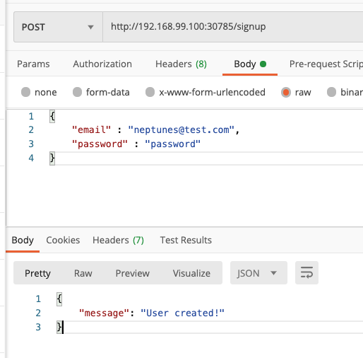

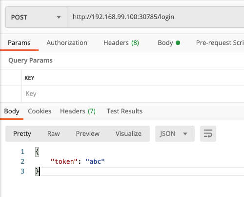

* user API 서버와 auth API 서버간의 커뮤니케이션이 성공적으로 동작했다. 
* 즉, Pod-internal communication 을 위해 localhost를 사용하면 된다.


## 데모 프로젝트 구조 변경

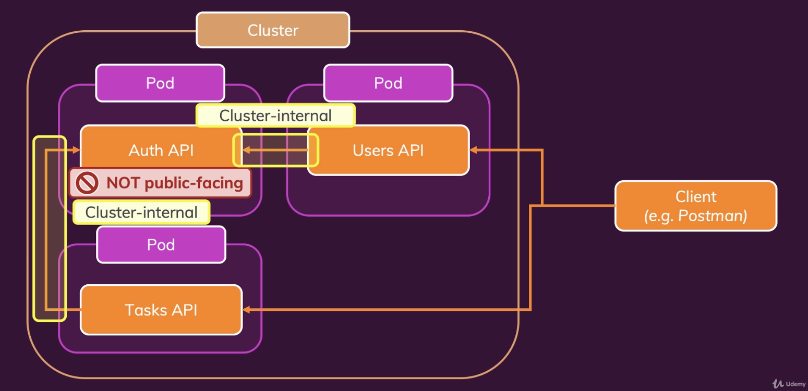

* Auth API
  * 독립된 pod 에 위치
  * 외부 접근은 허용하지 않는다. 클러스터 안에서만 접근 가능하도록
* User API 
  * 독립된 pod 에 위치
  * Auth API 서버에 요청을 보낸다.
    * Cluster-internal communication
* Tasks API
  * 독립된 pod 에 위치
  * Auth API 서버에 요청을 보낸다.
    * Cluster-internal communication


## Auth API

### Deployment 리소스 생성

* auth-deployment.yaml 작성

```yaml
apiVersion: apps/v1
kind: Deployment
metadata:
  name: auth-deployment
spec:
  replicas: 1
  selector:
    matchLabels:
      app: auth
  template:
    metadata:
      labels:
        app: auth
    spec:
      containers:
        - name: auth
          image: neptunes032/kub-demo-auth

```

### Service 리소스 생성

* auth-service.yaml 작성
* 외부 접근은 허용하지 않는다. 클러스터 안에서만 접근 가능하도록 `ClusterIP` 타입을 사용한다.

```yaml
apiVersion: v1
kind: Service
metadata:
  name: auth-service
spec:
  selector:
    app: auth
  type: ClusterIP
  ports:
    - protocol: TCP
      port: 80
      targetPort: 80

```

```bash
kubectl apply -f auth-deployment.yaml -f auth-service.yaml
```


## User API


### Pod-to-Pod Communication

* 앞서 생성한 auth-service에 어떻게 소통할까?

### 해결법 1 : 매뉴얼적인 방법

Deployment 리소스 수정

* users-deployment.yaml 수정
* Auth 애플리케이션을 분리

```bash
kubectl apply -f auth-deployment.yaml -f auth-service.yaml
# auth-service의 IP 주소 확인
kubectl get service
NAME           TYPE        CLUSTER-IP       EXTERNAL-IP   PORT(S)   AGE
auth-service   ClusterIP   10.101.220.154   <none>        80/TCP    19s
kubernetes     ClusterIP   10.96.0.1        <none>        443/TCP   3d9h
```

```yaml
# users-deployment.yaml
apiVersion: apps/v1
kind: Deployment
metadata:
  name: users-deployment
spec:
  replicas: 1
  selector:
    matchLabels:
      app: users
  template:
    metadata:
      labels:
        app: users
    spec:
      containers:
        - name: users
          image: neptunes032/kub-demo-user:latest
          env:
            - name: AUTH_ADDRESS
              value: "10.101.220.154"

```

```bash
kubectl apply -f users-deployment.yaml

# auth와 users 애플리케이션이 각각 다른 pod에서 동작하는걸 확인 할 수 있다.
kubectl get pods
NAME                               READY   STATUS    RESTARTS   AGE
auth-deployment-5954dcff87-z9542   1/1     Running   0          5m34s
users-deployment-74d54d9c7-7zx2w   1/1     Running   0          2m28s

minikube service users-service
|-----------|---------------|-------------|-----------------------------|
| NAMESPACE |     NAME      | TARGET PORT |             URL             |
|-----------|---------------|-------------|-----------------------------|
| default   | users-service |        8080 | http://192.168.99.101:31219 |
|-----------|---------------|-------------|-----------------------------|
🎉  Opening service default/users-service in default browser...
```

동작 확인

* 정상적으로 작동한다.

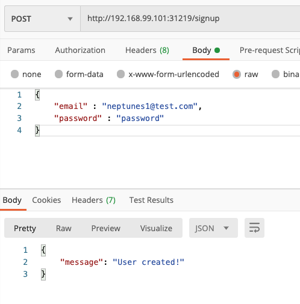

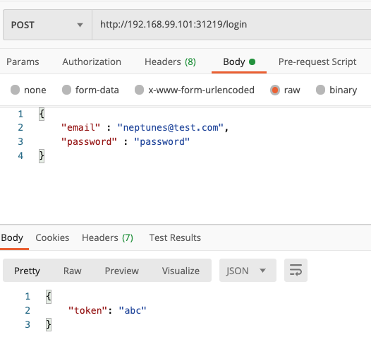

문제점

* 직접 service의 IP 주소를 찾는것은 번거롭다.


### 해결법 2: 제공되는 환경변수

* 쿠버네티스에 의해 자동으로 제공되는 환경변수를 사용한다.
  * `SERVICENAME_SERVICE_HOST` : 서비스의 IP 주소
* users-app.js 를 수정한다.

```javascript
# 수정 전
const hashedPW = await axios.get(`http://${process.env.AUTH_ADDRESS}/hashed-password/` + password);

# 수정 후
const hashedPW = await axios.get(`http://${process.env.AUTH_SERVICE_SERVICE_HOST}/hashed-password/` + password);
```

```javascript
# 수정 전
const response = await axios.get(
  `http://${process.env.AUTH_ADDRESS}/token/` + hashedPassword + '/' + password
);
# 수정 후
const response = await axios.get(
  `http://${process.env.AUTH_SERVICE_SERVICE_HOST}/token/` + hashedPassword + '/' + password
);
```

* 이미지 재빌드

```bash
ls
Dockerfile   package.json users-app.js
docker build -t neptunes032/kub-demo-user .
docker push neptunes032/kub-demo-user
cd ../kubernetes

# users-deployment.yaml에 수정사항이 없어 적용되지 않았다.
kubectl apply -f users-deployment.yaml
deployment.apps/users-deployment unchanged

kubectl delete -f users-deployment.yaml
kubectl apply -f users-deployment.yaml
```

* Docker-compose.yaml 수정

```yaml
version: "3"
services:
  auth:
    build: ./auth-api
  users:
    build: ./users-api
    environment:
      AUTH_ADDRESS: auth
      AUTH_SERVICE_SERVICE_HOST: auth
    ports:
      - "8080:8080"
  tasks:
    build: ./tasks-api
    ports:
      - "8000:8000"
    environment:
      TASKS_FOLDER: tasks

```

동작 확인

* 정상작동한다.


### 해결법 3 : CoreDNS

* 모든 서비스는 클러스터 내에서 사용되는 도메인 네임을 가지고 있다.
  * `servicename.namespacename` : 도메인 네임
  * 클러스터 내에서만 사용 가능
* 3가지 방법중 가장 많이 사용된다.

* users-app.js 를 수정한다.

```javascript
# 수정 전
const hashedPW = await axios.get(`http://${process.env.AUTH_SERVICE_SERVICE_HOST}/hashed-password/` + password);

# 수정 후
const hashedPW = await axios.get(`http://${process.env.AUTH_ADDRESS}/hashed-password/` + password);
```

```javascript
# 수정 전
const response = await axios.get(
  `http://${process.env.AUTH_SERVICE_SERVICE_HOST}/token/` + hashedPassword + '/' + password
);

# 수정 후
const response = await axios.get(
  `http://${process.env.AUTH_ADDRESS}/token/` + hashedPassword + '/' + password
);
```

* users-deployment.yaml 수정한다.

```yaml
apiVersion: apps/v1
kind: Deployment
metadata:
  name: users-deployment
spec:
  replicas: 1
  selector:
    matchLabels:
      app: users
  template:
    metadata:
      labels:
        app: users
    spec:
      containers:
        - name: users
          image: neptunes032/kub-demo-user:latest
          env:
            - name: AUTH_ADDRESS
              value: "auth-service.default"

```

* 이미지 재빌드

```bash
ls
Dockerfile   package.json users-app.js
docker build -t neptunes032/kub-demo-user .
docker push neptunes032/kub-demo-user
cd ../kubernetes

# users-deployment.yaml에 수정사항이 없어 적용되지 않았다.
kubectl apply -f users-deployment.yaml
deployment.apps/users-deployment unchanged

kubectl delete -f users-deployment.yaml
kubectl apply -f users-deployment.yaml
```

동작 확인

* 정상작동한다.

## Tasks API

### 코드 수정

* tasks-app.js 수정
* Auth API의 도메인을 환경변수로 받아오도록 변경

```javascript
# 추가
app.use((req, res, next) => {
  res.setHeader('Access-Control-Allow-Origin', '*');
  res.setHeader('Access-Control-Allow-Methods', 'POST,GET,OPTIONS');
  res.setHeader('Access-Control-Allow-Headers', 'Content-Type,Authorization');
  next();
})

# 수정 전
const response = await axios.get('http://auth/verify-token/' + token);

# 수정 후
const response = await axios.get(`http://${process.env.AUTH_ADDRESS}/verify-token/` + token);
```

### 이미지 빌드

* 도커 허브에 kub-demo-tasks 리포지토리 생성
* 이미지 빌드 후 도커 허브에 push

```bash
ls
Dockerfile   package.json tasks-app.js
docker build -t neptunes032/kub-demo-tasks .
docker push neptunes032/kub-demo-tasks
```

### Deployment 리소스 생성

* tasks-deployment.yaml 작성

```yaml
apiVersion: apps/v1
kind: Deployment
metadata:
  name: tasks-deployment
spec:
  replicas: 1
  selector:
    matchLabels:
      app: tasks
  template:
    metadata:
      labels:
        app: tasks
    spec:
      containers:
        - name: tasks
          image: neptunes032/kub-demo-tasks:latest
          env:
            - name: AUTH_ADDRESS
              value: "auth-service.default"
            - name: TASKS_FOLDER
              value: tasks
```

```bash
kubectl apply -f tasks-deployment.yaml
```

### Service 리소스 생성

* tasks-service.yaml 작성

```yaml
apiVersion: v1
kind: Service
metadata:
  name: tasks-service
spec:
  selector:
    app: tasks
  type: LoadBalancer
  ports:
    - protocol: TCP
      port: 8000
      targetPort: 8000

```

```bash
kubectl apply -f tasks-service.yaml
```

### 확인

```bash
minikube service tasks-service
|-----------|---------------|-------------|-----------------------------|
| NAMESPACE |     NAME      | TARGET PORT |             URL             |
|-----------|---------------|-------------|-----------------------------|
| default   | tasks-service |        8000 | http://192.168.99.101:32369 |
|-----------|---------------|-------------|-----------------------------|
🎉  Opening service default/tasks-service in default browser...
```

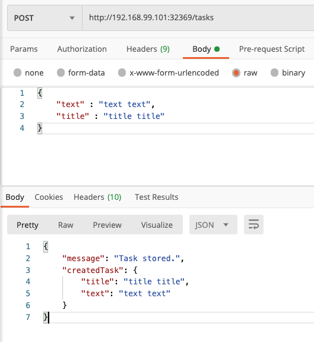

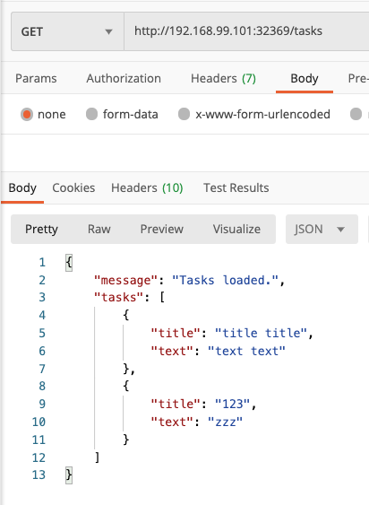

## frontend 배포하기

### 코드 수정

* frontend/src/App.js 수정
* Tasks API로 요청을 보낼 때 다음과 같이 도메인을 tasks-service의 IP 주소로 수정한다.

```bash
# tasks-service의 IP 주소 확인
minikube service tasks-service
|-----------|---------------|-------------|-----------------------------|
| NAMESPACE |     NAME      | TARGET PORT |             URL             |
|-----------|---------------|-------------|-----------------------------|
| default   | tasks-service |        8000 | http://192.168.99.101:32369 |
|-----------|---------------|-------------|-----------------------------|
🎉  Opening service default/tasks-service in default browser...
```

```javascript
const fetchTasks = useCallback(function () {
    fetch('http://192.168.99.101:32369/tasks', {
		...
    }
}
function addTaskHandler(task) {
    fetch('http://192.168.99.101:32369/tasks', {
      ...
    }
}
```

### 이미지빌드

* 도커 허브에서 kub-demo-frontend 리포지토리 생성 
* dockerfile

```dockerfile
FROM node:14-alpine as builder

WORKDIR /app

COPY package.json .

RUN npm install

COPY . .

RUN npm run build

FROM nginx:1.19-alpine

COPY --from=builder /app/build /usr/share/nginx/html

COPY conf/nginx.conf /etc/nginx/conf.d/default.conf

EXPOSE 80

CMD [ "nginx", "-g", "daemon off;" ]
```

- 디렉토리: frontend

```bash
docker build -t neptunes032/kub-demo-frontend .
docker push neptunes032/kub-demo-frontend
```

### Deployment & Service 리소스 생성

* frontend-deployment.yaml 작성

```yaml
apiVersion: apps/v1
kind: Deployment
metadata:
  name: frontend-deployment
spec:
  replicas: 1
  selector:
    matchLabels:
      app: frontend
  template:
    metadata:
      labels:
        app: frontend
    spec:
      containers:
        - name: frontend
          image: neptunes032/kub-demo-frontend:latest
```

* frontend-service.yaml 작성

```yaml
apiVersion: v1
kind: Service
metadata:
  name: frontend-service
spec:
  selector:
    app: frontend
  type: LoadBalancer
  ports:
    - protocol: TCP
      port: 80
      targetPort: 80
```

```bash
kubectl apply -f frontend-deployment.yaml -f frontend-service.yaml
minikube service frontend-service
|-----------|------------------|-------------|-----------------------------|
| NAMESPACE |       NAME       | TARGET PORT |             URL             |
|-----------|------------------|-------------|-----------------------------|
| default   | frontend-service |          80 | http://192.168.99.101:31597 |
|-----------|------------------|-------------|-----------------------------|
🎉  Opening service default/frontend-service in default browser...
```

### 확인

* 정상적으로 동작한다.

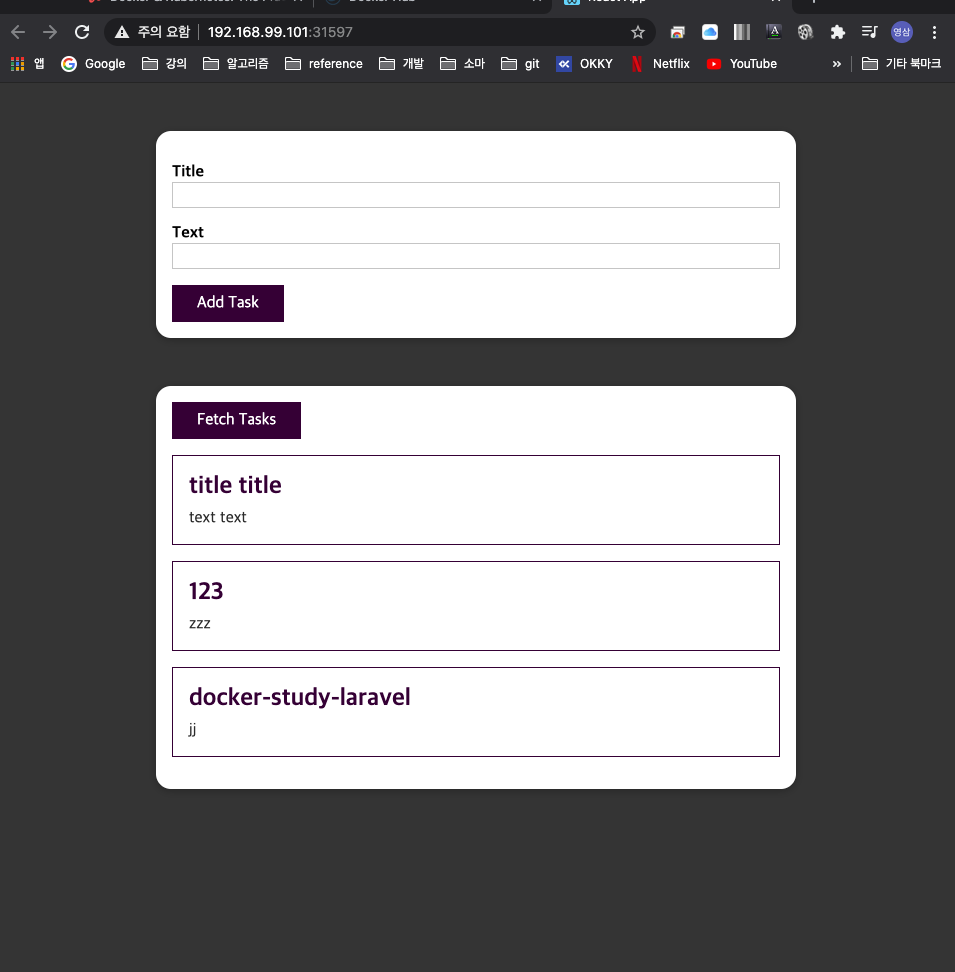


### Reverse Proxy 사용하기

* frontend/src/App.js 수정

```javascript
const fetchTasks = useCallback(function () {
    fetch('/api/tasks', {
		...
    }
}
          
function addTaskHandler(task) {
    fetch('/api/tasks', {
      ...
    }
}
```

* frontend/conf/nginx.conf 수정
* tasks service의 domain name을 사용하자

```
server {
  listen 80;

  location /api/ {
    proxy_pass http://tasks-service.default:8000/;
  }
  
  location / {
    root /usr/share/nginx/html;
    index index.html index.htm;
    try_files $uri $uri/ /index.html =404;
  }
  
  include /etc/nginx/extra-conf.d/*.conf;
}
```

* 이미지 빌드후 도커허브에 푸시

```bash
 docker build -t neptunes032/kub-demo-frontend .
 docker push neptunes032/kub-demo-frontend
 cd ../kubernetes
 kubectl delete -f frontend-deployment.yaml
 # 재배포
 kubectl apply -f frontend-deployment.yaml
 minikube service frontend-service
|-----------|------------------|-------------|-----------------------------|
| NAMESPACE |       NAME       | TARGET PORT |             URL             |
|-----------|------------------|-------------|-----------------------------|
| default   | frontend-service |          80 | http://192.168.99.101:31597 |
|-----------|------------------|-------------|-----------------------------|
🎉  Opening service default/frontend-service in default browser...
```

### 확인

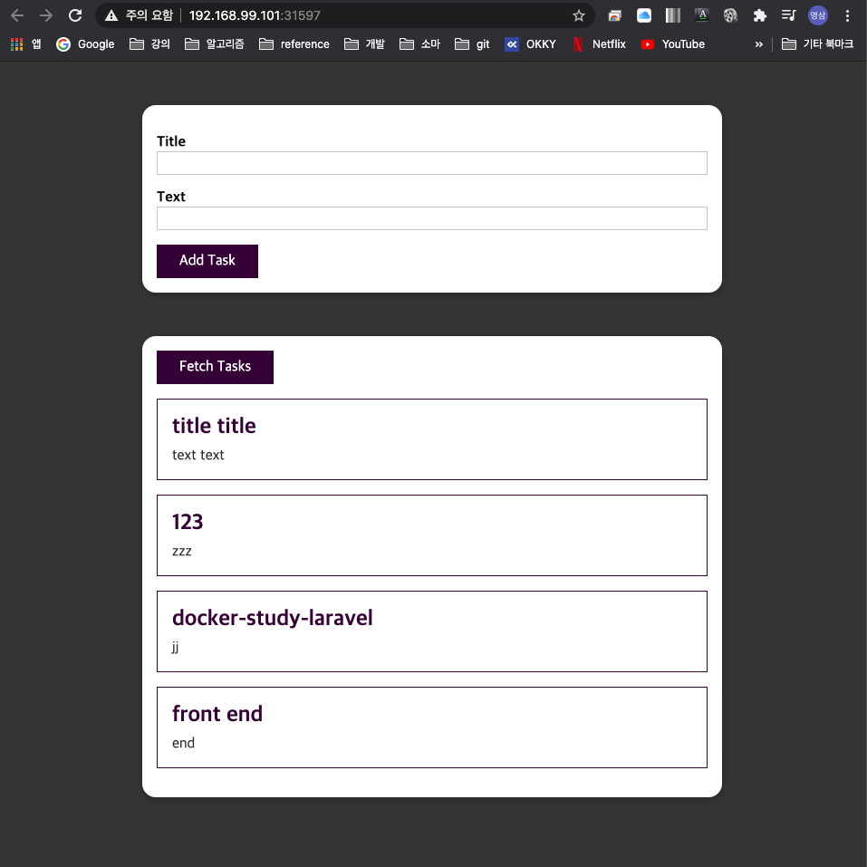