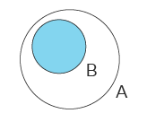
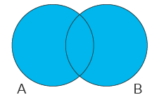
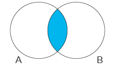
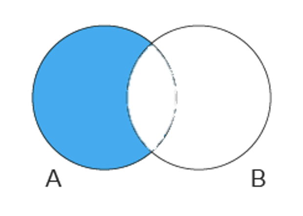

# 1 Set Interface

* Set은 중복이 없는 원소들을 가진 Collection이다.
* Set 인터페이스는 Collection 인터페이스가 상속한 메소드만 가지고 있다.
* Set에 담기는 원소는 필수적으로 equals와 hashCode 메소드를 적절히 오버라이딩해야한다.
  * 원소의 중복 방지를 위해 원소의 비교가 필수적이기 때문
* 두 가지의 Set 인스턴스가 같은 원소를 가질 때 두 인스턴스가 같다고 할 수 있다.


## 1.1 [메소드](https://docs.oracle.com/en/java/javase/11/docs/api/java.base/java/util/Set.html)

| Modifier and Type        | Method                                 | Description                                                  |
| :----------------------- | :------------------------------------- | :----------------------------------------------------------- |
| `boolean`                | `add(E e)`                             | Adds the specified element to this set if it is not already present (optional operation). |
| `boolean`                | `addAll(Collection<? extends E> c)`    | Adds all of the elements in the specified collection to this set if they're not already present (optional operation). |
| `void`                   | `clear()`                              | Removes all of the elements from this set (optional operation). |
| `boolean`                | `contains(Object o)`                   | Returns `true` if this set contains the specified element.   |
| `boolean`                | `containsAll(Collection<?> c)`         | Returns `true` if this set contains all of the elements of the specified collection. |
| `static <E> Set<E>`      | `copyOf(Collection<? extends E> coll)` | Returns an [unmodifiable Set](https://docs.oracle.com/en/java/javase/11/docs/api/java.base/java/util/Set.html#unmodifiable) containing the elements of the given Collection. |
| `boolean`                | `equals(Object o)`                     | Compares the specified object with this set for equality.    |
| `int`                    | `hashCode()`                           | Returns the hash code value for this set.                    |
| `boolean`                | `isEmpty()`                            | Returns `true` if this set contains no elements.             |
| `Iterator<E>`            | `iterator()`                           | Returns an iterator over the elements in this set.           |
| `boolean`                | `remove(Object o)`                     | Removes the specified element from this set if it is present (optional operation). |
| `boolean`                | `removeAll(Collection<?> c)`           | Removes from this set all of its elements that are contained in the specified collection (optional operation). |
| `boolean`                | `retainAll(Collection<?> c)`           | Retains only the elements in this set that are contained in the specified collection (optional operation). |
| `int`                    | `size()`                               | Returns the number of elements in this set (its cardinality). |
| `default Spliterator<E>` | `spliterator()`                        | Creates a `Spliterator` over the elements in this set.       |
| `Object[]`               | `toArray()`                            | Returns an array containing all of the elements in this set. |
| `<T> T[]`                | `toArray(T[] a)`                       | Returns an array containing all of the elements in this set; the runtime type of the returned array is that of the specified array. |


## 1.2 구현체

| Interfaces | Hash table Implementations | Tree Implementations | Hash table + Linked list  Implementations |
| ---------- | -------------------------- | -------------------- | ----------------------------------------- |
| `Set`      | `HashSet`                  | `TreeSet`            | `LinkedHashSet`                           |

* [HashSet](#2-HashSet-Class)
  * 원소를 해시 테이블에 저장
  * 원소의 순서를 보장하지 않는다.
  * 가장 성능이 좋은 구현체
  * [Hash-Table.md](../../../../Computer-Science/Data-Structure/Hash-Table/Hash-Table.md)
  
* [TreeSet](#3-TreeSet-Class)
  * 원소를 red-black tree에 저장한다.
  * 원소가 값을 기준으로 정렬되어 있다.
  * 정렬 기능이 추가되어 HashSet가 비교하면 느리다.
  
* [LinkedHashSet](#4-LinkedHashSet-Class)
  * 원소를 해시 테이블에 저장
  * 원소가 삽입 순서대로 정렬되어 있다.


## 1.3 중복 원소 제거하기

* Collection의 원소 중 중복된 원소를 하나만 남기고 제거해보자
* `import static org.assertj.core.api.Assertions.*;`
* 원소의 순서가 없는 Set, HashSet은 containsOnly()을 이용해 순서와 관계없이 원소를 가지고 있는지 확인
* 원소의 순서가 있는 TreeSet, LinkedHashSet은 containsExactly()을 이용해 순서대로 원소를 가지고 있는지 확인


**HashSet 사용하기**

- Colletion의 구현체들은 생성자의 인자로 Colletion을 받는다.
- HashSet도 Collection이기 때문에 Colletion을 인자로 받는 생성자가 있다.
- 아래와 같이 Colletion의 중복을 제거할 수 있다.

```java
@Test
void removeDuplicateElement1() {
  List<Integer> collection = Arrays.asList(5, 4, 3, 2, 2, 1);

  Collection<Integer> noDups = new HashSet<>(collection);

  assertThat(noDups.size()).isEqualTo(5);
  assertThat(noDups).containsOnly(1, 2, 3, 4, 5);
}
```


**aggregate operations 사용하기**

- Collection을 Stream으로 변환한후 collect 메서드를 통해 중복을 제거할 수 있다.

```java
@Test
void removeDuplicateElement2() {
  Collection<Integer> collection = Arrays.asList(5, 4, 3, 2, 2, 1);

  Set<Integer> noDups = collection.stream().collect(Collectors.toSet());

  assertThat(noDups.size()).isEqualTo(5);
  assertThat(noDups).containsOnly(1, 2, 3, 4, 5);
}
```


**aggregate operations + TreeSet 사용하기**

* TreeSet은 원소의 값을 기준으로 원소들이 순서를 가지고 있다.
* 순서를 정확이 확인하기 위해 containsExactly 메서드를 사용했다.

```java
@Test
void removeDuplicateElement3() {
  Collection<Integer> collection = Arrays.asList(5, 4, 3, 2, 2, 1);

  TreeSet<Integer> noDups = collection.stream().collect(Collectors.toCollection(TreeSet::new));

  assertThat(noDups.size()).isEqualTo(5);
  assertThat(noDups).containsExactly(1, 2, 3, 4, 5);
}
```


**LinkedHashSet 사용하기**

* LinkedHashSet을 이용해 중복 제거를 할 수 있다
* 또한 원본 Collection의 순서를 그대로 유지할 수 있다.
* 아래와 같이 containsExactly 메서드를 사용해 원본 Collection의 원소 순서가 유지되는 것을 볼 수 있다.

```java
@Test
void removeDuplicateElement4() {
  Collection<Integer> collection = Arrays.asList(5, 4, 3, 2, 2, 1);

  Collection<Integer> noDups = new LinkedHashSet<>(collection);

  assertThat(noDups.size()).isEqualTo(5);
  assertThat(noDups).containsExactly(5, 4, 3, 2, 1);
}
```


## 1.4 Bulk Operation

* A.containsAll(B)



* A.addAll(B)



* A.retainAll(B)



* A.removeAll(B)




# 2 HashSet Class

* [레퍼런스](https://docs.oracle.com/javase/8/docs/api/java/util/HashSet.html)
* 원소를 해시 테이블에 저장한다.
* TreeSet, LinkedHashSet과 비교하면 가장 성능이 좋다
  * 대신 원소의 순서를 보장하지 않는다.
  * HashSet의 대부분의 메소드가 O(1)
  * 반면 TreeSet은 대부분의 메소드가 O(logN)
* `null` 원소를 허용한다.
* `Thread-Safe` 하지 않다.


**HashSet의 중복 판단**

* 객체를 저장하기 전 먼저 객체의 `hasCode()` 메소드를 호출해서 이미 저장된 객체들의 해시코드와 비교한다.
* 동인한 해시코드가 있다면 다시 `equals()` 메소드로 두 객체를 비교해서 `true` 가 나오면 동일한 객체로 판단한다.


**HashSet은 원소의 순서를 보장하지 않는다.**

* iterator() 메소드의 설명을 보면 원소의 순서를 보장하지 않는 Iterator를 반환한다.

```java
public class HashSet<E> ...{
    /**
     * Returns an iterator over the elements in this set.  The elements
     * are returned in no particular order.
     *
     * @return an Iterator over the elements in this set
     * @see ConcurrentModificationException
     */
    public Iterator<E> iterator() {
        return map.keySet().iterator();
    }
}
```


## 2.1 성능

- `add`, `remove`, `contains` and `size` 메서드는 상수 시간의 성능을 가지고 있다.
- HastSet의 Iteration은 `instance's size`(원소의 개수) 더하기 `capacity`(버켓의 개수)에 비례한다.
- Iteration 성능이 중요한 경우 `initial capacity` 를 너무 높게 잡거나 `load factor` 를 너무 낮게 잡으면 안된다.


# 3 TreeSet Class

> TreeSet은 이진 트리를 기반으로 한 Set 컬렉션이다. 하나의 노드는 노드값인 value와 왼쪽과 오른쪽 자식 노드를 참조하기 위한 두개의 변수로 구성된다.TreeSet에 객체를 저장하면 자동으로 정렬되는데 부모값과 비교해서 작으면 왼쪽 자식 노드에, 높으면 오른쪽 자식 노드에 저장한다.

* [레퍼런스](https://docs.oracle.com/en/java/javase/11/docs/api/java.base/java/util/TreeSet.html)
* TreeSet은 원소를 red-black tree에 저장한다.
* 원소의 값을 기준으로 원소가 순서를 가진다.
  * 따라서 HashSet과 비교하여 상당히 느리다
* TreeSet의 원소는 저장과 동시에 자동 오름차순 정렬된다. 
* TreeSet의 원소는 정렬을 위해 java.lang.Comparable을 구현해야 한다.
* 사용자 정의 클래스를 사용할 경우 java.lang.Comparable의 compareTo()메소드를 오버라이딩 하면 된다.
* `Thread-Safe` 하지 않다.


## 3.1 성능

- `add`, `remove`,  `contains` 메서드는 log(n) 시간의 성능을 가지고 있다. 


**TreeSet은 원소의 순서를 보장한다.**

* HashSet과 달리 원소의 순서를 보장하여 오름차순 Iterator 내림차순 Iterator를 얻을 수 있다.

```java
public class TreeSet<E> ...{
  
    /**
     * Returns an iterator over the elements in this set in ascending order.
     *
     * @return an iterator over the elements in this set in ascending order
     */
    public Iterator<E> iterator() {
        return m.navigableKeySet().iterator();
    }
  
  
    /**
     * Returns an iterator over the elements in this set in descending order.
     *
     * @return an iterator over the elements in this set in descending order
     * @since 1.6
     */
    public Iterator<E> descendingIterator() {
        return m.descendingKeySet().iterator();
    }
}
```


## 3.2 생성자

- 원소의 순서가 필요하므로 원소는 `java.lang.Comparable`을 구현해야한다.
- Comparable를 구현하지 않은 원소를 정렬하거나 임의의 순서가 필요한 경우  TreeSet 생성시 `java.util.Comparator` 구현체를 넘겨주자.

| Constructor                                 | Description                                                  |
| :------------------------------------------ | :----------------------------------------------------------- |
| `TreeSet()`                                 | Constructs a new, empty tree set, sorted according to the natural ordering of its elements. |
| `TreeSet(Collection<? extends E> c)`        | Constructs a new tree set containing the elements in the specified collection, sorted according to the *natural ordering* of its elements. |
| `TreeSet(Comparator<? super E> comparator)` | Constructs a new, empty tree set, sorted according to the specified comparator. |
| `TreeSet(SortedSet<E> s)`                   | Constructs a new tree set containing the same elements and using the same ordering as the specified sorted set. |


## 3.3 [메소드](https://docs.oracle.com/en/java/javase/11/docs/api/java.base/java/util/TreeSet.html)

* Set으로부터 상속 받은 메소드 이외에 추가적인 메소드를 알아보자
* Set과 다르게 TreeSet은 원소의 순서가 있기 때문에 순서와 관련된 메소드를 쓰려면 참조 변수의 타입을 TreeSet으로 하자

| Modifier and Type | Method         | Description                                                  |
| :---------------- | :------------- | :----------------------------------------------------------- |
| `E`               | `ceiling(E e)` | Returns the least element in this set greater than or equal to the given element, or `null` if there is no such element. |
| `E`               | `floor(E e)`   | Returns the greatest element in this set less than or equal to the given element, or `null` if there is no such element. |
| `E`               | `higher(E e)`  | Returns the least element in this set strictly greater than the given element, or `null` if there is no such element. |
| `E`               | `lower(E e)`   | Returns the greatest element in this set strictly less than the given element, or `null` if there is no such element. |
| `E`               | `first()`      | Returns the first (lowest) element currently in this set.    |
| `E`               | `last()`       | Returns the last (highest) element currently in this set.    |


# 4 LinkedHashSet Class

* [레퍼런스](https://docs.oracle.com/en/java/javase/11/docs/api/java.base/java/util/LinkedHashSet.html)
* 해시 테이블과 더블 링크드 리스트로 구현됨
* 원소의 삽입 순서를 유지
* LinkedHashSet은 HashSet과 TreeSet의 중간 단계라고 생각할 수 있다
* 성능상 HashSet 보다 아주 조금 느리고 TreeSet 보다 빠르다
* `Thread-Safe` 하지 않다.
* `null` 원소를 허용한다.


**모든 객체 조회**

```java
// iterator 사용
Set<String> set = ...;
Iterator<String> iterator = set.iterator();
while(iterator.hasNext()){
  String str = iterator.next();
}

//향상된 for 문 사용
Set<String> set = ...;
for(String str:set){
  ...
}
```


## 4.1 성능

- HashSet과 달리 이터레이션 성능이 `capacity`에 영향을 받지 않는다.


# 5 어떤 구현체를 사용해야 될까?

**HashSet을 사용하는 경우**

- 3가지 구현체 중 성능이 가장 좋기 때문에 원소의 순서가 상관없는 경우 HashSet을 사용하자.
- 대부분의 연산에서 HashSet은 constant-time TreeSet은 log-time의 성능을 가진다.


**TreeSet을 사용하는 경우**

- TreeSet은 HashSet보다 느리다
- 원소의 순서가 필요한 경우 TreeSet을 사용하자
- 또한 SortedSet 인터페이스의 기능을 사용하고 싶을 때 TreeSet을 사용하자.


**LinkedHashSet을 사용하는 경우**

- LinkedHashSet의 경우 HashSet과 TreeSet의 중간이라고 할 수 있다.
- 성능은 HashSet과 비슷하며 원소가 삽입 순서대로 정렬되는 특징이 있다.
- 성능을 살리며 원소의 삽입 순서를 유지하고 싶은 경우 LinkedHashSet을 사용하자.


**비교 테스트**

```java
@Test
void testSet() {
    //given
    List<String> strings = Arrays.asList("if", "it", "is", "to", "be", "it", "is", "up", "to", "me", "to", "delegate");
    HashSet<String> hashSet = new HashSet<>();
    TreeSet<Object> treeSet = new TreeSet<>();
    LinkedHashSet<Object> linkedHashSet = new LinkedHashSet<>();

    // when
    for (String string : strings) {
        hashSet.add(string);
        treeSet.add(string);
        linkedHashSet.add(string);
    }

    // then
    System.out.println("hashSet = " + hashSet);
    assertThat(hashSet.size()).isEqualTo(8);
    assertThat(hashSet).containsOnly("if", "it", "is", "to", "be", "up", "me", "delegate");

    System.out.println("treeSet = " + treeSet);
    assertThat(treeSet.size()).isEqualTo(8);
    assertThat(treeSet).containsExactly("be", "delegate", "if", "is", "it", "me", "to", "up");

    System.out.println("linkedHashSet = " + linkedHashSet);
    assertThat(linkedHashSet.size()).isEqualTo(8);
    assertThat(linkedHashSet).containsExactly("if", "it", "is", "to", "be", "up", "me", "delegate");
}
```


참고

* https://docs.oracle.com/javase/tutorial/collections/interfaces/set.html
* https://docs.oracle.com/javase/tutorial/collections/implementations/set.html
