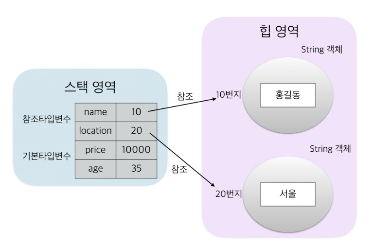

# 1 Data Type

* 모든 변수에는 타입이 있으며, 타입에 따라 저장할 수 있는 값의 종류와 범위가 달라진다. 
* 자바의 데이터 타입에는 크게 **기본 타입**과 **참조 타입**으로 분류된다.


## 1.1 기본 타입(Primitive Type)

* 기본 타입이란 정수, 실수, 문자, 논리 리터럴을 직접 저장하는 타입을 말한다.
* 정수 타입
  * `byte`, `char`, `short`, `int`, `long`
* 실수 타입
  * `float`, `double`
* 논리 타입
  * `boolean`


> **리터럴이란?**
>
> ```java
> int score = 90	//정수 리터럴 90
> ```
>
> 위에서 `90` 을 `리터럴`이라고 한다. 리터럴은 소스 코드 내에서 직접 입력된 값을 의미한다. 리터럴은 종류에 따라 정수 리터럴, 실수 리터럴 문자 리터럴, 논리 리터럴로 구분된다. 사실 리터럴은 상수와 같은 의미이지만, 프로그램에서는 상수를 "값을 한번 저장하면 변경 할 수 없는 변수"로 정의하기 때문에 이와 구분하기 위해 `리터럴` 이라는 용어를 사용한다.


## 1.2 참조 타입(Reference Type)

* 참조 타입이란 객체의 번지를 참조하는 타입으로 **배열** 타입, **열거** 타입, **클래스** 타입, **인터페이스** 타입을 말한다.
* 참조 타입의 변수의 값은 **힙 영역의 객체 주소**이므로 참조 변수의 `==`, `!=`의 연산은 결국 **주소를 비교하는 것**이 된다
  * 따라서 동일한 객체를 참조하고 있을 경우 `==` 연산의 결과는 `true` 이다
* 참조 타입의 변수는 힙 영역의 객체를 참조하지 않는다는 뜻으로 `null` 값을 가질 수 있다


## 1.3 차이점

* 기본 타입과 참조 타입의 차이점



* 기본 타입
  * **실제 값**을 변수 안에 저장한다
* 참조 타입
  * 메모리의 **번지**를 값을 저장한다
  * 번지를 통해 객체를 참조한다는 뜻에서 참조 타입이라고 부른다


참고

* http://www.yes24.com/Product/Goods/15651484
