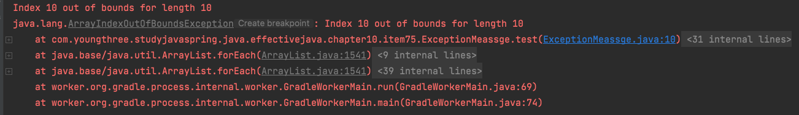

# 예외의 상세 메시지에 실패 관련 정보를 담으라


# 1 개요

* 예외를 잡지 못해 프로그램이 실패하면 자바 시스템이 예외의 stack trace 정보를 자동으로 출력함
* stack trace는 예외 객체의 toString 메서드를 호출해 문자열을 얻는다
  * 보통 예외의 클래스 이름 뒤에 상세 메시지가 붙는 형태
* 이 정보가 실패 원인을 분석하는데 사용되는 유일한 정보인 경우가 많음
* 실패를 재현하기 어렵다면 더 자세한 정보를 얻는것이 어려움
* 따라서 **예외의 toString 메서드에 실패 원인에 관한 정보를 가능한 많이 담는 것이 중요하다**


**stack trace 예시**



```java
public class ArrayIndexOutOfBoundsException extends IndexOutOfBoundsException {
  public ArrayIndexOutOfBoundsException(int index) {
    super("Array index out of range: " + index);
  }
}
```


# 2 실패 순간 포착

* **실패를 재현하기 어려운 경우 사후 분석을 위해 실패 순간의 상황을 포착해 예외의 상세 메시지에 담아야한다**
* 예외의 관여된 모든 매개변수와 필드의 값을 실패 메시지에 담아야 한다


> **주의**
>
> 보안과 관련한 정보는 주의가 필요하다. stack trace를 통해 많은 사람이 볼 수 있으므로 상세 메시지에 비밀번호나 암호 키 같은 정보는 담지 말아야한다


**IndexOutOfBoundsException 예시**

* 범위의 최솟값
* 범위의 최대값
* 범위를 벗어난 인덱스의 값


## 2.1 생성자 이용

* 실패를 적절히 포착하기 위해 필요한 정보를 생성자에서 모두 받아 상세 메시지를 미리 생성하는 방법이 있다


**IndexOutOfBoundsException.java**

* 상세 메시지(s)를 받는 생성자가 있다

```java
public class IndexOutOfBoundsException extends RuntimeException {
    private static final long serialVersionUID = 234122996006267687L;

    public IndexOutOfBoundsException() {
        super();
    }

    public IndexOutOfBoundsException(String s) {
        super(s);
    }
}
```

* IndexOutOfBoundsException에 아래와 같이 실패 순간을 담을 수 있는 생성자가 있다면 좋았을 것

```java
public IndexOutOfBoundsException(int lowerBound, int upperBound, int index){
  super(String.format("최솟값: %d, 최댓값:%d, 인덱스:%d", lowerBound, upperBound, index));
  this.lowerBound = lowerBound;
  this.upperBound = upperBound;
  this.index = index;
}
```

* 자바9에서는 아래와 같이 index를 받는 생성자가 추가됨
* 하지만 최솟값과 최댓값에 대한 정보는 받지 않는다

```java
public IndexOutOfBoundsException(int index) {
  super("Index out of range: " + index);
}
```


# 3 예외 상세 메시지와 최종 사용자

* 예외의 상세 메시지와 최종 사용자에게 보여줄 오류 메시지를 혼동해서는 안 된다
* 최종 사용자에게 보여줄 메시지는 추상화된 친절한 메시지가 필요
  * 데이터베이스 연결에 문제가 생겨 ConnectionException 발생 상세 메시지를 최종사용자에게 전달해도 이해할 수 없음
  * 보안상 문제도 있다
  * ConnectionException -> "서비스에 문제가 있습니다 잠시후 시도해주세요"
* 예외의 상세 메시지의 소비층은 프로그래머와 엔지니어
  * 가독성보다는 담긴 내용이 중요